## Reading Notes

I did not know there are so many ways to show data with ggplot. I learned lots of functions too such as is.na(), ifelse(), count(), cut_width(), cut_number(), add_residuals(`in modelr`). I learned to examine the distribution of a continuous variable is good to use histogram. And I learned showing multiple histograms with geom_freqpoly(). I also added how to rotate the x-axis. Additionally, I learned that checking NA is important for dataset because it can mislead tp the answer.

## EDA Example

The code below is an example of the EDA process using the `starwars` data from the `tidyverse` package. (Make sure you have the `tidyverse` package installed!)

Run the code line-by-line and look at the output. Add a comment to each line of code that explains what it does/what insights it provides.


```r
library(tidyverse)

dim(starwars) # Shows dimension of dataset. order: row column
```

```
## [1] 87 14
```

```r
colnames(starwars) # Shows all the column names.
```

```
##  [1] "name"       "height"     "mass"       "hair_color" "skin_color"
##  [6] "eye_color"  "birth_year" "sex"        "gender"     "homeworld" 
## [11] "species"    "films"      "vehicles"   "starships"
```

```r
head(starwars) # Shows first 6 dataset.
```

```
## # A tibble: 6 x 14
##   name  height  mass hair_color skin_color eye_color birth_year sex   gender
##   <chr>  <int> <dbl> <chr>      <chr>      <chr>          <dbl> <chr> <chr> 
## 1 Luke~    172    77 blond      fair       blue            19   male  mascu~
## 2 C-3PO    167    75 <NA>       gold       yellow         112   none  mascu~
## 3 R2-D2     96    32 <NA>       white, bl~ red             33   none  mascu~
## 4 Dart~    202   136 none       white      yellow          41.9 male  mascu~
## 5 Leia~    150    49 brown      light      brown           19   fema~ femin~
## 6 Owen~    178   120 brown, gr~ light      blue            52   male  mascu~
## # ... with 5 more variables: homeworld <chr>, species <chr>, films <list>,
## #   vehicles <list>, starships <list>
```

```r
glimpse(starwars) # columns become rows.
```

```
## Rows: 87
## Columns: 14
## $ name       <chr> "Luke Skywalker", "C-3PO", "R2-D2", "Darth Vader", "Leia...
## $ height     <int> 172, 167, 96, 202, 150, 178, 165, 97, 183, 182, 188, 180...
## $ mass       <dbl> 77.0, 75.0, 32.0, 136.0, 49.0, 120.0, 75.0, 32.0, 84.0, ...
## $ hair_color <chr> "blond", NA, NA, "none", "brown", "brown, grey", "brown"...
## $ skin_color <chr> "fair", "gold", "white, blue", "white", "light", "light"...
## $ eye_color  <chr> "blue", "yellow", "red", "yellow", "brown", "blue", "blu...
## $ birth_year <dbl> 19.0, 112.0, 33.0, 41.9, 19.0, 52.0, 47.0, NA, 24.0, 57....
## $ sex        <chr> "male", "none", "none", "male", "female", "male", "femal...
## $ gender     <chr> "masculine", "masculine", "masculine", "masculine", "fem...
## $ homeworld  <chr> "Tatooine", "Tatooine", "Naboo", "Tatooine", "Alderaan",...
## $ species    <chr> "Human", "Droid", "Droid", "Human", "Human", "Human", "H...
## $ films      <list> [<"The Empire Strikes Back", "Revenge of the Sith", "Re...
## $ vehicles   <list> [<"Snowspeeder", "Imperial Speeder Bike">, <>, <>, <>, ...
## $ starships  <list> [<"X-wing", "Imperial shuttle">, <>, <>, "TIE Advanced ...
```

```r
# ?starwars # Get explanation of dataset.

starwars %>% count(species) # Goes into dataset and counts number of values in a column (in this case species).
```

```
## # A tibble: 38 x 2
##    species       n
##    <chr>     <int>
##  1 Aleena        1
##  2 Besalisk      1
##  3 Cerean        1
##  4 Chagrian      1
##  5 Clawdite      1
##  6 Droid         6
##  7 Dug           1
##  8 Ewok          1
##  9 Geonosian     1
## 10 Gungan        3
## # ... with 28 more rows
```

```r
sum(is.na(starwars$height)) # Shows numbers of NA's in a column.
```

```
## [1] 6
```

```r
mean(starwars$height) # Shows mean value of the column. If the column has a NA's, then it returns "NA."
```

```
## [1] NA
```

```r
mean(starwars$height, na.rm = TRUE) # Shows mean value of the column by removing NA's in the column.
```

```
## [1] 174.358
```

```r
summary(starwars$height) # Shows statistical summary.
```

```
##    Min. 1st Qu.  Median    Mean 3rd Qu.    Max.    NA's 
##    66.0   167.0   180.0   174.4   191.0   264.0       6
```

```r
cm_to_ft <- function(cm){
  ft = cm / 30.48
  return(ft)
} # A function that changes cm to feet.

starwars_2 <- starwars %>% mutate(height_ft = cm_to_ft(height)) # Make a new dataset, and that dataset includes a new column that has height in feet.

dim(starwars_2) # Shows the dimension of the new dataset.
```

```
## [1] 87 15
```

```r
colnames(starwars_2) # Shows the new dataset's column names.
```

```
##  [1] "name"       "height"     "mass"       "hair_color" "skin_color"
##  [6] "eye_color"  "birth_year" "sex"        "gender"     "homeworld" 
## [11] "species"    "films"      "vehicles"   "starships"  "height_ft"
```

```r
summary(starwars_2$height_ft) # Shows statistical summary of a column.
```

```
##    Min. 1st Qu.  Median    Mean 3rd Qu.    Max.    NA's 
##   2.165   5.479   5.906   5.720   6.266   8.661       6
```

```r
ggplot(starwars_2, aes(height_ft)) + 
  geom_histogram() # Drawing histogram by using ggplot, x-axis is the column and y-axis is count.
```

```
## Warning: Removed 6 rows containing non-finite values (stat_bin).
```

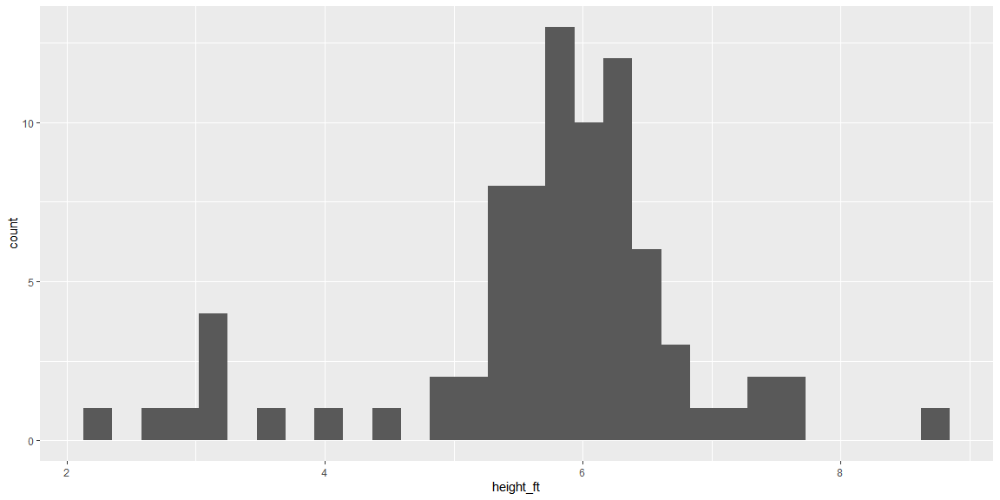<!-- -->

```r
sum(is.na(starwars_2$height_ft)) # The new dataset height_ft has 6 NA's
```

```
## [1] 6
```

```r
max(starwars_2$height_ft) # So, it returns NA
```

```
## [1] NA
```

```r
starwars_2 %>% filter(height_ft == max(height_ft)) # Filter the dataset with the condition that has the maximum height in feet. But since max(height_ft) is NA, the code does not work to show what we want to see. It shows nothing with this code.
```

```
## # A tibble: 0 x 15
## # ... with 15 variables: name <chr>, height <int>, mass <dbl>,
## #   hair_color <chr>, skin_color <chr>, eye_color <chr>, birth_year <dbl>,
## #   sex <chr>, gender <chr>, homeworld <chr>, species <chr>, films <list>,
## #   vehicles <list>, starships <list>, height_ft <dbl>
```

```r
starwars_2 %>% filter(height_ft == max(height_ft, na.rm = TRUE)) # Filters the new data set to show a row with maximum height in feet.
```

```
## # A tibble: 1 x 15
##   name  height  mass hair_color skin_color eye_color birth_year sex   gender
##   <chr>  <int> <dbl> <chr>      <chr>      <chr>          <dbl> <chr> <chr> 
## 1 Yara~    264    NA none       white      yellow            NA male  mascu~
## # ... with 6 more variables: homeworld <chr>, species <chr>, films <list>,
## #   vehicles <list>, starships <list>, height_ft <dbl>
```

```r
# https://starwars.fandom.com/wiki/Yarael_Poof
```

## EDA Practice

Continue exploring the `starwars` data to gain additional insights, using [R4DS: Chapter 7](https://r4ds.had.co.nz/exploratory-data-analysis.html) as a guide.

It is ok if you don't understand the all code in Chapter 7. (That is what we'll be learning the next two weeks!) If writing your own code is a struggle, try the "copy, paste, and tweak" method.

#### Histogram


```r
ggplot(starwars) +
  geom_bar(aes(sex)) +
  theme(axis.text.x = element_text(angle = 45, hjust = 1))
```

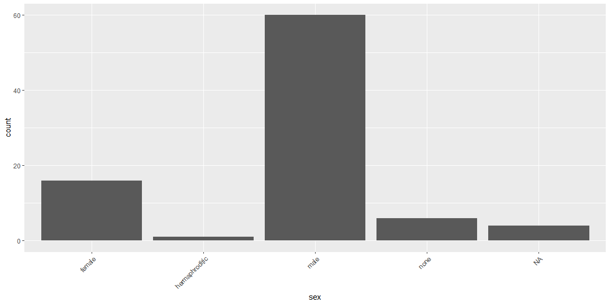<!-- -->


```r
starwars %>% count(sex)
```

```
## # A tibble: 5 x 2
##   sex                n
##   <chr>          <int>
## 1 female            16
## 2 hermaphroditic     1
## 3 male              60
## 4 none               6
## 5 <NA>               4
```

To examine the distribution of a continuous variable, use a histogram:

```r
ggplot(starwars) +
  geom_histogram(aes(x = height), binwidth = 20)
```

```
## Warning: Removed 6 rows containing non-finite values (stat_bin).
```

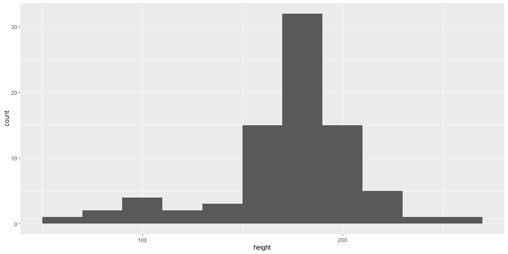<!-- -->


```r
starwars %>% count(cut_width(height, 20))
```

```
## # A tibble: 12 x 2
##    `cut_width(height, 20)`     n
##    <fct>                   <int>
##  1 [50,70]                     1
##  2 (70,90]                     2
##  3 (90,110]                    4
##  4 (110,130]                   2
##  5 (130,150]                   3
##  6 (150,170]                  15
##  7 (170,190]                  32
##  8 (190,210]                  15
##  9 (210,230]                   5
## 10 (230,250]                   1
## 11 (250,270]                   1
## 12 <NA>                        6
```


```r
ggplot(filter(starwars, height < 220), aes(x = height)) +
  geom_histogram(binwidth = 20)
```

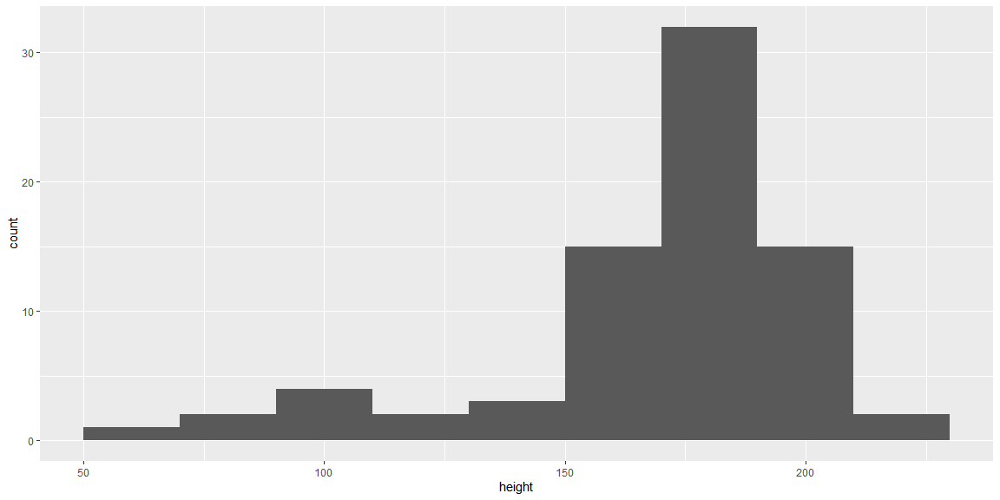<!-- -->


```r
ggplot(filter(starwars, height < 220), aes(x = height, color = sex)) +
  geom_freqpoly(binwidth = 20) # By adding color, I can show multiple histogram
```

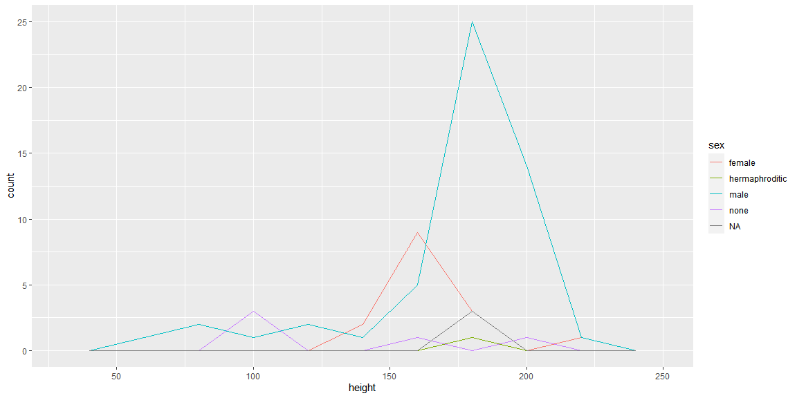<!-- -->


```r
ggplot(filter(starwars, height <220), aes(x = height)) +
  geom_histogram(binwidth = 1)
```

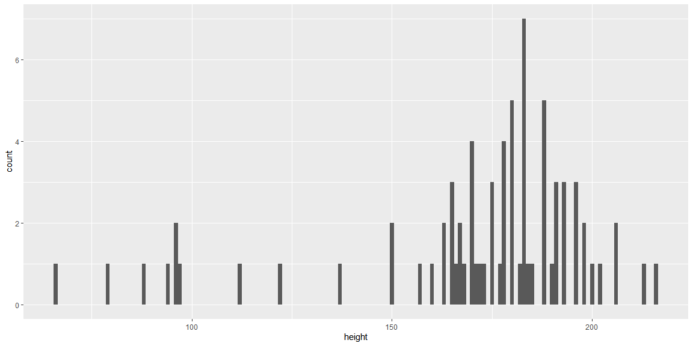<!-- -->

To make it easy to see the unusual values, we need to zoom to small values of the y-axis with coord_cartesian():


```r
ggplot(starwars, aes(x = mass)) +
  geom_histogram(binwidth = 20) +
  coord_cartesian(ylim = c(0, 5))
```

```
## Warning: Removed 28 rows containing non-finite values (stat_bin).
```

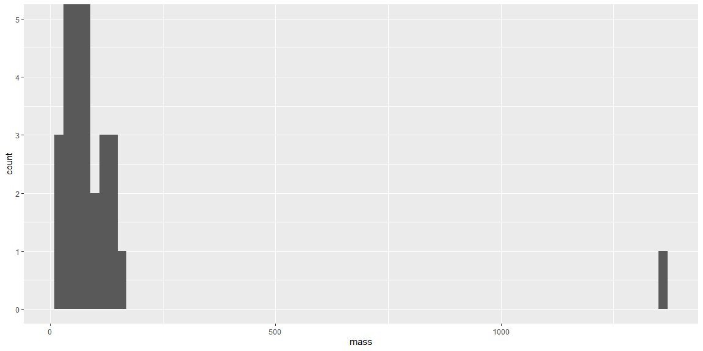<!-- -->


```r
unusual <- starwars %>% filter(height <100 | height > 200) %>% select(name, height, mass) %>% arrange()

unusual
```

```
## # A tibble: 17 x 3
##    name                  height  mass
##    <chr>                  <int> <dbl>
##  1 R2-D2                     96    32
##  2 Darth Vader              202   136
##  3 R5-D4                     97    32
##  4 Chewbacca                228   112
##  5 Yoda                      66    17
##  6 Wicket Systri Warrick     88    20
##  7 Roos Tarpals             224    82
##  8 Rugor Nass               206    NA
##  9 Dud Bolt                  94    45
## 10 Yarael Poof              264    NA
## 11 Lama Su                  229    88
## 12 Taun We                  213    NA
## 13 Ratts Tyerell             79    15
## 14 R4-P17                    96    NA
## 15 Grievous                 216   159
## 16 Tarfful                  234   136
## 17 Tion Medon               206    80
```


#### Missing values


```r
star <- starwars %>% filter(between(height, 100, 200))
star
```

```
## # A tibble: 64 x 14
##    name  height  mass hair_color skin_color eye_color birth_year sex   gender
##    <chr>  <int> <dbl> <chr>      <chr>      <chr>          <dbl> <chr> <chr> 
##  1 Luke~    172    77 blond      fair       blue            19   male  mascu~
##  2 C-3PO    167    75 <NA>       gold       yellow         112   none  mascu~
##  3 Leia~    150    49 brown      light      brown           19   fema~ femin~
##  4 Owen~    178   120 brown, gr~ light      blue            52   male  mascu~
##  5 Beru~    165    75 brown      light      blue            47   fema~ femin~
##  6 Bigg~    183    84 black      light      brown           24   male  mascu~
##  7 Obi-~    182    77 auburn, w~ fair       blue-gray       57   male  mascu~
##  8 Anak~    188    84 blond      fair       blue            41.9 male  mascu~
##  9 Wilh~    180    NA auburn, g~ fair       blue            64   male  mascu~
## 10 Han ~    180    80 brown      fair       brown           29   male  mascu~
## # ... with 54 more rows, and 5 more variables: homeworld <chr>, species <chr>,
## #   films <list>, vehicles <list>, starships <list>
```

use mutate() to replace the variable with a modified copy. You can use the ifelse() function to replace unusual values with NA. ifelse(condition, True, False).


```r
star <- starwars %>% mutate(height = ifelse(height < 100 | height > 201, NA, height))
```

- case_when() is particularly useful inside mutate when you want to create a new variable that relies on a complex combination of existing variables.


```r
ggplot(star, aes(x = height, y = mass)) +
  geom_point(na.rm = TRUE)
```

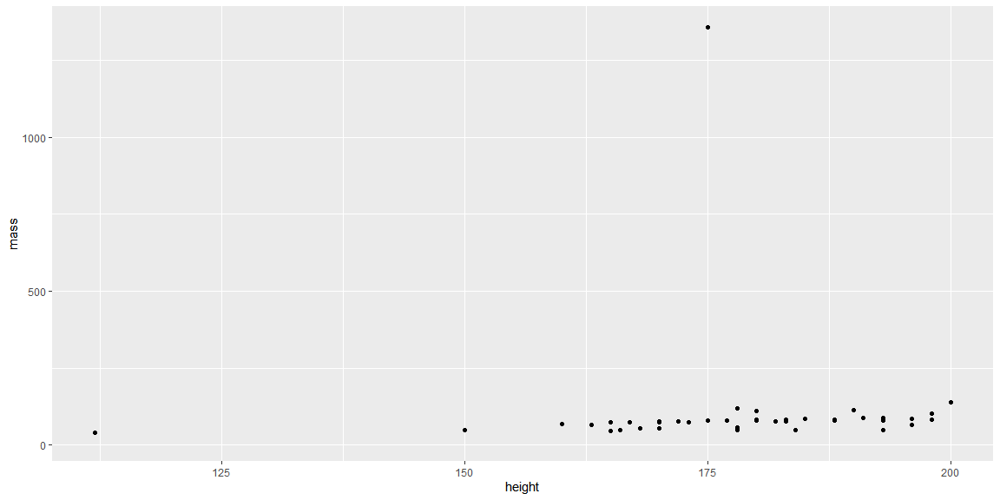<!-- -->


```r
nycflights13::flights %>% 
  mutate(
    cancelled = is.na(dep_time),
    sched_hour = sched_dep_time %/% 100, # %/%: integral division ex) 5/3 = 1
    sched_min = sched_dep_time %% 100, # %%: ex) 5/3 = 2
    sched_dep_time = sched_hour + sched_min / 60
  ) %>% 
  ggplot(mapping = aes(sched_dep_time)) + 
    geom_freqpoly(mapping = aes(colour = cancelled), binwidth = 1/4)
```

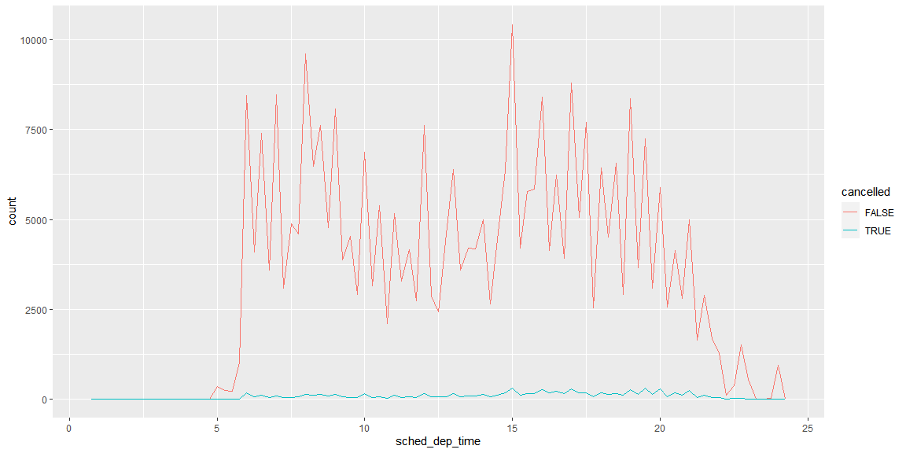<!-- -->

#### Covariation

Covariation is the tendency for the values of two or more variables to vary together in a related way. 


```r
ggplot(starwars, aes(x = sex, y = height)) +
  geom_boxplot() +
  theme(axis.text.x = element_text(angle = 45, hjust = 1))
```

```
## Warning: Removed 6 rows containing non-finite values (stat_boxplot).
```

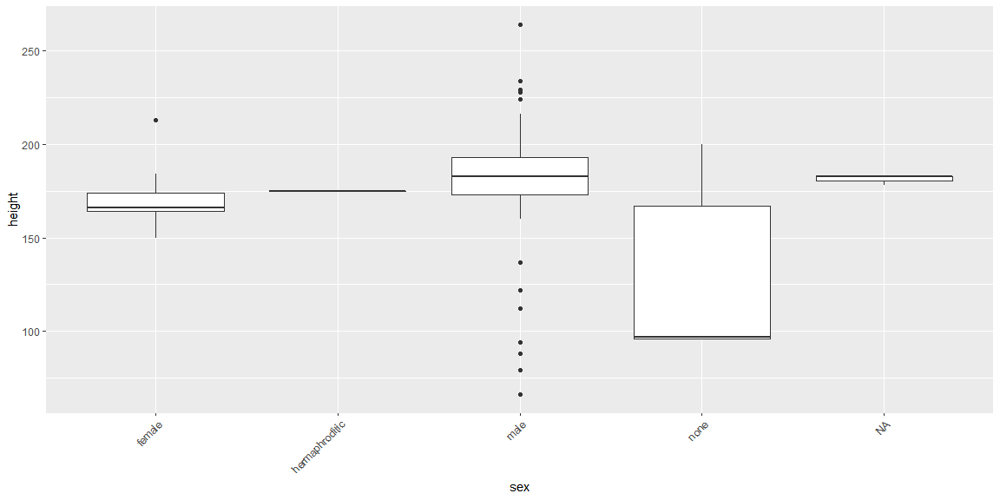<!-- -->


```r
ggplot(starwars) +
  geom_boxplot(aes(x = reorder(sex, height, FUN = median), y = height)) +
  theme(axis.text.x = element_text(angle = 45, hjust = 1))
```

```
## Warning: Removed 6 rows containing non-finite values (stat_boxplot).
```

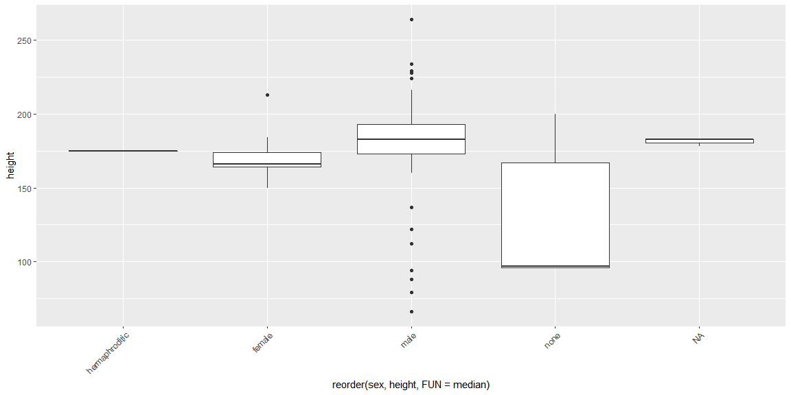<!-- -->

```r
ggplot(data = mpg) +
  geom_boxplot(mapping = aes(x = reorder(class, hwy, FUN = median), y = hwy)) +
  coord_flip()
```

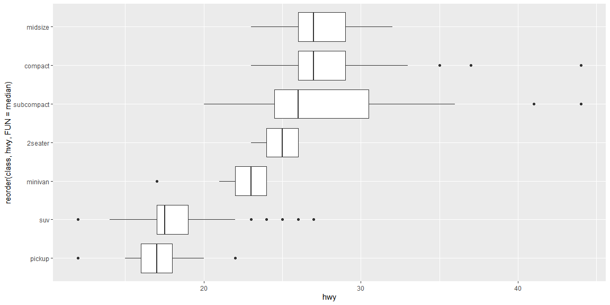<!-- -->

#### Two categorical variables


```r
ggplot(starwars) +
  geom_count(aes(x = sex, y = gender)) +
  theme(axis.text.x = element_text(angle = 45, hjust = 1))
```

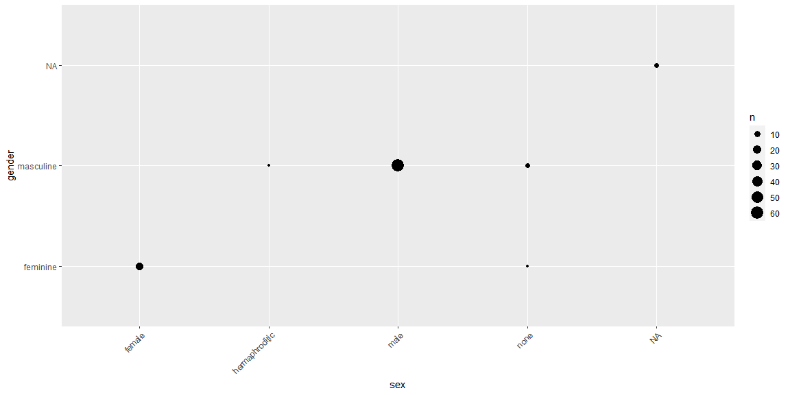<!-- -->


```r
starwars %>% count(gender, sex)
```

```
## # A tibble: 6 x 3
##   gender    sex                n
##   <chr>     <chr>          <int>
## 1 feminine  female            16
## 2 feminine  none               1
## 3 masculine hermaphroditic     1
## 4 masculine male              60
## 5 masculine none               5
## 6 <NA>      <NA>               4
```


```r
starwars %>% count(gender, sex) %>% ggplot(aes(x = sex, y = gender)) +
  geom_tile(aes(fill = n))
```

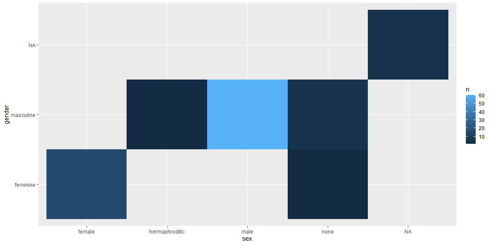<!-- -->

#### Two continuous variables

using the alpha aesthetic to add transparency.

```r
ggplot(starwars) +
  geom_point(aes(x = mass, y = height), alpha = 1/3)
```

```
## Warning: Removed 28 rows containing missing values (geom_point).
```

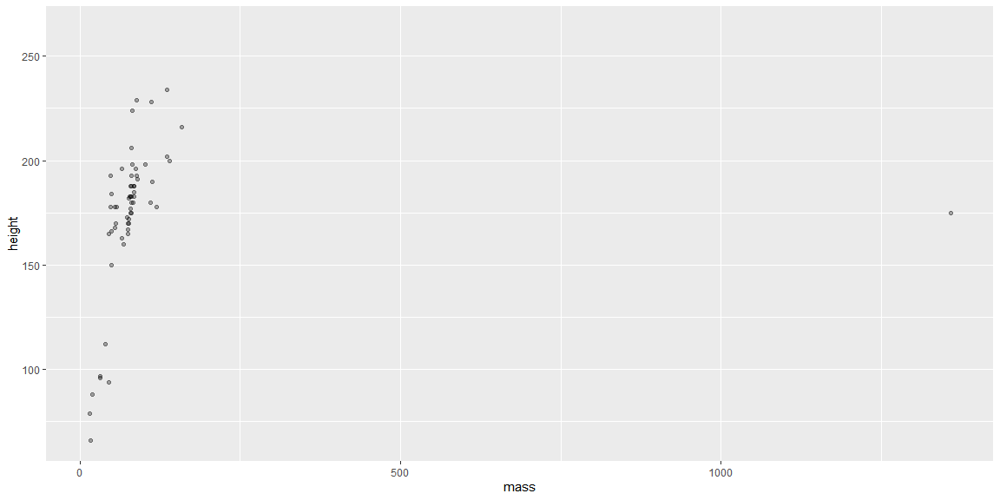<!-- -->


```r
ggplot(starwars) +
  geom_bin2d(aes(x = mass, y = height), alpha = 1/3)
```

```
## Warning: Removed 28 rows containing non-finite values (stat_bin2d).
```

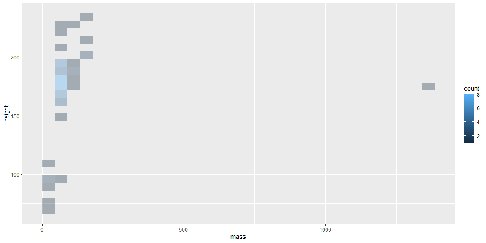<!-- -->

Using boxplot for 2 continuous data.

```r
ggplot(starwars, aes(x = height, y = mass)) +
  geom_boxplot(aes(group = cut_width(height, 20)))
```

```
## Warning: Removed 6 rows containing missing values (stat_boxplot).
```

```
## Warning: Removed 22 rows containing non-finite values (stat_boxplot).
```

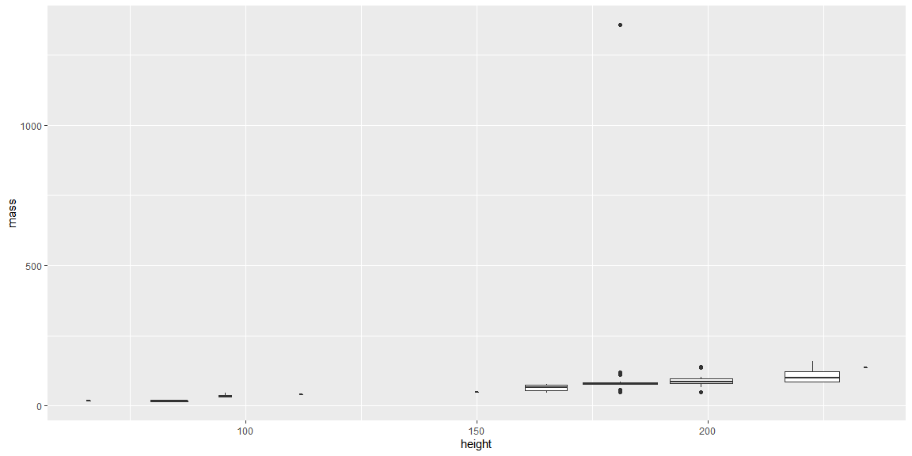<!-- -->

```r
ggplot(data = diamonds, mapping = aes(x = carat, y = price)) + 
  geom_boxplot(mapping = aes(group = cut_width(carat, 0.1)))
```

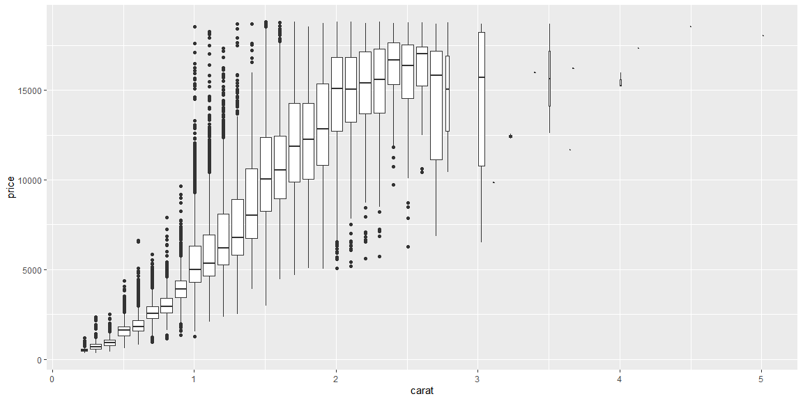<!-- -->

Display approximately the same number of points in each bin. That’s the job of cut_number():

```r
ggplot(starwars, aes(x = height, y = mass)) +
  geom_boxplot(aes(group = cut_number(height, 5))) # produce 5 bins
```

```
## Warning: Removed 6 rows containing missing values (stat_boxplot).
```

```
## Warning: Removed 22 rows containing non-finite values (stat_boxplot).
```

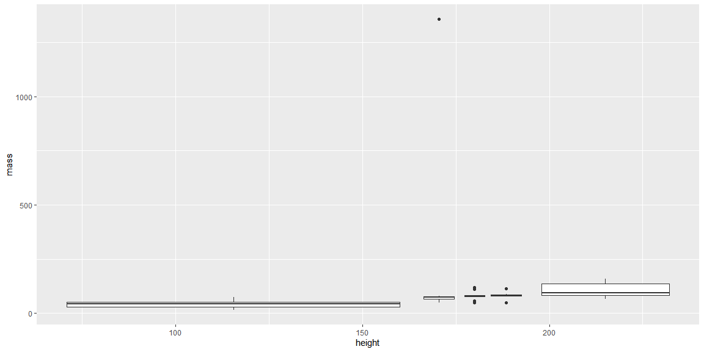<!-- -->

```r
ggplot(data = diamonds, mapping = aes(x = carat, y = price)) + 
  geom_boxplot(mapping = aes(group = cut_number(carat, 20))) # produce 20 bins
```

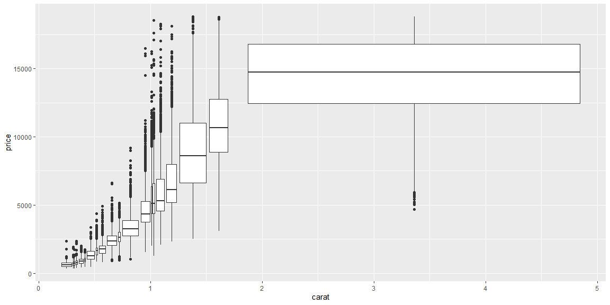<!-- -->


add_residual(): Add residuals to a data frame. Column name = resid

```r
library(modelr)

mod <- lm(log(price) ~ log(carat), data = diamonds)

diamonds2 <- diamonds %>% 
  add_residuals(mod) %>% 
  mutate(resid = exp(resid))

ggplot(data = diamonds2) + 
  geom_point(mapping = aes(x = carat, y = resid))
```

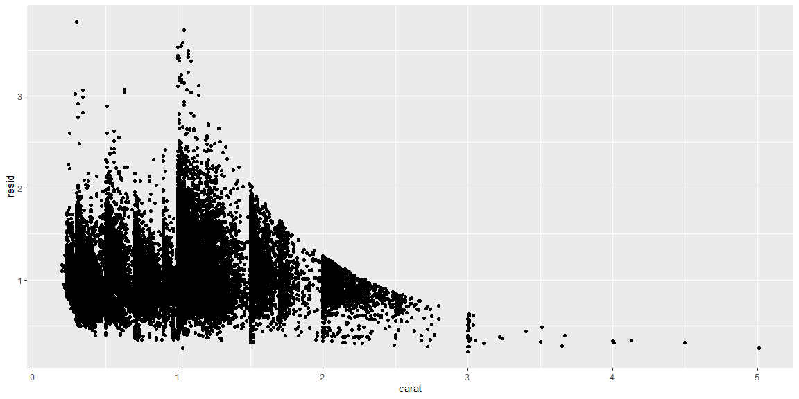<!-- -->


```r
ggplot(data = diamonds2) + 
  geom_boxplot(mapping = aes(x = cut, y = resid))
```

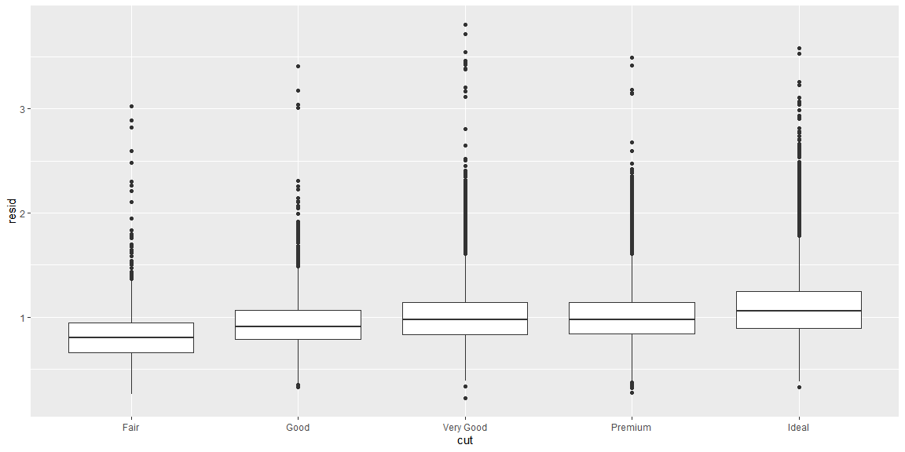<!-- -->


```r
mod <- lm(height ~ mass, data = starwars)

star <- starwars %>% 
  add_residuals(mod) %>% 
  mutate(resid = exp(resid))

ggplot(data = star) + 
  geom_point(mapping = aes(x = mass, y = resid))
```

```
## Warning: Removed 28 rows containing missing values (geom_point).
```

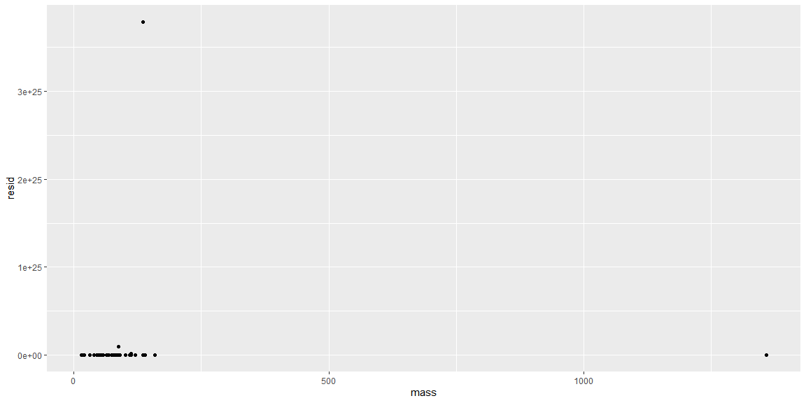<!-- -->


```r
ggplot(star) +
  geom_boxplot(aes(x = sex, y = resid))
```

```
## Warning: Removed 28 rows containing non-finite values (stat_boxplot).
```

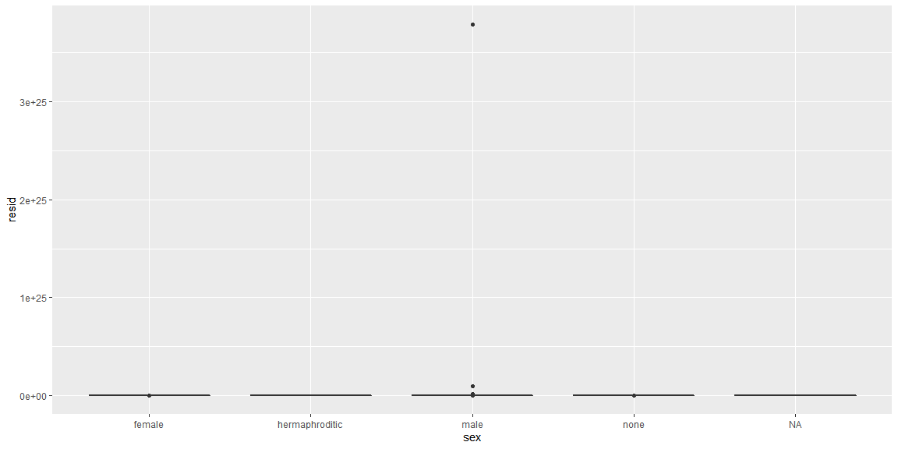<!-- -->


