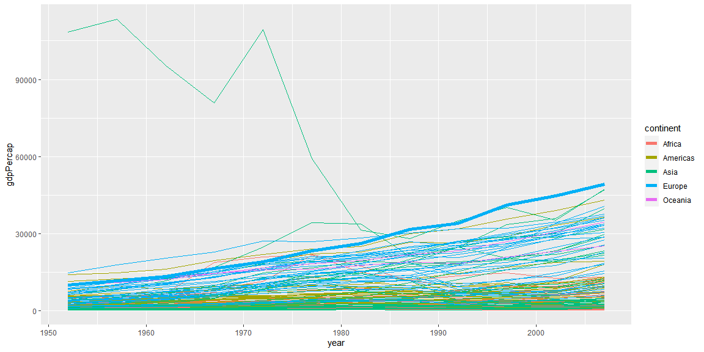
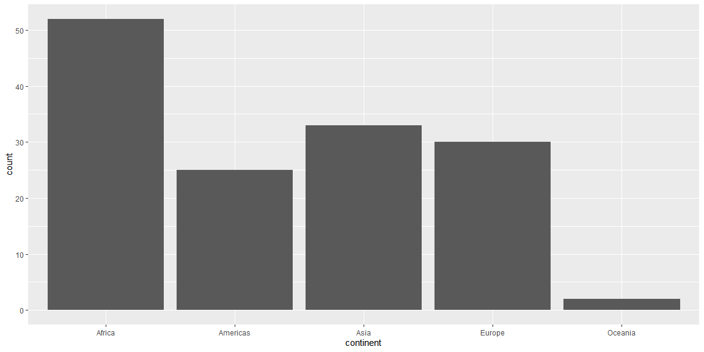
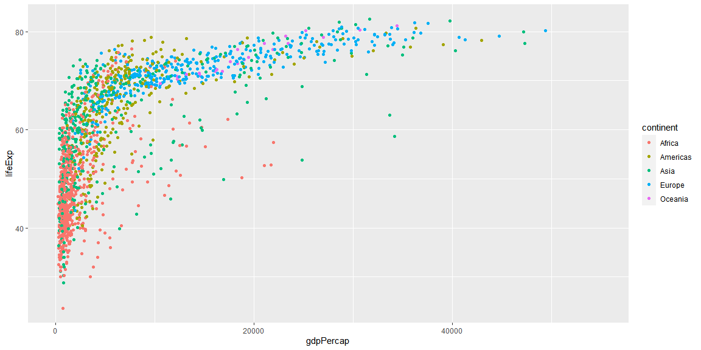
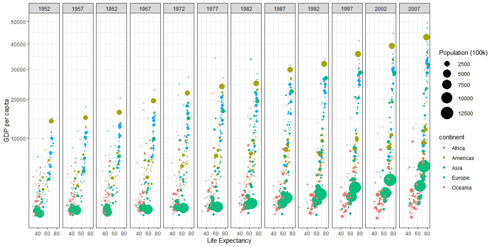

#### Pick one quantitative variable and create a chart that summarizes the distribution.


```r
Eu <- filter(gapminder, continent %in% c("Europe"))
Eu <- filter(Eu, gdpPercap == max(gdpPercap))
Eu
```

```
## # A tibble: 1 x 6
##   country continent  year lifeExp     pop gdpPercap
##   <fct>   <fct>     <int>   <dbl>   <int>     <dbl>
## 1 Norway  Europe     2007    80.2 4627926    49357.
```

```r
ggplot(gapminder, aes(x = year, y = gdpPercap, by = country)) +
  geom_line(aes(color = continent)) +
  geom_line(data = gapminder[gapminder$country == "Norway",], aes(color = continent), size = 2)
```

<!-- -->

#### Pick one qualitative variable and create a chart that summarizes the distribution.


```r
ggplot(gapminder %>% group_by(continent) %>% distinct(country), aes(x = continent)) +
  geom_bar()
```

<!-- -->

#### Pick any two variables and create a chart that summarizes the bivariate distribution (the relationship between the two).


```r
ggplot(gapminder, aes(x = gdpPercap, y = lifeExp)) +
  geom_point(aes(color = continent)) +
  coord_cartesian(xlim = c(0, 55000))
```

<!-- -->

#### Write a description for each of the three charts above about what you learn from the chart.

Norway ended up being the highest GDP per capita nation in the recent data.
Africa nations are more recorded than the other nations. 
There are some nations that GDP per capita is small but life expectancy is high. However, the relationship looks like as GDP per capita increases, life expectancy increases with diminishing degree. 

#### Recreate the graphic shown below


```r
ggplot(filter(gapminder, country != "Kuwait"), aes(x = lifeExp, y = gdpPercap)) +
  geom_point(aes(size = pop, color = continent)) +
  facet_wrap(~year, nrow = 1) +
  scale_y_continuous(trans = "sqrt") +
  labs(x = "Life Expectancy", y = "GDP per capita", size = "Population (100k)", color = "continent") +
  guides(size = guide_legend(order = 1), color = guide_legend(order = 2)) +
  scale_size(range = c(0.1, 10), breaks = 100000 * c(2500, 5000, 7500, 10000, 12500), labels = c("2500", "5000", "7500", "10000", "12500")) +
  theme_bw()
```

<!-- -->

```r
ggsave("case3.png", width = 15, units = "in")
```

```
## Saving 15 x 6 in image
```


