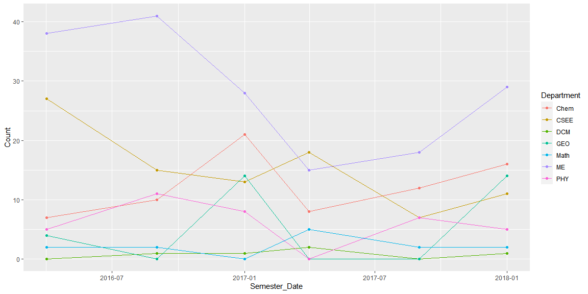
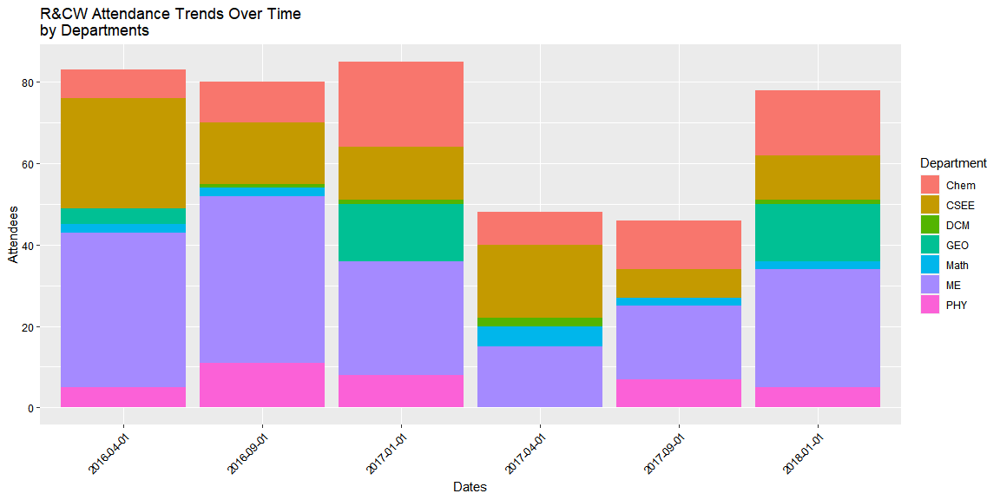
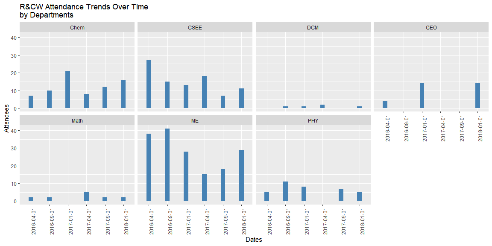

#### Study the code below and run it one line at a time to see the output. Include the code in your final report. Add a detailed comment to each line that explains what that particular line/function is doing.


```r
rcw <- read_csv("https://byuistats.github.io/M335/data/rcw.csv", col_types = cols(Semester_Date = col_date(format = "%m/%d/%y"), Semester = col_factor(levels = c("Winter", "Spring", "Fall"))))

# col_types = cols(): fix the type of the Semester_Date column by specifying that Semester_Date is a date column
# and I can specify by col_double(), col_logical(), col_character(), col_date(format = "")

head(rcw) # shows first six rows of the data set.
```

```
## # A tibble: 6 x 5
##    Year Semester Semester_Date Count Department
##   <dbl> <fct>    <date>        <dbl> <chr>     
## 1  2016 Spring   2016-04-01        7 Chem      
## 2  2016 Fall     2016-09-01       10 Chem      
## 3  2017 Winter   2017-01-01       21 Chem      
## 4  2017 Spring   2017-04-01        8 Chem      
## 5  2017 Fall     2017-09-01       12 Chem      
## 6  2018 Winter   2018-01-01       16 Chem
```

```r
str(rcw) # shows the data set structure.
```

```
## tibble [42 x 5] (S3: spec_tbl_df/tbl_df/tbl/data.frame)
##  $ Year         : num [1:42] 2016 2016 2017 2017 2017 ...
##  $ Semester     : Factor w/ 3 levels "Winter","Spring",..: 2 3 1 2 3 1 2 3 1 2 ...
##  $ Semester_Date: Date[1:42], format: "2016-04-01" "2016-09-01" ...
##  $ Count        : num [1:42] 7 10 21 8 12 16 27 15 13 18 ...
##  $ Department   : chr [1:42] "Chem" "Chem" "Chem" "Chem" ...
##  - attr(*, "spec")=
##   .. cols(
##   ..   Year = col_double(),
##   ..   Semester = col_factor(levels = c("Winter", "Spring", "Fall"), ordered = FALSE, include_na = FALSE),
##   ..   Semester_Date = col_date(format = "%m/%d/%y"),
##   ..   Count = col_double(),
##   ..   Department = col_character()
##   .. )
```

```r
ggplot(data = rcw, 
       mapping = aes(x = Semester_Date, 
                     y = Count, 
                     color = Department)) + # x-axis: Semester_Date, y-axis: Count, color by Departments 
  geom_line() + # line plot
  geom_point() # scatter plot
```

<!-- -->

#### Create your own chart to show R&CW attendance trends over time. Use at least one new function you learned from the Doing Readings.


```r
rcw$Semester_Date = as.factor(rcw$Semester_Date)

ggplot(rcw, aes(x = Semester_Date, y = Count)) +
  geom_bar(stat = "identity", aes(fill = Department)) +
  theme(axis.text.x = element_text(angle = 45, hjust = 1, color = "black"), axis.text.y = element_text(color = "black")) +
  labs(title = "R&CW Attendance Trends Over Time \nby Departments",
       y = "Attendees", x = "Dates")
```

<!-- -->

```r
aggregate(rcw$Count, by=list(Date = rcw$Semester_Date), FUN=sum) %>% pander()
```


-----------------
    Date      x  
------------ ----
 2016-04-01   83 

 2016-09-01   80 

 2017-01-01   85 

 2017-04-01   48 

 2017-09-01   46 

 2018-01-01   78 
-----------------


```r
ggplot(rcw, aes(x = Semester_Date, y = Count)) + 
  geom_bar(stat="identity", width = 0.25, fill = "steelblue") +
  facet_wrap(~Department, nrow =2) +
  theme(axis.text.x = element_text(angle = 90, hjust = 1)) +
  labs(title = "R&CW Attendance Trends Over Time \nby Departments", x = "Dates", y = "Attendees")
```

<!-- -->


#### Write a short description of the trends you see in the graphs.
We can not conclude which semester has the constantly high attendants for R&CW by seeing the data we have because the number of attendees are keep changing through time.
The first graph shows the total attendees for each conference. The second graph shows more accurately of which departments students are attending to the conference. However, the first example graph shows much better information about comapring the nuber of attendees through graph.
We can see that ME, CSEE, and Chem majors are the biggest attendees.
