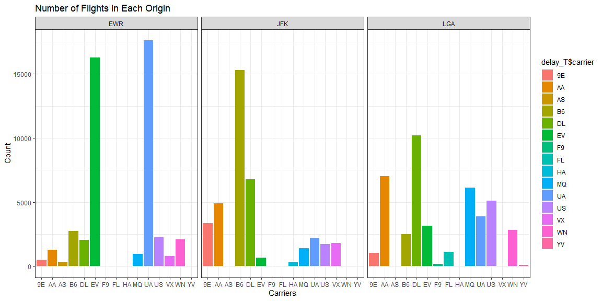
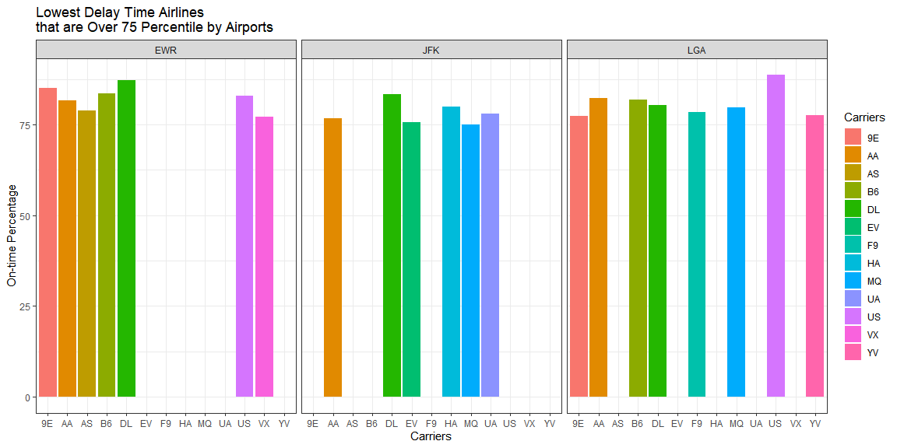
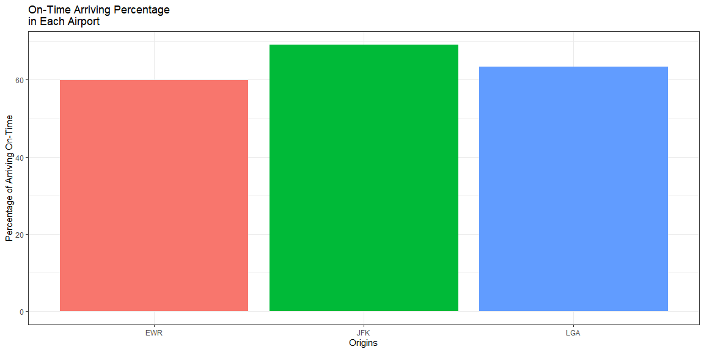

#### Introduction
Readers who have experience boarding an airplane may have encountered delays in flight departures. Unfortunately, sometimes, people have to reschedule their plans when this happens. Based on the data that is recorded in 2013 and departed from NYC (JFK, LGA or EWR), I will solve some questions that manager gave.

##### Q1) If I am leaving before noon, which two airlines do you recommend at each airport (JFK, LGA, EWR) that will have the lowest delay time at the 75th percentile?

People will buy a ticket by looking at the scheduled departure time. Airline `OO` is removed since it has only one record of boarding.


```r
flights_noon <- flights[flights$sched_dep_time < 1200,]

#sum(is.na(flights_noon$sched_dep_time))
#sum(is.na(flights_noon$dep_time))
flights_noon <- flights_noon %>% drop_na()

#sum(is.na(flights_noon))

# flights_noon %>% group_by(carrier) %>% count(carrier)
flights_noon <- flights_noon %>% filter(carrier != "OO")
```


```r
flights_noon_con <- flights_noon %>% group_by(origin, carrier) %>% count(dep_delay <= 0)

delay_T <- flights_noon_con %>% group_by(origin, carrier) %>% slice(2)
delay_F <- flights_noon_con %>% group_by(origin, carrier) %>% slice(1)
percen <- (delay_T$n) / (delay_T$n + delay_F$n) * 100
tot <- delay_T$n + delay_F$n
tb <- tibble(delay_T$origin, delay_T$carrier, delay_T$`dep_delay <= 0`, delay_T$n, delay_F$`dep_delay <= 0`, delay_F$n, percen, tot)

percen_over_75 <- tb %>% group_by(`delay_T$origin`, `delay_T$carrier`) %>% filter(percen >= 75)
```


```r
ggplot(tb, aes(x = `delay_T$carrier`, y = tot, fill = `delay_T$carrier`)) +
  geom_bar(stat = "identity") +
  facet_wrap(.~`delay_T$origin`) +
  labs(x = "Carriers", y = "Count", title = "Number of Flights in Each Origin") +
  theme_bw()
```

<!-- -->


```r
ggplot(percen_over_75, aes(x = `delay_T$carrier`, y = percen, fill = `delay_T$carrier`)) +
  geom_bar(position = "dodge", stat = "identity") +
  labs(y = "On-time Percentage", x = "Carriers", fill = "Carriers", title = "Lowest Delay Time Airlines \nthat are Over 75 Percentile by Airports") +
  facet_wrap(.~`delay_T$origin`) +
  theme_bw()
```

<!-- -->


```r
top_2 <- percen_over_75 %>% group_by(`delay_T$origin`) %>% top_n(n = 2, wt = percen)
top_2 <- top_2 %>% select(`delay_T$origin`, `delay_T$carrier` , percen )

colnames(top_2) <- c("Origin", "Airline", "On-Time Percentage")

top_2 %>% pander()
```


---------------------------------------
 Origin   Airline   On-Time Percentage 
-------- --------- --------------------
  EWR       9E            85.11        

  EWR       DL             87.3        

  JFK       DL            83.28        

  JFK       HA            79.82        

  LGA       AA            82.34        

  LGA       US             88.8        
---------------------------------------

The top 2 airlines that departed on-time or less than on-time are showing on the above table  depending on the origin.

However, my recommendation based on the number of flights departing from `EWR` are DL and B6 airlines. This is because 9E has no lots of flights that are departing from `EWR` even the percentage of departing on-time is higher than B6.

The recommendation based on the number of flights departing from `JFK` are DL and AA airlines. This is because HA has no lots of flights that are departing from `JFK` even the percentage of departing on-time is higher than AA.

The recommendation based on the number of flights departing from `LGA` are US and AA airlines.


##### Q2) Which origin airport is best to minimize my chances of a late arrival when I am using Delta Airlines (DL)?

Seeing the arrival delay data will be helpful to solve this problem since it is about a late arrival.


```r
flights_DL <- flights %>% filter(carrier == "DL")
#sum(is.na(flights_DL))

flights_DL <- flights_DL %>% drop_na()
```


```r
flights_DL1 <- flights_DL %>% group_by(origin) %>% count(arr_delay <= 0)

DL_T <- flights_DL1 %>% group_by(origin) %>% slice(2)
DL_F <- flights_DL1 %>% group_by(origin) %>% slice(1)
percent <- DL_T$n / (DL_T$n + DL_F$n) * 100

tb_DL <- tibble(DL_T$origin, DL_T$`arr_delay <= 0`, DL_T$n, DL_F$`arr_delay <= 0`, DL_F$n, percent)
```


```r
ggplot(tb_DL, aes(x = `DL_T$origin`, y = percent, fill = `DL_T$origin`)) +
  geom_bar(stat = "identity") +
  labs(x = "Origins", y = "Percentage of Arriving On-Time", title = "On-Time Arriving Percentage\nin Each Airport") +
  theme_bw() +
  theme(legend.position = "none")
```

<!-- -->


```r
DLDL <- tibble(tb_DL$`DL_T$origin`, tb_DL$percent)
colnames(DLDL) <- c("Origin", "On-time Percentage")
DLDL %>% pander()
```


-----------------------------
 Origin   On-time Percentage 
-------- --------------------
  EWR           59.84        

  JFK            69.1        

  LGA           63.45        
-----------------------------

`JFK` origin airport is best to minimize my chances of a late arrival when using Delta Airlines (DL) with 69.1 percent.

##### Q3) Which destination airport is the worst airport for arrival time? (you decide on the metric for "worst")


