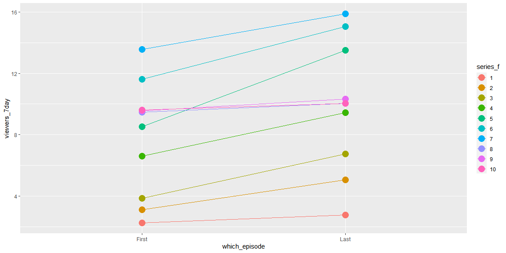
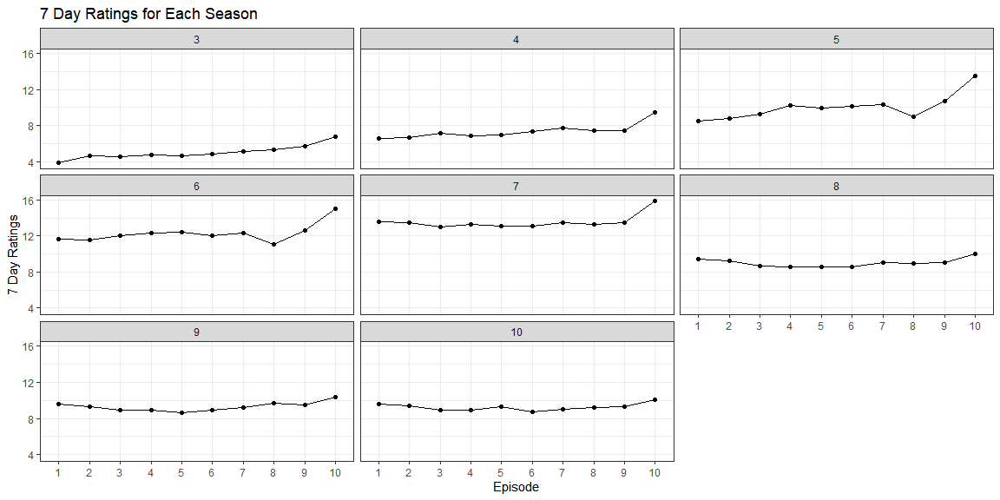
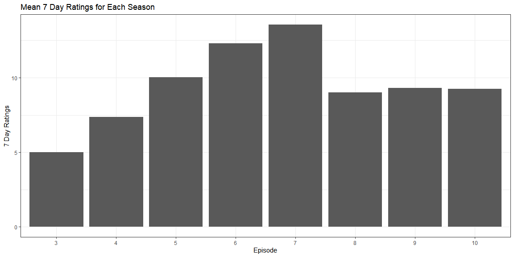

#### Study the code below and run it one line at a time to see the output. Include the code in your final report. Add a comment to each line that explains what that particular line/function is doing.


```r
only_first_last <- ratings %>% 
  group_by(series) %>% # group by "series"
  slice(1, n()) %>% # by each "series" get rows of first and the last (number of each "series")
  mutate(which_episode = ifelse(episode == 1, "First", "Last")) %>% # make a new column with in each series there are 2 episodes and if episode is 1 it is the "first".
  ungroup() %>% # ungroup it = become back to original setting but the data set has changed.
  mutate(series_f = as.factor(series)) # make a new column that "series" are factors

ggplot(only_first_last, aes(x = which_episode, y = viewers_7day, group = series_f, color = series_f)) + # group and color by series_f
  geom_line() + # draw line graphs
  geom_point(size = 5) # draw points
```

<!-- -->

#### Filter the data to seasons with 10 episodes. Then create one visualization that displays the 7 day ratings for each episode per series and also shows how mean ratings changed across series.


```r
ratings %>% group_by(series) %>% summarise(n = n()) #count series
```

```
## `summarise()` ungrouping output (override with `.groups` argument)
```

```
## # A tibble: 10 x 2
##    series     n
##    <fct>  <int>
##  1 1          6
##  2 2          8
##  3 3         10
##  4 4         10
##  5 5         10
##  6 6         10
##  7 7         10
##  8 8         10
##  9 9         10
## 10 10        10
```

```r
ten_episodes <- ratings %>% group_by(series) %>% summarise(n = n()) %>% filter(n == 10) %>% pull(series)
```

```
## `summarise()` ungrouping output (override with `.groups` argument)
```

```r
ten_episodes
```

```
## [1] 3  4  5  6  7  8  9  10
## Levels: 1 2 3 4 5 6 7 8 9 10
```

```r
ten <- filter(ratings, series %in% ten_episodes)
```


7 day ratings for each episode per series:

```r
ggplot(ten, aes(x = episode, y = viewers_7day)) +
  geom_line(aes(group = series)) +
  geom_point() +
  facet_wrap(.~series) +
  theme_bw() +
  labs(title = "7 Day Ratings for Each Season", x = "Episode", y = "7 Day Ratings")
```

<!-- -->

mean ratings changed across series:

```r
ten_mean <- ten %>% group_by(series) %>% summarise(mean_ratings = mean(viewers_7day))
```

```
## `summarise()` ungrouping output (override with `.groups` argument)
```

```r
ggplot(ten_mean, aes(x = series, y = mean_ratings)) +
  geom_bar(stat = "identity") +
  theme_bw() +
  labs(title = "Mean 7 Day Ratings for Each Season", x = "Episode", y = "7 Day Ratings")
```

<!-- -->

#### Discuss what you see in the graph and point out interesting features of the data. (Perhaps a little internet surfing or googling will help you explain what you see.)

The 7 day ratings were in the increasing trend until series 7. However, the ratings are a little above 9 from series 8 to 10.This can be found in both graphs.

I think `viewers_28day` seems interesting because until for a certain season, the viewers are smaller than the `viewers_7day`. However, they closely match up since season 6. So, I think analyzing more about `viewers_28day` will give a new insight.
