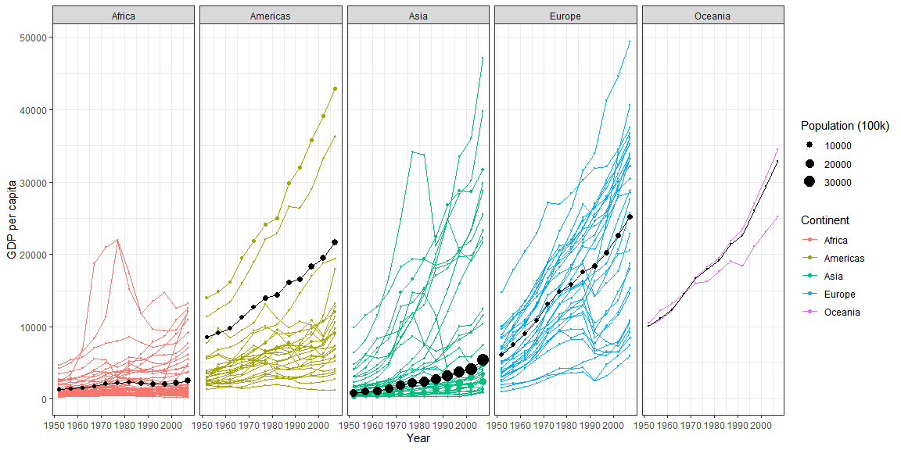
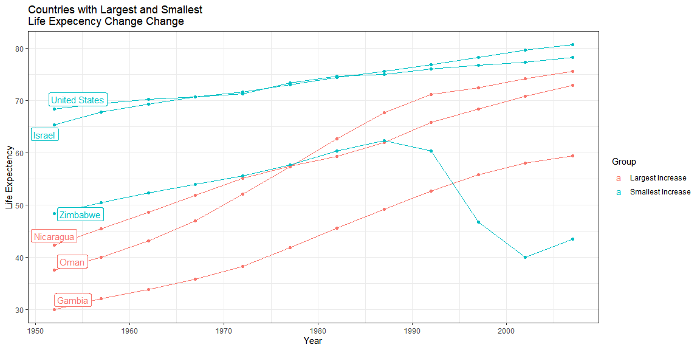

#### Recreate the graphic shown below using gapminder dataset


```r
gap <- gapminder %>% filter(country != "Kuwait")

sum(is.na(gap))
```

```
## [1] 0
```

```r
gap1 <- gap %>% group_by(continent, year) %>% summarise(wt_avg_gdp = weighted.mean(gdpPercap, pop), pop = sum(pop))
```

```
## `summarise()` regrouping output by 'continent' (override with `.groups` argument)
```


```r
ggplot(gap) +
  geom_point(aes(x = year, y = gdpPercap, group = country, size = pop, color = continent)) +
  geom_line(aes(x = year, y = gdpPercap, group = country, color = continent)) +
  geom_line(data = gap1, mapping = aes(x = year, y = wt_avg_gdp)) +
  geom_point(data = gap1, mapping = aes(x = year, y = wt_avg_gdp, size = pop)) +
  facet_wrap(.~continent, nrow = 1) +
  labs(x = "Year", y = "GDP per capita", color = "Continent", size = "Population (100k)") +
  guides(size = guide_legend(order = 1), color = guide_legend(order = 2)) +
  scale_size(range = c(0.1, 5), breaks = 100000 * c(10000, 20000, 30000), labels = c("10000", "20000", "30000")) +
  theme_bw()
```

<!-- -->

#### Visualize Africa, Americas and Asia life expectancy over time.


##### Within each continent find which country had the largest overall increase in life expectancy from 1952 to 2007


```r
three <- gap %>% filter(continent %in% c("Africa", "Americas", "Asia"))
life_chng <- three %>% group_by(country) %>% slice(1, n())

yr_1952 <- filter(life_chng, year == 1952)
yr_2007 <- filter(life_chng, year == 2007)
change <- (yr_2007$lifeExp - yr_1952$lifeExp) / yr_1952$lifeExp * 100
tb <- tibble(yr_1952$country, yr_1952$continent, change)

large_coun <- tb %>% group_by(`yr_1952$continent`) %>% top_n(n = 1, wt = change) %>% pull(`yr_1952$country`)

large_coun
```

```
## [1] Gambia    Nicaragua Oman     
## 142 Levels: Afghanistan Albania Algeria Angola Argentina Australia ... Zimbabwe
```

##### Within each continent find which country had the smallest overall increase (or even a decrease) from 1952 to 2007.


```r
small_coun <- tb %>% group_by(`yr_1952$continent`) %>% top_n(n = -1, wt = change) %>% pull(`yr_1952$country`)

small_coun
```

```
## [1] Israel        United States Zimbabwe     
## 142 Levels: Afghanistan Albania Algeria Angola Argentina Australia ... Zimbabwe
```

##### Display these country's life expectancy as it has changed over the years (you should have 6 countries in this plot).


```r
six <- gap %>% filter(country %in% large_coun | country %in% small_coun)
six <- six %>% mutate(hi_lo = ifelse(country %in% large_coun, "Largest Increase", "Smallest Increase"))
six_min_date <- six %>% filter(year == min(year))

ggplot(six, aes(x = year, y = lifeExp, group = country, color = hi_lo)) +
  geom_point() +
  geom_line() +
  labs(x = "Year", y = "Life Expectency", title = "Countries with Largest and Smallest\nLife Expecency Change Change", color = "Group")+
  ggrepel::geom_label_repel(data = six_min_date, mapping = aes(label = country)) +
  theme_bw()
```

<!-- -->

