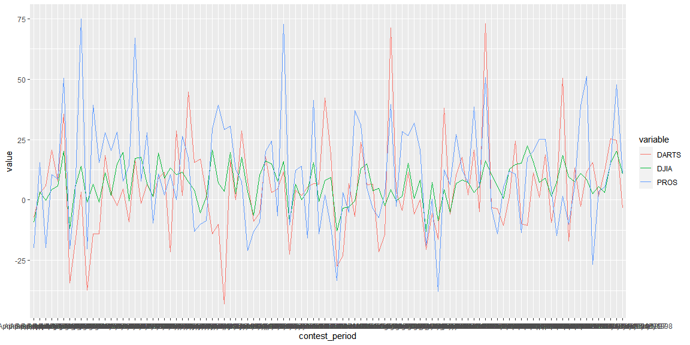

#### First, create a time series plot that shows the six-month returns (y-axis) across time (x-axis) for PROS, DARTS, and DJIA


```r
ggplot(data, aes(x = contest_period, y = value, group = variable, color = variable)) +
  geom_line()
```

<!-- -->

Seems DJIA has the least fluctuation return but small. 

PROS has the most high returns and fluctuates a lot.

I cannot say how much DARTS is different from PROS. DARTS fluctuates a lot and sometimes has high returns.

#### Now we need to "tidy" the data. Use the contestant_period column to create new month_end and year_end columns. (Try using separate() and/or extract() from tidyr. Save your tidy data as an .rds object)


```r
tidy_data <- data %>% 
  separate(contest_period, c("month_start", "month_end_year"), sep = "-") %>% 
  separate(month_end_year, c("month_end", "year_end"), sep = -4) %>% 
  select(-month_start)

tidy_data
```

```
## # A tibble: 300 x 4
##    month_end year_end variable value
##    <chr>     <chr>    <chr>    <dbl>
##  1 June      1990     PROS      12.7
##  2 July      1990     PROS      26.4
##  3 August    1990     PROS       2.5
##  4 September 1990     PROS     -20  
##  5 October   1990     PROS     -37.8
##  6 November  1990     PROS     -33.3
##  7 December  1990     PROS     -10.2
##  8 January   1991     PROS     -20.3
##  9 February  1991     PROS      38.9
## 10 March     1991     PROS      20.2
## # ... with 290 more rows
```

```r
saveRDS(tidy_data, "tidy_data.rds")
```

#### Using the new columns created above, write code that outputs a tibble of the DJIA returns that matches (as closely as possible) the table shown below (aka, “pivot_wider” the data).


```r
DJIA_data <- tidy_data %>% filter(variable == "DJIA")

DJIA_data <- DJIA_data %>% mutate(month_end = stringr::str_replace(month_end, "Dec.", "December")) %>% 
  mutate(month_end = stringr::str_replace(month_end, "Febuary", "February")) %>% 
  mutate(month_end = stringr::str_replace(month_end, "Decembermber", "December"))

DJIA_wide <- DJIA_data %>% 
  pivot_wider(names_from = year_end, values_from = value) %>% 
  mutate(Month = case_when(
    month_end %in% "January" ~ 1,
    month_end %in% 'February' ~ 2,
    month_end %in% "March" ~ 3,
    month_end %in% "April" ~ 4,
    month_end %in% "May" ~ 5,
    month_end %in% "June" ~ 6,
    month_end %in% "July" ~ 7,
    month_end %in% "August" ~ 8,
    month_end %in% "September" ~ 9,
    month_end %in% "October" ~ 10,
    month_end %in% "November" ~ 11,
    month_end %in% "December" ~ 12
  )) %>% 
  arrange(Month) %>% select(-c(variable, Month))

colnames(DJIA_wide)[which(names(DJIA_wide) == "month_end")] <- "Month"

DJIA_wide %>% kable()
```


|Month     |  1990| 1991| 1992| 1993| 1994| 1995| 1996| 1997|  1998|
|:---------|-----:|----:|----:|----:|----:|----:|----:|----:|-----:|
|January   |    NA| -0.8|  6.5| -0.8| 11.2|  1.8| 15.0| 19.6|  -0.3|
|February  |    NA| 11.0|  8.6|  2.5|  5.5|  3.2| 15.6| 20.1|  10.7|
|March     |    NA| 15.8|  7.2|  9.0|  1.6|  7.3| 18.4|  9.6|   7.6|
|April     |    NA| 16.2| 10.6|  5.8|  0.5| 12.8| 14.8| 15.3|  22.5|
|May       |    NA| 17.3| 17.6|  6.7|  1.3| 19.5|  9.0| 13.3|  10.6|
|June      |   2.5| 17.7|  3.6|  7.7| -6.2| 16.0| 10.2| 16.2|  15.0|
|July      |  11.5|  7.6|  4.2|  3.7| -5.3| 19.6|  1.3| 20.8|   7.1|
|August    |  -2.3|  4.4| -0.3|  7.3|  1.5| 15.3|  0.6|  8.3| -13.1|
|September |  -9.2|  3.4| -0.1|  5.2|  4.4| 14.0|  5.8| 20.2| -11.8|
|October   |  -8.5|  4.4| -5.0|  5.7|  6.9|  8.2|  7.2|  3.0|    NA|
|November  | -12.8| -3.3| -2.8|  4.9| -0.3| 13.1| 15.1|  3.8|    NA|
|December  |  -9.3|  6.6|  0.2|  8.0|  3.6|  9.3| 15.5| -0.7|    NA|

