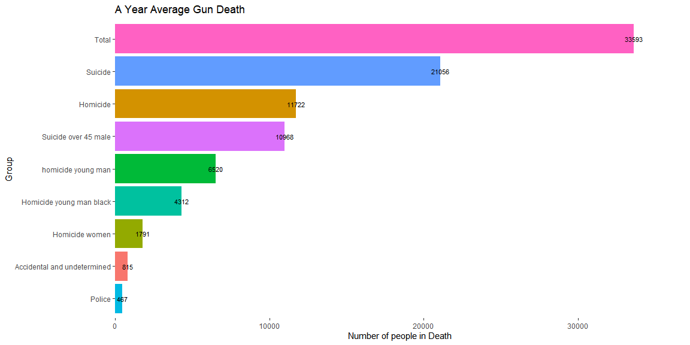
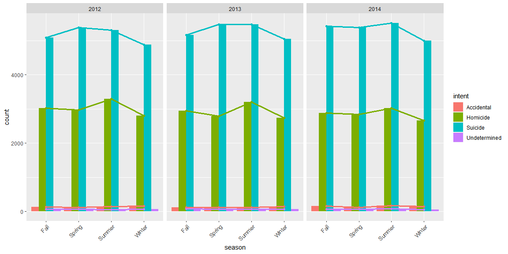
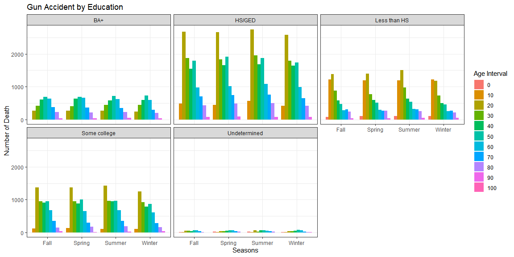
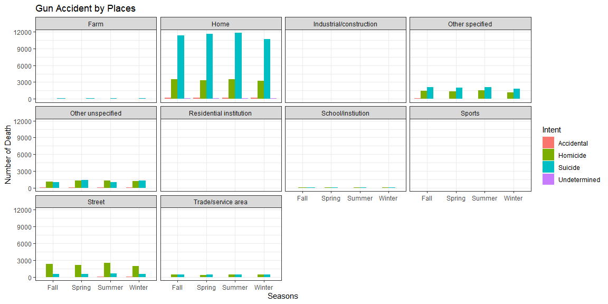

```r
library(tidyverse)
library(readr)

data <- read_csv("https://github.com/fivethirtyeight/guns-data/raw/master/full_data.csv")
```


#### Read the FiveThirtyEight article (Links to an external site.) and write a short paragraph summarizing the article.

I am not sure about the graph that is shown in the website. Is it the average of 3 years? I wonder the police shooting was divided in to 1/3 to since the data is only included in 2014. I understood in that way. I will check these out before I analyze this data deeper. I wonder if I can make this interactive graph with R too. IF I can, I want to try it. While I was reading the article, I felt that collecting reliable data is really hard even some of CDCs data is not reliable. It makes sense why China want to hack U.S. data.

#### Create one plot that provides similar insight to their visualization in the article. It does not have to look like theirs!


```r
data <- data %>% replace_na(list(intent = "Undetermined"))
data <- data %>% replace_na(list(place = "Other unspecified"))
data <- data %>% replace_na(list(education = "Undetermined"))

data <- data %>% drop_na()
```


```r
police <- sum(data %>% group_by(year) %>% count(police) %>% slice(2) %>% pull(n))/3
suicide <- sum(data %>% group_by(year) %>% filter(intent == "Suicide") %>% count(intent) %>% pull(n))/3
suicide_45 <- sum(data %>% group_by(year) %>% filter(intent == "Suicide", age > 45, sex == "M") %>% count(intent) %>% pull(n))/3
Homicide <- sum(data %>% group_by(year) %>% filter(intent == "Homicide") %>% count(intent) %>% pull(n))/3
homicide_young <- sum(data %>% group_by(year) %>% filter(intent == "Homicide", age >= 15, age <= 34, sex == "M") %>% count(intent) %>% pull(n))/3
homicide_young_black <- sum(data %>% group_by(year) %>% filter(intent == "Homicide", age >= 15, age <= 34, sex == "M", race == "Black") %>% count(intent) %>% pull(n))/3
homicide_woman <- sum(data %>% group_by(year) %>% filter(intent == "Homicide", sex == "F") %>% count(intent) %>% pull(n))/3
accidental <- sum(data %>% group_by(year) %>% filter(intent == "Undetermined" | intent == "Accidental") %>% count(intent) %>% pull(n))/3
total <- sum(data %>% group_by(year) %>% count(intent) %>% pull(n))/3

df <- tribble(
  ~group, ~number,
  "Police", police,
  "Suicide", suicide,
  "Suicide over 45 male", suicide_45,
  "Homicide", Homicide,
  "homicide young man", homicide_young,
  "Homicide young man black", homicide_young_black,
  "Homicide women", homicide_woman,
  "Accidental and undetermined", accidental,
  "Total", total
)

df <- df %>% mutate(number = round(df$number, 0))
```


```r
ggplot(df, aes(x = number, y = reorder(group, number), fill = group, label = number)) +
  geom_col() +
  labs(title = "A Year Average Gun Death", x = "Number of people in Death", y = "Group") +
  geom_text(size = 3) +
  scale_x_continuous(expand = expansion(mult = c(0, 0.1))) +
  theme_bw() +
  theme(legend.position = "none", panel.grid = element_blank(), panel.border = element_blank())
```

<!-- -->

#### Search for seasonal trends among the variables in FiveThirtyEight dataset.


```r
data$month <- as.numeric(data$month)
season <- data %>% mutate(season = case_when(month %in% c(3, 4, 5) ~ "Spring",
                                             month %in% c(6, 7, 8) ~ "Summer",
                                             month %in% c(9, 10, 11) ~ "Fall",
                                             month %in% c(12, 1, 2) ~ "Winter"))

num <- season %>% group_by(year, intent, season) %>% count()

ggplot(season, aes(x = season, fill = intent)) +
  geom_bar(position = "dodge") +
  geom_point(data = num, mapping = aes(x = season, y = n, color = intent)) +
  geom_line(data = num , mapping = aes(x = season, y = n, group = intent, color = intent), size = 1.25) +
  facet_wrap(.~year) +
  theme(axis.text.x = element_text(angle = 45, hjust = 1))
```

<!-- -->

Suicide in Winter is the least with the three years of data. Homicide is always highest in Summer. Accidental and Undetermined are less compare to Suicide and Homicide. Often, Accidental is seems hight in Winter.

#### Provide presentation-worthy plots that help our client understand what audiences (variables) they could target in different seasons if they want to reduce gun deaths (2-4 visualizations).


```r
season <- season %>% mutate(age_s = age %/% 10 * 10)
season$age_s <- as.factor(season$age_s)
season$police <- as.factor(season$police)
num <- season %>% group_by(year, intent, season) %>% count()
```


```r
ggplot(season, aes(x = season, fill = age_s)) +
  geom_bar(position = "dodge") +
  facet_wrap(.~education) +
  theme(axis.text.x = element_text(angle = 45, hjust = 1)) +
  labs(title = "Gun Accident by Education", x = "Seasons", y = "Number of Death", fill = "Age Interval") +
  theme_bw()
```

<!-- -->

We can see that other than BA+ education, most of degrees are affected by seasons. Usually, Winter has little bit less number of gun death. However, BA+ education makes people out from this trend. Thus, improving citizens' education level might help to reduce the number of gun death.


```r
ggplot(season, aes(x = season, fill = intent)) +
  geom_bar(position = "dodge") +
  facet_wrap(.~place) +
  labs(title = "Gun Accident by Places", x = "Seasons", y = "Number of Death", fill = "Intent") +
  theme_bw() 
```

<!-- -->

```r
  #theme(axis.text.x = element_text(angle = 45, hjust = 1))
```

Usually, there are more accidents happening during Summer. It is hard to prevent suicide which is the largest at home. However, homicide can be prevented in streets. Summer homicide is the most frequent, so we can target that point to reduce gun accidents.
