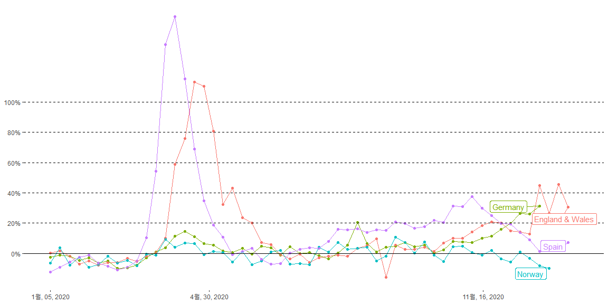
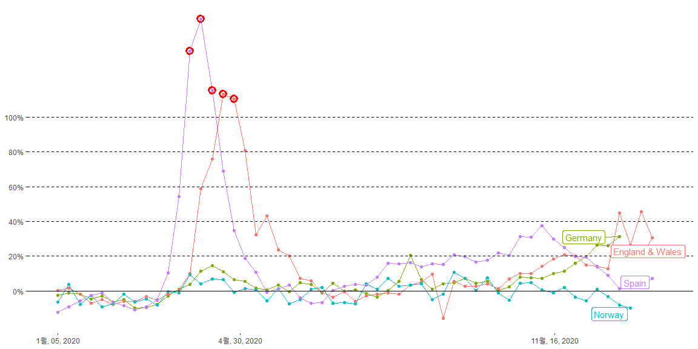
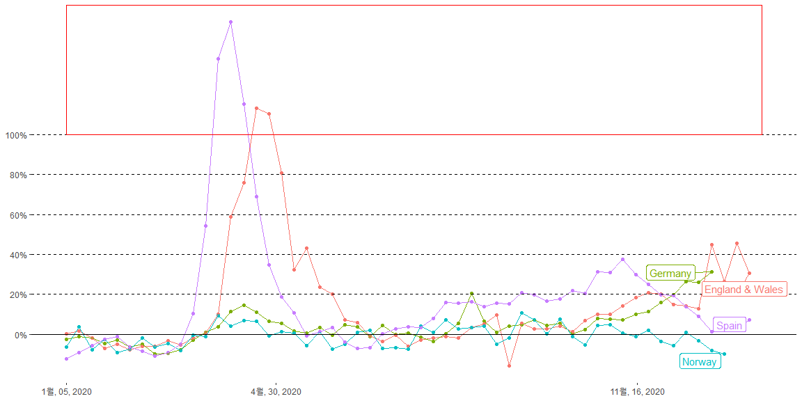
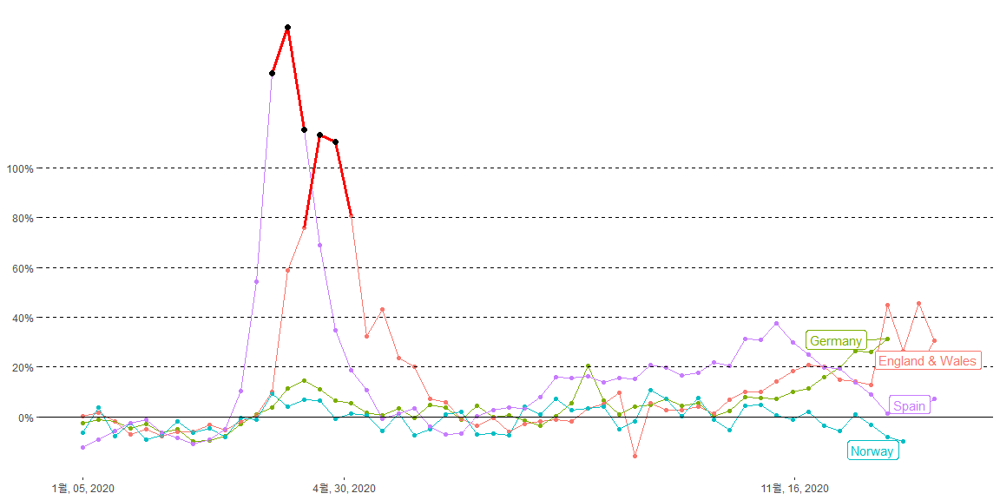
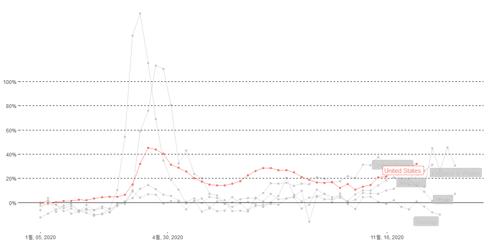
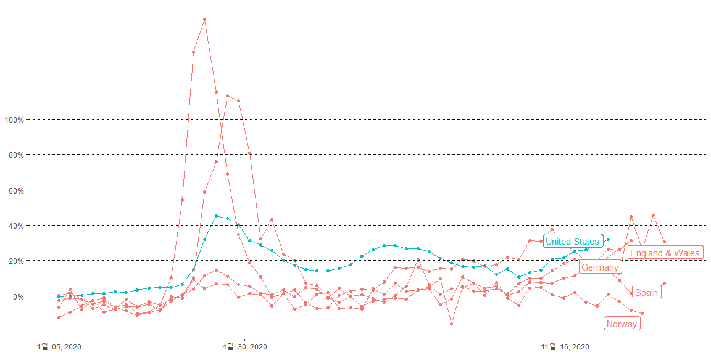

#### (1 graph) Recreate this graph (Links to an external site.) as closely as you can. Focus on labels (title, subtitle, and caption), the y-axis, and line color. 


```r
cov <- cov %>% mutate(Spain = Spain * 100)

cov1 <- cov %>%  select(c(date, Germany, `England & Wales`, Norway, Spain))
cov1 <- cov1 %>% pivot_longer(cols = -date, names_to = "country", values_to = "percentage")

View(cov1)

ger_date <- cov1 %>% filter(country == "Germany") %>% filter(date == "2020-12-27")
eng_date <- cov1 %>% filter(country == "England & Wales") %>% filter(date == "2021-01-17")
nor_date <- cov1 %>% filter(country == "Norway") %>% filter(date == "2021-01-03")
spn_date <- cov1 %>% filter(country == "Spain") %>% filter(date == "2021-01-17")
date <- bind_rows(ger_date, eng_date, nor_date, spn_date)
```


```r
base <- ggplot(cov1, aes(x = date, y = percentage, color = country)) +
  geom_point() +
  geom_line() +
  theme_bw() +
  scale_y_continuous(NULL, breaks = seq(0, 100, by = 20), labels = function(x) paste0(x, "%")) +
  geom_hline(yintercept = c(20 ,40, 60, 80, 100), linetype = "dashed") +
  geom_hline(yintercept = c(0), linetype = "solid") +
  scale_x_date(NULL, breaks = as.Date(c("2020-01-05", "2020-04-30", "2020-11-16", "2021-05-02")), date_labels = "%B, %d, %Y") +
  theme(panel.grid = element_blank(), panel.border = element_blank()) +
  # ggrepel::geom_label_repel(data = date, aes(label = country), label.size = NA, alpha = 0.8 ) +
  ggrepel::geom_label_repel(aes(label = country), data = date, nudge_x = -10, nudge_y = -2) +
  #scale_x_continuous(NULL, expand = expansion(mult = c(0, 0.2))) +
  theme(legend.position = "none")

base
```

<!-- -->


#### (3 graphs) Suppose we wanted to highlight (draw attention to) any points that are above 100%. Create three more graphs that show three different ways to highlight these points.


```r
over_100 <- cov1 %>% filter(percentage > 100)

base + geom_point(data = over_100, size = 3, shape = 1, color = "red", stroke = 2)
```

<!-- -->


```r
base + geom_rect(aes(xmin = min(date), xmax = max(date), ymax = Inf, ymin = 100), color = "red", fill = NA)
```

<!-- -->


```r
over_70_eng <- cov1 %>% filter(country == "England & Wales") %>%  filter(percentage > 70)
over_80_bul <- cov1 %>% filter(country == "Spain") %>%  filter(percentage > 80)

base + geom_line(data = over_70_eng, mappint = aes(x = date, y = percentage), color = "red", size = 1.25) +
  geom_line(data = over_80_bul, mappint = aes(x = date, y = percentage), color = "red", size = 1.25) +
  geom_point(data = over_100, mappint = aes(x = date, y = percentage), color = "black", size = 2.25)
```

<!-- -->

#### (2 graphs) Now add a line for the United States and make two graphs showing two different methods to highlight the United States data.


```r
cov2 <- cov %>%  select(c(date, Germany, `England & Wales`, Norway, Spain, `United States`))

cov2 <- cov2 %>% pivot_longer(-date, names_to = "country", values_to = "percentage")

us_date <- cov2 %>% filter(country == "United States") %>% filter(date == "2020-12-13")

date <- bind_rows(date, us_date)
```


```r
base2 <- ggplot(cov2, aes(x = date, y = percentage, color = country)) +
  geom_point() +
  geom_line() +
  theme_bw() +
  scale_y_continuous(NULL, breaks = seq(0, 100, by = 20), labels = function(x) paste0(x, "%")) +
  geom_hline(yintercept = c(20 ,40, 60, 80, 100), linetype = "dashed") +
  geom_hline(yintercept = c(0), linetype = "solid") +
  scale_x_date(NULL, breaks = as.Date(c("2020-01-05", "2020-04-30", "2020-11-16", "2021-05-02")), date_labels = "%B, %d, %Y") +
  theme(panel.grid = element_blank(), panel.border = element_blank()) +
  # ggrepel::geom_label_repel(data = date, aes(label = country), label.size = NA, alpha = 0.8 ) +
  ggrepel::geom_label_repel(aes(label = country), data = date, nudge_x = -3, nudge_y = -2) +
  theme(legend.position = "none")

base2 + gghighlight(country == "United States", label_key = country)
```

<!-- -->


```r
cov2_1 <- cov2 %>% mutate(US_or_not = ifelse(country == "United States", "Y", "N"))

date <- date %>% mutate(US_or_not = ifelse(country == "United States", "Y", "N"))

ggplot(cov2_1, aes(x = date, y = percentage, group = country, color = US_or_not)) +
  geom_point() +
  geom_line() +
  theme_bw() +
  scale_y_continuous(NULL, breaks = seq(0, 100, by = 20), labels = function(x) paste0(x, "%")) +
  geom_hline(yintercept = c(20 ,40, 60, 80, 100), linetype = "dashed") +
  geom_hline(yintercept = c(0), linetype = "solid") +
  scale_x_date(NULL, breaks = as.Date(c("2020-01-05", "2020-04-30", "2020-11-16", "2021-05-02")), date_labels = "%B, %d, %Y") +
  theme(panel.grid = element_blank(), panel.border = element_blank()) +
  #ggrepel::geom_label_repel(data = date, aes(label = country), label.size = NA, alpha = 0.8 ) +
  ggrepel::geom_label_repel(aes(label = country), data = date, nudge_x = -3, nudge_y = -2) +
  theme(legend.position = "none")
```

<!-- -->

Both look alike, I tried to find the other way to highlight the U.S. line, but I could not find other way to highlight. I like the first method because U.S. line stands out more than the second one.
