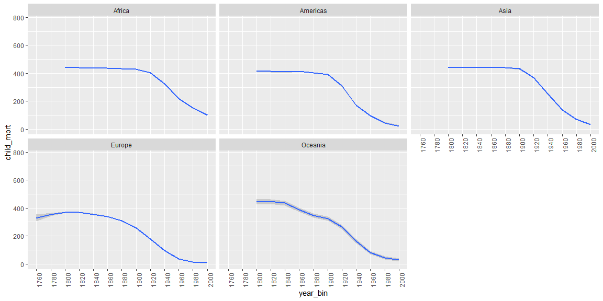
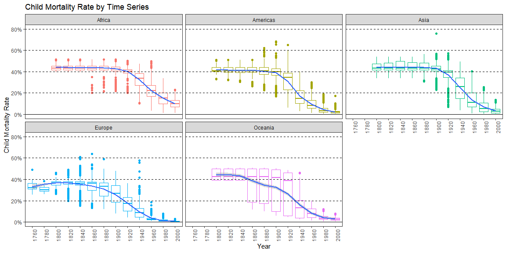

```r
library(tidyverse)
library(ourworldindata)
```


```r
health <- financing_healthcare[-1,]

# select country
health %>% count(country)
```

```
## # A tibble: 318 x 2
##    country                   n
##    <chr>                 <int>
##  1 Afghanistan             211
##  2 Akrotiri and Dhekelia     1
##  3 Aland Islands             1
##  4 Albania                 207
##  5 Algeria                 207
##  6 American Samoa            1
##  7 Andorra                  25
##  8 Angola                  215
##  9 Anguilla                  1
## 10 Antarctica                1
## # ... with 308 more rows
```

```r
in_use <- health %>% count(country) %>% filter(n > 5) %>% pull(country)

# select columns becasue of lots of NA
# total rows: 36873

chekc_na <- health %>%
  select(everything()) %>%  # replace to your needs
  summarise_all(funs(sum(is.na(.))))

health <- health %>% select(year, country, continent, child_mort)# %>% drop_na()
health <- health %>% filter(country %in% as.factor(in_use)) %>% drop_na()
```

#### Create at least three graphics that help you explore the data and understand child mortality (child_mort column).


```r
ggplot(health, aes(x = year, y = child_mort, color = continent)) +
  geom_jitter() +
  facet_wrap(.~continent) +
  theme(axis.text.x = element_text(angle = 90, hjust = 1))
```

<!-- -->


```r
health_bin <- health %>% mutate(year_bin = factor(year%/%20 * 20))

ggplot(health_bin, aes(x = year_bin, y = child_mort)) +
  geom_boxplot() +
  facet_wrap(.~continent) +
  theme(axis.text.x = element_text(angle = 90, hjust = 1)) +
  coord_cartesian(ylim = c(0, 770))
```

<!-- -->


```r
ggplot(health_bin, aes(x = year_bin, y = child_mort, group = continent)) +
  geom_smooth() +
  facet_wrap(.~continent) +
  theme(axis.text.x = element_text(angle = 90, hjust = 1)) +
  coord_cartesian(ylim = c(0, 770))
```

<!-- -->

#### Visualization for Presentation. Create a graphic you could use in a final presentation to communicate something interesting about child mortality.


```r
health_bin <- health_bin %>% mutate(child_mort_percentage = child_mort/1000 * 100)

ggplot(health_bin, aes(x = year_bin, y = child_mort_percentage)) +
  geom_boxplot(aes(color = continent)) +
  geom_smooth(aes(group = continent)) +
  facet_wrap(.~continent) +
  theme_bw() +
  theme(axis.text.x = element_text(angle = 90, hjust = 1)) +
  coord_cartesian(ylim = c(0, 80)) +
  theme(legend.position = "none", panel.grid = element_blank()) +
  scale_y_continuous(labels = function(x) paste0(x, "%")) +
  geom_hline(yintercept = c(20, 40, 60, 80), linetype = "dashed") +
  geom_hline(yintercept = c(0), linetype = "solid") +
  labs(title = "Child Mortality Rate by Time Series", x = "Year", y = "Child Mortality Rate")
```

<!-- -->

All the continents show similar patterns of Child Mortality Rate. We can see that as continent mortality rate gets closer to the mortality rate decreasing year the more countries' mortality rates diversify compare to the other years. In other words, the mortality rates by continent spread like a cone shape as the year get closer to the mortality rate decreasing transition year. Around 2000s, all the continent mortality rate become under 13%.
