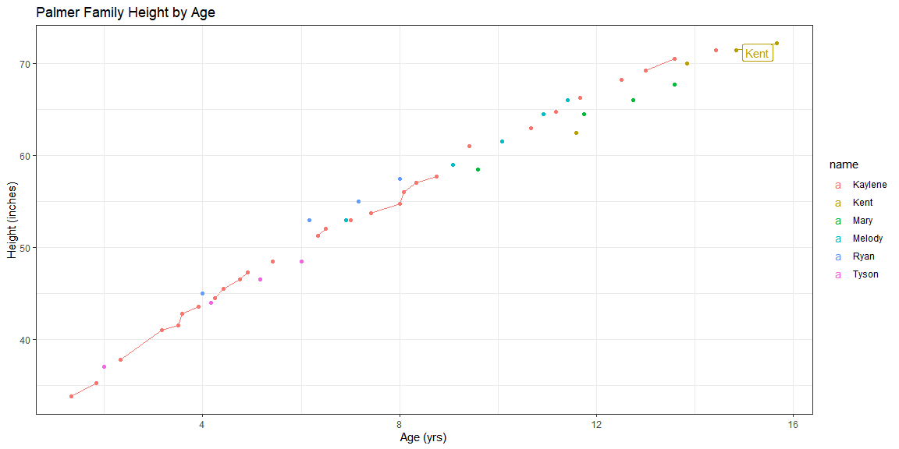

```r
library(tidyverse)
library(readxl)

#data <- openxlsx::read.xlsx("https://github.com/ktoutloud/classslides/blob/master/math335/data/palmer_height_s21.xlsx?raw=true")
#View(data)

data <- read_excel("palmer_height_s21.xlsx")

data_long <- data %>% pivot_longer(cols = -age, names_to = "name", values_to = "Height")

data_long1 <- data_long %>% separate(age, into = c("year", "month"), sep = c("y", "m"))

data_mid <- data_long1 %>% separate(month, into = "month", sep = "m")

data_mid$year <- as.numeric(data_mid$year)
data_mid$month <- as.numeric(data_mid$month)

# range month
month_to_decimal <- function(x){
  x/ 12
}

data_mid$month <- month_to_decimal(data_mid$month)

data_mid$age <- data_mid$year + data_mid$month


kay_age <- data_mid %>% filter(name == "Kaylene") %>% arrange(age) %>% slice(n())
ke_age <- data_mid %>% filter(name == "Kent") %>% arrange(age) %>% slice(n())
mar_age <- data_mid %>% filter(name == "Mary") %>% filter(age == max(age))
mel_age <- data_mid %>% filter(name == "Melody") %>% filter(age == max(age))
ry_age <- data_mid %>% filter(name == "Ryan") %>% filter(age == max(age))
ty_age <- data_mid %>% filter(name == "Tyson") %>% filter(age == max(age))

ages <- bind_rows(kay_age, ke_age, mar_age, mel_age, ry_age, ty_age)

ggplot(data_mid, aes(x = age, y = Height, color = name)) +
  geom_point() +
  geom_line() +
  ggrepel::geom_label_repel(ages , mapping = aes(label = name)) +
  labs(y = "Height (inches)", x = "Age (yrs)", title = "Palmer Family Height by Age") +
  theme_bw()
```

<!-- -->

