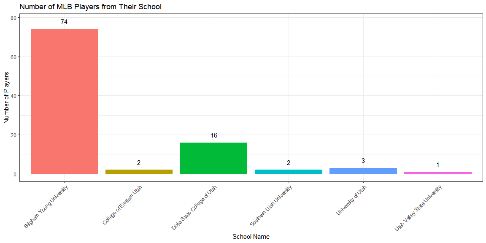
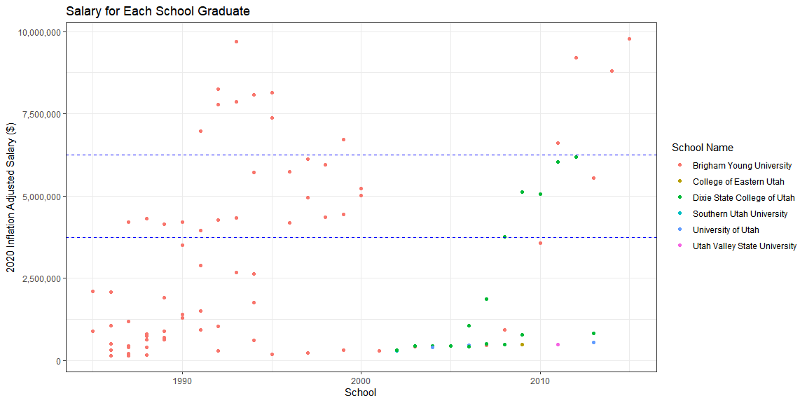

```r
library(tidyverse)
library(Lahman)
library(blscrapeR)
library(pander)

#glimpse(Salaries)
#glimpse(CollegePlaying)
#glimpse(People)
#glimpse(Schools)
```


```r
# start - Utah players
school <- Schools %>% select(schoolID, name_full, state) %>% filter(state == "UT")
school_player <- CollegePlaying %>% inner_join(school, by = "schoolID") %>% select(-state)

UT_player <- school_player %>% group_by(playerID) %>% arrange(yearID) %>% slice(n()) %>% select(-schoolID, -yearID) # %>% count(playerID) %>% View()
```


```r
# real name
peop <- People %>% select(playerID, nameFirst, nameLast)
peop$full_name <- str_c(peop$nameFirst, peop$nameLast, sep = " ")
peop <- peop %>% select(-nameFirst, -nameLast)

UT_player <- UT_player %>% inner_join(peop, by = "playerID")
```


```r
# Adding salary
players <- UT_player %>% inner_join(Salaries, by = "playerID") %>% select(-lgID, -teamID)
View(players)
```

#### Graphs to compare


```r
# 2020 based inflation
values <- inflation_adjust(base_year = 2020)

# implying to the salary
players$adj_salary <- 0
for (i in 1:nrow(players)) {
  players$adj_salary[i] = players$salary[i] / filter(values, values$year == players$yearID[i]) %>% pull(adj_value)
}
```


```r
coun <- data.frame(table(players$name_full))

ggplot(players, aes(x = name_full, fill = name_full)) + 
  geom_bar() +
  geom_text(aes(label = ..count..), stat = "count", nudge_y = 4) + # vjust = -0.5
  theme_bw() +
  theme(legend.position = "none", axis.text.x = element_text(angle = 45, hjust = 1)) +
  labs(title = "Number of MLB Players from Their School", y = "Number of Players", x = "School Name")
```

<!-- -->


```r
meanP <- players %>%                                        # Specify data frame
  group_by(name_full) %>%                         # Specify group indicator
  summarise_at(vars(adj_salary),              # Specify column
               list(mean = mean))              # Specify function
```


```r
options(scipen=5)
ggplot(players, aes(x = name_full, y = adj_salary, color = name_full)) +
  geom_boxplot() +
  geom_point(data = meanP, mapping = aes(x = name_full, y = mean), size = 2.5) +
  scale_y_continuous(labels = scales::comma_format(big.mark = ",")) +
  labs(title = "Salary for Each School Graduate", x = "School", y = "2020 Inflation Adjusted Salary ($)") +
  theme_bw() +
  theme(axis.text.x = element_text(angle = 45, hjust = 1), legend.position = "none")
```

<!-- -->


```r
ggplot(players, aes(x = yearID, y = adj_salary, color = name_full)) +
  geom_point() +
  labs(color = "School Name", title = "Salary for Each School Graduate", x = "School", y = "2020 Inflation Adjusted Salary ($)") +
  scale_y_continuous(labels = scales::comma_format(big.mark = ",")) +
  geom_hline(yintercept = c(6250000, 3750000), linetype = 2, color = "blue") +
  theme_bw()
```

<!-- -->


#### Conclusion
Most of the MLB players from Utah schools were BYU. Compare to the other schools, most of the high salary players from BYU.
