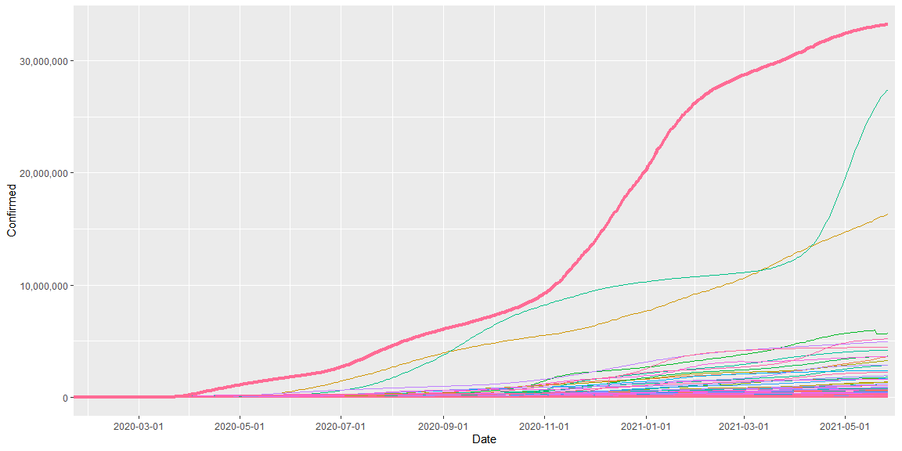
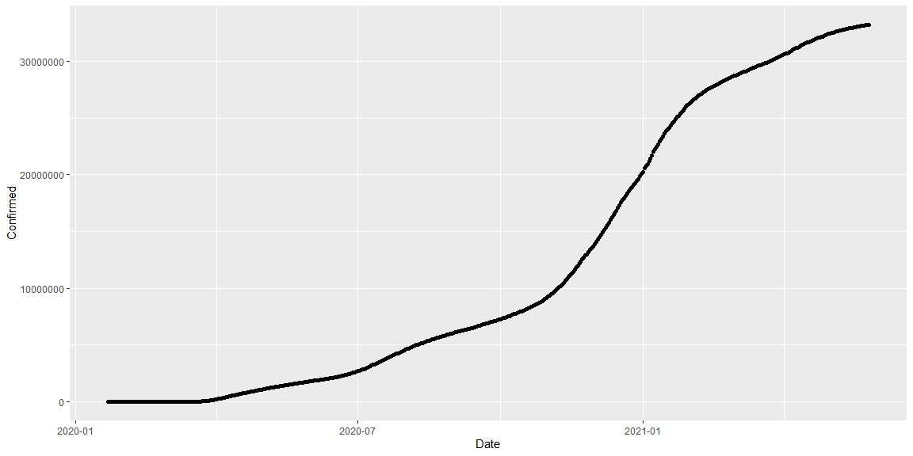
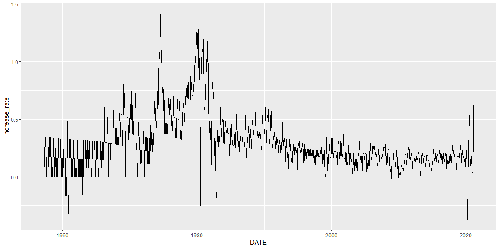
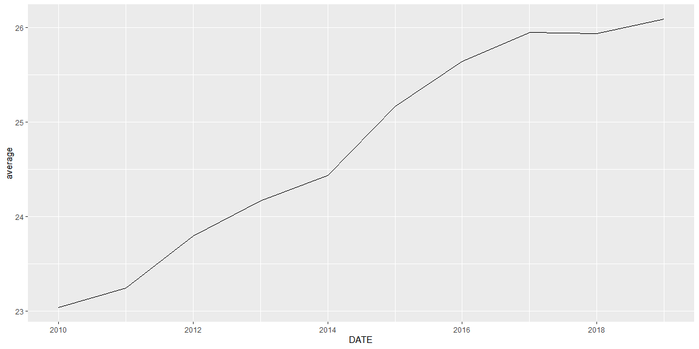

```r
library(tidyverse)
library(readr)
```

#### Part 1: Review the “What I do when I get a new data set (Links to an external site.)" reading, and write one quote that resonated with you.

Setp 1: Make an outline what I want to do with the data.
Step 2: Play with data (types of variables, are data interactive, missing values)
Step 3: Make into tidy data
Step 4: Visualize (for exploration; quick graph)
Step 5: Answer my question. (Using model: 60% training, 40% testing)

#### Find 3-5 potential data sources (that are free). Include a link to each source, and document some information about the source

(Kaggle COVID 19)(https://www.kaggle.com/gauravduttakiit/covid-19)
It has eight csv data sets. The data is up to date. It has US and worldwide aggregate data.

(St. Louis FRED)[https://fred.stlouisfed.org/]
It has many economical data sets. It not only has economical data but also fun data too such as
airlines ticket price data.

(World Bank)[https://data.worldbank.org/]
World Bank is a national institutional bank for developing countries.
This data will show out of the U.S. situation well.

#### Write R code that reads in, formats, and quickly visualizes the data (Aka, perform exploratory data analysis for each source.)

##### Kaggle

```r
covid_data <- read_csv("C:/Users/Jae/Desktop/R/Math 335/project/countries-aggregated.csv/countries-aggregated.csv")

options(scipen = 999)
covid_data %>% ggplot(aes(x = Date, y = Confirmed)) +
  geom_line(aes(group = Country, color = Country)) +
  geom_line(data = covid_data %>% filter(Country == "US"), aes(x = Date, y = Confirmed, color = Country), size = 1.5) +
  scale_y_continuous(labels = scales::comma_format(big.mark = ',')) + #, decimal.mark = '.')) +
  scale_x_date(expand = expansion(mult = c(0, 0.01)), date_breaks = "2 month") +
  theme(legend.position = "none")
```

<!-- -->


```r
covid_data %>% filter(Date == max(Date), Confirmed == max(Confirmed))
```

```
## # A tibble: 1 x 5
##   Date       Country Confirmed Recovered Deaths
##   <date>     <chr>       <dbl>     <dbl>  <dbl>
## 1 2021-05-27 US       33217718         0 593282
```


```r
ggplot(covid_data %>% filter(Country == "US"), aes(x = Date, y = Confirmed)) +
  geom_point()
```

<!-- -->


##### FRED(CPI)


```r
CPI <- read_csv("C:/Users/Jae/Desktop/R/Math 335/project/CPILFESL.csv")

CPI$last <- lag(CPI$CPILFESL, 1)
CPI$increase_rate <- (CPI$CPILFESL - CPI$last) / CPI$last * 100
CPI <- CPI[-1,]

ggplot(CPI, aes(x = DATE, y = increase_rate)) +
  geom_line()
```

<!-- -->

##### FRED(inequality)


```r
LA_county <- read_csv("C:/Users/Jae/Desktop/R/Math 335/project/inequality/2020RATIO006037.csv")
Sanfran_county <- read_csv("C:/Users/Jae/Desktop/R/Math 335/project/inequality/2020RATIO006075.csv")
Cook_county <- read_csv("C:/Users/Jae/Desktop/R/Math 335/project/inequality/2020RATIO017031.csv")
Hudson_county <- read_csv("C:/Users/Jae/Desktop/R/Math 335/project/inequality/2020RATIO034017.csv")
NY_county <- read_csv("C:/Users/Jae/Desktop/R/Math 335/project/inequality/2020RATIO036061.csv")

inequality <- LA_county %>%  left_join(Sanfran_county)
inequality <- inequality %>% left_join(Cook_county)
inequality <- inequality %>% left_join(Hudson_county)
inequality <- inequality %>% left_join(NY_county)
#inequality <- inequality %>% pivot_longer(cols = c(`2020RATIO006037`, `2020RATIO006075`, `2020RATIO017031`, `2020RATIO034017`, `2020RATIO036061`), names_to = "city", values_to = "value")
inequality <- inequality %>% group_by(DATE) %>% mutate(average = (sum(`2020RATIO006037`, `2020RATIO006075`, `2020RATIO017031`, `2020RATIO034017`, `2020RATIO036061`)/5))

ggplot(inequality, aes(x = DATE, y = average)) +
  geom_line()
```

<!-- -->

#### After exploring the data, write a short summary for each source about the read in process, and what you learned about the quality of the data.

Because those websites are authoritative data websites, all the data I got was clean. Especially, Kaggle data are cleaned by many individuals, data were already cleaned by the others.

FRED data are well cleaned and it shows individual things. So, it will be good if I know what kind of data I will need in advance of just collecting data.

I spent some time in World Bank data cataloges. However, data can be shown in their websites, I could not figure out how to get the data. Also, loading the data in the website was a little slow.


#### Part 3: Summarize the advantages and limitations of using these data sources to address your original project question. If needed, identify an alternative question you could use for your project.

Kaggle:
My mind is settled since the case study 2. This data is up-to-date. It has confirmed, recovered and death by every country.
I will use the COVID-19 data and show daily change all around the world by showing map graph.
Also, I want to have a line graph that can move simutaneously with the map graph.
Since, the data from Kaggle has all the nations and all the days since COVID-19 happened, I would enjoy using these data sets. 
I think this is accumulated cases. Thus, I have to wranggle the data to get everyday cases.

FRED(CPI):
The data is about Consumer Price Index for All Urban Consumers: All Items Less Food and Energy in U.S. City Average.
Nowadays inflation is the big issue. The data exist up to 2021 April 1st. Central Bank said this will be a temperal inflation.
We do not know how long is temperal. We can know after it happened. 
There were two spikes around 1975 and 1980. In early 2020, there was the biggest spike downward.
After that, the spike is keep going up. I am not sure how economists will interprete this.
However, I am sure this is not usual. The limitation is I am not sure which data I can add to the current one, so I get a cool insigths from aggregate data.

I tried to get data from the World Bank data website. However, I could not figure it out.
FRED(inequality):
This data represents the ratio of the mean income for the highest quintile (top 20 percent) of earners divided by the mean income of the lowest quintile (bottom 20 percent) of earners in a particular county.
As we can see the inequality ratio is increasing. I am interested in studying income inequality, however, I could not figure out what features I have to see more. So, sadly, I have to stop here.

I think data from these websites might not have limitations. I think I am limited how to use those data well.

