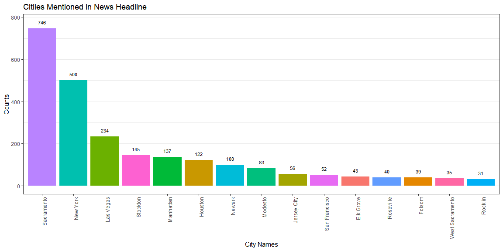
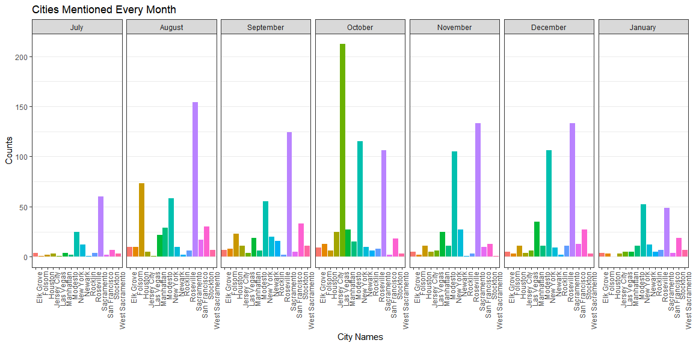
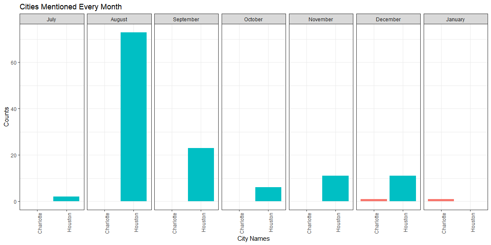

```r
library(tidyverse)
library(readr)
library(maps)
library(stringi)
```


```r
NY <- read_csv("https://storybench.org/reinventingtv/abc7ny.csv")

CA <- read_csv("https://storybench.org/reinventingtv/kcra.csv")

News <- bind_rows(NY, CA)
```


```r
cities <- separate(us.cities, col = name, into = c("city", "state"), sep = -3)

cities_vector <- unlist(cities$city)
cities_str <- unique(str_c(cities_vector, collapse = "|"))
```

####  For each headline, identify the name of the city mentioned in the headline (if any).


```r
News$cities_mentioned <- News$headline %>% str_extract_all(cities_str, simplify = TRUE)
```

#### Question 1: For the 15 cities with the most mentions overall, create a graphic that summarizes their mentions. Write a paragraph in which you discuss the results. Do they make sense? Do you need to make changes? If something looks wrong, fix your code and run it again to find the new top 15.


```r
cities_str <- str_replace(cities_str, "New York", "New York(?!er)")

cities_str <- str_replace(cities_str, "Sandy Springs", "abc")

cities_str <- str_replace(cities_str, "Sandy", "(?<!Superstorm )Sandy(?! Hook)(?! Kenyon)")

cities_str <- str_replace(cities_str, "Modesto", "Modesto(?! Christian)")

cities_str <- str_replace(cities_str, "Moore", "(?<!Brian  )(?<!Roy )(?<!Mandy )(?<!Bud )(?<!for )(?<!Kayla )Moore(?!'s)")

cities_str <- str_replace(cities_str, "Charlotte", "(?<!Princess )Charlotte(?!'s)(?!sville)")

cities_str <- str_replace(cities_str, "Davis", "(?<!Viola )(?<!Dave )(?<!Kim )(?<!UC )(?<!Paige )Davis")

cities_str <- str_replace(cities_str, "Folsom", "(?<!Lake )Folsom(?! Lake)")

cities_str <- str_replace(cities_str, "Clinton", "(?<!Chelsea )(?<!, )(?<!Hillary )(?<!and )Clinton(?! shares)(?! speaks)(?! Foundation)")

cities_str <- str_replace(cities_str, "Taylor", "(?<!Will )Taylor(?! Swift)(?! sells)(?!'s)")

cities_str <- str_replace(cities_str, "Chicago", "Chicago(?! Cubs)(?! Bears)")

cities_str <- str_replace(cities_str, "Brea", "Brea(?!k)(?!t)(?!s)()?!d")

News$cities_mentioned <- News$headline %>% str_extract_all(cities_str, simplify = TRUE)
```


```r
top_15_1 <- News %>% group_by(cities_mentioned) %>% summarise(n = n()) %>% arrange(desc(n))

top_15_1 <- top_15_1[2:16,] %>% mutate(cities_mentioned = unlist(cities_mentioned))
```


```r
ggplot(top_15_1, aes(x = reorder(cities_mentioned[,1], -n), y = n, fill = cities_mentioned[,1])) +
  geom_bar(stat = "identity") +
  geom_text(aes(label = n), size = 3, nudge_y = 30) +
  theme_bw() +
  theme(axis.text.x = element_text(angle = 90, hjust = 1), legend.position = "none", panel.grid.major.x = element_blank()) +
  labs(title = "Citiies Mentioned in News Headline", x = "City Names", y = "Counts")
```

<!-- -->

Several cities have same names as people names, natural disaster names, institution names, or names for certain teams. Therefore, those should be removed. There were some changes.

#### Question 2: For those same 15 cities, create a graphic to show the headline count for each city for each month. Write a paragraph to discuss meaningful insights from the graph about headlines over time for certain cities and/or other features and trends you notice in the graph.


```r
cities_15 <- unlist(top_15_1 %>% pull(cities_mentioned)) %>% stri_remove_empty()

News_new <- News %>% filter(cities_mentioned[,1] %in% cities_15)

News_new <- News_new %>% separate(datetime, into = c("Month", "Day", "Year"),sep = " ")
News_new$Day <- str_remove(News_new$Day, ",")

News_new$Month <- factor(News_new$Month, levels = c("July", "August", "September", "October", "November", "December", "January"))
```


```r
ggplot(News_new, aes(x = cities_mentioned[,1], fill = cities_mentioned[,1])) +
  geom_bar() +
  facet_wrap(.~Month, nrow = 1) +
  theme_bw() +
  theme(legend.position = "none", axis.text.x = element_text(angle = 90, hjust = 1), panel.grid.major.x = element_blank()) +
  labs(title = "Cities Mentioned Every Month", x = "City Names", y = "Counts")
```

<!-- -->

City Roseville and Modesto were mentioned nice amount of time through all the months. Seems like something happened in Roseville through August to December and in Modesto through October to December. Jersey City had a big spike in October. Mostly, in July and January, not so many cities were mentioned in general. Foisom had a big spike in August.

#### Question 3: Create a graphic specifically dedicated to comparing the headlines generated about Houston, TX and Charlotte, NC over time (by month). What trends do you notice?


```r
three <- c("Houston", "Charlotte")

News_Hou <- News %>% filter(cities_mentioned[,1] %in% three)

News_Hou <- News_Hou %>% separate(datetime, into = c("Month", "Day", "Year"),sep = " ")
News_Hou$Day <- str_remove(News_Hou$Day, ",")

News_Hou$Month <- factor(News_Hou$Month, levels = c("July", "August", "September", "October", "November", "December", "January"))
```


```r
ggplot(News_Hou, aes(x = cities_mentioned[,1], fill = cities_mentioned[,1])) +
  geom_bar() +
  facet_wrap(.~Month, nrow = 1) +
  theme_bw() +
  theme(legend.position = "none", axis.text.x = element_text(angle = 90, hjust = 1)) +
  labs(title = "Cities Mentioned Every Month", x = "City Names", y = "Counts")
```

<!-- -->

Houston had been mentioned a lot, while Charlotte had not been mentioned much. Houston had a spike in August and decreased until January when Houston was not mentioned any. Charlotte was mentioned only in December and January. 

