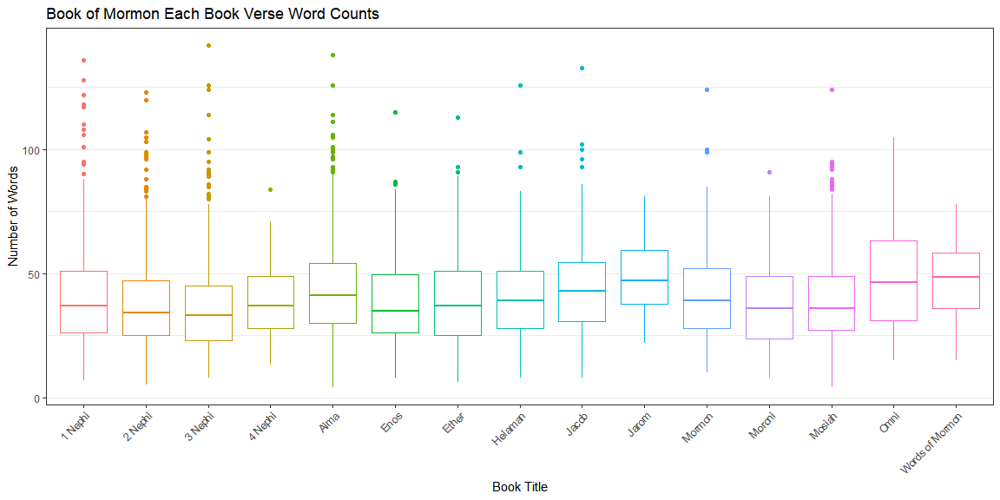

```r
library(tidyverse)
library(downloader)

download("http://scriptures.nephi.org/downloads/lds-scriptures.csv.zip", "temp.zip")
unzip("temp.zip")

scripture_data <- read_csv("lds-scriptures.csv",
                           col_types = cols(book_subtitle = col_character(),
                                            volume_subtitle = col_character()))
```

#### What is the average verse length (number of words) in the New Testament compared to the Book of Mormon?


```r
scripture_new_mor <- scripture_data %>% filter(volume_title == "New Testament" | volume_title == "Book of Mormon")
# scripture_new_mor$lengths <- str_count(scripture_new_mor$scripture_text, " ") + 1

scripture_new_mor$lengths <- str_count(scripture_new_mor$scripture_text, boundary("word"))

scripture_new_mor %>% group_by(volume_title) %>% summarise(`avg number of words` = mean(lengths))
```

```
## # A tibble: 2 x 2
##   volume_title   `avg number of words`
##   <chr>                          <dbl>
## 1 Book of Mormon                  40.5
## 2 New Testament                   22.7
```

#### How often is the word "Jesus" in the New Testament compared to the Book of Mormon?


```r
scripture_new_mor$Je <- str_count(scripture_new_mor$scripture_text, "Jesus")

scripture_new_mor %>% group_by(volume_title) %>% summarise(`number of Jesus` = sum(Je))
```

```
## `summarise()` ungrouping output (override with `.groups` argument)
```

```
## # A tibble: 2 x 2
##   volume_title   `number of Jesus`
##   <chr>                      <int>
## 1 Book of Mormon               184
## 2 New Testament                976
```

#### What does the distribution of verse word counts look like for each book in the Book of Mormon?


```r
ggplot(scripture_new_mor %>% filter(volume_title == "Book of Mormon"), aes(x = book_title, y = lengths, color = book_title)) +
  geom_boxplot() +
  labs(title = "Book of Mormon Each Book Verse Word Counts", x = "Book Title", y = "Number of Words") +
  theme_bw() +
  theme(legend.position = "none", axis.text.x = element_text(angle = 45, hjust = 1), panel.grid.major.x = element_blank())
```

<!-- -->

