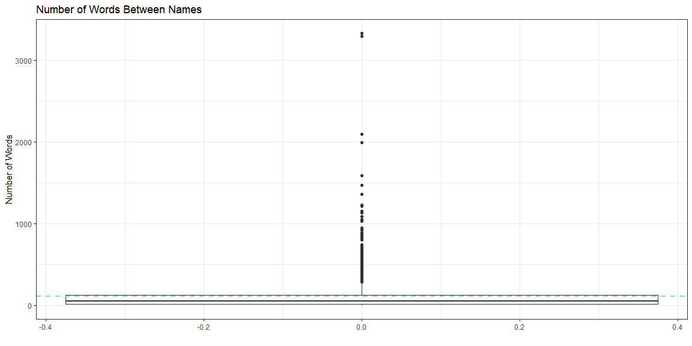

```r
library(tidyverse)
library(readr)
library(stringi)
library(rio)
```


```r
scripture <- rio::import("http://scriptures.nephi.org/downloads/lds-scriptures.csv.zip",
                           col_types = cols(book_subtitle = col_character(),
                                            volume_subtitle = col_character()))


savior <- rio::import("https://byuistats.github.io/M335/data/BoM_SaviorNames.rds")
```


```r
mormon <- scripture %>% filter(volume_title == "Book of Mormon") %>% pull(scripture_text) %>% str_flatten(collapse = " ")


names <- savior %>% pull(name) %>% str_flatten(collapse = " |") %>% str_replace_all(", ", " |")
```

#### Use the list of Savior names and the Book of Mormon verses to figure out the average number of words between references to the Savior.


```r
words <- mormon %>% str_split(pattern = names) %>% unlist() %>% map_int(function(x) {stri_stats_latex(x) %>% .["Words"]})

# words %>% max()

me <- words %>% mean()

me
```

```
## [1] 111.8648
```

#### Create an .Rmd file with 1-2 paragraphs summarizing your graphic that shows how the distance between Savior names is distributed across the Book of Mormon.


```r
words <- data.frame(words)

ggplot(words, aes(y = words), fill = "grey") + 
  geom_boxplot() +
  #geom_density(fill = "red", alpha = 0.2) +
  theme_bw() +
  geom_hline(yintercept = me, linetype = "dashed", color = "skyblue", size = 1) +
  labs(title = "Number of Words Between Names", x = "", y = "Number of Words")
```

<!-- -->

```r
count(words)
```

```
##      n
## 1 2360
```

```r
mean(words %>% filter(words < 200) %>% pull())  
```

```
## [1] 55.71956
```

The median of number of words in between Savior names are 52. The mean of number of words in between Savior names are 112. Out of all the Book of Mormon, there are 2360 intervals in between the Savior names. There are 356 cases that is over 200 and more words in between the Savior names. We can say that the Book of Mormon mentions the Savior name most of the time every 53 words. If we eliminated the intervals that are over 200 words, we get average 56 words exist in between the Savior names. So, except for the intervals that are over 200, we can conclude that the Savior names are mentioned every 53rd words.
