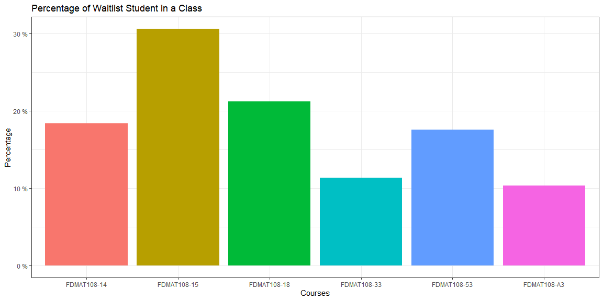
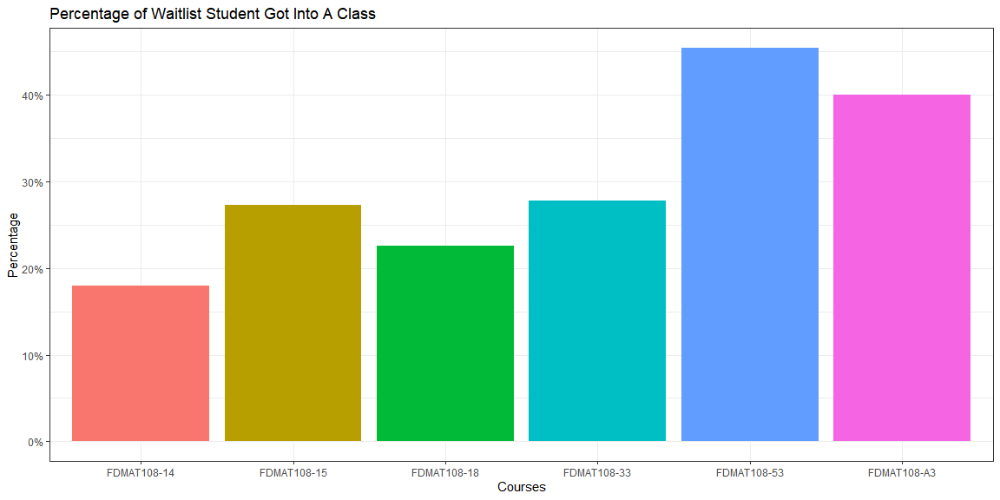

```r
library(readr)
library(lubridate)
library(tidyverse)

data <- read_csv("https://byuistats.github.io/M335/data/waitlist_DP_108.csv")

data <- data %>% mutate(date = lubridate::mdy_hm(`Registration Date`))
```

#### Use the functions from the previous task in conjunction with commands from the purrr package to calculate the following for each section in the dataset.

##### Function 1: The % of currently registered students were at one time on the waitlist. (Currently registered students and those who were on the waitlist at one time)/(Currently registered students)


```r
Fun_1 <- function(x, course){
  deno <- x %>% filter(`Course Sec` == course) %>% group_by(`Person ID`) %>% slice(n()) %>% filter(Status == "Registered") %>% ungroup() %>% count() %>% pull()
  
  numer <- x %>% filter(`Course Sec` == course) %>% group_by(`Person ID`) %>% slice(n()) %>% filter(Status == "Registered") %>% ungroup() %>% filter(`Waitlist Reason` == "Waitlist Registered") %>% count() %>% pull()
  
  round(numer / deno * 100, 2)
  
}

courses <- data %>% select(`Course Sec`) %>% distinct() %>% pull()

function1 <- tibble(course = courses,
       percentage1 = map_dbl(course, function(x) Fun_1(data, x)))

function1
```

```
## # A tibble: 6 x 2
##   course      percentage1
##   <chr>             <dbl>
## 1 FDMAT108-33        11.4
## 2 FDMAT108-A3        10.3
## 3 FDMAT108-15        30.6
## 4 FDMAT108-18        21.2
## 5 FDMAT108-53        17.5
## 6 FDMAT108-14        18.4
```

##### Function 2: The % of students who were ever on the waitlist that are currently registered for for the class. (those who were on the waitlist at one and currently registered students)/(those who were on the waitlist at one time)


```r
Fun_2 <- function(x, course){
  deno <- x %>% filter(`Course Sec` == course) %>% group_by(`Person ID`) %>% filter(Status == "Wait List") %>% distinct(`Person ID`) %>% ungroup() %>% count() %>% pull()
  
  numer <- x %>% filter(`Course Sec` == course) %>% group_by(`Person ID`) %>% slice(n()) %>% filter(Status == "Registered") %>% ungroup() %>% filter(`Waitlist Reason` == "Waitlist Registered") %>% count() %>% pull()
  
  round(numer / deno * 100, 2)
  
}

# paste0(map_dbl(courses, function(x) Fun_2(data, x)), " %")

function2 <- tibble(course = courses,
       percentage2 = map_dbl(courses, function(x) Fun_2(data, x)))

function2
```

```
## # A tibble: 6 x 2
##   course      percentage2
##   <chr>             <dbl>
## 1 FDMAT108-33        27.8
## 2 FDMAT108-A3        40  
## 3 FDMAT108-15        27.3
## 4 FDMAT108-18        22.6
## 5 FDMAT108-53        45.4
## 6 FDMAT108-14        18
```

#### Create a plot or two that explore the relationship between the two metrics above, while incorporating other variable(s) from the dataset (e.g. semester).


```r
ggplot(function1, aes(x = course, y = percentage1, fill = course)) +
  geom_bar(stat = "identity") +
  theme_bw() +
  theme(legend.position = "none") +
  labs(title = "Percentage of Waitlist Student in a Class", x = "Courses", y = "Percentage") +
  scale_y_continuous(labels = function(x) paste(x, "%"))
```

<!-- -->


```r
ggplot(function2, aes(x = course, y = percentage2, fill = course)) +
  geom_bar(stat = "identity") +
  theme_bw() +
  theme(legend.position = "none") +
  labs(title = "Percentage of Waitlist Student Got Into A Class", x = "Courses", y = "Percentage") +
  scale_y_continuous(labels = function(x) paste0(x, "%"))
```

<!-- -->

#### Do you see a trend/pattern? If so, describe it. If not, discuss what other factors may be affecting these waitlist percentages that we haven't taken into account.

Seems like Function 1 and Function 2 have reciprocal relationship. When there is a high percentage of waitlist students in a class, there is a smaller percentage of students who got into a class, vice versa. Which means that there are some classes that students get crowded. I think it will be better to have who is teaching the classes, the original size of the classes, and how many students are in the classes at the end.

