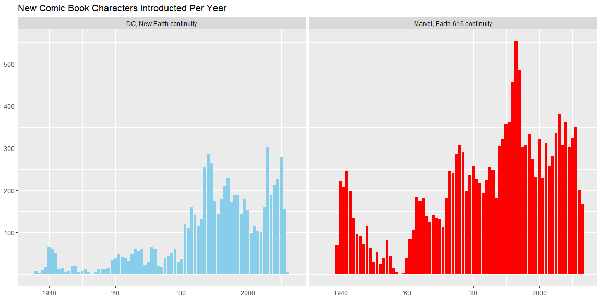
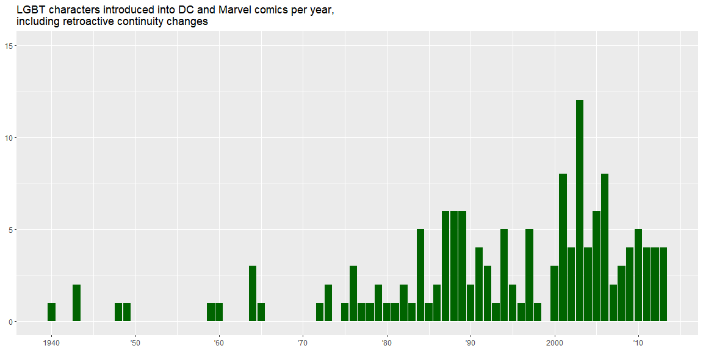

```r
library(tidyverse)
library(rio)
```


```r
my_URL_dc <- "https://github.com/fivethirtyeight/data/blob/master/comic-characters/dc-wikia-data.csv?raw=true"
my_URL_marvel <- "https://github.com/fivethirtyeight/data/blob/master/comic-characters/marvel-wikia-data.csv?raw=true"

dc <- read_csv(my_URL_dc)
marvel <- read_csv(my_URL_marvel)
colnames(marvel) <- colnames(marvel) %>% toupper()
colnames(dc) <- colnames(dc) %>% toupper()

identical(colnames(dc), colnames(marvel))
```

```
## [1] TRUE
```

```r
dc$universe <- "DC, New Earth continuity"
marvel$universe <- "Marvel, Earth-616 continuity"

data <- rbind(dc, marvel)
View(data)
```


```r
ggplot(data, aes(x = YEAR, fill = universe)) +
  geom_bar() +
  scale_y_continuous(NULL, breaks = seq(100, 500, 100)) +
  theme(legend.position = "none") +
  scale_x_continuous(NULL, breaks = seq(1940, 2000, 20), labels = c(1940, "'60", "'80", 2000)) +
  facet_wrap(.~universe) +
  labs(title = "New Comic Book Characters Introducted Per Year") +
  scale_fill_manual(values = c("skyblue", "red"))
```

<!-- -->


```r
#data$SEX <- as.factor(data$SEX)
#gender <- data %>% group_by(YEAR, universe) %>% summarise(feml = count(SEX == "Female Characters") / count(SEX))

#gender <- data %>% select(YEAR, universe, SEX) %>% arrange(YEAR)

#gender %>% 

#count(data$SEX)

#ggplot(data, aes(x = YEAR, y = ))
```


```r
data %>% select(GSM) %>% distinct()
```

```
## # A tibble: 7 x 1
##   GSM                   
##   <chr>                 
## 1 <NA>                  
## 2 Bisexual Characters   
## 3 Homosexual Characters 
## 4 Transvestites         
## 5 Pansexual Characters  
## 6 Transgender Characters
## 7 Genderfluid Characters
```

```r
data_lg <- data %>% filter(GSM != is.na(GSM))
```


```r
ggplot(data_lg, aes(x = YEAR, fill = "green")) +
  geom_bar() +
  scale_x_continuous(NULL, breaks = seq(1940, 2010, 10), labels = c(1940, "'50", "'60", "'70", "'80", "'90", 2000, "'10")) +
  expand_limits(y = c(0,15)) +
  scale_y_continuous(NULL, breaks = c(0, 5, 10, 15)) +
  labs(title = "LGBT characters introduced into DC and Marvel comics per year,\nincluding retroactive continuity changes") +
  scale_fill_manual(values = c("darkgreen")) +
  theme(legend.position = "none")
```

<!-- -->

