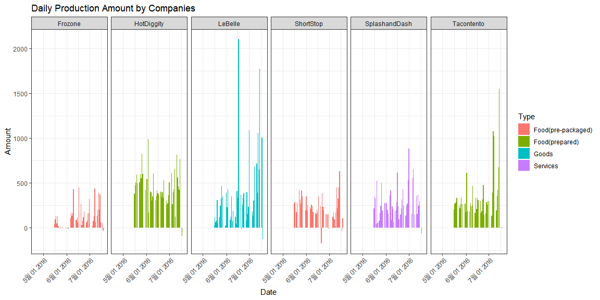
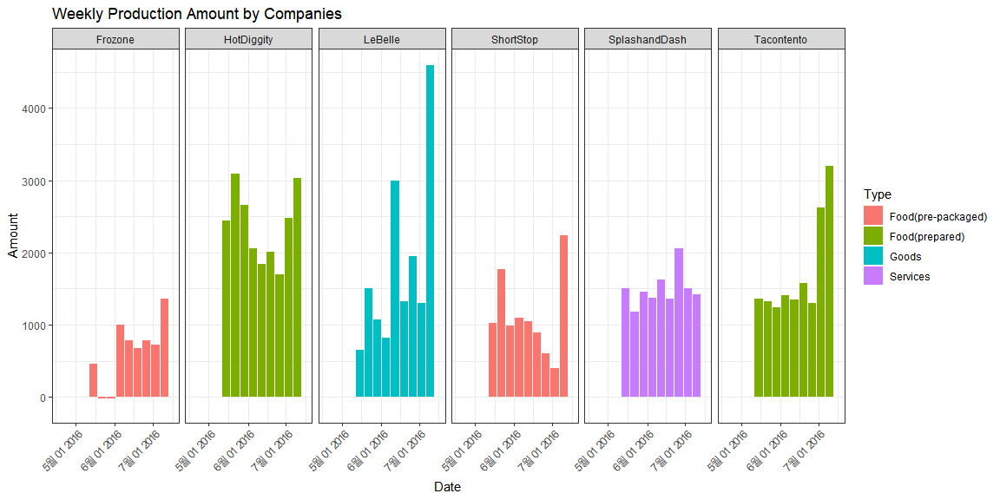
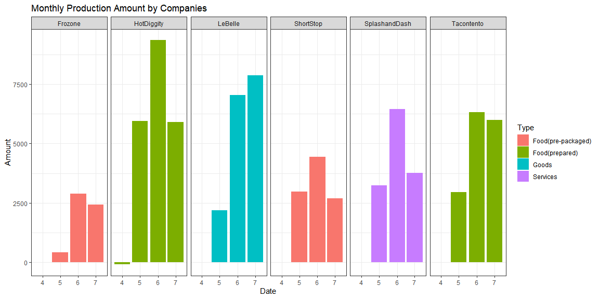
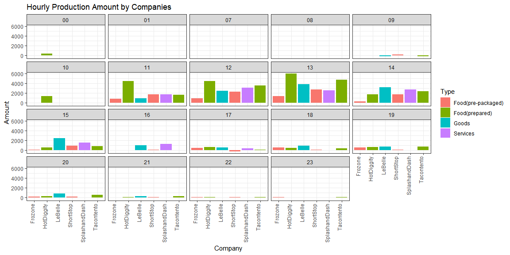
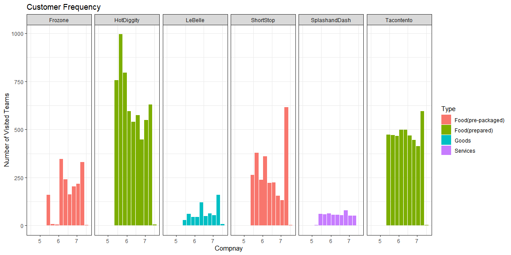

```r
library(readr)
library(lubridate)
library(tidyverse)
```


```r
data <- read_csv("https://byuistats.github.io/M335/data/sales.csv")

data$Time <- with_tz(data$Time, tz = "America/Denver")

data %>% str_count("Missing")
```

```
## [1] 2 2 0 0
```

```r
mis <- which(data$Name %in% "Missing")

data <- data[-mis,]
data %>% str_count("Missing")
```

```
## [1] 0 0 0 0
```

```r
data$daily <- floor_date(data$Time, "day") %>% as.Date()
data$weekly <- floor_date(data$Time, "week") %>% as.Date()
data$monthly <- floor_date(data$Time, "month") %>% as.Date()
data$hours <- round_date(data$Time, "hour") %>% update(yday = 1) %>% format(format = "%H")
```

#### Provide visualizations that show gross revenue over time for each company (Choose if you want to aggregate at the daily, the weekly, or the monthly level).

##### Daily


```r
daily <- data %>% group_by(Name,Type, daily) %>% summarise(sum = sum(Amount))

ggplot(daily, aes(daily, sum, fill = Type)) +
  geom_bar(stat = "identity") +
  scale_x_date(limits = c(min(data$daily), max(data$daily)), date_labels = "%B %d %Y") +
  facet_wrap(.~Name, nrow = 1) +
  theme_bw() +
  labs(title = "Daily Production Amount by Companies", x = "Date", y = "Amount") +
  theme(axis.text.x = element_text(angle = 45, hjust = 1))
```

<!-- -->

##### Weekly


```r
weekly <- data %>% group_by(Name,Type, weekly) %>% summarise(sum = sum(Amount))

ggplot(weekly, aes(weekly, sum, fill = Type)) +
  geom_bar(stat = "identity") +
  facet_wrap(.~Name, nrow = 1) +
  scale_x_date(limits = c(min(weekly$weekly), max(weekly$weekly)), date_labels = "%B %d %Y") +
  theme_bw() +
  labs(title = "Weekly Production Amount by Companies", x = "Date", y = "Amount") +
  theme(axis.text.x = element_text(angle = 45, hjust = 1))
```

<!-- -->

##### Monthly


```r
monthly <- data %>% group_by(Name,Type, monthly) %>% summarise(sum = sum(Amount))

ggplot(monthly, aes(monthly, sum, fill = Type)) +
  geom_bar(stat = "identity") +
  facet_wrap(.~Name, nrow = 1) +
  theme_bw() +
  theme(panel.grid.minor.x = element_blank()) +
  labs(title = "Monthly Production Amount by Companies", x = "Date", y = "Amount")
```

<!-- -->


#### Provide a visualization that gives insight into hours of operation for each company.


```r
hourly <- data %>% group_by(Name, Type, hours) %>% summarise(sum = sum(Amount))

ggplot(hourly, aes(Name, sum, fill = Type)) + 
  geom_bar(stat = "identity") +
  facet_wrap(.~hours) +
  theme_bw() +
  labs(title = "Hourly Production Amount by Companies", x = "Company", y = "Amount") +
  theme(axis.text.x = element_text(angle = 90, hjust = 1, vjust = -0.02))
```

<!-- -->

#### We don’t have employee numbers, but customer traffic (number of transactions) may be helpful. Provide a visualization on customer traffic for each company.


```r
ggplot(data, aes(x = weekly, fill = Type)) +
  geom_bar() +
  theme_bw() +
  labs(title = "Customer Frequency", x = "Compnay", y = "Number of Visited Teams") +
  theme(panel.grid.major.x = element_blank()) +
  facet_wrap(~Name, nrow = 1)
```

<!-- -->

#### Write a short paragraph with your final recommendation. Which company do you think performed the best over the three months?

The data, in general, date range is from May 15th to July 20. Thus, we cannot see the right picture for the revenue by months. HotDiggy's customer traffic is the highest compare to the others. Its trend was going down, but it is coming up lately. LeBelle has the highest fluctuation. I am guessing there might be a season that people buy jewels. Its customers visiting number is growing steadily by week. Tacontento is growing up recently. We have to see what made it happen.  And by industry, food (prepared) industry seem to have nice amount of frequency of visiting and revenue according to the data.


