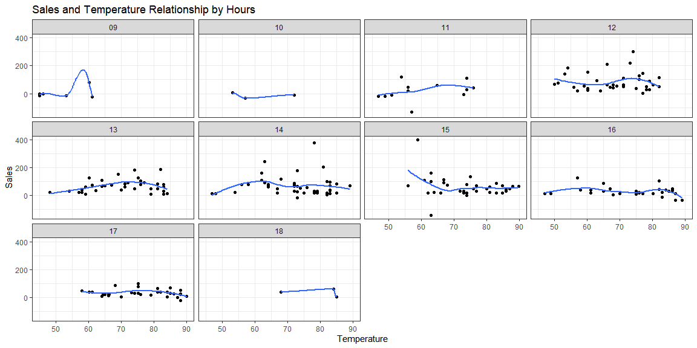

```r
library(tidyverse)
library(lubridate)
library(readr)
library(riem)

data <- read_csv("https://byuistats.github.io/M335/data/carwash.csv")
```

#### Read in the car wash data https://byuistats.github.io/M335/data/carwash.csv and format it for the needs of this task

##### Convert the times from UTC time to mountain time using the right function out of library(lubridate). Create a new hourly grouping variable using ceiling_date() from library(lubridate).


```r
data$time <- with_tz(data$time, "America/Denver")

data$hours <- ceiling_date(data$time, "hour")

data <- data %>% group_by(hours) %>% summarise(sales = sum(amount))
```

#### Use riem_measures(station = "RXE", date_start = , date_end = ) for station RXE from library(riem) to get the matching temperatures. Create a new hourly variable that matches your car wash hourly variable.


```r
#min(data$time)
#max(data$time)

temper <- riem_measures(station = "RXE", date_start = "2016-05-13", date_end = "2016-07-18")

temper1 <- temper %>% filter(tmpf != is.na(tmpf)) %>% select(valid, tmpf)
temper1$hours <- ceiling_date(temper1$valid, "hour")
```


```r
total <- left_join(data, temper1, by = "hours")
total <- total %>% filter(tmpf != is.na(tmpf))
total$fixed_day <- update(total$hours, yday = 1)
```


```r
total$hour <- format(total$fixed_day, format='%H')
```

#### Create a visualization that provides insight into the relationship between sales and temperature by hour of the day.


```r
ggplot(total, aes(tmpf, sales)) +
  geom_point() +
  geom_smooth(se = FALSE) +
  facet_wrap(.~ hour) +
  theme_bw() +
  labs(title = "Sales and Temperature Relationship by Hours", x = "Temperature", y = "Sales")
```

<!-- -->

