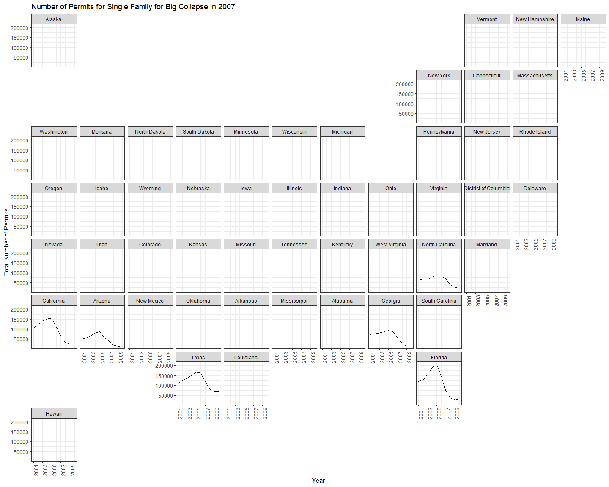
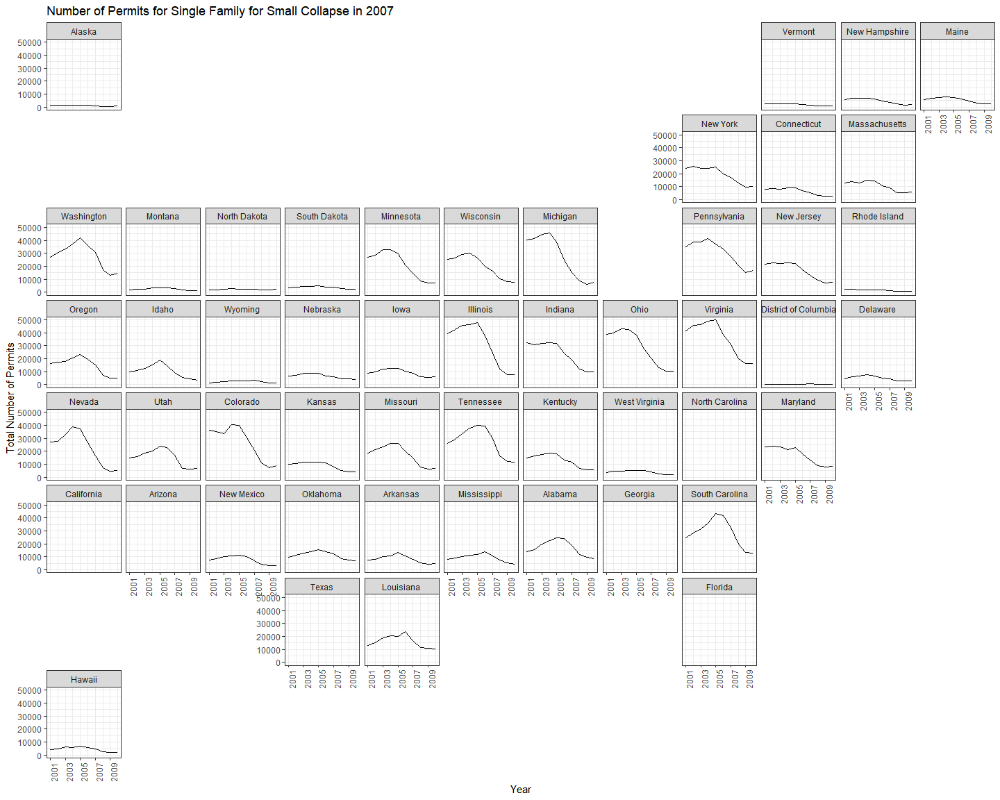
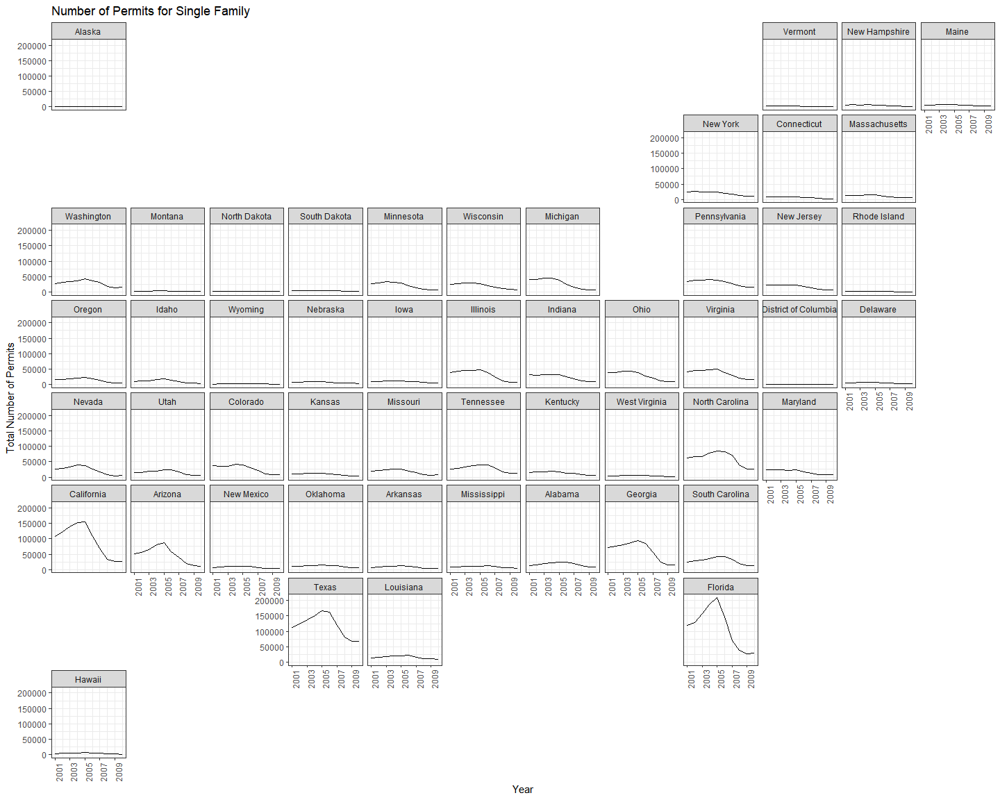
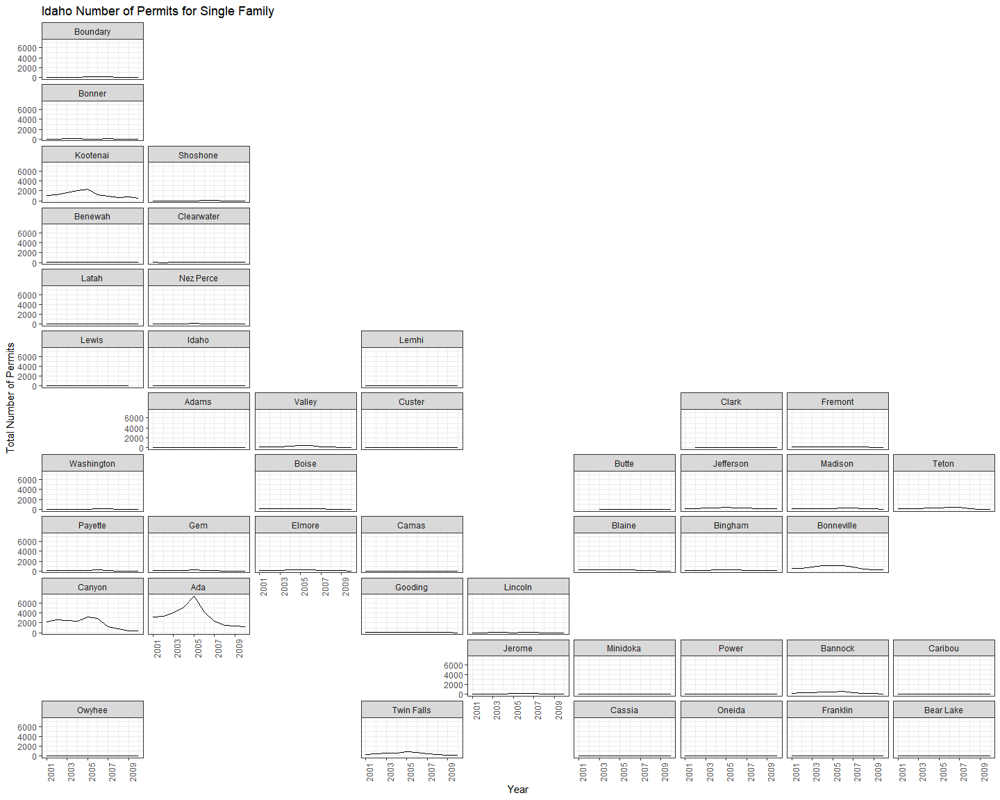
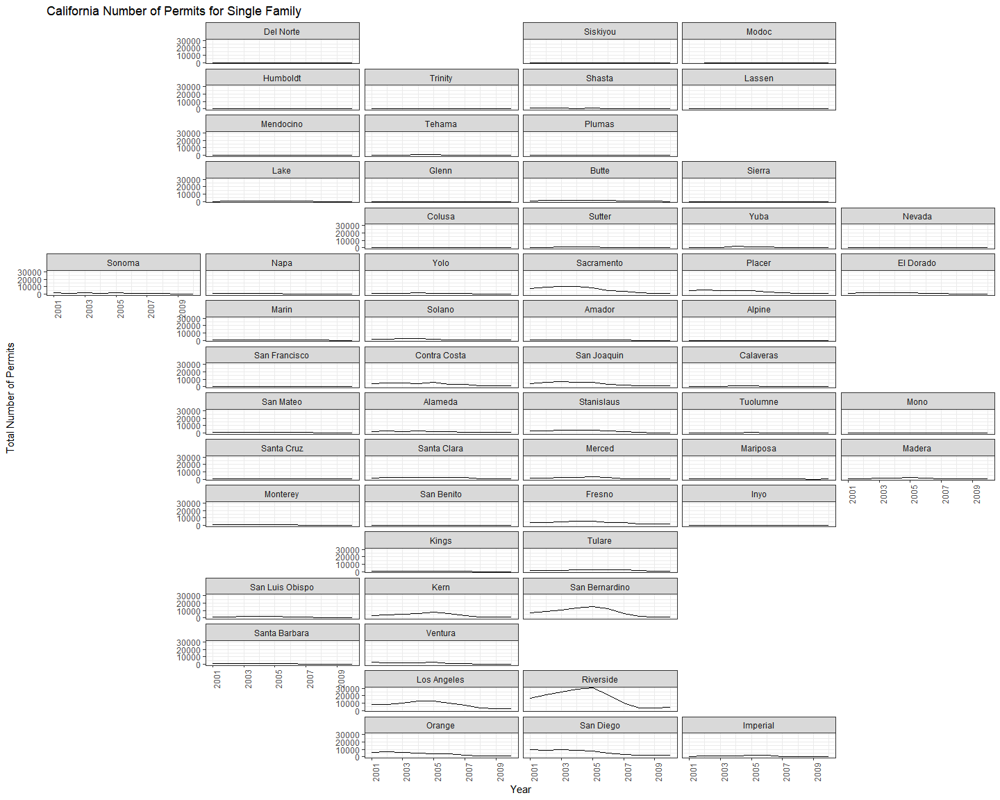
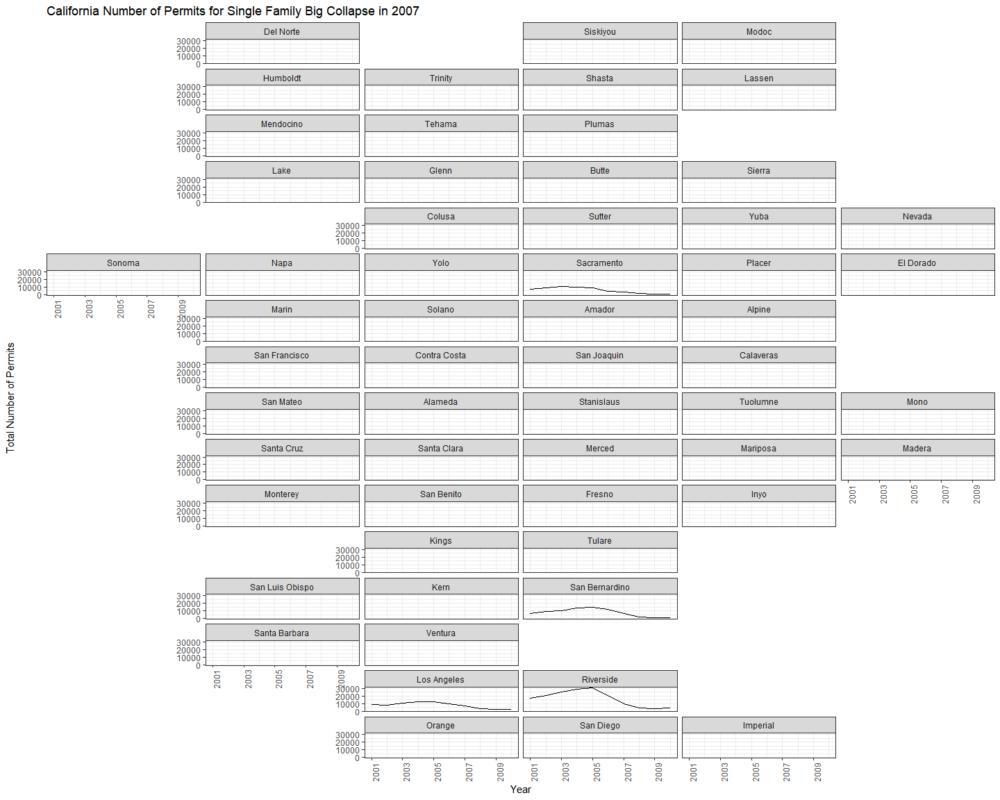
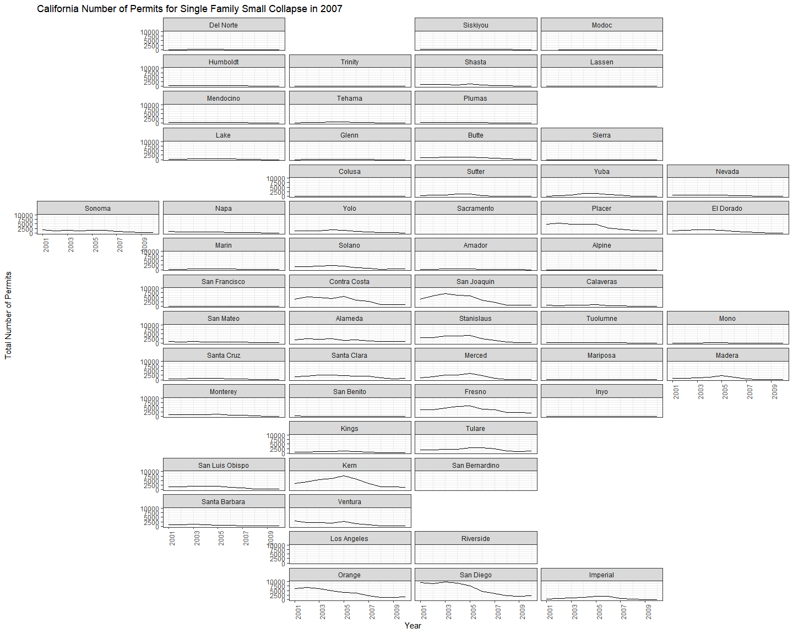

```r
library(tidyverse)
library(USAboundaries)
library(buildings)
library(geofacet)
```


```r
permits_2000 <- permits %>% filter(year > 2000) %>% filter(variable == "Single Family")

permits_2000_states <- permits_2000 %>% group_by(StateAbbr, year) %>% summarise(total_permits = sum(value))
```

#### Create at least one chart that shows trends in single family building permits across the US over time.

```r
ggplot(permits_2000_states %>% filter(StateAbbr %in% c("CA", "TX", "NC", "GA", "FL", "AZ")), aes(x = year, y = total_permits)) +
  geom_line(aes(group = StateAbbr)) +
  facet_geo(~StateAbbr, grid = "us_state_grid2", label = "name") + 
  theme_bw() +
  labs(title = "Number of Permits for Single Family for Big Collapse in 2007", x = "Year", y = "Total Number of Permits") +
  theme(axis.text.x = element_text(angle = 90, hjust = 1)) +
  scale_x_continuous(breaks = seq(2001, 2010, 2))
```

<!-- -->


```r
ggplot(permits_2000_states %>% filter(!StateAbbr %in% c("CA", "TX", "NC", "GA", "FL", "AZ")), aes(x = year, y = total_permits)) +
  geom_line(aes(group = StateAbbr)) +
  facet_geo(~StateAbbr, grid = "us_state_grid2", label = "name") + 
  theme_bw() +
  labs(title = "Number of Permits for Single Family for Small Collapse in 2007", x = "Year", y = "Total Number of Permits") +
  theme(axis.text.x = element_text(angle = 90, hjust = 1)) +
  scale_x_continuous(breaks = seq(2001, 2010, 2))
```

<!-- -->


```r
ggplot(permits_2000_states, aes(x = year, y = total_permits)) +
  geom_line(aes(group = StateAbbr)) +
  facet_geo(~StateAbbr, grid = "us_state_grid2", label = "name") + 
  theme_bw() +
  labs(title = "Number of Permits for Single Family", x = "Year", y = "Total Number of Permits") +
  theme(axis.text.x = element_text(angle = 90, hjust = 1)) +
  scale_x_continuous(breaks = seq(2001, 2010, 2))
```

<!-- -->

#### Create at least one chart that shows trends in single family building permits across counties in your state, over time.


```r
permits_2000_ID <- permits_2000 %>% filter(StateAbbr == "ID") %>% group_by(countyname, year) %>% summarise(total_permits = sum(value)) %>% separate(countyname, c("countyname", NA), sep = -7)

ggplot(permits_2000_ID, aes(x = year, y = total_permits)) +
  geom_line(aes(group = countyname)) +
  facet_geo(~countyname, grid = "us_id_counties_grid1", label = "name") +
  theme_bw() +
  labs(title = "Idaho Number of Permits for Single Family", x = "Year", y = "Total Number of Permits") +
  scale_x_continuous(breaks = seq(2001, 2010, 2)) +
  theme(axis.text.x = element_text(angle = 90, hjust = 1))
```

<!-- -->

#### Create at least one additional chart that could be useful for the news article.


```r
permits_2000_CA <- permits_2000 %>% filter(StateAbbr == "CA") %>% group_by(countyname, year) %>% summarise(total_permits = sum(value)) %>% separate(countyname, c("countyname", NA), sep = -7)

ggplot(permits_2000_CA, aes(x = year, y = total_permits)) +
  geom_line(aes(group = countyname)) +
  facet_geo(~countyname, grid = "us_ca_counties_grid1", label = "name") +
  theme_bw() +
  labs(title = "California Number of Permits for Single Family", x = "Year", y = "Total Number of Permits") +
  scale_x_continuous(breaks = seq(2001, 2010, 2)) +
  theme(axis.text.x = element_text(angle = 90, hjust = 1))
```

<!-- -->


```r
ggplot(permits_2000_CA %>% filter(countyname %in% c("Sacramento", "San Bernardino", "Los Angeles", "Riverside")), aes(x = year, y = total_permits)) +
  geom_line(aes(group = countyname)) +
  facet_geo(~countyname, grid = "us_ca_counties_grid1", label = "name") +
  theme_bw() +
  labs(title = "California Number of Permits for Single Family Big Collapse in 2007", x = "Year", y = "Total Number of Permits") +
  scale_x_continuous(breaks = seq(2001, 2010, 2)) +
  theme(axis.text.x = element_text(angle = 90, hjust = 1))
```

<!-- -->


```r
ggplot(permits_2000_CA %>% filter(!countyname %in% c("Sacramento", "San Bernardino", "Los Angeles", "Riverside")), aes(x = year, y = total_permits)) +
  geom_line(aes(group = countyname)) +
  facet_geo(~countyname, grid = "us_ca_counties_grid1", label = "name") +
  theme_bw() +
  labs(title = "California Number of Permits for Single Family Small Collapse in 2007", x = "Year", y = "Total Number of Permits") +
  scale_x_continuous(breaks = seq(2001, 2010, 2)) +
  theme(axis.text.x = element_text(angle = 90, hjust = 1))
```

<!-- -->

In 2007, many States and Counties' number of permits for single family decreased. In the States scale, southern States' number of permits for single family decreased more compare to the northern States. I wonder what is the causation of the housing market collapse. I think population might affect less than we thought because north east States have high population. The causation might relate to the economy growth and the housing demand growth in southern States.

Seeing the Idaho State, Ada county has the biggest decrease out of all the counties in Idaho. Ada county has the most population in Idaho, and it collapse the most. Also California counties had a big fall in high populated counties. 

Around all, high population affects the housing collapse. However, it is not always true when we see it by States. Obviously, house price gets higher when there is a high demand, so where many population region would have higher demand compare to the less population region. However, I want to see if the other factors affected to the housing price collapse.  
