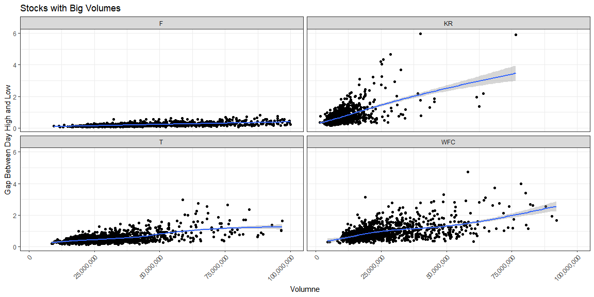
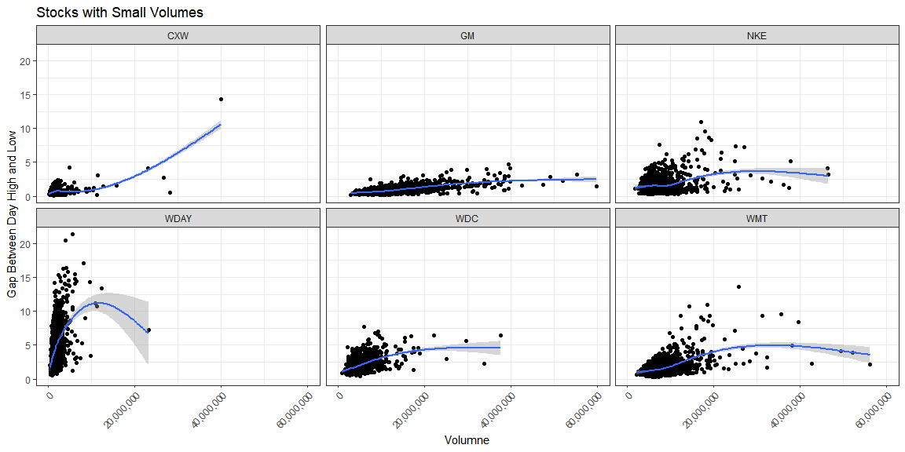

```r
library(tidyverse)
library(quantmod)
library(dygraphs)
library(tidyquant)
```


```r
tickers_today <- c("CXW", "F", "GM", "KR", "WDC", "NKE","T", "WDAY", "WFC", "WMT")

stocks <- tq_get(tickers_today)

stocks <- stocks %>% filter(date >= today() - years(5))
```

#### Use library(dygraphs) to build (at least two) interactive visualizations of the stock performances over the last 5 years.

##### Overall Growth


```r
stocks_avg <- stocks %>% select(symbol, date, adjusted) %>% group_by(date) %>% summarise(`average adjusted` = mean(adjusted))

stocks_avg_xts <- timetk::tk_xts(data = stocks_avg, date_var = date)

dygraph(stocks_avg_xts) %>% 
  dyRebase(value = 25000) %>% 
  dyRangeSelector()
```

<!--html_preserve--><div id="htmlwidget-768d518e075fbd779803" style="width:1152px;height:576px;" class="dygraphs html-widget"></div>
<script type="application/json" data-for="htmlwidget-768d518e075fbd779803">{"x":{"attrs":{"labels":["day","average adjusted"],"legend":"auto","retainDateWindow":false,"axes":{"x":{"pixelsPerLabel":60}},"showRangeSelector":true,"rangeSelectorHeight":40,"rangeSelectorPlotFillColor":" #A7B1C4","rangeSelectorPlotStrokeColor":"#808FAB","interactionModel":"Dygraph.Interaction.defaultModel"},"scale":"daily","annotations":[],"shadings":[],"events":[],"format":"date","data":[["2016-07-11T00:00:00.000Z","2016-07-12T00:00:00.000Z","2016-07-13T00:00:00.000Z","2016-07-14T00:00:00.000Z","2016-07-15T00:00:00.000Z","2016-07-18T00:00:00.000Z","2016-07-19T00:00:00.000Z","2016-07-20T00:00:00.000Z","2016-07-21T00:00:00.000Z","2016-07-22T00:00:00.000Z","2016-07-25T00:00:00.000Z","2016-07-26T00:00:00.000Z","2016-07-27T00:00:00.000Z","2016-07-28T00:00:00.000Z","2016-07-29T00:00:00.000Z","2016-08-01T00:00:00.000Z","2016-08-02T00:00:00.000Z","2016-08-03T00:00:00.000Z","2016-08-04T00:00:00.000Z","2016-08-05T00:00:00.000Z","2016-08-08T00:00:00.000Z","2016-08-09T00:00:00.000Z","2016-08-10T00:00:00.000Z","2016-08-11T00:00:00.000Z","2016-08-12T00:00:00.000Z","2016-08-15T00:00:00.000Z","2016-08-16T00:00:00.000Z","2016-08-17T00:00:00.000Z","2016-08-18T00:00:00.000Z","2016-08-19T00:00:00.000Z","2016-08-22T00:00:00.000Z","2016-08-23T00:00:00.000Z","2016-08-24T00:00:00.000Z","2016-08-25T00:00:00.000Z","2016-08-26T00:00:00.000Z","2016-08-29T00:00:00.000Z","2016-08-30T00:00:00.000Z","2016-08-31T00:00:00.000Z","2016-09-01T00:00:00.000Z","2016-09-02T00:00:00.000Z","2016-09-06T00:00:00.000Z","2016-09-07T00:00:00.000Z","2016-09-08T00:00:00.000Z","2016-09-09T00:00:00.000Z","2016-09-12T00:00:00.000Z","2016-09-13T00:00:00.000Z","2016-09-14T00:00:00.000Z","2016-09-15T00:00:00.000Z","2016-09-16T00:00:00.000Z","2016-09-19T00:00:00.000Z","2016-09-20T00:00:00.000Z","2016-09-21T00:00:00.000Z","2016-09-22T00:00:00.000Z","2016-09-23T00:00:00.000Z","2016-09-26T00:00:00.000Z","2016-09-27T00:00:00.000Z","2016-09-28T00:00:00.000Z","2016-09-29T00:00:00.000Z","2016-09-30T00:00:00.000Z","2016-10-03T00:00:00.000Z","2016-10-04T00:00:00.000Z","2016-10-05T00:00:00.000Z","2016-10-06T00:00:00.000Z","2016-10-07T00:00:00.000Z","2016-10-10T00:00:00.000Z","2016-10-11T00:00:00.000Z","2016-10-12T00:00:00.000Z","2016-10-13T00:00:00.000Z","2016-10-14T00:00:00.000Z","2016-10-17T00:00:00.000Z","2016-10-18T00:00:00.000Z","2016-10-19T00:00:00.000Z","2016-10-20T00:00:00.000Z","2016-10-21T00:00:00.000Z","2016-10-24T00:00:00.000Z","2016-10-25T00:00:00.000Z","2016-10-26T00:00:00.000Z","2016-10-27T00:00:00.000Z","2016-10-28T00:00:00.000Z","2016-10-31T00:00:00.000Z","2016-11-01T00:00:00.000Z","2016-11-02T00:00:00.000Z","2016-11-03T00:00:00.000Z","2016-11-04T00:00:00.000Z","2016-11-07T00:00:00.000Z","2016-11-08T00:00:00.000Z","2016-11-09T00:00:00.000Z","2016-11-10T00:00:00.000Z","2016-11-11T00:00:00.000Z","2016-11-14T00:00:00.000Z","2016-11-15T00:00:00.000Z","2016-11-16T00:00:00.000Z","2016-11-17T00:00:00.000Z","2016-11-18T00:00:00.000Z","2016-11-21T00:00:00.000Z","2016-11-22T00:00:00.000Z","2016-11-23T00:00:00.000Z","2016-11-25T00:00:00.000Z","2016-11-28T00:00:00.000Z","2016-11-29T00:00:00.000Z","2016-11-30T00:00:00.000Z","2016-12-01T00:00:00.000Z","2016-12-02T00:00:00.000Z","2016-12-05T00:00:00.000Z","2016-12-06T00:00:00.000Z","2016-12-07T00:00:00.000Z","2016-12-08T00:00:00.000Z","2016-12-09T00:00:00.000Z","2016-12-12T00:00:00.000Z","2016-12-13T00:00:00.000Z","2016-12-14T00:00:00.000Z","2016-12-15T00:00:00.000Z","2016-12-16T00:00:00.000Z","2016-12-19T00:00:00.000Z","2016-12-20T00:00:00.000Z","2016-12-21T00:00:00.000Z","2016-12-22T00:00:00.000Z","2016-12-23T00:00:00.000Z","2016-12-27T00:00:00.000Z","2016-12-28T00:00:00.000Z","2016-12-29T00:00:00.000Z","2016-12-30T00:00:00.000Z","2017-01-03T00:00:00.000Z","2017-01-04T00:00:00.000Z","2017-01-05T00:00:00.000Z","2017-01-06T00:00:00.000Z","2017-01-09T00:00:00.000Z","2017-01-10T00:00:00.000Z","2017-01-11T00:00:00.000Z","2017-01-12T00:00:00.000Z","2017-01-13T00:00:00.000Z","2017-01-17T00:00:00.000Z","2017-01-18T00:00:00.000Z","2017-01-19T00:00:00.000Z","2017-01-20T00:00:00.000Z","2017-01-23T00:00:00.000Z","2017-01-24T00:00:00.000Z","2017-01-25T00:00:00.000Z","2017-01-26T00:00:00.000Z","2017-01-27T00:00:00.000Z","2017-01-30T00:00:00.000Z","2017-01-31T00:00:00.000Z","2017-02-01T00:00:00.000Z","2017-02-02T00:00:00.000Z","2017-02-03T00:00:00.000Z","2017-02-06T00:00:00.000Z","2017-02-07T00:00:00.000Z","2017-02-08T00:00:00.000Z","2017-02-09T00:00:00.000Z","2017-02-10T00:00:00.000Z","2017-02-13T00:00:00.000Z","2017-02-14T00:00:00.000Z","2017-02-15T00:00:00.000Z","2017-02-16T00:00:00.000Z","2017-02-17T00:00:00.000Z","2017-02-21T00:00:00.000Z","2017-02-22T00:00:00.000Z","2017-02-23T00:00:00.000Z","2017-02-24T00:00:00.000Z","2017-02-27T00:00:00.000Z","2017-02-28T00:00:00.000Z","2017-03-01T00:00:00.000Z","2017-03-02T00:00:00.000Z","2017-03-03T00:00:00.000Z","2017-03-06T00:00:00.000Z","2017-03-07T00:00:00.000Z","2017-03-08T00:00:00.000Z","2017-03-09T00:00:00.000Z","2017-03-10T00:00:00.000Z","2017-03-13T00:00:00.000Z","2017-03-14T00:00:00.000Z","2017-03-15T00:00:00.000Z","2017-03-16T00:00:00.000Z","2017-03-17T00:00:00.000Z","2017-03-20T00:00:00.000Z","2017-03-21T00:00:00.000Z","2017-03-22T00:00:00.000Z","2017-03-23T00:00:00.000Z","2017-03-24T00:00:00.000Z","2017-03-27T00:00:00.000Z","2017-03-28T00:00:00.000Z","2017-03-29T00:00:00.000Z","2017-03-30T00:00:00.000Z","2017-03-31T00:00:00.000Z","2017-04-03T00:00:00.000Z","2017-04-04T00:00:00.000Z","2017-04-05T00:00:00.000Z","2017-04-06T00:00:00.000Z","2017-04-07T00:00:00.000Z","2017-04-10T00:00:00.000Z","2017-04-11T00:00:00.000Z","2017-04-12T00:00:00.000Z","2017-04-13T00:00:00.000Z","2017-04-17T00:00:00.000Z","2017-04-18T00:00:00.000Z","2017-04-19T00:00:00.000Z","2017-04-20T00:00:00.000Z","2017-04-21T00:00:00.000Z","2017-04-24T00:00:00.000Z","2017-04-25T00:00:00.000Z","2017-04-26T00:00:00.000Z","2017-04-27T00:00:00.000Z","2017-04-28T00:00:00.000Z","2017-05-01T00:00:00.000Z","2017-05-02T00:00:00.000Z","2017-05-03T00:00:00.000Z","2017-05-04T00:00:00.000Z","2017-05-05T00:00:00.000Z","2017-05-08T00:00:00.000Z","2017-05-09T00:00:00.000Z","2017-05-10T00:00:00.000Z","2017-05-11T00:00:00.000Z","2017-05-12T00:00:00.000Z","2017-05-15T00:00:00.000Z","2017-05-16T00:00:00.000Z","2017-05-17T00:00:00.000Z","2017-05-18T00:00:00.000Z","2017-05-19T00:00:00.000Z","2017-05-22T00:00:00.000Z","2017-05-23T00:00:00.000Z","2017-05-24T00:00:00.000Z","2017-05-25T00:00:00.000Z","2017-05-26T00:00:00.000Z","2017-05-30T00:00:00.000Z","2017-05-31T00:00:00.000Z","2017-06-01T00:00:00.000Z","2017-06-02T00:00:00.000Z","2017-06-05T00:00:00.000Z","2017-06-06T00:00:00.000Z","2017-06-07T00:00:00.000Z","2017-06-08T00:00:00.000Z","2017-06-09T00:00:00.000Z","2017-06-12T00:00:00.000Z","2017-06-13T00:00:00.000Z","2017-06-14T00:00:00.000Z","2017-06-15T00:00:00.000Z","2017-06-16T00:00:00.000Z","2017-06-19T00:00:00.000Z","2017-06-20T00:00:00.000Z","2017-06-21T00:00:00.000Z","2017-06-22T00:00:00.000Z","2017-06-23T00:00:00.000Z","2017-06-26T00:00:00.000Z","2017-06-27T00:00:00.000Z","2017-06-28T00:00:00.000Z","2017-06-29T00:00:00.000Z","2017-06-30T00:00:00.000Z","2017-07-03T00:00:00.000Z","2017-07-05T00:00:00.000Z","2017-07-06T00:00:00.000Z","2017-07-07T00:00:00.000Z","2017-07-10T00:00:00.000Z","2017-07-11T00:00:00.000Z","2017-07-12T00:00:00.000Z","2017-07-13T00:00:00.000Z","2017-07-14T00:00:00.000Z","2017-07-17T00:00:00.000Z","2017-07-18T00:00:00.000Z","2017-07-19T00:00:00.000Z","2017-07-20T00:00:00.000Z","2017-07-21T00:00:00.000Z","2017-07-24T00:00:00.000Z","2017-07-25T00:00:00.000Z","2017-07-26T00:00:00.000Z","2017-07-27T00:00:00.000Z","2017-07-28T00:00:00.000Z","2017-07-31T00:00:00.000Z","2017-08-01T00:00:00.000Z","2017-08-02T00:00:00.000Z","2017-08-03T00:00:00.000Z","2017-08-04T00:00:00.000Z","2017-08-07T00:00:00.000Z","2017-08-08T00:00:00.000Z","2017-08-09T00:00:00.000Z","2017-08-10T00:00:00.000Z","2017-08-11T00:00:00.000Z","2017-08-14T00:00:00.000Z","2017-08-15T00:00:00.000Z","2017-08-16T00:00:00.000Z","2017-08-17T00:00:00.000Z","2017-08-18T00:00:00.000Z","2017-08-21T00:00:00.000Z","2017-08-22T00:00:00.000Z","2017-08-23T00:00:00.000Z","2017-08-24T00:00:00.000Z","2017-08-25T00:00:00.000Z","2017-08-28T00:00:00.000Z","2017-08-29T00:00:00.000Z","2017-08-30T00:00:00.000Z","2017-08-31T00:00:00.000Z","2017-09-01T00:00:00.000Z","2017-09-05T00:00:00.000Z","2017-09-06T00:00:00.000Z","2017-09-07T00:00:00.000Z","2017-09-08T00:00:00.000Z","2017-09-11T00:00:00.000Z","2017-09-12T00:00:00.000Z","2017-09-13T00:00:00.000Z","2017-09-14T00:00:00.000Z","2017-09-15T00:00:00.000Z","2017-09-18T00:00:00.000Z","2017-09-19T00:00:00.000Z","2017-09-20T00:00:00.000Z","2017-09-21T00:00:00.000Z","2017-09-22T00:00:00.000Z","2017-09-25T00:00:00.000Z","2017-09-26T00:00:00.000Z","2017-09-27T00:00:00.000Z","2017-09-28T00:00:00.000Z","2017-09-29T00:00:00.000Z","2017-10-02T00:00:00.000Z","2017-10-03T00:00:00.000Z","2017-10-04T00:00:00.000Z","2017-10-05T00:00:00.000Z","2017-10-06T00:00:00.000Z","2017-10-09T00:00:00.000Z","2017-10-10T00:00:00.000Z","2017-10-11T00:00:00.000Z","2017-10-12T00:00:00.000Z","2017-10-13T00:00:00.000Z","2017-10-16T00:00:00.000Z","2017-10-17T00:00:00.000Z","2017-10-18T00:00:00.000Z","2017-10-19T00:00:00.000Z","2017-10-20T00:00:00.000Z","2017-10-23T00:00:00.000Z","2017-10-24T00:00:00.000Z","2017-10-25T00:00:00.000Z","2017-10-26T00:00:00.000Z","2017-10-27T00:00:00.000Z","2017-10-30T00:00:00.000Z","2017-10-31T00:00:00.000Z","2017-11-01T00:00:00.000Z","2017-11-02T00:00:00.000Z","2017-11-03T00:00:00.000Z","2017-11-06T00:00:00.000Z","2017-11-07T00:00:00.000Z","2017-11-08T00:00:00.000Z","2017-11-09T00:00:00.000Z","2017-11-10T00:00:00.000Z","2017-11-13T00:00:00.000Z","2017-11-14T00:00:00.000Z","2017-11-15T00:00:00.000Z","2017-11-16T00:00:00.000Z","2017-11-17T00:00:00.000Z","2017-11-20T00:00:00.000Z","2017-11-21T00:00:00.000Z","2017-11-22T00:00:00.000Z","2017-11-24T00:00:00.000Z","2017-11-27T00:00:00.000Z","2017-11-28T00:00:00.000Z","2017-11-29T00:00:00.000Z","2017-11-30T00:00:00.000Z","2017-12-01T00:00:00.000Z","2017-12-04T00:00:00.000Z","2017-12-05T00:00:00.000Z","2017-12-06T00:00:00.000Z","2017-12-07T00:00:00.000Z","2017-12-08T00:00:00.000Z","2017-12-11T00:00:00.000Z","2017-12-12T00:00:00.000Z","2017-12-13T00:00:00.000Z","2017-12-14T00:00:00.000Z","2017-12-15T00:00:00.000Z","2017-12-18T00:00:00.000Z","2017-12-19T00:00:00.000Z","2017-12-20T00:00:00.000Z","2017-12-21T00:00:00.000Z","2017-12-22T00:00:00.000Z","2017-12-26T00:00:00.000Z","2017-12-27T00:00:00.000Z","2017-12-28T00:00:00.000Z","2017-12-29T00:00:00.000Z","2018-01-02T00:00:00.000Z","2018-01-03T00:00:00.000Z","2018-01-04T00:00:00.000Z","2018-01-05T00:00:00.000Z","2018-01-08T00:00:00.000Z","2018-01-09T00:00:00.000Z","2018-01-10T00:00:00.000Z","2018-01-11T00:00:00.000Z","2018-01-12T00:00:00.000Z","2018-01-16T00:00:00.000Z","2018-01-17T00:00:00.000Z","2018-01-18T00:00:00.000Z","2018-01-19T00:00:00.000Z","2018-01-22T00:00:00.000Z","2018-01-23T00:00:00.000Z","2018-01-24T00:00:00.000Z","2018-01-25T00:00:00.000Z","2018-01-26T00:00:00.000Z","2018-01-29T00:00:00.000Z","2018-01-30T00:00:00.000Z","2018-01-31T00:00:00.000Z","2018-02-01T00:00:00.000Z","2018-02-02T00:00:00.000Z","2018-02-05T00:00:00.000Z","2018-02-06T00:00:00.000Z","2018-02-07T00:00:00.000Z","2018-02-08T00:00:00.000Z","2018-02-09T00:00:00.000Z","2018-02-12T00:00:00.000Z","2018-02-13T00:00:00.000Z","2018-02-14T00:00:00.000Z","2018-02-15T00:00:00.000Z","2018-02-16T00:00:00.000Z","2018-02-20T00:00:00.000Z","2018-02-21T00:00:00.000Z","2018-02-22T00:00:00.000Z","2018-02-23T00:00:00.000Z","2018-02-26T00:00:00.000Z","2018-02-27T00:00:00.000Z","2018-02-28T00:00:00.000Z","2018-03-01T00:00:00.000Z","2018-03-02T00:00:00.000Z","2018-03-05T00:00:00.000Z","2018-03-06T00:00:00.000Z","2018-03-07T00:00:00.000Z","2018-03-08T00:00:00.000Z","2018-03-09T00:00:00.000Z","2018-03-12T00:00:00.000Z","2018-03-13T00:00:00.000Z","2018-03-14T00:00:00.000Z","2018-03-15T00:00:00.000Z","2018-03-16T00:00:00.000Z","2018-03-19T00:00:00.000Z","2018-03-20T00:00:00.000Z","2018-03-21T00:00:00.000Z","2018-03-22T00:00:00.000Z","2018-03-23T00:00:00.000Z","2018-03-26T00:00:00.000Z","2018-03-27T00:00:00.000Z","2018-03-28T00:00:00.000Z","2018-03-29T00:00:00.000Z","2018-04-02T00:00:00.000Z","2018-04-03T00:00:00.000Z","2018-04-04T00:00:00.000Z","2018-04-05T00:00:00.000Z","2018-04-06T00:00:00.000Z","2018-04-09T00:00:00.000Z","2018-04-10T00:00:00.000Z","2018-04-11T00:00:00.000Z","2018-04-12T00:00:00.000Z","2018-04-13T00:00:00.000Z","2018-04-16T00:00:00.000Z","2018-04-17T00:00:00.000Z","2018-04-18T00:00:00.000Z","2018-04-19T00:00:00.000Z","2018-04-20T00:00:00.000Z","2018-04-23T00:00:00.000Z","2018-04-24T00:00:00.000Z","2018-04-25T00:00:00.000Z","2018-04-26T00:00:00.000Z","2018-04-27T00:00:00.000Z","2018-04-30T00:00:00.000Z","2018-05-01T00:00:00.000Z","2018-05-02T00:00:00.000Z","2018-05-03T00:00:00.000Z","2018-05-04T00:00:00.000Z","2018-05-07T00:00:00.000Z","2018-05-08T00:00:00.000Z","2018-05-09T00:00:00.000Z","2018-05-10T00:00:00.000Z","2018-05-11T00:00:00.000Z","2018-05-14T00:00:00.000Z","2018-05-15T00:00:00.000Z","2018-05-16T00:00:00.000Z","2018-05-17T00:00:00.000Z","2018-05-18T00:00:00.000Z","2018-05-21T00:00:00.000Z","2018-05-22T00:00:00.000Z","2018-05-23T00:00:00.000Z","2018-05-24T00:00:00.000Z","2018-05-25T00:00:00.000Z","2018-05-29T00:00:00.000Z","2018-05-30T00:00:00.000Z","2018-05-31T00:00:00.000Z","2018-06-01T00:00:00.000Z","2018-06-04T00:00:00.000Z","2018-06-05T00:00:00.000Z","2018-06-06T00:00:00.000Z","2018-06-07T00:00:00.000Z","2018-06-08T00:00:00.000Z","2018-06-11T00:00:00.000Z","2018-06-12T00:00:00.000Z","2018-06-13T00:00:00.000Z","2018-06-14T00:00:00.000Z","2018-06-15T00:00:00.000Z","2018-06-18T00:00:00.000Z","2018-06-19T00:00:00.000Z","2018-06-20T00:00:00.000Z","2018-06-21T00:00:00.000Z","2018-06-22T00:00:00.000Z","2018-06-25T00:00:00.000Z","2018-06-26T00:00:00.000Z","2018-06-27T00:00:00.000Z","2018-06-28T00:00:00.000Z","2018-06-29T00:00:00.000Z","2018-07-02T00:00:00.000Z","2018-07-03T00:00:00.000Z","2018-07-05T00:00:00.000Z","2018-07-06T00:00:00.000Z","2018-07-09T00:00:00.000Z","2018-07-10T00:00:00.000Z","2018-07-11T00:00:00.000Z","2018-07-12T00:00:00.000Z","2018-07-13T00:00:00.000Z","2018-07-16T00:00:00.000Z","2018-07-17T00:00:00.000Z","2018-07-18T00:00:00.000Z","2018-07-19T00:00:00.000Z","2018-07-20T00:00:00.000Z","2018-07-23T00:00:00.000Z","2018-07-24T00:00:00.000Z","2018-07-25T00:00:00.000Z","2018-07-26T00:00:00.000Z","2018-07-27T00:00:00.000Z","2018-07-30T00:00:00.000Z","2018-07-31T00:00:00.000Z","2018-08-01T00:00:00.000Z","2018-08-02T00:00:00.000Z","2018-08-03T00:00:00.000Z","2018-08-06T00:00:00.000Z","2018-08-07T00:00:00.000Z","2018-08-08T00:00:00.000Z","2018-08-09T00:00:00.000Z","2018-08-10T00:00:00.000Z","2018-08-13T00:00:00.000Z","2018-08-14T00:00:00.000Z","2018-08-15T00:00:00.000Z","2018-08-16T00:00:00.000Z","2018-08-17T00:00:00.000Z","2018-08-20T00:00:00.000Z","2018-08-21T00:00:00.000Z","2018-08-22T00:00:00.000Z","2018-08-23T00:00:00.000Z","2018-08-24T00:00:00.000Z","2018-08-27T00:00:00.000Z","2018-08-28T00:00:00.000Z","2018-08-29T00:00:00.000Z","2018-08-30T00:00:00.000Z","2018-08-31T00:00:00.000Z","2018-09-04T00:00:00.000Z","2018-09-05T00:00:00.000Z","2018-09-06T00:00:00.000Z","2018-09-07T00:00:00.000Z","2018-09-10T00:00:00.000Z","2018-09-11T00:00:00.000Z","2018-09-12T00:00:00.000Z","2018-09-13T00:00:00.000Z","2018-09-14T00:00:00.000Z","2018-09-17T00:00:00.000Z","2018-09-18T00:00:00.000Z","2018-09-19T00:00:00.000Z","2018-09-20T00:00:00.000Z","2018-09-21T00:00:00.000Z","2018-09-24T00:00:00.000Z","2018-09-25T00:00:00.000Z","2018-09-26T00:00:00.000Z","2018-09-27T00:00:00.000Z","2018-09-28T00:00:00.000Z","2018-10-01T00:00:00.000Z","2018-10-02T00:00:00.000Z","2018-10-03T00:00:00.000Z","2018-10-04T00:00:00.000Z","2018-10-05T00:00:00.000Z","2018-10-08T00:00:00.000Z","2018-10-09T00:00:00.000Z","2018-10-10T00:00:00.000Z","2018-10-11T00:00:00.000Z","2018-10-12T00:00:00.000Z","2018-10-15T00:00:00.000Z","2018-10-16T00:00:00.000Z","2018-10-17T00:00:00.000Z","2018-10-18T00:00:00.000Z","2018-10-19T00:00:00.000Z","2018-10-22T00:00:00.000Z","2018-10-23T00:00:00.000Z","2018-10-24T00:00:00.000Z","2018-10-25T00:00:00.000Z","2018-10-26T00:00:00.000Z","2018-10-29T00:00:00.000Z","2018-10-30T00:00:00.000Z","2018-10-31T00:00:00.000Z","2018-11-01T00:00:00.000Z","2018-11-02T00:00:00.000Z","2018-11-05T00:00:00.000Z","2018-11-06T00:00:00.000Z","2018-11-07T00:00:00.000Z","2018-11-08T00:00:00.000Z","2018-11-09T00:00:00.000Z","2018-11-12T00:00:00.000Z","2018-11-13T00:00:00.000Z","2018-11-14T00:00:00.000Z","2018-11-15T00:00:00.000Z","2018-11-16T00:00:00.000Z","2018-11-19T00:00:00.000Z","2018-11-20T00:00:00.000Z","2018-11-21T00:00:00.000Z","2018-11-23T00:00:00.000Z","2018-11-26T00:00:00.000Z","2018-11-27T00:00:00.000Z","2018-11-28T00:00:00.000Z","2018-11-29T00:00:00.000Z","2018-11-30T00:00:00.000Z","2018-12-03T00:00:00.000Z","2018-12-04T00:00:00.000Z","2018-12-06T00:00:00.000Z","2018-12-07T00:00:00.000Z","2018-12-10T00:00:00.000Z","2018-12-11T00:00:00.000Z","2018-12-12T00:00:00.000Z","2018-12-13T00:00:00.000Z","2018-12-14T00:00:00.000Z","2018-12-17T00:00:00.000Z","2018-12-18T00:00:00.000Z","2018-12-19T00:00:00.000Z","2018-12-20T00:00:00.000Z","2018-12-21T00:00:00.000Z","2018-12-24T00:00:00.000Z","2018-12-26T00:00:00.000Z","2018-12-27T00:00:00.000Z","2018-12-28T00:00:00.000Z","2018-12-31T00:00:00.000Z","2019-01-02T00:00:00.000Z","2019-01-03T00:00:00.000Z","2019-01-04T00:00:00.000Z","2019-01-07T00:00:00.000Z","2019-01-08T00:00:00.000Z","2019-01-09T00:00:00.000Z","2019-01-10T00:00:00.000Z","2019-01-11T00:00:00.000Z","2019-01-14T00:00:00.000Z","2019-01-15T00:00:00.000Z","2019-01-16T00:00:00.000Z","2019-01-17T00:00:00.000Z","2019-01-18T00:00:00.000Z","2019-01-22T00:00:00.000Z","2019-01-23T00:00:00.000Z","2019-01-24T00:00:00.000Z","2019-01-25T00:00:00.000Z","2019-01-28T00:00:00.000Z","2019-01-29T00:00:00.000Z","2019-01-30T00:00:00.000Z","2019-01-31T00:00:00.000Z","2019-02-01T00:00:00.000Z","2019-02-04T00:00:00.000Z","2019-02-05T00:00:00.000Z","2019-02-06T00:00:00.000Z","2019-02-07T00:00:00.000Z","2019-02-08T00:00:00.000Z","2019-02-11T00:00:00.000Z","2019-02-12T00:00:00.000Z","2019-02-13T00:00:00.000Z","2019-02-14T00:00:00.000Z","2019-02-15T00:00:00.000Z","2019-02-19T00:00:00.000Z","2019-02-20T00:00:00.000Z","2019-02-21T00:00:00.000Z","2019-02-22T00:00:00.000Z","2019-02-25T00:00:00.000Z","2019-02-26T00:00:00.000Z","2019-02-27T00:00:00.000Z","2019-02-28T00:00:00.000Z","2019-03-01T00:00:00.000Z","2019-03-04T00:00:00.000Z","2019-03-05T00:00:00.000Z","2019-03-06T00:00:00.000Z","2019-03-07T00:00:00.000Z","2019-03-08T00:00:00.000Z","2019-03-11T00:00:00.000Z","2019-03-12T00:00:00.000Z","2019-03-13T00:00:00.000Z","2019-03-14T00:00:00.000Z","2019-03-15T00:00:00.000Z","2019-03-18T00:00:00.000Z","2019-03-19T00:00:00.000Z","2019-03-20T00:00:00.000Z","2019-03-21T00:00:00.000Z","2019-03-22T00:00:00.000Z","2019-03-25T00:00:00.000Z","2019-03-26T00:00:00.000Z","2019-03-27T00:00:00.000Z","2019-03-28T00:00:00.000Z","2019-03-29T00:00:00.000Z","2019-04-01T00:00:00.000Z","2019-04-02T00:00:00.000Z","2019-04-03T00:00:00.000Z","2019-04-04T00:00:00.000Z","2019-04-05T00:00:00.000Z","2019-04-08T00:00:00.000Z","2019-04-09T00:00:00.000Z","2019-04-10T00:00:00.000Z","2019-04-11T00:00:00.000Z","2019-04-12T00:00:00.000Z","2019-04-15T00:00:00.000Z","2019-04-16T00:00:00.000Z","2019-04-17T00:00:00.000Z","2019-04-18T00:00:00.000Z","2019-04-22T00:00:00.000Z","2019-04-23T00:00:00.000Z","2019-04-24T00:00:00.000Z","2019-04-25T00:00:00.000Z","2019-04-26T00:00:00.000Z","2019-04-29T00:00:00.000Z","2019-04-30T00:00:00.000Z","2019-05-01T00:00:00.000Z","2019-05-02T00:00:00.000Z","2019-05-03T00:00:00.000Z","2019-05-06T00:00:00.000Z","2019-05-07T00:00:00.000Z","2019-05-08T00:00:00.000Z","2019-05-09T00:00:00.000Z","2019-05-10T00:00:00.000Z","2019-05-13T00:00:00.000Z","2019-05-14T00:00:00.000Z","2019-05-15T00:00:00.000Z","2019-05-16T00:00:00.000Z","2019-05-17T00:00:00.000Z","2019-05-20T00:00:00.000Z","2019-05-21T00:00:00.000Z","2019-05-22T00:00:00.000Z","2019-05-23T00:00:00.000Z","2019-05-24T00:00:00.000Z","2019-05-28T00:00:00.000Z","2019-05-29T00:00:00.000Z","2019-05-30T00:00:00.000Z","2019-05-31T00:00:00.000Z","2019-06-03T00:00:00.000Z","2019-06-04T00:00:00.000Z","2019-06-05T00:00:00.000Z","2019-06-06T00:00:00.000Z","2019-06-07T00:00:00.000Z","2019-06-10T00:00:00.000Z","2019-06-11T00:00:00.000Z","2019-06-12T00:00:00.000Z","2019-06-13T00:00:00.000Z","2019-06-14T00:00:00.000Z","2019-06-17T00:00:00.000Z","2019-06-18T00:00:00.000Z","2019-06-19T00:00:00.000Z","2019-06-20T00:00:00.000Z","2019-06-21T00:00:00.000Z","2019-06-24T00:00:00.000Z","2019-06-25T00:00:00.000Z","2019-06-26T00:00:00.000Z","2019-06-27T00:00:00.000Z","2019-06-28T00:00:00.000Z","2019-07-01T00:00:00.000Z","2019-07-02T00:00:00.000Z","2019-07-03T00:00:00.000Z","2019-07-05T00:00:00.000Z","2019-07-08T00:00:00.000Z","2019-07-09T00:00:00.000Z","2019-07-10T00:00:00.000Z","2019-07-11T00:00:00.000Z","2019-07-12T00:00:00.000Z","2019-07-15T00:00:00.000Z","2019-07-16T00:00:00.000Z","2019-07-17T00:00:00.000Z","2019-07-18T00:00:00.000Z","2019-07-19T00:00:00.000Z","2019-07-22T00:00:00.000Z","2019-07-23T00:00:00.000Z","2019-07-24T00:00:00.000Z","2019-07-25T00:00:00.000Z","2019-07-26T00:00:00.000Z","2019-07-29T00:00:00.000Z","2019-07-30T00:00:00.000Z","2019-07-31T00:00:00.000Z","2019-08-01T00:00:00.000Z","2019-08-02T00:00:00.000Z","2019-08-05T00:00:00.000Z","2019-08-06T00:00:00.000Z","2019-08-07T00:00:00.000Z","2019-08-08T00:00:00.000Z","2019-08-09T00:00:00.000Z","2019-08-12T00:00:00.000Z","2019-08-13T00:00:00.000Z","2019-08-14T00:00:00.000Z","2019-08-15T00:00:00.000Z","2019-08-16T00:00:00.000Z","2019-08-19T00:00:00.000Z","2019-08-20T00:00:00.000Z","2019-08-21T00:00:00.000Z","2019-08-22T00:00:00.000Z","2019-08-23T00:00:00.000Z","2019-08-26T00:00:00.000Z","2019-08-27T00:00:00.000Z","2019-08-28T00:00:00.000Z","2019-08-29T00:00:00.000Z","2019-08-30T00:00:00.000Z","2019-09-03T00:00:00.000Z","2019-09-04T00:00:00.000Z","2019-09-05T00:00:00.000Z","2019-09-06T00:00:00.000Z","2019-09-09T00:00:00.000Z","2019-09-10T00:00:00.000Z","2019-09-11T00:00:00.000Z","2019-09-12T00:00:00.000Z","2019-09-13T00:00:00.000Z","2019-09-16T00:00:00.000Z","2019-09-17T00:00:00.000Z","2019-09-18T00:00:00.000Z","2019-09-19T00:00:00.000Z","2019-09-20T00:00:00.000Z","2019-09-23T00:00:00.000Z","2019-09-24T00:00:00.000Z","2019-09-25T00:00:00.000Z","2019-09-26T00:00:00.000Z","2019-09-27T00:00:00.000Z","2019-09-30T00:00:00.000Z","2019-10-01T00:00:00.000Z","2019-10-02T00:00:00.000Z","2019-10-03T00:00:00.000Z","2019-10-04T00:00:00.000Z","2019-10-07T00:00:00.000Z","2019-10-08T00:00:00.000Z","2019-10-09T00:00:00.000Z","2019-10-10T00:00:00.000Z","2019-10-11T00:00:00.000Z","2019-10-14T00:00:00.000Z","2019-10-15T00:00:00.000Z","2019-10-16T00:00:00.000Z","2019-10-17T00:00:00.000Z","2019-10-18T00:00:00.000Z","2019-10-21T00:00:00.000Z","2019-10-22T00:00:00.000Z","2019-10-23T00:00:00.000Z","2019-10-24T00:00:00.000Z","2019-10-25T00:00:00.000Z","2019-10-28T00:00:00.000Z","2019-10-29T00:00:00.000Z","2019-10-30T00:00:00.000Z","2019-10-31T00:00:00.000Z","2019-11-01T00:00:00.000Z","2019-11-04T00:00:00.000Z","2019-11-05T00:00:00.000Z","2019-11-06T00:00:00.000Z","2019-11-07T00:00:00.000Z","2019-11-08T00:00:00.000Z","2019-11-11T00:00:00.000Z","2019-11-12T00:00:00.000Z","2019-11-13T00:00:00.000Z","2019-11-14T00:00:00.000Z","2019-11-15T00:00:00.000Z","2019-11-18T00:00:00.000Z","2019-11-19T00:00:00.000Z","2019-11-20T00:00:00.000Z","2019-11-21T00:00:00.000Z","2019-11-22T00:00:00.000Z","2019-11-25T00:00:00.000Z","2019-11-26T00:00:00.000Z","2019-11-27T00:00:00.000Z","2019-11-29T00:00:00.000Z","2019-12-02T00:00:00.000Z","2019-12-03T00:00:00.000Z","2019-12-04T00:00:00.000Z","2019-12-05T00:00:00.000Z","2019-12-06T00:00:00.000Z","2019-12-09T00:00:00.000Z","2019-12-10T00:00:00.000Z","2019-12-11T00:00:00.000Z","2019-12-12T00:00:00.000Z","2019-12-13T00:00:00.000Z","2019-12-16T00:00:00.000Z","2019-12-17T00:00:00.000Z","2019-12-18T00:00:00.000Z","2019-12-19T00:00:00.000Z","2019-12-20T00:00:00.000Z","2019-12-23T00:00:00.000Z","2019-12-24T00:00:00.000Z","2019-12-26T00:00:00.000Z","2019-12-27T00:00:00.000Z","2019-12-30T00:00:00.000Z","2019-12-31T00:00:00.000Z","2020-01-02T00:00:00.000Z","2020-01-03T00:00:00.000Z","2020-01-06T00:00:00.000Z","2020-01-07T00:00:00.000Z","2020-01-08T00:00:00.000Z","2020-01-09T00:00:00.000Z","2020-01-10T00:00:00.000Z","2020-01-13T00:00:00.000Z","2020-01-14T00:00:00.000Z","2020-01-15T00:00:00.000Z","2020-01-16T00:00:00.000Z","2020-01-17T00:00:00.000Z","2020-01-21T00:00:00.000Z","2020-01-22T00:00:00.000Z","2020-01-23T00:00:00.000Z","2020-01-24T00:00:00.000Z","2020-01-27T00:00:00.000Z","2020-01-28T00:00:00.000Z","2020-01-29T00:00:00.000Z","2020-01-30T00:00:00.000Z","2020-01-31T00:00:00.000Z","2020-02-03T00:00:00.000Z","2020-02-04T00:00:00.000Z","2020-02-05T00:00:00.000Z","2020-02-06T00:00:00.000Z","2020-02-07T00:00:00.000Z","2020-02-10T00:00:00.000Z","2020-02-11T00:00:00.000Z","2020-02-12T00:00:00.000Z","2020-02-13T00:00:00.000Z","2020-02-14T00:00:00.000Z","2020-02-18T00:00:00.000Z","2020-02-19T00:00:00.000Z","2020-02-20T00:00:00.000Z","2020-02-21T00:00:00.000Z","2020-02-24T00:00:00.000Z","2020-02-25T00:00:00.000Z","2020-02-26T00:00:00.000Z","2020-02-27T00:00:00.000Z","2020-02-28T00:00:00.000Z","2020-03-02T00:00:00.000Z","2020-03-03T00:00:00.000Z","2020-03-04T00:00:00.000Z","2020-03-05T00:00:00.000Z","2020-03-06T00:00:00.000Z","2020-03-09T00:00:00.000Z","2020-03-10T00:00:00.000Z","2020-03-11T00:00:00.000Z","2020-03-12T00:00:00.000Z","2020-03-13T00:00:00.000Z","2020-03-16T00:00:00.000Z","2020-03-17T00:00:00.000Z","2020-03-18T00:00:00.000Z","2020-03-19T00:00:00.000Z","2020-03-20T00:00:00.000Z","2020-03-23T00:00:00.000Z","2020-03-24T00:00:00.000Z","2020-03-25T00:00:00.000Z","2020-03-26T00:00:00.000Z","2020-03-27T00:00:00.000Z","2020-03-30T00:00:00.000Z","2020-03-31T00:00:00.000Z","2020-04-01T00:00:00.000Z","2020-04-02T00:00:00.000Z","2020-04-03T00:00:00.000Z","2020-04-06T00:00:00.000Z","2020-04-07T00:00:00.000Z","2020-04-08T00:00:00.000Z","2020-04-09T00:00:00.000Z","2020-04-13T00:00:00.000Z","2020-04-14T00:00:00.000Z","2020-04-15T00:00:00.000Z","2020-04-16T00:00:00.000Z","2020-04-17T00:00:00.000Z","2020-04-20T00:00:00.000Z","2020-04-21T00:00:00.000Z","2020-04-22T00:00:00.000Z","2020-04-23T00:00:00.000Z","2020-04-24T00:00:00.000Z","2020-04-27T00:00:00.000Z","2020-04-28T00:00:00.000Z","2020-04-29T00:00:00.000Z","2020-04-30T00:00:00.000Z","2020-05-01T00:00:00.000Z","2020-05-04T00:00:00.000Z","2020-05-05T00:00:00.000Z","2020-05-06T00:00:00.000Z","2020-05-07T00:00:00.000Z","2020-05-08T00:00:00.000Z","2020-05-11T00:00:00.000Z","2020-05-12T00:00:00.000Z","2020-05-13T00:00:00.000Z","2020-05-14T00:00:00.000Z","2020-05-15T00:00:00.000Z","2020-05-18T00:00:00.000Z","2020-05-19T00:00:00.000Z","2020-05-20T00:00:00.000Z","2020-05-21T00:00:00.000Z","2020-05-22T00:00:00.000Z","2020-05-26T00:00:00.000Z","2020-05-27T00:00:00.000Z","2020-05-28T00:00:00.000Z","2020-05-29T00:00:00.000Z","2020-06-01T00:00:00.000Z","2020-06-02T00:00:00.000Z","2020-06-03T00:00:00.000Z","2020-06-04T00:00:00.000Z","2020-06-05T00:00:00.000Z","2020-06-08T00:00:00.000Z","2020-06-09T00:00:00.000Z","2020-06-10T00:00:00.000Z","2020-06-11T00:00:00.000Z","2020-06-12T00:00:00.000Z","2020-06-15T00:00:00.000Z","2020-06-16T00:00:00.000Z","2020-06-17T00:00:00.000Z","2020-06-18T00:00:00.000Z","2020-06-19T00:00:00.000Z","2020-06-22T00:00:00.000Z","2020-06-23T00:00:00.000Z","2020-06-24T00:00:00.000Z","2020-06-25T00:00:00.000Z","2020-06-26T00:00:00.000Z","2020-06-29T00:00:00.000Z","2020-06-30T00:00:00.000Z","2020-07-01T00:00:00.000Z","2020-07-02T00:00:00.000Z","2020-07-06T00:00:00.000Z","2020-07-07T00:00:00.000Z","2020-07-08T00:00:00.000Z","2020-07-09T00:00:00.000Z","2020-07-10T00:00:00.000Z","2020-07-13T00:00:00.000Z","2020-07-14T00:00:00.000Z","2020-07-15T00:00:00.000Z","2020-07-16T00:00:00.000Z","2020-07-17T00:00:00.000Z","2020-07-20T00:00:00.000Z","2020-07-21T00:00:00.000Z","2020-07-22T00:00:00.000Z","2020-07-23T00:00:00.000Z","2020-07-24T00:00:00.000Z","2020-07-27T00:00:00.000Z","2020-07-28T00:00:00.000Z","2020-07-29T00:00:00.000Z","2020-07-30T00:00:00.000Z","2020-07-31T00:00:00.000Z","2020-08-03T00:00:00.000Z","2020-08-04T00:00:00.000Z","2020-08-05T00:00:00.000Z","2020-08-06T00:00:00.000Z","2020-08-07T00:00:00.000Z","2020-08-10T00:00:00.000Z","2020-08-11T00:00:00.000Z","2020-08-12T00:00:00.000Z","2020-08-13T00:00:00.000Z","2020-08-14T00:00:00.000Z","2020-08-17T00:00:00.000Z","2020-08-18T00:00:00.000Z","2020-08-19T00:00:00.000Z","2020-08-20T00:00:00.000Z","2020-08-21T00:00:00.000Z","2020-08-24T00:00:00.000Z","2020-08-25T00:00:00.000Z","2020-08-26T00:00:00.000Z","2020-08-27T00:00:00.000Z","2020-08-28T00:00:00.000Z","2020-08-31T00:00:00.000Z","2020-09-01T00:00:00.000Z","2020-09-02T00:00:00.000Z","2020-09-03T00:00:00.000Z","2020-09-04T00:00:00.000Z","2020-09-08T00:00:00.000Z","2020-09-09T00:00:00.000Z","2020-09-10T00:00:00.000Z","2020-09-11T00:00:00.000Z","2020-09-14T00:00:00.000Z","2020-09-15T00:00:00.000Z","2020-09-16T00:00:00.000Z","2020-09-17T00:00:00.000Z","2020-09-18T00:00:00.000Z","2020-09-21T00:00:00.000Z","2020-09-22T00:00:00.000Z","2020-09-23T00:00:00.000Z","2020-09-24T00:00:00.000Z","2020-09-25T00:00:00.000Z","2020-09-28T00:00:00.000Z","2020-09-29T00:00:00.000Z","2020-09-30T00:00:00.000Z","2020-10-01T00:00:00.000Z","2020-10-02T00:00:00.000Z","2020-10-05T00:00:00.000Z","2020-10-06T00:00:00.000Z","2020-10-07T00:00:00.000Z","2020-10-08T00:00:00.000Z","2020-10-09T00:00:00.000Z","2020-10-12T00:00:00.000Z","2020-10-13T00:00:00.000Z","2020-10-14T00:00:00.000Z","2020-10-15T00:00:00.000Z","2020-10-16T00:00:00.000Z","2020-10-19T00:00:00.000Z","2020-10-20T00:00:00.000Z","2020-10-21T00:00:00.000Z","2020-10-22T00:00:00.000Z","2020-10-23T00:00:00.000Z","2020-10-26T00:00:00.000Z","2020-10-27T00:00:00.000Z","2020-10-28T00:00:00.000Z","2020-10-29T00:00:00.000Z","2020-10-30T00:00:00.000Z","2020-11-02T00:00:00.000Z","2020-11-03T00:00:00.000Z","2020-11-04T00:00:00.000Z","2020-11-05T00:00:00.000Z","2020-11-06T00:00:00.000Z","2020-11-09T00:00:00.000Z","2020-11-10T00:00:00.000Z","2020-11-11T00:00:00.000Z","2020-11-12T00:00:00.000Z","2020-11-13T00:00:00.000Z","2020-11-16T00:00:00.000Z","2020-11-17T00:00:00.000Z","2020-11-18T00:00:00.000Z","2020-11-19T00:00:00.000Z","2020-11-20T00:00:00.000Z","2020-11-23T00:00:00.000Z","2020-11-24T00:00:00.000Z","2020-11-25T00:00:00.000Z","2020-11-27T00:00:00.000Z","2020-11-30T00:00:00.000Z","2020-12-01T00:00:00.000Z","2020-12-02T00:00:00.000Z","2020-12-03T00:00:00.000Z","2020-12-04T00:00:00.000Z","2020-12-07T00:00:00.000Z","2020-12-08T00:00:00.000Z","2020-12-09T00:00:00.000Z","2020-12-10T00:00:00.000Z","2020-12-11T00:00:00.000Z","2020-12-14T00:00:00.000Z","2020-12-15T00:00:00.000Z","2020-12-16T00:00:00.000Z","2020-12-17T00:00:00.000Z","2020-12-18T00:00:00.000Z","2020-12-21T00:00:00.000Z","2020-12-22T00:00:00.000Z","2020-12-23T00:00:00.000Z","2020-12-24T00:00:00.000Z","2020-12-28T00:00:00.000Z","2020-12-29T00:00:00.000Z","2020-12-30T00:00:00.000Z","2020-12-31T00:00:00.000Z","2021-01-04T00:00:00.000Z","2021-01-05T00:00:00.000Z","2021-01-06T00:00:00.000Z","2021-01-07T00:00:00.000Z","2021-01-08T00:00:00.000Z","2021-01-11T00:00:00.000Z","2021-01-12T00:00:00.000Z","2021-01-13T00:00:00.000Z","2021-01-14T00:00:00.000Z","2021-01-15T00:00:00.000Z","2021-01-19T00:00:00.000Z","2021-01-20T00:00:00.000Z","2021-01-21T00:00:00.000Z","2021-01-22T00:00:00.000Z","2021-01-25T00:00:00.000Z","2021-01-26T00:00:00.000Z","2021-01-27T00:00:00.000Z","2021-01-28T00:00:00.000Z","2021-01-29T00:00:00.000Z","2021-02-01T00:00:00.000Z","2021-02-02T00:00:00.000Z","2021-02-03T00:00:00.000Z","2021-02-04T00:00:00.000Z","2021-02-05T00:00:00.000Z","2021-02-08T00:00:00.000Z","2021-02-09T00:00:00.000Z","2021-02-10T00:00:00.000Z","2021-02-11T00:00:00.000Z","2021-02-12T00:00:00.000Z","2021-02-16T00:00:00.000Z","2021-02-17T00:00:00.000Z","2021-02-18T00:00:00.000Z","2021-02-19T00:00:00.000Z","2021-02-22T00:00:00.000Z","2021-02-23T00:00:00.000Z","2021-02-24T00:00:00.000Z","2021-02-25T00:00:00.000Z","2021-02-26T00:00:00.000Z","2021-03-01T00:00:00.000Z","2021-03-02T00:00:00.000Z","2021-03-03T00:00:00.000Z","2021-03-04T00:00:00.000Z","2021-03-05T00:00:00.000Z","2021-03-08T00:00:00.000Z","2021-03-09T00:00:00.000Z","2021-03-10T00:00:00.000Z","2021-03-11T00:00:00.000Z","2021-03-12T00:00:00.000Z","2021-03-15T00:00:00.000Z","2021-03-16T00:00:00.000Z","2021-03-17T00:00:00.000Z","2021-03-18T00:00:00.000Z","2021-03-19T00:00:00.000Z","2021-03-22T00:00:00.000Z","2021-03-23T00:00:00.000Z","2021-03-24T00:00:00.000Z","2021-03-25T00:00:00.000Z","2021-03-26T00:00:00.000Z","2021-03-29T00:00:00.000Z","2021-03-30T00:00:00.000Z","2021-03-31T00:00:00.000Z","2021-04-01T00:00:00.000Z","2021-04-05T00:00:00.000Z","2021-04-06T00:00:00.000Z","2021-04-07T00:00:00.000Z","2021-04-08T00:00:00.000Z","2021-04-09T00:00:00.000Z","2021-04-12T00:00:00.000Z","2021-04-13T00:00:00.000Z","2021-04-14T00:00:00.000Z","2021-04-15T00:00:00.000Z","2021-04-16T00:00:00.000Z","2021-04-19T00:00:00.000Z","2021-04-20T00:00:00.000Z","2021-04-21T00:00:00.000Z","2021-04-22T00:00:00.000Z","2021-04-23T00:00:00.000Z","2021-04-26T00:00:00.000Z","2021-04-27T00:00:00.000Z","2021-04-28T00:00:00.000Z","2021-04-29T00:00:00.000Z","2021-04-30T00:00:00.000Z","2021-05-03T00:00:00.000Z","2021-05-04T00:00:00.000Z","2021-05-05T00:00:00.000Z","2021-05-06T00:00:00.000Z","2021-05-07T00:00:00.000Z","2021-05-10T00:00:00.000Z","2021-05-11T00:00:00.000Z","2021-05-12T00:00:00.000Z","2021-05-13T00:00:00.000Z","2021-05-14T00:00:00.000Z","2021-05-17T00:00:00.000Z","2021-05-18T00:00:00.000Z","2021-05-19T00:00:00.000Z","2021-05-20T00:00:00.000Z","2021-05-21T00:00:00.000Z","2021-05-24T00:00:00.000Z","2021-05-25T00:00:00.000Z","2021-05-26T00:00:00.000Z","2021-05-27T00:00:00.000Z","2021-05-28T00:00:00.000Z","2021-06-01T00:00:00.000Z","2021-06-02T00:00:00.000Z","2021-06-03T00:00:00.000Z","2021-06-04T00:00:00.000Z","2021-06-07T00:00:00.000Z","2021-06-08T00:00:00.000Z","2021-06-09T00:00:00.000Z","2021-06-10T00:00:00.000Z","2021-06-11T00:00:00.000Z","2021-06-14T00:00:00.000Z","2021-06-15T00:00:00.000Z","2021-06-16T00:00:00.000Z","2021-06-17T00:00:00.000Z","2021-06-18T00:00:00.000Z","2021-06-21T00:00:00.000Z","2021-06-22T00:00:00.000Z","2021-06-23T00:00:00.000Z","2021-06-24T00:00:00.000Z","2021-06-25T00:00:00.000Z","2021-06-28T00:00:00.000Z","2021-06-29T00:00:00.000Z","2021-06-30T00:00:00.000Z","2021-07-01T00:00:00.000Z","2021-07-02T00:00:00.000Z","2021-07-06T00:00:00.000Z","2021-07-07T00:00:00.000Z","2021-07-08T00:00:00.000Z"],[40.778514,41.4127149,41.4344061,41.5231848,41.1995265,41.2226364,41.1831942,41.3822672,41.0517032,41.3398957,41.3330674,41.4138741,41.3328588,41.1999231,40.7504022,40.5895915,39.8129101,39.9757108,39.8273512,40.2433375,40.1368674,40.1708193,39.8947439,40.2575312,40.2208016,40.3945037,40.0622064,39.8532312,39.4619825,39.7599472,39.4373601,39.4247289,39.4179803,39.8683496,39.5783497,39.6700343,39.7719984,39.7120142,40.1457515,40.3556504,40.5043548,40.7478244,40.5353953,39.6310418,40.0279156,39.6007946,39.4983686,40.005706,40.0953548,40.0601813,40.0221874,40.420057,40.5044084,40.3289821,40.0136977,40.3984661,40.2192674,39.8064684,40.1659986,40.1198137,39.878317,40.1956575,39.8572586,39.6983698,39.7722648,39.1870974,39.3216432,39.1249011,39.0811505,38.6898049,38.9147676,39.0868843,39.0509852,38.9378668,39.1730462,38.8861304,39.1552248,39.3357297,39.3640213,39.2686109,38.7853462,38.4913612,38.3955562,38.2955817,39.1604811,39.100939,39.939701,40.0106334,40.4558482,40.3885784,40.5710154,40.3957472,40.4615398,40.5217828,40.7859909,41.0296014,41.106783,41.3610724,41.2331757,41.3474625,41.3121892,41.4752955,40.3789937,40.5764541,40.8701809,41.9398317,41.8075195,41.7765374,41.5341549,41.9099998,41.312607,41.5501488,41.4016086,41.6001953,41.8213071,41.6202681,41.3247635,41.4643346,41.4724064,41.0982635,41.0474987,40.850623,41.4198615,42.1132622,41.9998585,42.0439617,42.1645406,42.2463903,43.0794449,42.7676127,42.9880537,43.2202283,43.460662,43.1813734,43.2987931,43.1912064,43.767908,44.5989296,44.3861082,44.2755596,43.9898457,44.1880645,43.9553094,43.9427386,44.26992,44.3110839,44.17385,44.1157397,44.7474857,44.6470879,44.7548644,45.0659188,45.2476209,45.0653193,45.4017407,45.8799932,45.8496259,45.6581484,45.9927523,45.9880788,45.0453123,45.726543,45.2595116,45.1889575,44.7577188,44.5729891,44.5889461,44.339472,44.5124675,44.755287,44.8225965,45.0005019,45.2781797,45.1375935,45.0089426,43.8529747,43.5720233,43.8055489,44.2043998,44.1162233,44.6444324,44.9054777,45.1168843,44.930054,44.5864869,44.6517997,44.5087497,44.7650161,44.8935094,44.8086235,44.9087706,44.9485658,44.6346403,45.0497112,44.8542309,44.9146985,45.484429,45.1951696,45.684821,45.8877765,45.7713555,45.9169354,46.0987249,45.9604961,45.8323976,46.0147502,46.1240819,46.530392,46.3085809,46.2422725,46.4474591,46.1467624,46.1247222,46.6256848,46.4237822,45.1813848,45.7430653,46.3242784,46.5373912,46.4551059,46.6092974,46.7301163,46.7563111,46.8861048,46.7805215,47.3907692,47.7334071,47.4076089,47.2177328,47.2887914,47.5161268,46.9898376,46.968536,47.4430683,47.2496382,46.3116439,45.487839,46.0060077,45.6358608,46.271526,46.2034013,46.5004446,46.5483027,46.00385,46.5947371,46.19451,46.5102318,46.1704608,46.2364659,45.9209441,46.2338789,46.3710643,46.6097752,47.3753989,47.287129,47.773925,47.6783638,47.519449,47.6461857,47.9372425,47.8439266,47.811921,48.0446807,48.1005788,47.9478437,47.253164,47.3438761,47.5217131,46.9317602,47.0552905,46.7364767,46.6640472,46.7404572,46.7243996,45.911778,46.1130952,46.9603543,46.8239081,47.4080845,46.2656705,45.8402376,45.8128708,46.6861996,46.6689659,46.5137951,46.6096517,46.5642392,46.6338612,47.0124243,47.0654488,47.3952993,47.197007,47.2741961,47.1255904,46.5442896,46.8350525,47.1081013,46.9216333,46.7433462,47.1755965,47.4136096,47.4937829,47.1648206,46.833224,46.9744747,46.6514034,46.6320688,46.9589407,46.9395155,47.2436676,46.9261129,47.2625908,47.4756565,47.6983164,48.065789,47.9676236,48.5023319,48.6154258,48.3769271,48.6597513,48.2591343,48.2552988,48.2138334,48.2713953,48.8068636,48.9684339,48.8978684,48.5942,49.1745935,48.947724,48.4586212,49.0753834,49.0922319,49.1733544,49.0753929,48.8985613,48.5564531,49.1834689,48.8096988,49.0606858,48.9617088,49.2092129,48.9059917,50.5073387,50.8092071,51.0720097,51.2523829,51.2295811,51.3454616,50.6665599,51.0294982,50.000741,49.4818805,49.1798083,48.8728124,49.2667507,49.313897,49.7650339,50.2202818,50.1791802,50.1729659,50.4783801,50.357177,50.4956528,51.0857733,51.0197485,50.7650039,50.8798194,50.7450764,50.7825701,50.7306026,50.7360149,50.3922772,50.9858879,51.4170821,51.9166663,52.1771411,52.4044231,52.0160233,52.299981,52.6527171,52.6843438,52.3444534,52.9574131,53.3737273,53.7582867,54.0488473,54.3373624,54.4382292,54.531073,55.4768442,54.9596052,54.9688596,55.0870408,54.8266099,53.8225013,51.5402192,52.2813872,52.6591644,50.4402867,51.1175873,51.6959316,52.2349334,53.1897071,53.9513317,54.0012354,53.0973333,52.6487426,52.5795271,53.4309881,53.8757537,53.0192944,52.4078253,51.7829142,52.5573735,53.0553781,53.6683357,53.5208301,53.5139319,54.2552114,54.7298381,54.4824181,54.395644,54.1230153,54.4577113,53.3259405,53.6116691,53.6045753,52.4703961,50.7856152,51.9445456,50.893489,50.8474766,51.7376321,50.4778917,51.2525513,52.016421,52.0344566,50.9610891,51.042393,51.7532099,51.4707256,51.7740557,51.1990594,51.6749849,52.4522433,52.2985995,51.9179377,51.7679634,51.5592771,51.1921597,51.0206081,51.5710047,50.783909,50.4029021,50.442639,50.041706,50.0976752,50.7184991,51.0426593,51.0376191,50.9772717,51.4268806,51.3070727,51.4599333,51.6901399,52.6633809,52.2427381,52.0658063,52.2261112,52.1525991,52.1268649,52.1531468,52.0417904,51.6171234,52.3003392,52.0806759,52.1431649,52.6610992,52.7332471,52.8226719,52.2915225,52.3777935,52.3920153,52.5555588,52.401139,52.5092924,52.5192551,52.629096,52.2834098,52.1265227,52.0782043,51.9383143,51.4473748,51.467191,50.8191167,51.0686217,52.0769284,52.2155231,51.8725932,52.2588932,52.5887672,53.1054022,53.3665019,53.1336183,53.7918815,53.6348394,53.5344858,53.6382086,53.480851,53.2489495,53.1311061,53.3265129,52.9127543,53.1351651,53.4075614,52.5248433,51.9454555,51.9398778,51.9707905,52.6186247,52.6777423,53.0390221,53.2467878,53.5058665,53.4446607,53.3332835,53.0082079,53.3139673,53.1964605,54.4699728,54.7202761,54.8693885,55.2623963,55.1200075,54.8976196,55.35125,55.7362013,55.9232368,55.8235797,55.6206366,55.7533826,55.368257,54.0764384,54.0593318,53.828732,53.8695585,53.9067541,54.2493986,54.1818618,54.1191369,53.6364323,53.9451929,53.6349236,54.1656731,53.8796671,53.6659746,53.7465337,53.4536198,53.5606372,53.6355334,53.5647842,53.111061,53.4418965,52.4981046,52.3434509,51.8364129,51.5742321,49.9349536,49.4225531,49.9932383,49.9045016,51.2851664,51.5996191,50.5654975,50.3886382,50.4782563,50.5108304,48.8181614,49.9628207,48.2524975,48.5661099,49.8937795,50.6327728,51.6393763,51.3132454,51.5089334,51.8966145,53.1410587,53.2330019,52.2284016,51.0744597,51.318688,50.7154136,50.9644532,50.6329159,49.2551913,48.8701615,49.7946523,50.046958,51.0732761,50.8913798,52.2650837,51.8724296,53.9840869,54.9743223,53.1884741,53.4907012,51.9435609,51.5622741,51.9198851,52.2879255,51.8075849,51.2090109,49.7522931,50.1250049,49.432672,48.4812679,47.8020167,46.4771219,49.2274894,49.8825673,50.0969976,50.2852321,50.5693373,49.4184386,51.1205071,51.6522911,52.2992536,52.3567013,52.5655492,52.7977021,52.2396478,52.5756853,52.7853482,53.0662285,54.3003092,53.8774868,54.0477135,54.1921959,54.8283789,54.5357106,53.8102478,54.4346173,55.6183817,55.9452547,56.2708567,56.7302747,56.7265517,56.1444104,56.3521589,56.5309692,57.0148534,57.0740008,57.1110156,57.7476707,58.2216545,57.7696291,57.5297086,58.4068736,58.8381042,58.6942786,58.7441184,58.8850441,58.0305767,56.9672499,57.0771825,56.613717,56.040377,55.9255155,56.8464372,56.9124741,56.901152,56.8745865,56.9256701,57.3776427,57.7201732,57.2679183,58.485989,56.6011107,56.4798821,56.9491697,56.2651122,56.5873236,57.1208308,57.5487963,57.4365939,57.7671467,57.1674534,57.4475084,57.4824641,57.4813678,58.2744784,58.594328,58.7992896,58.6487149,59.4021954,59.087282,58.9849505,58.6066725,59.3296269,59.3697094,59.4261626,59.8408161,59.9181276,60.1574063,59.2953393,58.7925292,59.6159131,59.2144917,58.1984325,57.7702926,58.1491187,58.9140321,57.0548129,58.2040651,58.6630927,59.507823,59.1899261,58.0704127,58.8105479,58.8688926,58.0392877,58.6480077,58.4580107,57.1368791,57.5714349,56.3979958,55.3727044,56.8196669,57.3740451,57.9631167,58.9020087,59.4256055,58.887288,58.9069456,59.1154703,58.9349046,58.9521555,59.9313894,60.0902906,60.8261444,60.4816689,59.6603969,58.9486922,59.0729474,59.5784607,60.0967715,61.2251061,61.1309826,61.6160081,61.7222292,61.954596,62.3661218,62.5358477,63.1560827,63.3440697,62.882578,61.8374977,62.0675299,62.1729415,61.593081,61.6233515,61.6624451,62.3002536,62.2463195,62.6048624,62.0455689,61.4238985,60.2612473,60.2611664,59.2308573,57.4406854,58.0782226,58.1955616,59.432758,58.8933538,58.2708468,59.1314406,57.4512321,57.8156125,58.9653476,59.0331619,58.3918278,59.205407,59.671541,58.5413138,59.2016185,58.2685362,58.4488003,59.3233984,58.5084647,58.3497914,58.9713482,59.8435472,59.4404472,59.8562404,60.0226624,60.229477,60.1186431,59.8515509,59.8121824,60.238017,60.2798905,59.8932054,59.807991,59.9135342,59.0394756,59.9622463,60.5816526,60.0441975,60.3012495,59.3929138,58.3429619,59.228265,59.8923735,60.0946916,58.6260462,59.3645876,59.6826963,60.793861,60.8501022,61.311065,59.1150347,58.9528056,58.5033434,58.5994916,58.6039577,58.1376331,58.609084,59.1119639,59.2449685,58.8541414,59.5438756,58.0661989,58.8728149,59.1695827,59.149912,59.1046115,59.2142841,59.2324394,59.313209,59.3103906,59.5155564,59.2334814,59.4091247,59.4064698,59.2163332,59.4746474,59.2559697,59.7136516,60.1204883,60.2487289,60.7550396,60.6394923,59.681517,59.4372467,58.9086019,58.6049782,59.7502993,59.3038555,59.346027,59.6817481,59.8199623,59.8324047,60.4380271,60.7064282,60.9096376,61.1888849,61.9339213,61.7851042,61.8513697,61.928554,61.9620429,61.6331042,61.8359575,62.5183302,62.18289,62.0606138,62.6036194,63.1708682,63.3479092,63.1008996,63.4596988,63.2053312,62.6156426,63.4276717,63.234944,63.4371901,63.4651678,63.6626746,63.2765439,62.5974535,63.2500122,62.4086844,62.8633738,61.7930236,62.658003,63.9236053,63.5404537,63.4242202,63.5205659,63.91176,63.9667269,64.6757775,64.8183839,64.9715957,65.132953,64.9668429,64.369116,63.3778192,61.3010205,59.7480337,59.4404202,57.4052723,57.1516181,59.3852392,57.5552943,59.4678311,58.1229243,56.562851,52.517972,54.93137,51.8093226,46.6496146,49.7926138,44.3989835,47.094973,44.9476213,46.4782751,44.8241664,44.3993124,47.5044082,47.974883,50.4224909,48.9711212,50.0479465,48.4600712,46.9067953,47.1636938,46.2179815,50.052861,49.8876194,51.6599922,52.6864952,52.0027828,53.6864853,52.3933285,52.0656489,53.6422347,52.9673881,51.0641239,52.4066886,51.7395328,52.3243362,53.2647345,53.0618208,54.1491849,53.2622943,51.5391199,51.6762127,52.3701626,52.2591674,53.158637,54.6594037,54.4431196,53.1254267,51.7553773,52.1914297,52.208816,53.400835,53.4958019,54.3252383,54.8635032,55.1690383,56.1209622,57.1946206,57.7094565,57.7596337,57.3978187,57.794858,58.9441159,58.1913011,59.3421086,60.0300253,59.4355119,58.9830762,55.9088833,56.1920336,56.8113794,57.6611919,57.264313,57.4117669,57.0104127,57.7198554,57.7207512,56.5395155,57.42317,56.0711506,56.7426441,57.3457463,57.3655015,57.1996861,57.7147911,57.9824707,58.5732854,58.317344,58.9664686,57.5174996,58.0085792,58.4012366,58.1483101,57.9712592,58.8808392,59.0539114,59.1916994,58.973516,58.1893022,58.0972364,57.7973694,58.0322671,57.3712565,57.4144158,57.7440164,58.0709861,58.4993605,57.6317417,57.3021152,58.3697645,57.8596432,58.117434,58.6395426,58.6535181,59.4156036,59.9040198,59.664944,59.6076051,59.6179218,60.151159,60.1939781,62.0753652,63.0654241,66.5479192,65.9133599,67.1242455,66.9799753,64.8946013,64.0097772,62.8112284,63.3674333,62.3848274,62.7326686,63.3090983,63.1453134,62.9094735,62.4293002,61.7157921,61.6292288,62.8744332,63.2358667,63.1205823,63.9477577,64.574953,64.7358449,64.2201994,65.2797515,64.9339563,65.6805615,64.8599921,66.4928701,66.4869447,66.8307548,67.1722749,67.6117272,66.6886508,66.609434,66.8613896,66.62471,66.7551777,66.8833411,66.9225274,67.0533351,65.0264809,65.0694017,63.3733426,64.3325615,63.1580437,63.1548761,64.2498912,64.7865795,66.6916948,66.8733651,66.9757074,66.46586,67.073412,66.7623034,67.9269578,69.0407239,69.0100664,68.6326906,69.8604055,67.5384382,68.07936,69.4705048,69.5230674,70.2758671,70.171647,70.7803746,70.6369433,70.4651048,70.7023654,71.2048889,71.6750313,70.6572405,70.1659984,70.0835485,69.8557225,70.5089023,71.2541996,72.4882905,72.0742177,72.7502625,73.4806695,72.8646932,72.7579698,72.3390592,71.5202117,71.5814792,72.4607203,71.0197491,71.0396374,71.2110627,72.3136149,72.1766627,72.6152048,72.4929489,72.5550602,72.8661202,71.7925143,71.979634,73.1581181,73.3536811,73.6747536,73.4007487,73.4653716,71.3730037,72.014866,71.6199297,72.8007478,75.6105635,75.9503222,77.1224232,77.7753304,79.1717153,79.2949521,78.7782853,79.1925749,79.9609587,79.5954499,79.9004767,79.187069,79.4832757,78.0691936,76.7179835,77.2611948,75.2821649,74.2373501,76.1663811,75.4092275,73.7856251,72.2591362,74.022947,73.8960101,75.5263771,75.9514924,77.7486599,77.9507804,78.4918755,78.6128597,79.3783278,77.5918921,77.5621331,78.1256886,77.3542126,75.4198516,75.4184577,76.7988887,76.0652552,76.34787,76.5885304,77.7238942,78.9077022,79.4479418,78.7471951,78.8864972,79.2656672,79.4074134,79.232202,78.611989,78.9393121,78.8973389,78.317802,76.9907887,77.9754444,77.4972947,78.1847155,78.8744285,79.4900726,79.0122692,78.7459351,77.8033436,77.8907298,76.3783174,76.757884,77.3143429,78.0709031,77.235786,77.2305216,74.4236738,74.9321995,76.7306781,77.3311454,76.4825872,75.8631719,76.9058857,76.7863451,77.3035297,77.4668913,78.1853198,77.769099,77.6711024,77.4512995,77.5977786,77.5964615,77.8753895,77.9677286,77.6539105,77.3298565,77.3265513,77.8922988,77.8067125,77.6203698,77.1427642,76.9473407,76.3155039,76.9589986,77.4122697,77.5055043,78.1562537,80.7230722,80.1372707,80.6604854,80.1782709,80.042677,80.4884613,79.9588392,79.8720008,79.4049999]],"plugins":{"Rebase":25000}},"evals":["attrs.interactionModel"],"jsHooks":[]}</script><!--/html_preserve-->

##### Individual Growth


```r
stocks_inter <- stocks %>% select(symbol, date, adjusted) %>% pivot_wider(names_from = symbol, values_from = adjusted)

stock_xts <- timetk::tk_xts(data = stocks_inter, date_var = date)

dygraph(stock_xts) %>% 
  dyRebase(value = 25000) %>% 
  dyRangeSelector()
```

<!--html_preserve--><div id="htmlwidget-fbbbf06565e002f7d163" style="width:1152px;height:576px;" class="dygraphs html-widget"></div>
<script type="application/json" data-for="htmlwidget-fbbbf06565e002f7d163">{"x":{"attrs":{"labels":["day","CXW","F","GM","KR","WDC","NKE","T","WDAY","WFC","WMT"],"legend":"auto","retainDateWindow":false,"axes":{"x":{"pixelsPerLabel":60}},"showRangeSelector":true,"rangeSelectorHeight":40,"rangeSelectorPlotFillColor":" #A7B1C4","rangeSelectorPlotStrokeColor":"#808FAB","interactionModel":"Dygraph.Interaction.defaultModel"},"scale":"daily","annotations":[],"shadings":[],"events":[],"format":"date","data":[["2016-07-11T00:00:00.000Z","2016-07-12T00:00:00.000Z","2016-07-13T00:00:00.000Z","2016-07-14T00:00:00.000Z","2016-07-15T00:00:00.000Z","2016-07-18T00:00:00.000Z","2016-07-19T00:00:00.000Z","2016-07-20T00:00:00.000Z","2016-07-21T00:00:00.000Z","2016-07-22T00:00:00.000Z","2016-07-25T00:00:00.000Z","2016-07-26T00:00:00.000Z","2016-07-27T00:00:00.000Z","2016-07-28T00:00:00.000Z","2016-07-29T00:00:00.000Z","2016-08-01T00:00:00.000Z","2016-08-02T00:00:00.000Z","2016-08-03T00:00:00.000Z","2016-08-04T00:00:00.000Z","2016-08-05T00:00:00.000Z","2016-08-08T00:00:00.000Z","2016-08-09T00:00:00.000Z","2016-08-10T00:00:00.000Z","2016-08-11T00:00:00.000Z","2016-08-12T00:00:00.000Z","2016-08-15T00:00:00.000Z","2016-08-16T00:00:00.000Z","2016-08-17T00:00:00.000Z","2016-08-18T00:00:00.000Z","2016-08-19T00:00:00.000Z","2016-08-22T00:00:00.000Z","2016-08-23T00:00:00.000Z","2016-08-24T00:00:00.000Z","2016-08-25T00:00:00.000Z","2016-08-26T00:00:00.000Z","2016-08-29T00:00:00.000Z","2016-08-30T00:00:00.000Z","2016-08-31T00:00:00.000Z","2016-09-01T00:00:00.000Z","2016-09-02T00:00:00.000Z","2016-09-06T00:00:00.000Z","2016-09-07T00:00:00.000Z","2016-09-08T00:00:00.000Z","2016-09-09T00:00:00.000Z","2016-09-12T00:00:00.000Z","2016-09-13T00:00:00.000Z","2016-09-14T00:00:00.000Z","2016-09-15T00:00:00.000Z","2016-09-16T00:00:00.000Z","2016-09-19T00:00:00.000Z","2016-09-20T00:00:00.000Z","2016-09-21T00:00:00.000Z","2016-09-22T00:00:00.000Z","2016-09-23T00:00:00.000Z","2016-09-26T00:00:00.000Z","2016-09-27T00:00:00.000Z","2016-09-28T00:00:00.000Z","2016-09-29T00:00:00.000Z","2016-09-30T00:00:00.000Z","2016-10-03T00:00:00.000Z","2016-10-04T00:00:00.000Z","2016-10-05T00:00:00.000Z","2016-10-06T00:00:00.000Z","2016-10-07T00:00:00.000Z","2016-10-10T00:00:00.000Z","2016-10-11T00:00:00.000Z","2016-10-12T00:00:00.000Z","2016-10-13T00:00:00.000Z","2016-10-14T00:00:00.000Z","2016-10-17T00:00:00.000Z","2016-10-18T00:00:00.000Z","2016-10-19T00:00:00.000Z","2016-10-20T00:00:00.000Z","2016-10-21T00:00:00.000Z","2016-10-24T00:00:00.000Z","2016-10-25T00:00:00.000Z","2016-10-26T00:00:00.000Z","2016-10-27T00:00:00.000Z","2016-10-28T00:00:00.000Z","2016-10-31T00:00:00.000Z","2016-11-01T00:00:00.000Z","2016-11-02T00:00:00.000Z","2016-11-03T00:00:00.000Z","2016-11-04T00:00:00.000Z","2016-11-07T00:00:00.000Z","2016-11-08T00:00:00.000Z","2016-11-09T00:00:00.000Z","2016-11-10T00:00:00.000Z","2016-11-11T00:00:00.000Z","2016-11-14T00:00:00.000Z","2016-11-15T00:00:00.000Z","2016-11-16T00:00:00.000Z","2016-11-17T00:00:00.000Z","2016-11-18T00:00:00.000Z","2016-11-21T00:00:00.000Z","2016-11-22T00:00:00.000Z","2016-11-23T00:00:00.000Z","2016-11-25T00:00:00.000Z","2016-11-28T00:00:00.000Z","2016-11-29T00:00:00.000Z","2016-11-30T00:00:00.000Z","2016-12-01T00:00:00.000Z","2016-12-02T00:00:00.000Z","2016-12-05T00:00:00.000Z","2016-12-06T00:00:00.000Z","2016-12-07T00:00:00.000Z","2016-12-08T00:00:00.000Z","2016-12-09T00:00:00.000Z","2016-12-12T00:00:00.000Z","2016-12-13T00:00:00.000Z","2016-12-14T00:00:00.000Z","2016-12-15T00:00:00.000Z","2016-12-16T00:00:00.000Z","2016-12-19T00:00:00.000Z","2016-12-20T00:00:00.000Z","2016-12-21T00:00:00.000Z","2016-12-22T00:00:00.000Z","2016-12-23T00:00:00.000Z","2016-12-27T00:00:00.000Z","2016-12-28T00:00:00.000Z","2016-12-29T00:00:00.000Z","2016-12-30T00:00:00.000Z","2017-01-03T00:00:00.000Z","2017-01-04T00:00:00.000Z","2017-01-05T00:00:00.000Z","2017-01-06T00:00:00.000Z","2017-01-09T00:00:00.000Z","2017-01-10T00:00:00.000Z","2017-01-11T00:00:00.000Z","2017-01-12T00:00:00.000Z","2017-01-13T00:00:00.000Z","2017-01-17T00:00:00.000Z","2017-01-18T00:00:00.000Z","2017-01-19T00:00:00.000Z","2017-01-20T00:00:00.000Z","2017-01-23T00:00:00.000Z","2017-01-24T00:00:00.000Z","2017-01-25T00:00:00.000Z","2017-01-26T00:00:00.000Z","2017-01-27T00:00:00.000Z","2017-01-30T00:00:00.000Z","2017-01-31T00:00:00.000Z","2017-02-01T00:00:00.000Z","2017-02-02T00:00:00.000Z","2017-02-03T00:00:00.000Z","2017-02-06T00:00:00.000Z","2017-02-07T00:00:00.000Z","2017-02-08T00:00:00.000Z","2017-02-09T00:00:00.000Z","2017-02-10T00:00:00.000Z","2017-02-13T00:00:00.000Z","2017-02-14T00:00:00.000Z","2017-02-15T00:00:00.000Z","2017-02-16T00:00:00.000Z","2017-02-17T00:00:00.000Z","2017-02-21T00:00:00.000Z","2017-02-22T00:00:00.000Z","2017-02-23T00:00:00.000Z","2017-02-24T00:00:00.000Z","2017-02-27T00:00:00.000Z","2017-02-28T00:00:00.000Z","2017-03-01T00:00:00.000Z","2017-03-02T00:00:00.000Z","2017-03-03T00:00:00.000Z","2017-03-06T00:00:00.000Z","2017-03-07T00:00:00.000Z","2017-03-08T00:00:00.000Z","2017-03-09T00:00:00.000Z","2017-03-10T00:00:00.000Z","2017-03-13T00:00:00.000Z","2017-03-14T00:00:00.000Z","2017-03-15T00:00:00.000Z","2017-03-16T00:00:00.000Z","2017-03-17T00:00:00.000Z","2017-03-20T00:00:00.000Z","2017-03-21T00:00:00.000Z","2017-03-22T00:00:00.000Z","2017-03-23T00:00:00.000Z","2017-03-24T00:00:00.000Z","2017-03-27T00:00:00.000Z","2017-03-28T00:00:00.000Z","2017-03-29T00:00:00.000Z","2017-03-30T00:00:00.000Z","2017-03-31T00:00:00.000Z","2017-04-03T00:00:00.000Z","2017-04-04T00:00:00.000Z","2017-04-05T00:00:00.000Z","2017-04-06T00:00:00.000Z","2017-04-07T00:00:00.000Z","2017-04-10T00:00:00.000Z","2017-04-11T00:00:00.000Z","2017-04-12T00:00:00.000Z","2017-04-13T00:00:00.000Z","2017-04-17T00:00:00.000Z","2017-04-18T00:00:00.000Z","2017-04-19T00:00:00.000Z","2017-04-20T00:00:00.000Z","2017-04-21T00:00:00.000Z","2017-04-24T00:00:00.000Z","2017-04-25T00:00:00.000Z","2017-04-26T00:00:00.000Z","2017-04-27T00:00:00.000Z","2017-04-28T00:00:00.000Z","2017-05-01T00:00:00.000Z","2017-05-02T00:00:00.000Z","2017-05-03T00:00:00.000Z","2017-05-04T00:00:00.000Z","2017-05-05T00:00:00.000Z","2017-05-08T00:00:00.000Z","2017-05-09T00:00:00.000Z","2017-05-10T00:00:00.000Z","2017-05-11T00:00:00.000Z","2017-05-12T00:00:00.000Z","2017-05-15T00:00:00.000Z","2017-05-16T00:00:00.000Z","2017-05-17T00:00:00.000Z","2017-05-18T00:00:00.000Z","2017-05-19T00:00:00.000Z","2017-05-22T00:00:00.000Z","2017-05-23T00:00:00.000Z","2017-05-24T00:00:00.000Z","2017-05-25T00:00:00.000Z","2017-05-26T00:00:00.000Z","2017-05-30T00:00:00.000Z","2017-05-31T00:00:00.000Z","2017-06-01T00:00:00.000Z","2017-06-02T00:00:00.000Z","2017-06-05T00:00:00.000Z","2017-06-06T00:00:00.000Z","2017-06-07T00:00:00.000Z","2017-06-08T00:00:00.000Z","2017-06-09T00:00:00.000Z","2017-06-12T00:00:00.000Z","2017-06-13T00:00:00.000Z","2017-06-14T00:00:00.000Z","2017-06-15T00:00:00.000Z","2017-06-16T00:00:00.000Z","2017-06-19T00:00:00.000Z","2017-06-20T00:00:00.000Z","2017-06-21T00:00:00.000Z","2017-06-22T00:00:00.000Z","2017-06-23T00:00:00.000Z","2017-06-26T00:00:00.000Z","2017-06-27T00:00:00.000Z","2017-06-28T00:00:00.000Z","2017-06-29T00:00:00.000Z","2017-06-30T00:00:00.000Z","2017-07-03T00:00:00.000Z","2017-07-05T00:00:00.000Z","2017-07-06T00:00:00.000Z","2017-07-07T00:00:00.000Z","2017-07-10T00:00:00.000Z","2017-07-11T00:00:00.000Z","2017-07-12T00:00:00.000Z","2017-07-13T00:00:00.000Z","2017-07-14T00:00:00.000Z","2017-07-17T00:00:00.000Z","2017-07-18T00:00:00.000Z","2017-07-19T00:00:00.000Z","2017-07-20T00:00:00.000Z","2017-07-21T00:00:00.000Z","2017-07-24T00:00:00.000Z","2017-07-25T00:00:00.000Z","2017-07-26T00:00:00.000Z","2017-07-27T00:00:00.000Z","2017-07-28T00:00:00.000Z","2017-07-31T00:00:00.000Z","2017-08-01T00:00:00.000Z","2017-08-02T00:00:00.000Z","2017-08-03T00:00:00.000Z","2017-08-04T00:00:00.000Z","2017-08-07T00:00:00.000Z","2017-08-08T00:00:00.000Z","2017-08-09T00:00:00.000Z","2017-08-10T00:00:00.000Z","2017-08-11T00:00:00.000Z","2017-08-14T00:00:00.000Z","2017-08-15T00:00:00.000Z","2017-08-16T00:00:00.000Z","2017-08-17T00:00:00.000Z","2017-08-18T00:00:00.000Z","2017-08-21T00:00:00.000Z","2017-08-22T00:00:00.000Z","2017-08-23T00:00:00.000Z","2017-08-24T00:00:00.000Z","2017-08-25T00:00:00.000Z","2017-08-28T00:00:00.000Z","2017-08-29T00:00:00.000Z","2017-08-30T00:00:00.000Z","2017-08-31T00:00:00.000Z","2017-09-01T00:00:00.000Z","2017-09-05T00:00:00.000Z","2017-09-06T00:00:00.000Z","2017-09-07T00:00:00.000Z","2017-09-08T00:00:00.000Z","2017-09-11T00:00:00.000Z","2017-09-12T00:00:00.000Z","2017-09-13T00:00:00.000Z","2017-09-14T00:00:00.000Z","2017-09-15T00:00:00.000Z","2017-09-18T00:00:00.000Z","2017-09-19T00:00:00.000Z","2017-09-20T00:00:00.000Z","2017-09-21T00:00:00.000Z","2017-09-22T00:00:00.000Z","2017-09-25T00:00:00.000Z","2017-09-26T00:00:00.000Z","2017-09-27T00:00:00.000Z","2017-09-28T00:00:00.000Z","2017-09-29T00:00:00.000Z","2017-10-02T00:00:00.000Z","2017-10-03T00:00:00.000Z","2017-10-04T00:00:00.000Z","2017-10-05T00:00:00.000Z","2017-10-06T00:00:00.000Z","2017-10-09T00:00:00.000Z","2017-10-10T00:00:00.000Z","2017-10-11T00:00:00.000Z","2017-10-12T00:00:00.000Z","2017-10-13T00:00:00.000Z","2017-10-16T00:00:00.000Z","2017-10-17T00:00:00.000Z","2017-10-18T00:00:00.000Z","2017-10-19T00:00:00.000Z","2017-10-20T00:00:00.000Z","2017-10-23T00:00:00.000Z","2017-10-24T00:00:00.000Z","2017-10-25T00:00:00.000Z","2017-10-26T00:00:00.000Z","2017-10-27T00:00:00.000Z","2017-10-30T00:00:00.000Z","2017-10-31T00:00:00.000Z","2017-11-01T00:00:00.000Z","2017-11-02T00:00:00.000Z","2017-11-03T00:00:00.000Z","2017-11-06T00:00:00.000Z","2017-11-07T00:00:00.000Z","2017-11-08T00:00:00.000Z","2017-11-09T00:00:00.000Z","2017-11-10T00:00:00.000Z","2017-11-13T00:00:00.000Z","2017-11-14T00:00:00.000Z","2017-11-15T00:00:00.000Z","2017-11-16T00:00:00.000Z","2017-11-17T00:00:00.000Z","2017-11-20T00:00:00.000Z","2017-11-21T00:00:00.000Z","2017-11-22T00:00:00.000Z","2017-11-24T00:00:00.000Z","2017-11-27T00:00:00.000Z","2017-11-28T00:00:00.000Z","2017-11-29T00:00:00.000Z","2017-11-30T00:00:00.000Z","2017-12-01T00:00:00.000Z","2017-12-04T00:00:00.000Z","2017-12-05T00:00:00.000Z","2017-12-06T00:00:00.000Z","2017-12-07T00:00:00.000Z","2017-12-08T00:00:00.000Z","2017-12-11T00:00:00.000Z","2017-12-12T00:00:00.000Z","2017-12-13T00:00:00.000Z","2017-12-14T00:00:00.000Z","2017-12-15T00:00:00.000Z","2017-12-18T00:00:00.000Z","2017-12-19T00:00:00.000Z","2017-12-20T00:00:00.000Z","2017-12-21T00:00:00.000Z","2017-12-22T00:00:00.000Z","2017-12-26T00:00:00.000Z","2017-12-27T00:00:00.000Z","2017-12-28T00:00:00.000Z","2017-12-29T00:00:00.000Z","2018-01-02T00:00:00.000Z","2018-01-03T00:00:00.000Z","2018-01-04T00:00:00.000Z","2018-01-05T00:00:00.000Z","2018-01-08T00:00:00.000Z","2018-01-09T00:00:00.000Z","2018-01-10T00:00:00.000Z","2018-01-11T00:00:00.000Z","2018-01-12T00:00:00.000Z","2018-01-16T00:00:00.000Z","2018-01-17T00:00:00.000Z","2018-01-18T00:00:00.000Z","2018-01-19T00:00:00.000Z","2018-01-22T00:00:00.000Z","2018-01-23T00:00:00.000Z","2018-01-24T00:00:00.000Z","2018-01-25T00:00:00.000Z","2018-01-26T00:00:00.000Z","2018-01-29T00:00:00.000Z","2018-01-30T00:00:00.000Z","2018-01-31T00:00:00.000Z","2018-02-01T00:00:00.000Z","2018-02-02T00:00:00.000Z","2018-02-05T00:00:00.000Z","2018-02-06T00:00:00.000Z","2018-02-07T00:00:00.000Z","2018-02-08T00:00:00.000Z","2018-02-09T00:00:00.000Z","2018-02-12T00:00:00.000Z","2018-02-13T00:00:00.000Z","2018-02-14T00:00:00.000Z","2018-02-15T00:00:00.000Z","2018-02-16T00:00:00.000Z","2018-02-20T00:00:00.000Z","2018-02-21T00:00:00.000Z","2018-02-22T00:00:00.000Z","2018-02-23T00:00:00.000Z","2018-02-26T00:00:00.000Z","2018-02-27T00:00:00.000Z","2018-02-28T00:00:00.000Z","2018-03-01T00:00:00.000Z","2018-03-02T00:00:00.000Z","2018-03-05T00:00:00.000Z","2018-03-06T00:00:00.000Z","2018-03-07T00:00:00.000Z","2018-03-08T00:00:00.000Z","2018-03-09T00:00:00.000Z","2018-03-12T00:00:00.000Z","2018-03-13T00:00:00.000Z","2018-03-14T00:00:00.000Z","2018-03-15T00:00:00.000Z","2018-03-16T00:00:00.000Z","2018-03-19T00:00:00.000Z","2018-03-20T00:00:00.000Z","2018-03-21T00:00:00.000Z","2018-03-22T00:00:00.000Z","2018-03-23T00:00:00.000Z","2018-03-26T00:00:00.000Z","2018-03-27T00:00:00.000Z","2018-03-28T00:00:00.000Z","2018-03-29T00:00:00.000Z","2018-04-02T00:00:00.000Z","2018-04-03T00:00:00.000Z","2018-04-04T00:00:00.000Z","2018-04-05T00:00:00.000Z","2018-04-06T00:00:00.000Z","2018-04-09T00:00:00.000Z","2018-04-10T00:00:00.000Z","2018-04-11T00:00:00.000Z","2018-04-12T00:00:00.000Z","2018-04-13T00:00:00.000Z","2018-04-16T00:00:00.000Z","2018-04-17T00:00:00.000Z","2018-04-18T00:00:00.000Z","2018-04-19T00:00:00.000Z","2018-04-20T00:00:00.000Z","2018-04-23T00:00:00.000Z","2018-04-24T00:00:00.000Z","2018-04-25T00:00:00.000Z","2018-04-26T00:00:00.000Z","2018-04-27T00:00:00.000Z","2018-04-30T00:00:00.000Z","2018-05-01T00:00:00.000Z","2018-05-02T00:00:00.000Z","2018-05-03T00:00:00.000Z","2018-05-04T00:00:00.000Z","2018-05-07T00:00:00.000Z","2018-05-08T00:00:00.000Z","2018-05-09T00:00:00.000Z","2018-05-10T00:00:00.000Z","2018-05-11T00:00:00.000Z","2018-05-14T00:00:00.000Z","2018-05-15T00:00:00.000Z","2018-05-16T00:00:00.000Z","2018-05-17T00:00:00.000Z","2018-05-18T00:00:00.000Z","2018-05-21T00:00:00.000Z","2018-05-22T00:00:00.000Z","2018-05-23T00:00:00.000Z","2018-05-24T00:00:00.000Z","2018-05-25T00:00:00.000Z","2018-05-29T00:00:00.000Z","2018-05-30T00:00:00.000Z","2018-05-31T00:00:00.000Z","2018-06-01T00:00:00.000Z","2018-06-04T00:00:00.000Z","2018-06-05T00:00:00.000Z","2018-06-06T00:00:00.000Z","2018-06-07T00:00:00.000Z","2018-06-08T00:00:00.000Z","2018-06-11T00:00:00.000Z","2018-06-12T00:00:00.000Z","2018-06-13T00:00:00.000Z","2018-06-14T00:00:00.000Z","2018-06-15T00:00:00.000Z","2018-06-18T00:00:00.000Z","2018-06-19T00:00:00.000Z","2018-06-20T00:00:00.000Z","2018-06-21T00:00:00.000Z","2018-06-22T00:00:00.000Z","2018-06-25T00:00:00.000Z","2018-06-26T00:00:00.000Z","2018-06-27T00:00:00.000Z","2018-06-28T00:00:00.000Z","2018-06-29T00:00:00.000Z","2018-07-02T00:00:00.000Z","2018-07-03T00:00:00.000Z","2018-07-05T00:00:00.000Z","2018-07-06T00:00:00.000Z","2018-07-09T00:00:00.000Z","2018-07-10T00:00:00.000Z","2018-07-11T00:00:00.000Z","2018-07-12T00:00:00.000Z","2018-07-13T00:00:00.000Z","2018-07-16T00:00:00.000Z","2018-07-17T00:00:00.000Z","2018-07-18T00:00:00.000Z","2018-07-19T00:00:00.000Z","2018-07-20T00:00:00.000Z","2018-07-23T00:00:00.000Z","2018-07-24T00:00:00.000Z","2018-07-25T00:00:00.000Z","2018-07-26T00:00:00.000Z","2018-07-27T00:00:00.000Z","2018-07-30T00:00:00.000Z","2018-07-31T00:00:00.000Z","2018-08-01T00:00:00.000Z","2018-08-02T00:00:00.000Z","2018-08-03T00:00:00.000Z","2018-08-06T00:00:00.000Z","2018-08-07T00:00:00.000Z","2018-08-08T00:00:00.000Z","2018-08-09T00:00:00.000Z","2018-08-10T00:00:00.000Z","2018-08-13T00:00:00.000Z","2018-08-14T00:00:00.000Z","2018-08-15T00:00:00.000Z","2018-08-16T00:00:00.000Z","2018-08-17T00:00:00.000Z","2018-08-20T00:00:00.000Z","2018-08-21T00:00:00.000Z","2018-08-22T00:00:00.000Z","2018-08-23T00:00:00.000Z","2018-08-24T00:00:00.000Z","2018-08-27T00:00:00.000Z","2018-08-28T00:00:00.000Z","2018-08-29T00:00:00.000Z","2018-08-30T00:00:00.000Z","2018-08-31T00:00:00.000Z","2018-09-04T00:00:00.000Z","2018-09-05T00:00:00.000Z","2018-09-06T00:00:00.000Z","2018-09-07T00:00:00.000Z","2018-09-10T00:00:00.000Z","2018-09-11T00:00:00.000Z","2018-09-12T00:00:00.000Z","2018-09-13T00:00:00.000Z","2018-09-14T00:00:00.000Z","2018-09-17T00:00:00.000Z","2018-09-18T00:00:00.000Z","2018-09-19T00:00:00.000Z","2018-09-20T00:00:00.000Z","2018-09-21T00:00:00.000Z","2018-09-24T00:00:00.000Z","2018-09-25T00:00:00.000Z","2018-09-26T00:00:00.000Z","2018-09-27T00:00:00.000Z","2018-09-28T00:00:00.000Z","2018-10-01T00:00:00.000Z","2018-10-02T00:00:00.000Z","2018-10-03T00:00:00.000Z","2018-10-04T00:00:00.000Z","2018-10-05T00:00:00.000Z","2018-10-08T00:00:00.000Z","2018-10-09T00:00:00.000Z","2018-10-10T00:00:00.000Z","2018-10-11T00:00:00.000Z","2018-10-12T00:00:00.000Z","2018-10-15T00:00:00.000Z","2018-10-16T00:00:00.000Z","2018-10-17T00:00:00.000Z","2018-10-18T00:00:00.000Z","2018-10-19T00:00:00.000Z","2018-10-22T00:00:00.000Z","2018-10-23T00:00:00.000Z","2018-10-24T00:00:00.000Z","2018-10-25T00:00:00.000Z","2018-10-26T00:00:00.000Z","2018-10-29T00:00:00.000Z","2018-10-30T00:00:00.000Z","2018-10-31T00:00:00.000Z","2018-11-01T00:00:00.000Z","2018-11-02T00:00:00.000Z","2018-11-05T00:00:00.000Z","2018-11-06T00:00:00.000Z","2018-11-07T00:00:00.000Z","2018-11-08T00:00:00.000Z","2018-11-09T00:00:00.000Z","2018-11-12T00:00:00.000Z","2018-11-13T00:00:00.000Z","2018-11-14T00:00:00.000Z","2018-11-15T00:00:00.000Z","2018-11-16T00:00:00.000Z","2018-11-19T00:00:00.000Z","2018-11-20T00:00:00.000Z","2018-11-21T00:00:00.000Z","2018-11-23T00:00:00.000Z","2018-11-26T00:00:00.000Z","2018-11-27T00:00:00.000Z","2018-11-28T00:00:00.000Z","2018-11-29T00:00:00.000Z","2018-11-30T00:00:00.000Z","2018-12-03T00:00:00.000Z","2018-12-04T00:00:00.000Z","2018-12-06T00:00:00.000Z","2018-12-07T00:00:00.000Z","2018-12-10T00:00:00.000Z","2018-12-11T00:00:00.000Z","2018-12-12T00:00:00.000Z","2018-12-13T00:00:00.000Z","2018-12-14T00:00:00.000Z","2018-12-17T00:00:00.000Z","2018-12-18T00:00:00.000Z","2018-12-19T00:00:00.000Z","2018-12-20T00:00:00.000Z","2018-12-21T00:00:00.000Z","2018-12-24T00:00:00.000Z","2018-12-26T00:00:00.000Z","2018-12-27T00:00:00.000Z","2018-12-28T00:00:00.000Z","2018-12-31T00:00:00.000Z","2019-01-02T00:00:00.000Z","2019-01-03T00:00:00.000Z","2019-01-04T00:00:00.000Z","2019-01-07T00:00:00.000Z","2019-01-08T00:00:00.000Z","2019-01-09T00:00:00.000Z","2019-01-10T00:00:00.000Z","2019-01-11T00:00:00.000Z","2019-01-14T00:00:00.000Z","2019-01-15T00:00:00.000Z","2019-01-16T00:00:00.000Z","2019-01-17T00:00:00.000Z","2019-01-18T00:00:00.000Z","2019-01-22T00:00:00.000Z","2019-01-23T00:00:00.000Z","2019-01-24T00:00:00.000Z","2019-01-25T00:00:00.000Z","2019-01-28T00:00:00.000Z","2019-01-29T00:00:00.000Z","2019-01-30T00:00:00.000Z","2019-01-31T00:00:00.000Z","2019-02-01T00:00:00.000Z","2019-02-04T00:00:00.000Z","2019-02-05T00:00:00.000Z","2019-02-06T00:00:00.000Z","2019-02-07T00:00:00.000Z","2019-02-08T00:00:00.000Z","2019-02-11T00:00:00.000Z","2019-02-12T00:00:00.000Z","2019-02-13T00:00:00.000Z","2019-02-14T00:00:00.000Z","2019-02-15T00:00:00.000Z","2019-02-19T00:00:00.000Z","2019-02-20T00:00:00.000Z","2019-02-21T00:00:00.000Z","2019-02-22T00:00:00.000Z","2019-02-25T00:00:00.000Z","2019-02-26T00:00:00.000Z","2019-02-27T00:00:00.000Z","2019-02-28T00:00:00.000Z","2019-03-01T00:00:00.000Z","2019-03-04T00:00:00.000Z","2019-03-05T00:00:00.000Z","2019-03-06T00:00:00.000Z","2019-03-07T00:00:00.000Z","2019-03-08T00:00:00.000Z","2019-03-11T00:00:00.000Z","2019-03-12T00:00:00.000Z","2019-03-13T00:00:00.000Z","2019-03-14T00:00:00.000Z","2019-03-15T00:00:00.000Z","2019-03-18T00:00:00.000Z","2019-03-19T00:00:00.000Z","2019-03-20T00:00:00.000Z","2019-03-21T00:00:00.000Z","2019-03-22T00:00:00.000Z","2019-03-25T00:00:00.000Z","2019-03-26T00:00:00.000Z","2019-03-27T00:00:00.000Z","2019-03-28T00:00:00.000Z","2019-03-29T00:00:00.000Z","2019-04-01T00:00:00.000Z","2019-04-02T00:00:00.000Z","2019-04-03T00:00:00.000Z","2019-04-04T00:00:00.000Z","2019-04-05T00:00:00.000Z","2019-04-08T00:00:00.000Z","2019-04-09T00:00:00.000Z","2019-04-10T00:00:00.000Z","2019-04-11T00:00:00.000Z","2019-04-12T00:00:00.000Z","2019-04-15T00:00:00.000Z","2019-04-16T00:00:00.000Z","2019-04-17T00:00:00.000Z","2019-04-18T00:00:00.000Z","2019-04-22T00:00:00.000Z","2019-04-23T00:00:00.000Z","2019-04-24T00:00:00.000Z","2019-04-25T00:00:00.000Z","2019-04-26T00:00:00.000Z","2019-04-29T00:00:00.000Z","2019-04-30T00:00:00.000Z","2019-05-01T00:00:00.000Z","2019-05-02T00:00:00.000Z","2019-05-03T00:00:00.000Z","2019-05-06T00:00:00.000Z","2019-05-07T00:00:00.000Z","2019-05-08T00:00:00.000Z","2019-05-09T00:00:00.000Z","2019-05-10T00:00:00.000Z","2019-05-13T00:00:00.000Z","2019-05-14T00:00:00.000Z","2019-05-15T00:00:00.000Z","2019-05-16T00:00:00.000Z","2019-05-17T00:00:00.000Z","2019-05-20T00:00:00.000Z","2019-05-21T00:00:00.000Z","2019-05-22T00:00:00.000Z","2019-05-23T00:00:00.000Z","2019-05-24T00:00:00.000Z","2019-05-28T00:00:00.000Z","2019-05-29T00:00:00.000Z","2019-05-30T00:00:00.000Z","2019-05-31T00:00:00.000Z","2019-06-03T00:00:00.000Z","2019-06-04T00:00:00.000Z","2019-06-05T00:00:00.000Z","2019-06-06T00:00:00.000Z","2019-06-07T00:00:00.000Z","2019-06-10T00:00:00.000Z","2019-06-11T00:00:00.000Z","2019-06-12T00:00:00.000Z","2019-06-13T00:00:00.000Z","2019-06-14T00:00:00.000Z","2019-06-17T00:00:00.000Z","2019-06-18T00:00:00.000Z","2019-06-19T00:00:00.000Z","2019-06-20T00:00:00.000Z","2019-06-21T00:00:00.000Z","2019-06-24T00:00:00.000Z","2019-06-25T00:00:00.000Z","2019-06-26T00:00:00.000Z","2019-06-27T00:00:00.000Z","2019-06-28T00:00:00.000Z","2019-07-01T00:00:00.000Z","2019-07-02T00:00:00.000Z","2019-07-03T00:00:00.000Z","2019-07-05T00:00:00.000Z","2019-07-08T00:00:00.000Z","2019-07-09T00:00:00.000Z","2019-07-10T00:00:00.000Z","2019-07-11T00:00:00.000Z","2019-07-12T00:00:00.000Z","2019-07-15T00:00:00.000Z","2019-07-16T00:00:00.000Z","2019-07-17T00:00:00.000Z","2019-07-18T00:00:00.000Z","2019-07-19T00:00:00.000Z","2019-07-22T00:00:00.000Z","2019-07-23T00:00:00.000Z","2019-07-24T00:00:00.000Z","2019-07-25T00:00:00.000Z","2019-07-26T00:00:00.000Z","2019-07-29T00:00:00.000Z","2019-07-30T00:00:00.000Z","2019-07-31T00:00:00.000Z","2019-08-01T00:00:00.000Z","2019-08-02T00:00:00.000Z","2019-08-05T00:00:00.000Z","2019-08-06T00:00:00.000Z","2019-08-07T00:00:00.000Z","2019-08-08T00:00:00.000Z","2019-08-09T00:00:00.000Z","2019-08-12T00:00:00.000Z","2019-08-13T00:00:00.000Z","2019-08-14T00:00:00.000Z","2019-08-15T00:00:00.000Z","2019-08-16T00:00:00.000Z","2019-08-19T00:00:00.000Z","2019-08-20T00:00:00.000Z","2019-08-21T00:00:00.000Z","2019-08-22T00:00:00.000Z","2019-08-23T00:00:00.000Z","2019-08-26T00:00:00.000Z","2019-08-27T00:00:00.000Z","2019-08-28T00:00:00.000Z","2019-08-29T00:00:00.000Z","2019-08-30T00:00:00.000Z","2019-09-03T00:00:00.000Z","2019-09-04T00:00:00.000Z","2019-09-05T00:00:00.000Z","2019-09-06T00:00:00.000Z","2019-09-09T00:00:00.000Z","2019-09-10T00:00:00.000Z","2019-09-11T00:00:00.000Z","2019-09-12T00:00:00.000Z","2019-09-13T00:00:00.000Z","2019-09-16T00:00:00.000Z","2019-09-17T00:00:00.000Z","2019-09-18T00:00:00.000Z","2019-09-19T00:00:00.000Z","2019-09-20T00:00:00.000Z","2019-09-23T00:00:00.000Z","2019-09-24T00:00:00.000Z","2019-09-25T00:00:00.000Z","2019-09-26T00:00:00.000Z","2019-09-27T00:00:00.000Z","2019-09-30T00:00:00.000Z","2019-10-01T00:00:00.000Z","2019-10-02T00:00:00.000Z","2019-10-03T00:00:00.000Z","2019-10-04T00:00:00.000Z","2019-10-07T00:00:00.000Z","2019-10-08T00:00:00.000Z","2019-10-09T00:00:00.000Z","2019-10-10T00:00:00.000Z","2019-10-11T00:00:00.000Z","2019-10-14T00:00:00.000Z","2019-10-15T00:00:00.000Z","2019-10-16T00:00:00.000Z","2019-10-17T00:00:00.000Z","2019-10-18T00:00:00.000Z","2019-10-21T00:00:00.000Z","2019-10-22T00:00:00.000Z","2019-10-23T00:00:00.000Z","2019-10-24T00:00:00.000Z","2019-10-25T00:00:00.000Z","2019-10-28T00:00:00.000Z","2019-10-29T00:00:00.000Z","2019-10-30T00:00:00.000Z","2019-10-31T00:00:00.000Z","2019-11-01T00:00:00.000Z","2019-11-04T00:00:00.000Z","2019-11-05T00:00:00.000Z","2019-11-06T00:00:00.000Z","2019-11-07T00:00:00.000Z","2019-11-08T00:00:00.000Z","2019-11-11T00:00:00.000Z","2019-11-12T00:00:00.000Z","2019-11-13T00:00:00.000Z","2019-11-14T00:00:00.000Z","2019-11-15T00:00:00.000Z","2019-11-18T00:00:00.000Z","2019-11-19T00:00:00.000Z","2019-11-20T00:00:00.000Z","2019-11-21T00:00:00.000Z","2019-11-22T00:00:00.000Z","2019-11-25T00:00:00.000Z","2019-11-26T00:00:00.000Z","2019-11-27T00:00:00.000Z","2019-11-29T00:00:00.000Z","2019-12-02T00:00:00.000Z","2019-12-03T00:00:00.000Z","2019-12-04T00:00:00.000Z","2019-12-05T00:00:00.000Z","2019-12-06T00:00:00.000Z","2019-12-09T00:00:00.000Z","2019-12-10T00:00:00.000Z","2019-12-11T00:00:00.000Z","2019-12-12T00:00:00.000Z","2019-12-13T00:00:00.000Z","2019-12-16T00:00:00.000Z","2019-12-17T00:00:00.000Z","2019-12-18T00:00:00.000Z","2019-12-19T00:00:00.000Z","2019-12-20T00:00:00.000Z","2019-12-23T00:00:00.000Z","2019-12-24T00:00:00.000Z","2019-12-26T00:00:00.000Z","2019-12-27T00:00:00.000Z","2019-12-30T00:00:00.000Z","2019-12-31T00:00:00.000Z","2020-01-02T00:00:00.000Z","2020-01-03T00:00:00.000Z","2020-01-06T00:00:00.000Z","2020-01-07T00:00:00.000Z","2020-01-08T00:00:00.000Z","2020-01-09T00:00:00.000Z","2020-01-10T00:00:00.000Z","2020-01-13T00:00:00.000Z","2020-01-14T00:00:00.000Z","2020-01-15T00:00:00.000Z","2020-01-16T00:00:00.000Z","2020-01-17T00:00:00.000Z","2020-01-21T00:00:00.000Z","2020-01-22T00:00:00.000Z","2020-01-23T00:00:00.000Z","2020-01-24T00:00:00.000Z","2020-01-27T00:00:00.000Z","2020-01-28T00:00:00.000Z","2020-01-29T00:00:00.000Z","2020-01-30T00:00:00.000Z","2020-01-31T00:00:00.000Z","2020-02-03T00:00:00.000Z","2020-02-04T00:00:00.000Z","2020-02-05T00:00:00.000Z","2020-02-06T00:00:00.000Z","2020-02-07T00:00:00.000Z","2020-02-10T00:00:00.000Z","2020-02-11T00:00:00.000Z","2020-02-12T00:00:00.000Z","2020-02-13T00:00:00.000Z","2020-02-14T00:00:00.000Z","2020-02-18T00:00:00.000Z","2020-02-19T00:00:00.000Z","2020-02-20T00:00:00.000Z","2020-02-21T00:00:00.000Z","2020-02-24T00:00:00.000Z","2020-02-25T00:00:00.000Z","2020-02-26T00:00:00.000Z","2020-02-27T00:00:00.000Z","2020-02-28T00:00:00.000Z","2020-03-02T00:00:00.000Z","2020-03-03T00:00:00.000Z","2020-03-04T00:00:00.000Z","2020-03-05T00:00:00.000Z","2020-03-06T00:00:00.000Z","2020-03-09T00:00:00.000Z","2020-03-10T00:00:00.000Z","2020-03-11T00:00:00.000Z","2020-03-12T00:00:00.000Z","2020-03-13T00:00:00.000Z","2020-03-16T00:00:00.000Z","2020-03-17T00:00:00.000Z","2020-03-18T00:00:00.000Z","2020-03-19T00:00:00.000Z","2020-03-20T00:00:00.000Z","2020-03-23T00:00:00.000Z","2020-03-24T00:00:00.000Z","2020-03-25T00:00:00.000Z","2020-03-26T00:00:00.000Z","2020-03-27T00:00:00.000Z","2020-03-30T00:00:00.000Z","2020-03-31T00:00:00.000Z","2020-04-01T00:00:00.000Z","2020-04-02T00:00:00.000Z","2020-04-03T00:00:00.000Z","2020-04-06T00:00:00.000Z","2020-04-07T00:00:00.000Z","2020-04-08T00:00:00.000Z","2020-04-09T00:00:00.000Z","2020-04-13T00:00:00.000Z","2020-04-14T00:00:00.000Z","2020-04-15T00:00:00.000Z","2020-04-16T00:00:00.000Z","2020-04-17T00:00:00.000Z","2020-04-20T00:00:00.000Z","2020-04-21T00:00:00.000Z","2020-04-22T00:00:00.000Z","2020-04-23T00:00:00.000Z","2020-04-24T00:00:00.000Z","2020-04-27T00:00:00.000Z","2020-04-28T00:00:00.000Z","2020-04-29T00:00:00.000Z","2020-04-30T00:00:00.000Z","2020-05-01T00:00:00.000Z","2020-05-04T00:00:00.000Z","2020-05-05T00:00:00.000Z","2020-05-06T00:00:00.000Z","2020-05-07T00:00:00.000Z","2020-05-08T00:00:00.000Z","2020-05-11T00:00:00.000Z","2020-05-12T00:00:00.000Z","2020-05-13T00:00:00.000Z","2020-05-14T00:00:00.000Z","2020-05-15T00:00:00.000Z","2020-05-18T00:00:00.000Z","2020-05-19T00:00:00.000Z","2020-05-20T00:00:00.000Z","2020-05-21T00:00:00.000Z","2020-05-22T00:00:00.000Z","2020-05-26T00:00:00.000Z","2020-05-27T00:00:00.000Z","2020-05-28T00:00:00.000Z","2020-05-29T00:00:00.000Z","2020-06-01T00:00:00.000Z","2020-06-02T00:00:00.000Z","2020-06-03T00:00:00.000Z","2020-06-04T00:00:00.000Z","2020-06-05T00:00:00.000Z","2020-06-08T00:00:00.000Z","2020-06-09T00:00:00.000Z","2020-06-10T00:00:00.000Z","2020-06-11T00:00:00.000Z","2020-06-12T00:00:00.000Z","2020-06-15T00:00:00.000Z","2020-06-16T00:00:00.000Z","2020-06-17T00:00:00.000Z","2020-06-18T00:00:00.000Z","2020-06-19T00:00:00.000Z","2020-06-22T00:00:00.000Z","2020-06-23T00:00:00.000Z","2020-06-24T00:00:00.000Z","2020-06-25T00:00:00.000Z","2020-06-26T00:00:00.000Z","2020-06-29T00:00:00.000Z","2020-06-30T00:00:00.000Z","2020-07-01T00:00:00.000Z","2020-07-02T00:00:00.000Z","2020-07-06T00:00:00.000Z","2020-07-07T00:00:00.000Z","2020-07-08T00:00:00.000Z","2020-07-09T00:00:00.000Z","2020-07-10T00:00:00.000Z","2020-07-13T00:00:00.000Z","2020-07-14T00:00:00.000Z","2020-07-15T00:00:00.000Z","2020-07-16T00:00:00.000Z","2020-07-17T00:00:00.000Z","2020-07-20T00:00:00.000Z","2020-07-21T00:00:00.000Z","2020-07-22T00:00:00.000Z","2020-07-23T00:00:00.000Z","2020-07-24T00:00:00.000Z","2020-07-27T00:00:00.000Z","2020-07-28T00:00:00.000Z","2020-07-29T00:00:00.000Z","2020-07-30T00:00:00.000Z","2020-07-31T00:00:00.000Z","2020-08-03T00:00:00.000Z","2020-08-04T00:00:00.000Z","2020-08-05T00:00:00.000Z","2020-08-06T00:00:00.000Z","2020-08-07T00:00:00.000Z","2020-08-10T00:00:00.000Z","2020-08-11T00:00:00.000Z","2020-08-12T00:00:00.000Z","2020-08-13T00:00:00.000Z","2020-08-14T00:00:00.000Z","2020-08-17T00:00:00.000Z","2020-08-18T00:00:00.000Z","2020-08-19T00:00:00.000Z","2020-08-20T00:00:00.000Z","2020-08-21T00:00:00.000Z","2020-08-24T00:00:00.000Z","2020-08-25T00:00:00.000Z","2020-08-26T00:00:00.000Z","2020-08-27T00:00:00.000Z","2020-08-28T00:00:00.000Z","2020-08-31T00:00:00.000Z","2020-09-01T00:00:00.000Z","2020-09-02T00:00:00.000Z","2020-09-03T00:00:00.000Z","2020-09-04T00:00:00.000Z","2020-09-08T00:00:00.000Z","2020-09-09T00:00:00.000Z","2020-09-10T00:00:00.000Z","2020-09-11T00:00:00.000Z","2020-09-14T00:00:00.000Z","2020-09-15T00:00:00.000Z","2020-09-16T00:00:00.000Z","2020-09-17T00:00:00.000Z","2020-09-18T00:00:00.000Z","2020-09-21T00:00:00.000Z","2020-09-22T00:00:00.000Z","2020-09-23T00:00:00.000Z","2020-09-24T00:00:00.000Z","2020-09-25T00:00:00.000Z","2020-09-28T00:00:00.000Z","2020-09-29T00:00:00.000Z","2020-09-30T00:00:00.000Z","2020-10-01T00:00:00.000Z","2020-10-02T00:00:00.000Z","2020-10-05T00:00:00.000Z","2020-10-06T00:00:00.000Z","2020-10-07T00:00:00.000Z","2020-10-08T00:00:00.000Z","2020-10-09T00:00:00.000Z","2020-10-12T00:00:00.000Z","2020-10-13T00:00:00.000Z","2020-10-14T00:00:00.000Z","2020-10-15T00:00:00.000Z","2020-10-16T00:00:00.000Z","2020-10-19T00:00:00.000Z","2020-10-20T00:00:00.000Z","2020-10-21T00:00:00.000Z","2020-10-22T00:00:00.000Z","2020-10-23T00:00:00.000Z","2020-10-26T00:00:00.000Z","2020-10-27T00:00:00.000Z","2020-10-28T00:00:00.000Z","2020-10-29T00:00:00.000Z","2020-10-30T00:00:00.000Z","2020-11-02T00:00:00.000Z","2020-11-03T00:00:00.000Z","2020-11-04T00:00:00.000Z","2020-11-05T00:00:00.000Z","2020-11-06T00:00:00.000Z","2020-11-09T00:00:00.000Z","2020-11-10T00:00:00.000Z","2020-11-11T00:00:00.000Z","2020-11-12T00:00:00.000Z","2020-11-13T00:00:00.000Z","2020-11-16T00:00:00.000Z","2020-11-17T00:00:00.000Z","2020-11-18T00:00:00.000Z","2020-11-19T00:00:00.000Z","2020-11-20T00:00:00.000Z","2020-11-23T00:00:00.000Z","2020-11-24T00:00:00.000Z","2020-11-25T00:00:00.000Z","2020-11-27T00:00:00.000Z","2020-11-30T00:00:00.000Z","2020-12-01T00:00:00.000Z","2020-12-02T00:00:00.000Z","2020-12-03T00:00:00.000Z","2020-12-04T00:00:00.000Z","2020-12-07T00:00:00.000Z","2020-12-08T00:00:00.000Z","2020-12-09T00:00:00.000Z","2020-12-10T00:00:00.000Z","2020-12-11T00:00:00.000Z","2020-12-14T00:00:00.000Z","2020-12-15T00:00:00.000Z","2020-12-16T00:00:00.000Z","2020-12-17T00:00:00.000Z","2020-12-18T00:00:00.000Z","2020-12-21T00:00:00.000Z","2020-12-22T00:00:00.000Z","2020-12-23T00:00:00.000Z","2020-12-24T00:00:00.000Z","2020-12-28T00:00:00.000Z","2020-12-29T00:00:00.000Z","2020-12-30T00:00:00.000Z","2020-12-31T00:00:00.000Z","2021-01-04T00:00:00.000Z","2021-01-05T00:00:00.000Z","2021-01-06T00:00:00.000Z","2021-01-07T00:00:00.000Z","2021-01-08T00:00:00.000Z","2021-01-11T00:00:00.000Z","2021-01-12T00:00:00.000Z","2021-01-13T00:00:00.000Z","2021-01-14T00:00:00.000Z","2021-01-15T00:00:00.000Z","2021-01-19T00:00:00.000Z","2021-01-20T00:00:00.000Z","2021-01-21T00:00:00.000Z","2021-01-22T00:00:00.000Z","2021-01-25T00:00:00.000Z","2021-01-26T00:00:00.000Z","2021-01-27T00:00:00.000Z","2021-01-28T00:00:00.000Z","2021-01-29T00:00:00.000Z","2021-02-01T00:00:00.000Z","2021-02-02T00:00:00.000Z","2021-02-03T00:00:00.000Z","2021-02-04T00:00:00.000Z","2021-02-05T00:00:00.000Z","2021-02-08T00:00:00.000Z","2021-02-09T00:00:00.000Z","2021-02-10T00:00:00.000Z","2021-02-11T00:00:00.000Z","2021-02-12T00:00:00.000Z","2021-02-16T00:00:00.000Z","2021-02-17T00:00:00.000Z","2021-02-18T00:00:00.000Z","2021-02-19T00:00:00.000Z","2021-02-22T00:00:00.000Z","2021-02-23T00:00:00.000Z","2021-02-24T00:00:00.000Z","2021-02-25T00:00:00.000Z","2021-02-26T00:00:00.000Z","2021-03-01T00:00:00.000Z","2021-03-02T00:00:00.000Z","2021-03-03T00:00:00.000Z","2021-03-04T00:00:00.000Z","2021-03-05T00:00:00.000Z","2021-03-08T00:00:00.000Z","2021-03-09T00:00:00.000Z","2021-03-10T00:00:00.000Z","2021-03-11T00:00:00.000Z","2021-03-12T00:00:00.000Z","2021-03-15T00:00:00.000Z","2021-03-16T00:00:00.000Z","2021-03-17T00:00:00.000Z","2021-03-18T00:00:00.000Z","2021-03-19T00:00:00.000Z","2021-03-22T00:00:00.000Z","2021-03-23T00:00:00.000Z","2021-03-24T00:00:00.000Z","2021-03-25T00:00:00.000Z","2021-03-26T00:00:00.000Z","2021-03-29T00:00:00.000Z","2021-03-30T00:00:00.000Z","2021-03-31T00:00:00.000Z","2021-04-01T00:00:00.000Z","2021-04-05T00:00:00.000Z","2021-04-06T00:00:00.000Z","2021-04-07T00:00:00.000Z","2021-04-08T00:00:00.000Z","2021-04-09T00:00:00.000Z","2021-04-12T00:00:00.000Z","2021-04-13T00:00:00.000Z","2021-04-14T00:00:00.000Z","2021-04-15T00:00:00.000Z","2021-04-16T00:00:00.000Z","2021-04-19T00:00:00.000Z","2021-04-20T00:00:00.000Z","2021-04-21T00:00:00.000Z","2021-04-22T00:00:00.000Z","2021-04-23T00:00:00.000Z","2021-04-26T00:00:00.000Z","2021-04-27T00:00:00.000Z","2021-04-28T00:00:00.000Z","2021-04-29T00:00:00.000Z","2021-04-30T00:00:00.000Z","2021-05-03T00:00:00.000Z","2021-05-04T00:00:00.000Z","2021-05-05T00:00:00.000Z","2021-05-06T00:00:00.000Z","2021-05-07T00:00:00.000Z","2021-05-10T00:00:00.000Z","2021-05-11T00:00:00.000Z","2021-05-12T00:00:00.000Z","2021-05-13T00:00:00.000Z","2021-05-14T00:00:00.000Z","2021-05-17T00:00:00.000Z","2021-05-18T00:00:00.000Z","2021-05-19T00:00:00.000Z","2021-05-20T00:00:00.000Z","2021-05-21T00:00:00.000Z","2021-05-24T00:00:00.000Z","2021-05-25T00:00:00.000Z","2021-05-26T00:00:00.000Z","2021-05-27T00:00:00.000Z","2021-05-28T00:00:00.000Z","2021-06-01T00:00:00.000Z","2021-06-02T00:00:00.000Z","2021-06-03T00:00:00.000Z","2021-06-04T00:00:00.000Z","2021-06-07T00:00:00.000Z","2021-06-08T00:00:00.000Z","2021-06-09T00:00:00.000Z","2021-06-10T00:00:00.000Z","2021-06-11T00:00:00.000Z","2021-06-14T00:00:00.000Z","2021-06-15T00:00:00.000Z","2021-06-16T00:00:00.000Z","2021-06-17T00:00:00.000Z","2021-06-18T00:00:00.000Z","2021-06-21T00:00:00.000Z","2021-06-22T00:00:00.000Z","2021-06-23T00:00:00.000Z","2021-06-24T00:00:00.000Z","2021-06-25T00:00:00.000Z","2021-06-28T00:00:00.000Z","2021-06-29T00:00:00.000Z","2021-06-30T00:00:00.000Z","2021-07-01T00:00:00.000Z","2021-07-02T00:00:00.000Z","2021-07-06T00:00:00.000Z","2021-07-07T00:00:00.000Z","2021-07-08T00:00:00.000Z"],[23.331255,23.660976,24.033705,23.653807,23.703987,23.668146,23.453114,23.266747,22.965698,23.094717,23.252413,23.015877,22.836678,22.693319,22.972868,23.324089,22.836678,22.241749,20.865528,20.542973,20.456966,20.069899,19.754517,19.632666,19.496475,19.345947,19.173922,19.510811,12.593862,13.676201,13.876901,13.188789,12.90208,13.002427,12.550854,12.034774,11.482849,11.418339,11.210474,11.504353,11.504353,11.475681,11.518689,11.102955,11.131626,11.009773,11.482849,11.611871,11.554529,11.898582,11.325159,11.25348,11.712222,11.396834,11.439843,10.59404,10.465019,10.286384,10.323599,10.479905,10.420361,10.241724,10.174739,10.010988,10.010988,9.973773,10.688312,10.591553,10.584109,10.680869,10.829732,10.465019,10.197066,10.412916,10.211953,10.241724,10.144964,9.936559,9.810025,10.755301,10.465019,10.331042,10.532007,10.837175,10.688312,10.561778,15.116963,14.744807,14.469415,15.481677,15.19884,15.370029,14.789471,15.057421,15.831504,16.449282,16.739565,16.374853,16.598146,16.575819,16.903311,17.722055,17.357346,17.268024,17.736938,18.064438,18.622675,18.444038,18.548239,18.890625,18.451481,18.257957,17.863478,17.960232,18.049551,17.558306,17.483877,17.751829,17.982567,17.982567,18.490074,18.52795,18.861244,18.830942,18.4522,18.74004,19.156656,20.05806,20.345901,20.217127,20.618595,20.997334,21.080654,20.838263,21.254877,21.466972,22.459267,22.118404,22.345648,22.065376,22.012352,21.997206,22.269896,22.171429,22.33807,22.292624,22.042656,22.322924,23.474289,23.3228,24.019674,24.678684,24.799885,24.762005,24.822607,25.799753,26.133043,25.754307,26.534508,26.102743,25.527063,26.019421,25.693705,26.072449,24.671108,24.148449,23.9818,24.209051,24.110573,24.171173,24.148449,24.496889,24.73171,25.0347,24.784735,24.027252,24.496889,24.648386,24.049978,23.898479,23.762135,23.936354,24.143629,24.120598,23.821201,23.936354,24.051506,24.489088,24.512117,24.604237,25.625257,25.387276,25.471722,25.863235,25.625257,25.609903,25.75576,26.108892,26.208694,26.446674,26.676981,26.822842,26.446674,26.277788,25.855562,25.226063,25.034142,25.694347,26.108892,25.916977,25.855562,25.187679,25.540813,25.97839,26.247078,23.598572,23.583218,24.059183,23.345236,22.523817,22.54685,23.314533,23.099579,22.661999,22.070885,22.439371,22.923012,22.715734,22.66968,22.232098,22.930691,24.274132,23.521807,23.22241,22.608261,22.293512,21.518154,21.725426,21.241789,21.272493,21.717749,21.779167,21.986439,21.318556,21.602594,21.392183,21.493494,21.485697,21.797424,21.322041,21.431149,21.064869,20.96356,21.805218,21.664944,22.116945,22.335148,22.132532,22.545568,22.623501,22.49881,22.210461,22.358532,21.719496,21.563635,21.220734,21.587011,21.454529,20.597281,21.041491,21.197357,20.231001,20.519352,19.888103,19.794588,20.254385,20.231001,20.231001,19.708862,19.163342,19.030859,19.015274,19.475067,19.42831,19.311413,19.365965,19.708862,20.332312,20.636244,20.885628,20.846661,20.550522,20.885628,20.589489,20.947973,20.464798,20.293352,20.215418,20.114103,20.332312,20.49597,19.942659,20.145279,19.82576,19.895895,20.09852,19.856932,20.332312,20.457003,21.201469,20.718359,20.552044,20.544125,20.742119,20.330286,20.496601,20.552044,20.575802,20.559958,20.544125,20.369886,21.066835,20.852999,20.583721,20.68668,20.369886,19.593737,19.459105,19.601658,19.760059,19.364063,19.53038,19.411579,19.498701,19.427423,19.688778,19.791737,20.59956,20.449081,19.49078,19.300703,18.152327,18.350321,18.5404,18.382,18.382,18.255283,18.374083,18.215683,18.302801,18.564159,18.492878,18.619598,18.382,18.334478,17.803848,17.732574,17.867208,17.859291,17.487057,17.281141,17.24946,17.241541,17.487057,17.843452,17.582094,17.384098,17.534576,17.708813,17.74049,17.708813,17.708813,18.160816,18.201176,18.451389,18.233459,18.346457,19.00832,18.112387,17.515097,18.249603,18.01553,18.193104,17.934814,17.741096,18.03167,18.104315,17.950954,18.217316,18.386818,19.395752,18.61282,18.402958,18.733889,18.459461,18.007458,17.256809,16.724092,16.441593,16.078377,16.255945,16.320517,17.159954,17.482811,17.329453,17.200312,17.168024,17.458599,17.490879,17.846027,17.644243,16.780594,16.780594,17.208382,17.200312,17.184166,17.523169,17.563528,17.119596,17.36981,17.700741,17.555452,17.272953,17.216452,17.345596,16.77252,16.76445,16.925877,16.514235,15.7313,15.55373,15.666732,16.191374,16.100643,15.671732,16.348095,16.925474,17.02445,17.098684,17.181168,17.007957,16.867737,16.570797,16.455322,16.735765,16.884228,16.859486,16.777002,16.711018,16.628534,16.562548,16.75226,16.900726,17.073944,16.628534,16.859486,16.900726,17.379128,17.717308,17.832781,17.214163,16.966715,17.148178,17.214163,17.065693,16.917227,17.304893,16.950216,17.0327,17.370878,17.255402,17.395626,17.329638,17.395626,17.667818,17.882273,17.750299,17.874025,17.849279,17.775043,17.60183,17.651321,17.684315,17.700811,17.667818,17.230658,17.478109,17.69256,17.370878,17.511099,18.129719,18.58338,19.317476,19.647404,19.127766,18.962797,19.556671,20.069113,19.800293,19.993502,20.228724,19.993502,19.968304,20.144718,20.598351,20.682362,20.867174,20.774765,20.379938,20.413536,20.673956,20.640356,20.715961,20.631956,20.816767,21.085588,21.261999,21.488819,21.539223,21.530819,21.640028,21.337608,21.65683,21.673634,21.497219,21.186398,21.312407,21.077187,20.791567,20.472343,20.909174,21.228399,21.261999,21.446817,21.312407,20.976377,20.984781,21.320807,21.598028,21.564423,21.808044,21.749239,21.36281,21.572826,21.63163,20.993181,20.741163,20.615154,20.85877,21.11919,21.194798,21.438416,21.413214,21.295605,21.665232,21.077187,20.640356,20.489141,20.203522,20.295927,20.809101,20.620937,20.663702,20.552515,20.141975,20.005133,20.484095,20.655148,20.364351,20.013685,19.132742,19.175505,19.628807,19.774204,19.671572,19.979475,20.013685,20.347248,20.390013,20.697914,20.304482,20.184742,20.193295,19.209717,19.278141,19.397881,19.979475,18.636679,18.807732,18.970236,18.687992,19.423536,19.278141,18.867601,18.602463,18.320219,18.303114,18.17482,18.14916,18.439959,18.74786,18.277458,18.74786,18.824839,18.773521,19.064316,18.337326,18.961681,18.918919,18.722202,18.576807,18.362982,18.397198,17.969551,17.037292,17.18269,16.053713,16.438589,15.74581,15.138557,15.51488,15.08724,15.506329,15.620215,15.225986,15.339878,15.690303,15.918077,16.426197,16.653973,16.899269,17.074484,16.557606,16.794144,17.16209,17.056961,17.074484,16.724058,16.732819,16.811665,16.794144,16.855467,17.19713,17.144569,17.407387,17.083244,17.494995,17.573837,17.459953,17.643927,17.766575,17.775335,17.530037,17.600122,17.521276,17.819138,17.933025,18.6952,18.958021,19.308447,19.24712,18.922979,18.800329,18.555031,18.213367,18.458664,18.292212,17.451189,17.179613,17.065722,17.311022,17.074484,16.846706,16.820425,16.7591,16.7591,16.706537,16.618931,17.074484,16.811665,16.802904,17.109528,16.978115,17.293499,17.427906,17.669834,17.616072,17.786318,17.974485,18.216415,18.198496,17.875925,18.225378,18.162653,18.234337,18.458347,18.126812,18.395622,18.512108,18.234337,18.368742,18.422503,18.225378,18.422503,18.31498,18.646513,18.933245,18.583792,19.085571,19.166214,18.55691,18.288097,19.345423,19.60527,19.435026,19.354383,19.55151,19.829279,19.784479,19.856161,20.06225,20.01745,19.981607,20.00849,19.721756,19.452944,19.488789,19.623194,19.2827,19.390224,19.372303,19.820322,20.411705,20.716358,21.083733,21.262938,21.504869,21.325663,21.460068,21.567591,21.415266,21.325663,20.044331,19.883043,19.372303,18.521069,18.673395,19.002924,18.490324,18.490324,18.4354,18.545242,18.4354,17.977718,17.70311,16.650444,16.641291,16.412449,15.991382,16.119534,15.561162,15.222476,14.883794,15.414704,15.021098,14.462727,14.810565,14.838025,15.167556,15.5337,15.158401,15.195017,15.378087,15.963923,16.229376,16.494831,16.192762,16.156147,16.265991,15.725927,15.753386,16.174456,16.064611,15.890693,15.854078,15.817463,15.268246,15.76254,15.240785,15.579469,15.634392,15.515394,15.771696,15.908998,15.918152,15.835769,16.11038,16.384987,16.751133,16.531445,16.302603,16.384987,16.073763,16.018845,15.863232,15.890693,15.606929,15.826618,16.558908,16.320913,16.220221,16.220222,15.253392,14.906084,15.093819,15.412967,15.262779,14.849764,14.652643,14.173923,14.586936,14.708963,14.46491,14.371043,14.596323,14.389815,14.568164,14.971791,15.20646,14.915471,14.859151,14.643257,14.52123,14.52123,14.324109,14.746511,15.150138,14.896698,14.624483,14.953018,15.159526,14.962404,14.924858,14.66203,14.774671,14.502456,14.511843,14.417975,14.371043,14.164535,14.145761,14.164535,14.361655,14.455523,14.220855,14.00496,14.033121,14.173923,13.94864,14.126988,14.427362,14.324109,14.164535,14.399202,14.943631,15.056273,15.694568,15.994943,16.03249,16.370411,16.257771,16.276543,16.576918,16.445505,16.285931,16.314089,16.210836,15.526958,15.49806,15.430635,15.392107,14.987559,15.026088,15.295786,15.642542,15.825552,15.989298,15.604014,15.594381,15.54622,15.729231,15.632909,15.623277,15.950768,15.81592,15.81592,15.363211,15.459531,15.77739,16.201204,16.220469,15.979666,16.162676,16.326422,16.750233,16.278261,16.230101,16.326422,16.143412,16.576855,16.759867,16.220469,15.26689,15.536588,15.180201,14.265151,15.488428,15.13204,15.931506,15.738863,15.565485,14.255519,14.159197,12.743278,10.431572,11.65485,10.171505,11.38515,8.803746,9.603211,9.535786,8.408829,9.757324,9.892175,10.739799,10.999866,11.52,11.17,10.08,9.78,8.98,9.6,9.48,10.34,11.26,12.02,12.48,11.96,11.39,11.64,11.42,11.1,11.1,10.93,11.16,11.84,12.5,13.21,13.12,12.16,11.72,11.81,11.54,11,12.33,11.65,11,10.33,10.05,10.24,11.62,11.06,11.43,11.58,11.48,12.23,13.07,12.56,12.03,12.55,12.2,12.97,12.93,13.79,13.96,14.16,13.22,11.96,12.38,12.5,12.52,10.43,10.19,9.84,10.1,9.73,9.35,9.45,9.02,9.53,9.36,9.4,9.53,9.26,9.17,9.25,8.8,9.25,9.12,9.11,9.42,9.24,9.14,8.83,9.16,9.16,9.17,8.91,8.84,8.91,9.04,8.79,8.91,8.92,9.21,9.14,8.74,8.74,8.98,9.16,9.9,9.68,9.87,10.05,9.59,9.37,9.31,9.25,9.66,9.54,9.21,9.43,9.35,9.31,9.41,9.48,9.53,9.49,9.5,9.4,9.06,9.03,9.13,9.15,9.13,8.93,8.57,8.22,8.21,8,8,8.04,8.25,8.16,8,8.18,8.31,8.03,7.98,7.91,7.99,7.92,7.89,7.72,7.82,7.94,7.76,7.64,7.66,6.85,6.73,6.62,6.41,6,5.92,6.32,6.41,7.19,7.51,6.46,6.18,6,6.22,6.38,6.58,6.23,6.6,6.72,6.81,6.71,6.82,6.8,7.09,7.79,7.84,7.68,7.09,7.46,7.64,7.71,7.86,7.59,7.85,7.71,7.55,7.53,7.86,7.76,7.55,7.55,7.4,7.2,6.45,6.73,6.98,7.03,6.83,6.78,6.55,6.7,6.73,6.93,6.85,6.69,6.52,6.86,6.87,7.1,7.34,7.28,6.71,6.77,6.77,6.65,6.26,7.29,6.94,7.11,7.23,7.29,6.92,7.24,7.19,7.63,7.96,7.85,7.62,7.73,7.62,7.6,6.95,7.19,7.59,7.51,7.73,8.23,7.18,7.59,7.42,7.67,7.79,7.74,8.15,8.31,8.54,8.33,8.52,9.09,9.09,9.31,9.25,9.22,9.01,8.48,8.51,8.63,8.92,9.11,9.06,9.05,8.84,8.97,9.08,7.51,7.26,7.53,7.59,7.61,7.94,8.14,8.61,8.42,8.32,8.73,8.47,8.18,8.15,8.18,8,7.96,7.77,8.42,8.34,8.29,7.91,8.14,8.07,7.92,7.72,7.8,7.83,8.13,8.22,8.11,8.06,7.97,7.86,7.55,7.45,7.63,7.83,8.59,8.63,9.07,9.03,9.3,9.43,11.12,10.79,11.41,11.38,11.29,11.97,11.98,11.7,11.63,11.4,11.24,11.65,11.15,11,10.69,10.47,10.59,10.49,10.48,10.6,10.42],[10.561112,10.70437,10.728243,10.815787,10.799873,10.863541,10.863541,10.935168,11.078426,11.014757,11.006797,11.151623,11.135532,10.226344,10.186113,10.041287,9.606809,9.75968,9.719453,9.807957,9.799911,9.904508,9.856231,9.904508,9.9206,10.001058,9.928647,9.968874,9.9206,9.968874,9.944737,9.993011,9.896462,10.033242,9.96083,10.033242,10.09761,10.13784,10.009105,10.05738,10.194161,10.218298,10.242435,9.96083,10.218298,9.96083,9.767728,9.743589,9.743589,9.743589,9.655085,9.727498,9.799911,9.791863,9.663128,9.638993,9.727498,9.630947,9.711407,9.735544,9.816004,10.041287,9.968874,9.888415,9.751635,9.647038,9.622901,9.58267,9.58267,9.558534,9.566579,9.663128,9.630947,9.671175,9.807957,9.653179,9.677618,9.563574,9.54728,9.563574,9.457671,9.286604,9.245872,9.237725,9.433235,9.351772,9.433235,9.726494,10.003464,9.82425,9.807958,9.775372,9.669472,9.579865,9.604302,9.685764,9.69391,9.807958,9.710204,9.710204,9.742787,10.125656,9.97088,10.133801,10.231556,10.638864,10.614423,10.728472,10.443356,10.402627,10.207117,10.247848,10.288578,10.313017,10.410771,10.296725,10.101216,10.150093,10.093071,9.979024,9.962733,9.88127,10.255995,10.728472,10.402627,10.39448,10.288578,10.467794,10.321165,10.255995,10.288578,10.272288,10.272288,10.288842,10.2309,10.189513,10.437836,10.586829,10.239177,10.338505,10.239177,10.2309,10.19779,10.16468,10.396448,10.363338,10.214345,10.247454,10.247454,10.35506,10.396448,10.470943,10.454391,10.379891,10.413003,10.504054,10.487501,10.396448,10.321951,10.479222,10.371616,10.504054,10.479222,10.470943,10.363338,10.313674,10.371616,10.346782,10.371616,10.379891,10.38817,10.470943,10.512331,10.330228,10.16468,9.701144,9.742534,9.659759,9.618369,9.485932,9.643203,9.668035,9.668035,9.634925,9.469376,9.411435,9.320382,9.32866,9.29555,9.312105,9.336938,9.29555,9.196221,9.336938,9.345326,9.38727,9.622163,9.513107,9.588609,9.630551,9.731221,9.622163,9.622163,9.580219,9.160768,9.286604,9.22788,9.345326,9.336938,9.362105,9.261436,9.236269,9.160768,9.177547,9.177547,9.026546,9.051711,9.118823,9.311771,9.269825,9.194325,9.110435,9.169157,9.294994,9.328549,9.571828,9.521495,9.437607,9.328549,9.286604,9.311771,9.336938,9.462772,9.454384,9.412437,9.429215,9.412437,9.429215,9.328549,9.261436,9.336938,9.261436,9.378882,9.294994,9.30338,9.370494,9.38727,9.697664,9.479552,9.378882,9.445995,9.513107,9.546661,9.622163,9.731221,9.798333,9.848665,9.857055,9.924166,9.941157,9.796715,9.592794,9.575801,9.397369,9.499331,9.490834,9.533318,9.303906,9.346388,9.286912,9.303906,9.278414,9.252925,9.278414,9.150965,9.150965,9.269919,9.210443,9.176455,9.040507,8.972536,8.981031,9.049005,9.099985,9.099985,9.193448,9.167959,9.210443,9.295408,9.371881,9.643774,9.652271,9.771225,9.686256,9.652271,9.694755,9.847696,9.873184,9.822205,9.873184,9.881683,9.958153,9.949656,9.958153,10.060114,10.14508,10.136583,10.153578,10.162074,10.17057,10.272532,10.48495,10.450964,10.40848,10.45946,10.48495,10.527433,10.518936,10.298023,10.238545,10.298023,10.425473,10.357498,10.391485,10.408689,10.357078,10.48611,10.357078,10.554929,10.374282,10.408689,10.554929,10.623746,10.683961,10.632349,10.606541,10.460303,10.374282,10.357078,10.331271,10.460303,10.339873,10.322669,10.357078,10.331271,10.434497,10.425896,10.382884,10.408689,10.417291,10.503314,10.804394,10.769984,10.821597,10.864608,10.692563,10.649552,10.778586,10.847403,10.821597,10.8388,10.864608,10.718369,10.821597,10.890413,10.916221,10.942027,10.864608,10.821597,10.8388,10.752779,10.821597,10.744176,10.890413,10.976439,11.165686,11.354935,11.311922,11.251708,11.208695,11.320525,11.380741,11.268913,10.477509,10.382884,10.322669,10.339873,10.288259,10.36568,9.952772,10.02159,9.801238,9.748354,9.669026,9.624957,9.439862,9.0256,9.483932,9.483932,9.193069,9.281209,9.431047,9.334092,9.466303,9.483932,9.35172,9.36935,9.342908,9.36935,9.431047,9.598516,9.35172,9.35172,9.069672,9.166625,9.325278,9.36935,9.36935,9.35172,9.457488,9.528003,9.50156,9.713098,9.757168,9.827681,9.704285,9.686653,9.783608,9.475119,9.307652,9.545631,9.545631,9.572072,9.765981,9.572072,9.827681,9.986334,10.003963,9.854123,9.915821,10.092102,10.074474,9.968706,9.942263,10.030404,10.030404,9.986334,9.789824,9.66477,9.86128,9.789824,9.923807,10.209641,10.263235,10.039927,10.057794,10.013129,10.0042,10.147115,10.129251,10.066726,9.879146,10.013129,9.995266,9.986335,10.022063,10.182844,10.236438,10.120317,10.281099,10.290033,10.218573,10.379354,10.281099,10.218573,10.316831,10.316831,10.459747,10.486544,10.566935,10.691988,10.74558,10.808107,10.74558,10.817039,10.73665,10.62053,10.611596,10.709852,10.62053,10.602664,10.459747,10.406152,10.272168,10.290033,10.20071,10.075657,9.888079,9.914875,9.816618,9.870214,9.879146,10.0042,10.048861,9.888079,9.870214,9.807687,9.691567,9.700499,9.70943,9.66477,9.565134,9.483612,9.57419,9.528902,8.958256,8.994487,9.121297,9.094123,8.967312,8.985428,9.094123,9.085064,9.130355,9.103181,8.976371,8.822386,8.568765,8.604998,8.559706,8.614056,8.650288,8.804271,8.931081,8.777096,8.72275,8.768039,9.048834,9.066948,9.030718,8.786155,8.586881,8.577824,8.595939,8.541593,8.396666,8.496303,8.432898,8.460072,8.487244,8.559706,8.650288,8.67746,8.858618,8.885792,8.922024,8.686519,8.50536,8.396666,8.360434,8.37855,8.441955,8.333261,8.269855,8.287971,8.260797,8.387608,8.106812,7.989059,7.980003,7.826019,7.980003,7.970944,7.934714,7.708267,7.699208,7.754531,7.920503,7.542458,8.289328,8.280106,8.556725,8.722695,8.805681,8.565945,8.648931,8.787239,8.796461,8.851785,8.722695,8.648931,8.750357,8.796461,8.796461,8.584388,8.34465,8.529062,8.353872,8.399974,8.418415,8.667371,8.556725,8.676593,8.63971,8.676593,8.851785,8.464518,8.316989,8.132576,7.855958,7.874399,7.966605,7.837517,7.855958,7.837517,7.809855,7.671545,7.616223,7.422589,7.035324,7.238178,7.238178,7.201295,7.053765,7.28428,7.173633,7.450252,7.643884,7.717649,8.040372,7.994267,8.132576,8.289328,8.151017,7.643884,7.708428,7.911282,7.837517,7.689988,7.929724,8.169458,7.985046,8.077253,8.171064,8.255496,8.180448,8.161684,8.20859,8.180448,7.795816,7.870865,7.814578,7.936534,7.889627,7.89901,8.011583,8.283641,8.386833,8.171064,8.171064,8.217972,8.330546,8.236733,8.227353,8.246116,8.264878,8.227353,8.049109,7.955296,7.89901,8.077252,8.039727,8.002203,7.889627,7.908391,8.039727,8.161684,7.983441,8.152303,8.011583,7.983441,8.217972,8.086635,8.227353,8.236733,8.424358,8.452501,8.565078,8.668272,8.677652,8.724559,8.640128,8.752703,8.80899,8.865276,8.752703,8.780846,8.912184,8.95909,8.912184,9.05516,9.121881,8.959842,9.922548,9.836762,9.960675,9.817699,9.855827,9.922548,9.884421,9.893953,9.855827,9.722382,9.893953,9.608002,9.760509,9.874889,9.913016,9.808168,9.798635,9.760509,9.503152,9.388772,9.369707,9.322048,9.255326,9.283922,9.074224,9.160008,9.455493,9.322048,9.293454,9.302985,9.360175,9.455493,9.388772,9.588937,9.512683,9.579405,9.627065,9.569874,9.569874,9.522215,9.484088,9.379239,9.445961,9.722382,9.750978,9.674723,9.646129,9.722382,9.722382,9.722382,9.665193,9.636596,9.712851,9.998802,9.93208,10.017866,9.846294,9.779572,9.722382,9.69336,9.83847,9.993254,9.248356,9.25803,9.287052,9.238682,9.219334,9.006506,8.977483,8.929112,9.170962,9.219334,9.248356,9.141941,8.987157,8.958136,8.706611,8.571175,8.667914,8.735632,8.667914,8.745307,8.745307,8.484109,8.532478,8.474435,8.706611,8.8227,8.871069,8.803351,8.900091,9.035527,9.035527,9.229008,9.112919,9.112919,9.103246,9.141941,8.996831,8.977483,8.948462,8.803351,8.871069,8.861395,8.813025,8.900091,8.842048,8.784003,8.861395,8.60987,8.329324,8.426064,8.455086,8.397042,8.261606,8.280955,8.338999,8.493782,8.532478,8.774328,8.774328,8.813025,8.987157,8.878997,8.918327,9.055987,8.456188,8.574182,8.46602,8.495519,8.397191,8.446355,8.741339,8.849499,8.869164,8.770837,8.741339,8.888829,8.928161,8.888829,8.662676,8.64301,8.800335,8.800335,8.75117,8.584013,8.564348,8.741339,8.849499,8.859331,8.947826,8.908496,8.859331,8.741339,8.800335,8.780669,8.869164,8.859331,8.918327,8.957659,9.164147,9.075652,9.232977,9.232977,9.380468,9.252643,9.321471,9.282141,9.31164,9.291973,9.203478,9.095318,9.144482,9.262475,9.055987,9.006823,9.095318,9.095318,9.105151,9.095318,9.085485,9.134649,9.036321,9.016656,9.006823,9.055987,9.006823,8.987158,8.849499,8.741339,8.820001,8.86,8.84,8.82,8.98,9.18,8.31,8.25,8.11,8.06,8.1,8.24,8.25,8.1,8.06,8,8.03,7.89,7.57,7.23,7.21,6.97,6.96,7.2,6.97,7.08,6.74,6.49,5.9,6.26,5.9,5.35,5.63,5.01,5.01,4.5,4.47,4.33,4.01,4.95,5.39,5.25,5.19,5.03,4.83,4.4,4.36,4.24,4.53,4.71,5.03,5.37,5.16,5.29,5.03,4.94,5.12,4.98,4.77,4.77,4.89,4.87,5.17,5.38,5.26,5.09,4.92,4.86,4.97,4.87,4.87,5.24,5.12,4.98,4.72,4.89,4.9,5.31,5.3,5.49,5.63,5.65,5.84,6.03,5.85,5.71,5.87,5.9,6.19,6.57,7.34,7.53,7.24,6.81,6.13,6.46,6.5,6.55,6.33,6.33,6.23,6.28,6.15,5.95,6.03,5.91,6.01,6.08,5.98,6.05,6.19,6.12,6.09,5.84,6.1,6.06,6.36,6.74,6.86,6.8,6.66,6.68,6.84,6.98,6.88,6.93,7.01,6.92,6.74,6.61,6.69,6.86,6.96,6.93,6.86,7.09,7.23,7.11,7.03,7.04,6.98,6.89,6.87,6.84,6.66,6.98,6.94,6.82,6.91,6.94,6.82,6.83,6.95,6.82,6.9,7.03,6.97,6.91,7,7.12,7.04,7.02,7.28,7.23,6.87,6.78,6.64,6.66,6.51,6.69,6.6,6.66,6.75,6.89,7.02,6.98,7.23,7.35,7.25,7.67,7.76,7.57,7.62,7.67,7.59,7.74,7.85,8.21,8.16,8.03,7.92,7.7,7.9,7.73,7.71,7.88,7.64,7.99,7.79,8.2,8.38,8.33,8.21,8.54,8.8,8.75,8.82,8.82,8.74,8.86,9.45,9.08,9.09,9.08,9.24,9.2,9.21,9.34,9.22,9.25,9.45,9.12,9.02,8.91,9.15,9.04,9.08,8.95,8.93,8.79,8.99,8.86,8.89,8.82,8.86,8.79,8.52,8.65,8.84,9.06,9,9.3,9.78,9.78,10.17,9.83,10.02,10.86,11.53,11.52,11.29,11.19,10.79,10.72,10.53,10.83,10.86,11.2,11.37,11.51,11.56,11.93,11.76,11.45,11.45,11.54,11.48,11.43,11.58,11.7,11.62,12.27,11.76,11.7,11.98,12.55,12.17,11.93,12.27,12.65,12.57,12.91,12.81,13.37,13.2,12.49,12.69,12.49,12.83,12.85,12.21,12.14,12.32,12.3,12.15,12.46,12.25,12.17,12.7,12.92,12.73,12.51,12.51,12.38,12.2,12.24,12.24,12.23,12.11,11.45,11.73,11.94,12.22,12.27,12.49,12.43,11.26,11.54,11.63,11.41,11.61,11.74,11.82,11.71,11.58,11.33,11.55,11.84,12.15,12.14,12.11,12.49,13.33,13.06,12.81,13.9,14.88,14.53,14.81,14.91,15.99,15.97,15.88,15.63,15.48,15.11,15.28,14.87,15,15.02,14.77,14.52,14.78,14.91,15.42,15.26,15.19,14.96,15.01,14.86,14.91,14.93,14.5,14.23,14.06],[25.763174,26.165058,26.190704,26.301867,26.310419,26.395922,26.720844,26.926064,27.3878,27.498957,27.413452,27.49041,27.37925,26.498533,26.968822,26.763597,25.592161,25.857229,25.942734,26.336069,26.404476,26.566935,26.720844,27.148378,26.994471,27.242435,27.11418,27.233887,26.977365,27.216787,27.250992,27.27664,27.174034,26.968822,26.960268,27.199686,27.079975,27.293745,27.191137,27.498957,27.464752,27.594551,27.438795,26.37447,26.980186,26.772511,26.57349,26.92827,26.798471,27.447451,27.386877,27.784922,28.027208,27.793571,27.516674,27.343615,27.603205,27.23978,27.490713,27.72435,27.836836,28.278143,28.148346,27.98394,27.819534,27.594551,27.412836,27.265734,27.577246,27.309,27.170553,27.559937,27.473408,27.72435,28.537735,27.343615,27.326305,27.109983,27.101328,27.343615,27.23978,27.213818,26.885,26.962877,27.707039,27.456102,26.789816,28.321407,29.437649,28.797323,28.927122,28.754061,28.918461,28.555038,28.563688,29.255941,29.299198,29.636667,29.46361,29.91357,29.878952,31.523035,30.640423,30.561695,30.675409,31.751287,31.856243,32.940857,32.451038,32.678455,31.445141,31.698797,31.812511,31.838749,32.022434,31.856243,31.217722,31.217722,31.086515,30.74539,30.736641,30.474236,30.74539,32.442291,31.830006,31.480127,31.497618,32.669716,33.194527,32.809658,32.660957,32.63472,32.774666,32.625973,32.372311,32.057426,32.36356,33.483166,32.818405,32.372311,31.777525,32.022434,31.611332,31.25271,31.777525,32.214863,30.701658,30.736641,30.684164,30.762878,31.069021,32.57349,32.43354,32.389809,32.556004,33.072063,33.098305,32.58223,32.2761,32.599728,32.223614,32.739685,33.02832,33.43943,33.159534,32.818405,32.933273,32.544476,32.544476,32.579823,32.659348,32.774231,32.765388,32.102654,31.5548,30.529774,30.388397,30.27352,30.538612,30.671152,31.422255,31.404575,31.289705,31.245525,30.193991,30.282351,30.04377,30.185162,29.787519,30.017262,29.973083,29.990757,29.504753,29.955408,29.76984,29.85821,30.132137,29.822861,29.964249,30.034939,30.379553,30.520939,30.609301,30.220505,29.336859,29.584284,29.292679,29.84054,30.017262,30.27352,30.247009,30.140976,29.707991,29.884718,29.531263,28.647619,28.691801,28.91272,29.089439,29.354536,29.336859,28.806675,29.221983,29.628456,29.981922,30.423738,30.441416,30.450253,30.423738,30.68285,30.477352,30.68285,30.986645,30.834745,30.924099,30.915167,30.63818,30.69179,30.736465,30.495224,30.548832,30.557766,30.843683,30.566696,30.897295,31.14747,31.210016,31.781864,31.281502,31.156412,31.218958,31.442327,31.629969,31.719315,32.040977,32.478794,32.5056,32.550262,32.586014,32.532402,32.228607,32.005234,31.781864,31.826538,32.112453,31.960562,32.148197,31.058119,31.111736,31.067057,31.513815,31.540609,31.621029,31.522741,31.16535,31.210016,31.692511,31.755053,31.94269,31.272558,31.120665,31.19215,31.540609,31.710386,31.737188,31.808662,31.728241,31.737188,32.005234,32.648556,33.381229,33.265076,33.658211,33.315228,33.396461,33.712364,34.199776,34.488609,35.012127,35.093361,34.8316,34.930889,35.093361,35.291939,35.580761,36.375061,36.338951,36.627792,36.627792,36.447269,38.044888,39.218273,39.516136,39.579311,40.554131,40.915176,40.806862,41.041538,40.518021,41.41161,41.303291,40.635368,40.725624,40.933224,41.167904,40.752708,41.953167,40.725624,40.842964,40.29237,39.146061,38.794048,38.92944,38.451054,38.216377,38.035854,37.638714,38.008778,38.008778,38.505207,39.326584,38.812103,38.685734,39.353661,39.606396,40.508999,40.590233,39.976463,40.129906,39.868149,40.545101,39.543209,38.893333,38.622547,38.857227,38.631577,38.044888,38.272587,38.272587,37.9538,37.826283,37.707878,37.170498,37.298019,38.390999,38.700676,38.728004,38.400105,38.272587,38.072212,37.625912,37.689667,37.33445,38.072212,39.001244,40.203526,40.085114,40.27639,40.121544,39.165192,40.249065,40.139767,40.249065,40.103336,39.948494,39.301815,39.429329,39.511299,40.221741,39.310921,39.611496,39.183407,38.891941,38.627808,38.646023,37.343552,36.013763,38.126858,38.609589,37.115849,37.762527,38.254375,37.707878,38.081322,38.117744,37.425522,37.134071,36.942799,37.261574,37.261574,37.8354,36.587574,35.840702,34.419827,34.09193,34.374287,34.547344,34.374287,34.815926,34.815926,34.806732,34.972336,34.67791,34.82513,34.907928,34.052254,33.941849,34.576706,33.445004,32.359303,33.11377,32.083282,32.63533,33.435806,32.902153,33.98785,34.990742,34.963139,34.668713,34.806732,35.947628,35.883221,35.726807,35.634796,36.039635,36.085644,35.81881,34.751522,34.604309,34.67791,34.898735,35.064354,35.193161,34.641113,33.803837,33.509411,33.306995,33.26099,33.776226,33.435806,33.426601,33.371399,34.190273,33.941849,33.702629,33.98785,34.990742,35.239166,34.76992,35.045956,35.22076,34.82513,35.321972,35.239166,34.392693,34.806732,39.287521,39.74757,40.281219,39.940784,40.419224,40.846157,41.068909,41.625774,41.003941,41.254528,40.43779,40.753349,40.790478,39.221966,38.934254,38.163921,38.284573,37.690582,38.061829,37.467834,37.607052,36.567577,36.660381,36.168484,36.632538,36.344818,36.89241,37.20797,36.474751,36.446915,36.530441,36.716072,37.152275,37.00378,36.484043,36.567577,36.446915,36.641815,34.943378,34.10807,34.832001,34.961933,35.184685,34.470036,33.987419,35.017624,34.896969,34.878407,34.952652,34.813438,33.959576,33.56049,33.597614,33.356304,33.681141,33.764675,34.126637,34.256573,33.532646,33.105713,33.365585,34.980503,34.637096,34.451477,33.746113,33.458393,33.040745,32.753033,32.255783,31.814821,31.777292,31.683474,31.955553,32.133812,32.490337,32.856239,32.931293,33.522366,33.850746,33.137703,32.602917,31.477062,31.645945,31.589645,31.589645,32.086903,31.242508,31.89926,32.133812,32.011845,32.133812,30.632673,30.58576,30.313681,29.825809,30.135416,30.341825,29.957159,29.159676,29.272261,29.403612,30.135416,28.671804,30.022833,30.632673,31.083014,31.467682,34.329227,34.216648,33.803833,34.010242,34.207264,34.601311,34.310467,33.494221,33.484837,33.710018,33.053261,33.353493,33.541134,33.475456,32.921909,33.353493,33.710018,35.323738,34.423054,34.666992,34.488728,35.605202,36.07431,34.263557,33.846405,32.888844,32.632858,32.888844,33.827442,33.287033,33.277554,32.860401,33.087936,33.116386,32.49065,31.267626,30.689297,31.779591,32.196747,32.158821,31.713224,31.89336,30.575533,31.599455,32.575977,33.002617,33.353401,32.926765,35.249557,35.704636,35.600349,35.714115,36.273479,36.605312,36.169197,35.714115,36.178677,36.633751,36.463097,36.47258,37.060394,36.994022,36.766479,36.908699,37.259487,37.837807,36.643238,36.690636,36.624275,37.003498,36.97506,36.870773,37.060394,37.477543,37.875732,37.56287,37.913658,38.05587,38.027428,37.923141,37.430138,37.477543,37.212078,37.240524,36.662193,36.422825,36.37495,36.978168,36.978168,37.150509,36.413246,36.451546,36.365376,36.643047,35.427036,35.762154,34.890846,35.18766,35.302563,35.053616,35.484489,35.522785,36.154728,36.202602,36.757942,37.140938,37.284561,37.399464,37.207966,37.581383,37.657982,38.021824,37.887779,37.973953,38.289925,38.586742,37.820755,38.13673,38.031403,37.447334,37.993107,38.309067,37.29414,37.102634,36.623894,37.150509,36.470695,36.891991,36.585594,35.98238,36.279202,35.005741,35.465336,35.781303,35.790882,35.427036,35.398315,35.55151,34.038681,33.636536,33.626961,33.368435,33.310989,33.339718,31.922632,32.267326,34.211025,34.316353,34.055058,34.345383,34.84861,35.032486,34.519577,34.858288,34.509899,34.974415,35.516357,35.593781,35.767975,35.729259,35.767975,36.464748,36.900238,37.08411,37.287334,37.50024,37.103466,36.929272,37.258308,36.997013,36.851849,36.871208,37.190559,37.945404,38.090569,38.158314,37.897018,37.858307,38.206699,38.57444,39.397026,39.561546,39.435738,39.455093,39.367996,39.126057,39.03896,38.855087,38.497021,37.75185,37.819603,38.119598,38.806702,38.332504,37.606697,37.75185,35.990555,35.293777,35.806683,36.155075,35.767975,35.922806,36.058296,34.896999,35.080872,34.732479,35.264744,35.719585,35.89378,35.719585,37.006691,37.857082,37.905952,38.687923,38.687923,38.570625,38.189419,37.98415,36.371338,37.426998,37.319477,36.92849,36.527733,36.400665,35.941254,36.273594,36.762325,36.576607,36.635254,35.296131,33.898361,34.191601,34.123177,33.966785,33.116394,33.370529,33.878811,34.768299,34.699879,35.442749,35.823963,35.374325,35.354778,35.12019,35.491623,35.784866,35.012669,35.911934,35.814186,37.348797,37.055561,36.322464,37.114208,37.524746,37.368351,37.554066,37.62249,37.798431,37.847305,37.720234,36.351791,35.970581,36.058548,35.794636,35.560051,34.484837,33.888588,34.533714,35.002895,35.100639,35.325455,35.18861,35.071316,34.729202,34.993114,34.884445,35.111671,34.953602,34.686855,34.815289,35.664921,35.220348,35.674805,35.872395,36.86034,36.81094,36.801064,36.326847,36.139141,36.040344,36.119381,36.000824,36.158894,36.929497,35.882271,35.408058,34.726376,34.232399,34.657219,34.232399,34.558422,34.726376,34.726376,35.121552,35.170948,34.568302,34.489265,34.459629,33.896496,33.007343,33.23457,33.195053,32.92831,32.987583,33.313606,33.955772,34.607819,33.916256,33.224693,33.837219,34.588058,35.062275,34.864685,34.341072,33.995289,34.499142,34.864685,34.232399,32.6912,31.36735,31.614336,30.339882,30.132414,31.041327,30.152174,31.150002,30.1,28.690001,24.690001,27.120001,26,23.040001,24.709999,21,20.32,16.799999,17.709999,18.139999,17.6,21.110001,21.49,22.559999,21.379999,21.32,20.780001,19.26,18.190001,18.040001,19.549999,21.299999,23.129999,24.059999,23.01,22.98,21.66,20.870001,22.48,22.379999,21.24,21.299999,21.52,21.950001,22.450001,22.18,23.780001,22.290001,20.9,20.75,21.26,21.889999,22.440001,23.93,22.799999,22.559999,21.459999,22.309999,22.629999,24.809999,24.690001,25.48,25.799999,25.98,27.4,27.790001,26.68,25.879999,26.940001,27.41,29.07,29.16,30.610001,30.68,29.860001,28.75,26.5,27.959999,27.77,27.780001,27.16,27.09,26.59,26.370001,26.25,25.280001,25.23,24.459999,25.299999,25.299999,24.959999,25.24,25.73,25.129999,24.940001,23.42,24.389999,24.860001,25.639999,26.879999,26.85,26.450001,26.01,26.15,26.299999,26.76,26.25,25.700001,26.33,25.889999,25.200001,24.889999,25.639999,25.799999,26.33,26.620001,26.719999,27.98,28.52,28.030001,27.549999,27.860001,30.01,29.84,29.219999,28.83,28.559999,30.309999,29.690001,29.48,29.690001,30.02,29.629999,29.790001,30.959999,29.48,30,32.380001,31.950001,30.17,30.459999,31.18,31.58,31.790001,31.92,31.5,30,29.440001,29.34,29.110001,29,29.440001,28.74,29.59,30.379999,30.459999,30.959999,30.4,31.620001,32.209999,32.16,32.209999,31.870001,31.67,32.59,33.450001,33.349998,35.599998,35.77,37.41,36.830002,35.82,34.889999,34.09,34.889999,34.529999,34.549999,35.349998,35.240002,37.139999,37.470001,38.959999,41.080002,40.560001,39.32,41.189999,42.130001,41.98,42.720001,42.82,43.040001,44.77,46.459999,45.459999,45.060001,43.84,44.68,44.580002,44.09,44.400002,44.310001,43.799999,44.43,42.869999,41.919998,41.619999,41.66,41.419998,42.029999,41.009998,41.209999,40.900002,42.450001,41.580002,41.66,41.57,41.84,41.639999,40.509998,41.66,42.98,43.32,43.060001,45.009998,47.82,48.73,51.529999,49.970001,54.84,55.860001,55.080002,55.400002,53.389999,52.040001,49.34,51.040001,50.68,51.509998,52.720001,54.25,54.130001,54.41,56.880001,56.060001,54.880001,53.5,53.599998,53.459999,52.889999,52.16,52.57,51.98,51.110001,52.900002,50.599998,51.330002,52.540001,54.110001,52.669998,51.830002,53.75,54.98,54.650002,56.830002,56.330002,59.259998,57.939999,57.119999,60.049999,59.27,59.82,58.099998,56.16,55.810001,56.599998,56.52,55.939999,58.509998,57.459999,57.799999,61.040001,61.939999,60.830002,60.09,60.16,59.66,58.490002,58.48,58.610001,58.709999,57.880001,55.77,57.490002,56.66,57.529999,58.209999,58.970001,58.549999,56.57,57.220001,57.150002,55.34,57.580002,58.720001,58.990002,57.41,55.73,53.759998,54.599998,56,56.040001,55.889999,55.529999,55.509998,56.720001,56.599998,56.759998,58.080002,59.77,59.310001,59.650002,59.650002,63.459999,63.369999,63.23,63.919998,62.77,61.34,61.490002,60.790001,60.810001,61.759998,60.080002,58.759998,59.299999,59.240002,60.119999,60.040001,60.299999,58.639999,58.830002,59.169998,59.110001,58.959999,57.459999,56.59,56.060001],[33.987331,33.851532,33.93301,33.77005,33.235886,32.900898,32.783203,32.955215,32.556858,32.574966,32.402939,32.973324,32.203758,31.144499,30.954363,30.791401,29.523897,30.058056,29.46957,29.532948,29.252283,29.234171,29.424307,29.351604,29.606047,29.742357,29.169857,28.969942,29.497,29.633312,29.860489,29.30617,29.978621,29.769611,29.69692,29.378868,29.224386,29.069899,29.042641,29.53335,29.687826,28.461061,28.451969,28.633717,28.070311,28.124834,27.906738,28.397453,28.24297,27.979439,28.252058,28.024876,27.943092,27.670479,27.334249,27.170683,27.116158,26.80719,26.970764,26.607273,26.352837,26.207438,26.68906,26.352837,26.398268,27.361511,28.324751,28.288403,28.415628,28.015787,27.84313,28.179359,28.09757,27.952179,28.333841,28.088482,28.079399,28.188448,28.406538,28.1521,27.979439,29.278908,28.188448,28.09757,28.388361,28.079399,29.342516,29.980991,30.573862,31.595427,31.796089,30.738047,30.573862,30.510023,30.582979,30.528267,30.738047,30.902231,30.701563,30.190781,29.461096,30.427929,30.373207,30.035721,30.163416,30.674198,31.184977,31.723124,31.212339,31.394764,31.668392,32.799408,32.781162,32.726433,32.370712,32.115326,31.90554,31.996754,32.078842,31.63191,31.549826,31.476849,30.75629,30.31847,30.291101,30.199902,30.026596,30.272869,30.163416,30.573862,31.102894,31.777849,31.841696,31.248819,31.093769,30.582979,30.455294,30.528267,30.774529,30.427929,30.646824,30.975187,30.5009,31.102894,31.029922,30.72892,30.172543,29.953632,30.546505,30.537384,30.400063,30.271915,30.67469,31.06831,31.132378,31.324614,30.418379,30.198687,30.473305,29.493839,29.109373,29.347376,28.07498,27.122976,26.884977,26.372356,26.54628,26.390671,26.381514,26.262512,26.271666,26.39982,26.839209,27.049742,26.720205,26.482206,26.509666,26.784285,26.637819,26.482206,26.582899,26.857513,26.729361,26.994825,26.912437,27.1779,26.830055,27.013128,27.333517,27.635597,27.068052,27.333517,27.434212,27.461674,27.296904,27.415901,27.196209,27.415901,27.589825,27.315207,27.333517,27.59898,27.141285,26.56459,26.381514,26.912437,26.747669,26.866671,26.473051,26.592052,27.498285,27.96701,27.130665,26.781418,26.487322,26.285131,26.735468,26.864132,26.910086,26.763039,26.772228,26.873327,27.066328,27.351236,27.369623,27.80158,27.69129,27.654528,27.397192,27.305285,27.755627,28.288681,27.599386,27.86591,27.829151,22.572121,20.485859,20.807528,20.568573,20.559381,20.734007,20.770767,20.779957,20.927004,21.460064,21.358965,21.432487,21.643873,21.349773,21.257866,21.285439,20.779957,20.798336,20.954578,21.064867,21.147585,21.018909,20.724813,21.083246,21.377348,21.377348,21.349773,21.763351,21.800116,22.011499,22.314789,22.535362,22.608887,22.636457,22.112591,22.176928,22.397507,22.176928,22.00231,21.662252,21.703835,21.786989,21.35273,21.334246,21.121737,21.121737,20.890747,21.195652,21.214127,19.495565,20.086899,20.06842,20.151579,20.511921,20.207014,20.715195,20.724438,20.83531,21.038578,19.458605,19.717319,19.939066,20.077663,19.643402,19.929827,19.809713,19.523285,19.218376,18.682484,18.617802,18.423773,18.654762,18.691717,18.71944,18.534645,18.442253,18.996628,18.968912,19.125984,19.061302,18.74716,18.968912,19.199903,19.403172,19.680355,18.885757,18.92271,19.098269,19.301535,19.421646,19.726559,19.837429,19.523285,19.236856,19.005871,19.070543,19.125984,19.310774,19.569485,19.865149,19.70808,19.689594,20.188538,20.280935,20.401045,20.456482,20.46113,20.080158,20.702723,21.752726,21.557594,21.167328,21.501839,21.35317,21.539009,21.892107,22.654058,24.029285,23.852734,24.977077,24.363798,24.54035,24.651857,24.791233,24.698317,24.466011,24.800524,24.06645,24.577518,25.088579,25.042122,25.385927,25.599644,26.250086,25.831944,25.748318,25.692564,25.506725,26.296549,25.878407,25.069998,25.385927,25.989908,25.804071,26.008493,26.092123,26.147877,26.250086,26.64035,27.002745,27.616022,27.532391,27.235048,27.393009,28.1178,28.693899,29.12134,28.647438,28.210714,28.071333,27.262924,26.454512,27.012039,26.854074,25.618229,25.701859,25.274422,26.129293,26.507298,26.871309,26.777973,25.657946,25.583279,25.405943,25.592615,25.993958,25.452608,25.312611,25.629946,25.527277,26.124624,26.143293,24.481918,21.448511,22.475203,22.391201,22.409868,21.877855,22.055191,22.111198,21.616516,21.849855,21.887188,21.83119,21.728523,22.279202,21.905859,22.045864,22.344536,21.728523,22.017862,22.475203,22.223204,22.185863,21.971191,21.896524,21.915188,22.027193,22.148527,22.55921,22.61521,22.941885,22.568537,22.512539,23.13789,23.68857,23.921907,23.921907,23.819239,23.51123,23.109886,22.913879,22.279202,22.531208,22.381868,22.484539,22.736547,22.736547,22.93255,23.199917,23.218678,23.396925,23.734646,23.350016,23.237442,23.171778,23.049816,23.040432,23.087341,22.984148,23.434452,22.824663,22.9091,23.218678,23.368778,23.153013,23.434452,23.790936,23.959803,24.100517,24.400721,24.541443,24.278765,24.400721,24.381958,24.560202,26.952427,27.853035,27.515306,27.205725,27.215103,26.670994,26.689751,26.473986,26.924286,26.830473,27.3183,26.971193,26.989956,26.239449,26.22069,26.314499,26.258213,26.66161,26.398933,26.380173,26.398933,26.539654,26.230074,26.53027,26.867998,26.924286,27.881174,27.205725,26.914904,27.899937,28.07818,28.059423,28.143854,28.716106,27.974987,28.27519,28.040661,28.700439,28.332842,28.775843,29.548727,29.595854,29.558151,29.916317,30.453569,29.407345,29.397923,29.322517,28.917227,29.25654,29.690107,30.067123,30.123678,30.689207,30.510122,29.925745,29.58643,29.906891,26.937881,26.2027,27.182943,27.60709,27.220644,27.50341,28.22917,27.908701,27.57881,27.701344,27.333752,27.437433,27.098116,27.409155,27.691916,27.126392,27.399727,27.663643,26.315804,26.136721,25.203606,25.373259,25.919935,25.637175,25.722,25.787983,25.976486,26.372358,26.796501,26.344084,26.391207,25.995338,26.607994,28.361126,28.050085,27.644791,28.436527,28.851246,29.058601,29.520451,29.548727,29.58643,29.567577,29.577002,28.67758,28.431416,28.630238,28.933201,28.014841,27.958033,28.109516,27.995903,28.440884,28.639706,28.743853,28.081112,28.175791,27.115406,27.986433,27.617199,27.257425,27.68347,28.166325,28.175791,27.976967,27.380507,27.030201,26.727236,26.206514,25.94142,25.184006,26.253851,25.922483,26.111835,26.036095,25.846739,25.894079,26.187582,26.433737,26.94499,26.556816,26.963924,26.91659,26.79351,27.096476,27.172216,27.389973,27.863354,27.759211,27.68347,27.181684,26.623093,26.717766,26.585218,26.755638,26.821913,26.575752,26.623093,26.79351,26.78404,26.679897,26.348528,26.083431,27.058603,27.418375,27.551565,28.065306,28.112869,27.351776,27.190048,27.132967,27.446918,27.513514,28.350712,27.903574,26.657282,27.247128,27.513514,27.056858,24.364491,23.27993,23.470207,23.289448,23.52729,23.546314,23.17528,23.356039,23.146738,22.823277,23.137226,23.156252,22.975491,23.27993,23.089663,23.25139,23.40361,23.289448,22.604462,22.642513,22.528353,22.737652,22.6996,22.775705,23.765127,24.488167,24.421572,24.231295,24.326437,24.297895,24.526224,24.259838,23.993456,24.326437,24.516708,23.784155,24.326437,24.526224,24.335951,24.526224,24.488167,24.459625,24.516708,24.050539,24.126648,24.57379,24.155188,24.155186,24.11692,23.590769,23.169847,23.026352,23.246376,22.959387,22.509764,22.691528,22.595865,22.031445,21.792286,21.820982,21.964481,22.605427,22.356705,22.672398,22.892422,23.332476,23.590769,23.562069,23.552505,23.208115,23.303778,22.901987,22.614996,22.12711,21.275698,21.122635,20.902609,20.50082,20.462555,20.768677,20.66345,20.510387,20.615614,20.806946,20.854776,20.768677,20.711281,20.816509,20.940876,21.122635,21.007839,20.701714,20.720846,20.749546,19.955534,19.917269,20.319057,20.223392,20.548651,20.50082,20.50082,20.242525,20.58692,21.275698,20.969572,21.313963,22.86372,22.33757,22.308872,22.06971,22.050581,21.299183,21.414782,21.829012,22.14691,22.069843,22.484076,22.801973,22.435911,23.042805,22.272144,22.647842,22.801973,22.811607,23.129507,23.755667,23.919434,23.794201,24.266233,24.873129,24.632299,24.651566,25.268095,25.02726,24.709364,24.295132,24.873129,24.738262,24.776794,24.863495,24.824963,24.834599,24.796062,24.834599,24.651566,24.131367,23.688234,23.880903,23.929068,23.563002,23.630438,22.96574,23.360704,23.216208,23.418503,23.61117,23.534105,23.062071,23.22584,23.938702,24.063932,24.015766,24.352932,24.401096,23.726768,23.832733,23.736404,24.073566,24.073566,26.809418,26.009857,25.87499,26.029125,25.634161,26.009857,26.067656,26.077347,25.922298,26.174253,26.038584,25.767248,25.873844,26.213013,26.164562,26.203323,26.387445,26.494041,26.881664,26.542496,26.784758,25.970749,26.639399,26.978569,27.007645,27.153,27.327433,27.220833,27.434027,27.81196,27.453409,27.870104,28.102676,27.996078,28.199585,27.996078,27.870104,28.160822,28.092985,27.773197,27.81196,27.908865,27.705362,27.540623,27.560007,27.482481,27.540623,27.947628,27.414646,27.211143,27.278978,27.530935,27.492172,27.560007,27.317741,27.453409,27.453409,26.600637,26.697542,26.028893,26.145184,26.542496,27.211143,27.182072,27.094856,27.269287,27.560007,27.802271,27.899719,27.509922,28.952171,28.786507,29.020386,29.536863,29.497889,28.913193,28.016659,27.636606,27.41247,28.922935,28.59161,30.170284,32.616264,31.222738,30.452888,31.768452,29.809725,28.377222,29.926662,30.306715,32.158253,33.045036,33.308155,30.959623,30.287226,29.380947,27.22732,28.260281,28.386963,28.8937,29.351713,29.722019,30.793961,31.46636,31.797689,31.047329,30.228756,30.267735,30.530849,31.271461,31.212994,31.135035,31.115545,31.115545,31.349421,31.485853,32.041313,32.11927,32.431107,31.534578,30.716003,30.803709,31.144777,31.700237,31.973097,31.943861,31.846413,32.489578,32.869633,32.694218,33.23019,32.094452,31.830097,31.585323,31.095783,31.624489,31.448254,31.693024,30.71394,32.583992,31.389511,31.937799,31.810518,32.309853,31.996544,32.417549,31.800726,32.319637,32.231522,31.888844,32.016125,31.585323,31.409092,31.84968,32.123825,31.144737,31.565748,31.3993,31.428671,32.133614,32.094452,31.996544,33.416218,33.142071,32.867931,32.799393,33.024586,32.975628,31.74198,32.074867,32.740646,32.583992,33.523918,33.063747,33.024586,33.142071,33.435802,34.062416,34.424675,34.395306,33.984085,34.033039,34.493214,34.375725,33.690365,34.062416,34.365932,34.649868,34.35614,34.297394,34.503002,34.297394,33.543495,33.886177,34.043652,34.831017,35.431381,35.667595,35.647907,35.352638,35.3428,35.490437,35.510117,35.795536,35.588856,34.742439,35.116436,34.840862,36.021904,35.539642,34.909756,34.073177,34.624332,34.191288,33.827129,32.321293,32.20319,31.514244,31.996504,32.685448,32.931503,33.207081,32.754341,32.901974,33.000397,33.167709,33.236603,33.374393,33.482655,33.531864,33.984596,33.413761,33.492496,33.74839,33.905865,34.083019,34.250332,33.3055,33.443283,33.531864,33.344868,32.803555,32.803555,32.124451,32.242554,32.636242,31.829191,31.652035,31.750452,31.701244,31.553616,32.222874,31.583139,32.20319,32.64608,30.520199,31.415823,31.583139,31.70191,31.810781,31.969143,31.573242,31.711809,32.424431,32.107712,32.691666,32.355148,31.988937,32.097816,32.661972,32.671867,31.959248,30.56369,30.266762,30.632973,30.979385,30.890308,30.890308,31.018978,30.979385,30.870516,30.652767,30.682461,30.553793,30.484509,30.573587,31.068466,31.207033,31.068466,31.137747,31.226826,31.434675,31.800886,31.573242,31.880066,31.494061,31.306005,31.434675,31.197136,31.662319,32.800541,33.354805,33.275623,32.731255,32.869823,33.21624,34.215893,36.690281,38.353073,35.017593,34.14661,33.354805,32.760952,33.612141,33.107368,32.81044,32.939106,33.24593,33.265728,33.235874,33.783173,33.494595,34.201107,33.67371,33.852825,33.424938,32.867691,32.589066,32.250736,32.05172,32.728378,32.400002,33.086609,33.922482,34.27076,34.56929,34.290665,35.066833,34.768303,35.285748,35.693733,35.643982,35.106632,34.519531,35.226048,36.012161,36.459949,35.534519,36.310692,37.04705,37.763515,37.892876,35.813148,35.773342,36.549507,36.708721,36.967445,37.04705,37.594349,37.783417,37.395332,37.057003,37.007248,36.927643,37.246071,37.574448,37.723709,37.246071,37.166462,36.360443,36.589314,36.469902,36.877888,36.360443,37.196316,35.713638,36.290787,37.504791,37.544594,38.669044,38.231201,36.450001,36.810001,37.200001,37.389999,37.200001,36.400002,36.360001,36.59,36.599998,36.459999,36.389999,36.290001,36.98,37.279999,37.950001,38.490002,38.610001,38.970001,38.889999,38.279999,38.790001,38.709999,38.400002,37.869999,37.549999,39.18,38.75,39.580002,39.830002,39.189999,39.150002,39.209999,39.360001,38.849998,38.310001,38.130001,38.369999,37.41,37.639999,37.880001],[43.642544,45.724117,45.874062,45.64473,45.565357,45.971088,45.159618,45.75058,45.556534,46.218056,45.926979,47.399975,47.135353,47.364681,41.904953,40.634834,39.735172,39.497032,39.073662,40.061523,39.999779,39.938042,38.076973,38.712029,39.082485,40.431976,40.379059,39.45293,40.405514,41.10231,40.696587,41.014107,40.052711,40.961189,41.393383,41.525688,41.543324,41.164051,40.855347,41.428665,41.940235,47.011883,47.161816,45.503613,46.138672,46.191593,45.856422,46.994236,48.458401,48.184963,47.999744,49.507999,49.45507,49.331593,50.284176,51.915928,51.604572,51.835873,52.013783,52.360722,52.209488,52.698761,51.64016,52.191696,52.716549,50.368057,50.199036,49.17601,48.784599,47.307903,48.028458,47.681519,47.912819,47.210049,47.610355,47.708206,50.279099,53.001217,52.67207,51.987095,50.919601,49.104855,49.051476,48.944733,51.30212,50.937389,51.133095,50.563763,52.387402,52.912258,53.116867,52.956738,52.307335,54.202148,54.415649,54.433445,54.300003,54.789272,55.394199,55.750023,56.630707,54.807076,56.354939,55.234058,56.799721,61.514515,60.713886,60.233509,58.970303,60.402531,59.753136,60.393627,59.762039,60.811741,61.336575,61.576763,62.439671,62.581997,62.421867,62.009727,61.310875,60.880817,62.206829,63.201378,63.210342,63.058014,64.384033,63.470146,64.016685,63.389526,63.613518,64.169014,65.620468,64.213799,65.073929,65.091866,68.102287,71.695114,70.306366,71.247147,70.978348,71.43528,70.924583,70.987305,70.897705,70.727463,70.826027,69.060982,69.930077,69.311852,70.306366,68.460678,68.102287,68.048531,67.116745,67.107773,66.722511,66.830017,66.883781,68.18293,68.881783,70.171974,68.3442,69.473129,68.810104,68.810104,68.496506,66.534355,67.197372,67.824547,67.824547,68.738426,69.114746,68.872833,68.469627,65.602554,67.134651,68.263557,70.046539,70.395966,72.178932,73.378006,75.505692,74.405785,74.054192,74.820503,74.559044,75.81221,76.785919,76.434303,77.579277,75.920418,75.280304,75.875343,74.712326,74.6492,76.100723,74.928696,77.326851,78.327576,76.281036,77.272751,80.301987,79.066856,78.697235,80.437218,80.392151,81.789574,81.050285,80.130692,80.725723,80.851936,80.82489,80.256912,80.202827,76.830994,77.633369,78.129242,79.319283,79.364372,80.869972,80.4823,81.14946,82.303467,81.194534,82.573921,82.510803,80.617546,81.086342,81.077339,82.060036,77.543228,78.111206,81.185532,79.157005,78.715256,78.543945,79.914314,79.54467,82.069069,81.365829,84.151665,83.538605,82.808319,84.9114,83.080276,80.315475,77.314964,78.330238,78.067368,78.810692,80.922813,83.170921,85.328384,84.122749,85.609406,85.727242,85.455299,85.645653,86.126106,85.953865,85.772568,84.983925,84.267792,83.3069,77.024895,77.160873,77.659439,76.481003,76.607918,73.580208,73.398895,73.734306,73.417038,71.785362,72.428955,75.084999,75.982422,77.822617,74.767723,75.420395,76.018677,78.547798,80.052597,81.086006,81.811195,82.092216,81.648018,81.856522,80.016327,81.956238,81.13131,81.185715,80.152306,78.865089,79.209541,80.478638,77.722885,77.768227,80.242943,80.841225,81.512039,78.293991,77.496269,78.393707,78.040161,78.212402,80.424248,79.047684,78.765083,76.021065,75.66552,76.89624,76.194275,76.440422,76.823288,78.409538,78.054008,78.181625,80.041367,79.157074,78.199883,77.944603,77.926369,78.774185,80.214569,80.123398,79.576431,81.481743,79.412338,78.208969,81.381462,81.354118,80.770668,79.321175,80.086952,78.48246,79.421448,79.886383,81.062386,80.624809,83.487335,82.375145,83.150024,83.232086,82.849182,84.189293,84.699814,84.581299,78.901817,79.211777,73.842255,71.891365,72.347176,70.296005,71.617867,70.979729,71.42643,74.270737,74.024582,74.544212,76.239853,75.337341,74.407471,76.230736,76.795952,75.455856,73.687279,73.550537,72.930634,73.805786,73.970917,72.952705,74.649712,75.833038,75.374367,75.851364,74.70475,73.95256,74.218575,75.447754,76.245804,76.942947,78.117096,79.254547,78.520706,79.107765,80.116798,79.777397,80.713043,82.189896,80.217705,79.878304,81.621178,80.401161,78.199646,74.713913,77.282349,76.787025,73.466393,73.925041,75.530304,76.108215,76.438446,77.548355,77.887779,79.309586,78.584908,78.456505,81.767944,81.841331,79.979195,79.841621,80.052582,80.951553,82.510941,86.042542,87.390961,89.179703,91.317024,94.353264,94.399132,94.665146,93.775368,97.646362,94.628471,95.096268,94.334915,92.491158,84.703293,86.473686,84.556526,83.744904,85.100685,82.997826,84.123039,85.322029,83.495865,80.950317,81.67894,83.67112,82.66581,83.468208,82.942497,83.486664,84.270607,84.574966,82.55513,82.60125,80.240166,79.714439,79.244072,81.079453,74.595673,72.66806,73.590378,70.805016,70.998703,71.275398,72.419037,71.69043,72.354477,72.898636,72.677299,74.817024,76.532509,80.258598,79.797455,78.164986,79.806671,81.042564,81.623604,80.664413,79.640663,79.769775,79.806671,77.021332,79.197968,78.257202,79.225616,78.137299,76.182022,76.200478,76.550949,75.739326,76.421837,76.135925,74.337433,74.033066,74.254417,73.986954,74.604904,73.488914,72.059341,72.409836,71.293839,71.414513,71.860107,72.444923,71.35881,71.906517,72.342827,73.967354,74.338684,72.58419,73.196861,73.818825,72.806976,73.32682,73.131874,71.906517,71.145309,70.903946,69.724998,70.207718,71.563034,66.030342,65.009209,65.120605,64.266579,63.60746,63.087624,63.403252,62.892677,62.242874,61.370255,60.144897,59.615765,60.330551,59.365116,60.395538,59.996361,59.430096,60.23772,59.430096,58.808132,59.235157,59.847832,60.033497,58.845268,58.743156,58.706017,55.921104,55.707588,53.646755,53.553917,52.959808,51.038219,52.514221,53.006222,52.876263,53.08049,53.934528,54.203743,55.744724,56.366692,55.624039,55.401249,54.714306,54.564507,54.807938,54.321087,54.040211,54.639412,53.000977,52.570301,52.102184,50.950592,50.697807,50.679081,50.941231,51.025494,52.486042,52.205162,52.270706,52.93544,51.830662,52.111542,49.003197,50.56673,41.37278,38.901085,38.732563,40.324184,44.078541,44.696465,45.276932,45.782509,45.436092,44.527935,42.814606,40.689323,41.840908,42.177952,43.750847,43.629131,42.234131,42.767792,43.910011,44.32196,44.864983,45.57653,45.080326,42.617989,42.496277,43.413803,40.296097,40.820396,39.350483,39.004066,38.947899,38.358063,37.412453,36.307678,35.811474,36.251511,34.247936,34.350925,33.611286,32.824841,34.575623,35.012207,34.869846,35.088139,36.312473,33.835327,35.268467,36.521275,36.170105,37.764587,37.783577,37.992371,36.122654,35.761997,35.904362,34.61359,37.204628,35.648106,35.705048,38.096779,40.963051,41.760292,40.384102,41.598949,42.699902,44.60759,45.414318,44.996716,45.556679,43.525616,44.332344,43.592052,44.854351,45.262466,45.537697,45.224499,45.556679,45.993267,44.78791,46.970844,48.745647,48.3755,46.069195,47.739605,49.03038,49.932022,48.157207,45.670578,44.598091,45.063148,47.132187,46.648144,46.496288,45.158062,45.651588,45.831921,45.442791,44.768929,49.144268,45.926834,45.452278,44.683517,43.070049,43.904964,46.121803,47.321396,48.348244,49.912506,49.327106,49.941296,49.509445,48.08913,48.645733,48.780094,49.739761,49.768555,52.100555,52.254105,53.156193,52.023777,52.254105,51.764668,50.814594,48.866463,48.434612,49.058395,48.751301,47.753242,48.751301,47.56131,45.306084,44.81665,44.547943,44.010525,41.256268,42.830132,43.655453,43.27158,42.830132,40.258213,41.69772,40.488529,39.816765,39.327332,37.983791,38.060562,37.868629,35.718964,35.584614,37.561535,36.371544,36.457912,35.45026,36.448315,36.860973,34.778492,35.834129,34.864861,34.807278,36.573074,37.273632,38.04137,38.42524,39.375313,39.44249,42.321503,43.243649,46.155678,48.194099,46.912807,46.534237,47.097237,48.407646,49.970436,52.455372,52.668915,53.678421,53.037773,49.980145,49.980145,51.329384,50.9217,53.688129,54.338482,55.678017,55.299454,54.843231,54.154057,54.930592,52.309769,53.882267,52.795101,51.203194,52.008862,51.280849,53.581356,52.668915,52.581558,53.969624,52.833935,52.474785,53.571648,55.571243,54.542324,54.697628,55.250916,53.028072,53.037773,51.115837,51.872963,53.464874,55.59066,55.78479,57.590252,60.133423,60.414921,60.909962,60.444038,62.414516,62.80278,62.705711,61.142929,62.03595,61.696213,60.812893,58.900665,59.201572,57.83292,59.259811,59.98782,58.716236,57.891159,56.871952,55.153851,56.583622,57.357262,56.789276,54.370415,55.359505,56.152733,57.141819,58.052559,59.560677,58.228832,58.385521,56.926373,57.386639,57.641258,56.456314,58.287594,59.962185,61.431129,61.489883,60.872932,50.580547,52.715408,53.82201,53.018986,52.607689,52.137627,50.942886,50.913509,51.452122,49.963593,49.336845,49.297672,48.484856,46.536064,47.49577,46.849434,47.4566,48.729679,47.70142,49.366222,49.28788,47.49577,46.722126,46.457718,46.408756,48.063763,47.064884,48.220451,50.012554,52.617477,53.175674,55.330124,56.054802,56.04501,57.553123,59.844673,61.401749,60.941479,61.499676,60.843552,61.088375,62.155804,64.771545,63.774597,62.550629,66.785164,67.752487,67.73275,67.061546,68.236153,68.315117,65.807961,67.782104,67.377403,67.900551,67.782104,70.012878,68.621109,65.798096,67.525467,65.896797,66.094215,64.653091,66.37059,67.545204,67.229347,67.811714,66.163307,67.140503,68.02887,69.440376,68.680336,68.354607,67.426758,68.660591,68.167061,66.11396,62.738174,58.760281,58.849117,54.456654,54.841614,59.263687,56.193901,58.375324,56.963814,54.022346,46.787125,49.30415,44.556343,38.604313,41.27927,32.839821,33.609737,28.812576,30.934776,30.648525,33.925598,39.946728,41.091728,43.717335,41.703712,42.947418,41.081856,38.169998,38.400002,38.209999,43.310001,42.860001,45.34,45.049999,43.759998,44.77,42.650002,41.080002,42.32,39.549999,37.830002,39.93,39.389999,40.689999,43.09,44.700001,47.73,46.080002,40.48,39.669998,40.34,40.630001,41.849998,44.200001,42.389999,40.98,39.25,40.34,39.209999,42.380001,41.740002,42.98,42.689999,42.419998,45.07,46.009998,43.619999,44.369999,43.080002,44,45.439999,45.98,48.459999,48.529999,47.830002,46.849998,42.349998,42.950001,42.93,44.470001,43.709999,42.82,44.389999,45.110001,43.509998,42.25,42.57,40.869999,41.990002,44.150002,42.450001,42.439999,42.950001,41.720001,42.799999,42.32,42.310001,41.849998,42.049999,44.07,43.799999,43.41,43.580002,44.169998,43.959999,46.16,42.849998,43.73,42.849998,42.419998,42.759998,43.099998,43.900002,44.759998,44.470001,37.299999,36.990002,37.360001,36.98,36.77,35.740002,35.740002,35.599998,34.709999,34.450001,34.099998,33.709999,34.540001,34.310001,34.299999,35.240002,37.84,38.419998,37.34,38.860001,37.709999,38.16,36.450001,36.549999,36.25,37.369999,38.939999,37.779999,38.779999,38.279999,37.209999,36.09,36.470001,38.919998,37.529999,38.470001,38.619999,39.32,36.549999,36.330002,35.959999,36.57,36.259998,37.549999,38.700001,38.119999,38.32,37.849998,37.73,38,37.939999,40.919998,41.41,42.060001,42.939999,41.720001,40.490002,40.32,38.810001,38.110001,37.73,37.029999,37.48,37.509998,39.150002,39.810001,41.48,41.27,40.599998,39.310001,41.470001,43.580002,42.720001,42.490002,42.610001,42.419998,44.48,45.84,45.259998,45.849998,44.880001,47.27,47.720001,48.48,51.75,51.139999,52.419998,51.099998,51.610001,51.09,51.139999,53.580002,53.02,53.459999,53.189999,52.209999,49.720001,49.93,49.919998,50.060001,48.290001,49.529999,55.389999,52.23,53.060001,53.41,54.740002,51.82,51.560001,49.900002,49.470001,50.369999,51.209999,51.990002,51.82,53.509998,50.709999,51.279999,52.060001,53.189999,52.650002,56.43,57.59,57.91,57.700001,59.259998,59.740002,62.119999,61.689999,60.389999,63.959999,65.57,66.660004,67.300003,68.709999,68.879997,67.860001,67.150002,70.529999,67.790001,68.529999,72.209999,69.540001,69.669998,63.490002,68.07,68.860001,69.330002,66.580002,68.690002,68.470001,68.599998,69.769997,71.300003,69.169998,70.580002,70.330002,65.459999,63.66,64.050003,67.279999,65.349998,65.459999,66.75,71.370003,72.040001,72.82,72.220001,72.940002,72.93,71.43,69.800003,68.690002,68.730003,68.889999,68.309998,67.980003,69.459999,66.260002,68.07,71.410004,72.449997,70.599998,71.129997,70.629997,70.120003,67.279999,68.580002,69.610001,71.650002,68.620003,68.150002,64.379997,66.370003,71.870003,76.419998,73.209999,71.260002,72.949997,72.339996,73.910004,73.050003,74.760002,75.860001,75.230003,75.550003,76.599998,76.779999,77.169998,76.129997,75.699997,74.860001,73.559998,74.779999,74.709999,74.919998,73.269997,70.769997,69.470001,69.199997,68.459999,69.239998,69.790001,70.75,69.989998,70.650002,71.169998,70.860001,70.209999,69.150002,69.330002,67.82],[53.791927,54.956177,54.889912,55.363194,54.776321,54.653278,54.672211,54.672211,53.943386,53.697277,54.085358,53.35651,52.807529,52.485695,52.533028,52.447842,51.984035,51.823124,51.860989,52.864315,52.987377,52.788593,52.182808,53.697277,53.43224,53.735134,53.83926,53.820324,54.151608,55.75127,55.524097,56.432785,57.000698,56.073093,55.845921,55.495701,54.89938,54.55862,55.564758,55.071182,54.49218,54.78643,53.315201,52.517899,53.163342,52.555859,52.32806,52.650776,52.375515,52.157207,52.081272,52.52739,52.59383,52.347042,51.635166,52.52739,50.54361,49.509007,49.974102,49.99308,49.490017,49.471043,49.385616,49.157814,49.157814,49.186287,49.774769,49.385616,48.996456,48.43644,48.616791,49.167301,49.252728,49.138824,49.233749,48.455421,49.328667,49.252728,49.376118,47.629639,47.098099,47.193024,47.202511,47.420826,48.32254,48.483894,48.521866,47.828976,48.189667,47.658108,47.58218,48.10424,48.967983,48.502884,48.67374,49.081882,48.73069,48.901543,48.417461,48.056778,47.525238,48.249207,48.068211,49.392326,48.173008,49.630478,49.106544,49.268497,49.097027,49.820995,49.335178,48.858871,48.506413,48.439732,49.335178,49.820995,49.668583,49.44949,48.858871,48.601673,48.639774,48.420685,49.516171,50.554516,50.544979,51.354687,50.849815,50.592617,50.192513,49.916256,50.411621,51.107018,50.745022,50.421146,50.678352,50.716446,50.916496,51.30706,51.107018,50.668816,50.564034,50.392563,50.506878,50.29731,49.878162,50.29731,50.306828,51.326103,52.688332,53.555195,53.431358,53.774288,53.955292,53.621868,54.06007,54.641167,55.47945,54.669735,55.117455,54.955509,54.450638,55.20319,55.231861,54.180733,54.247627,54.037395,53.999176,53.855846,53.922726,54.152073,54.734966,55.098076,55.040749,55.231861,56.072754,55.432526,51.524258,52.909832,53.855846,53.444946,54.104298,54.161621,53.550056,53.253841,53.091396,52.59449,52.537163,52.690052,52.661381,52.460716,52.479828,53.100941,52.881165,53.74118,53.616951,53.378056,53.89407,53.368496,53.005383,52.986275,52.70916,53.005383,52.948055,52.546711,52.62315,52.107143,52.04982,51.552921,51.88736,52.451157,52.135818,51.830036,51.791817,51.380909,50.434898,49.49844,49.383785,49.469784,49.278664,49.880684,49.699127,50.02401,50.253353,50.568687,50.635574,50.146568,50.798573,50.827339,50.319157,51.03828,51.009521,51.258812,51.80534,52.073814,52.409409,50.721867,48.995979,49.878109,49.437042,50.424637,50.242458,50.673931,51.086224,50.76981,51.16293,50.980755,56.570702,56.235119,55.189995,54.806465,55.592705,56.311821,55.784466,55.82283,55.55434,55.611877,55.410534,55.276291,55.39135,56.666584,57.481598,56.522762,56.944653,55.957054,55.755707,56.254292,56.618645,57.376122,57.328182,57.663769,57.299416,57.328182,57.011765,57.433643,56.637825,56.54195,57.318592,56.14883,56.129642,55.094109,52.687462,51.402641,51.901226,51.402641,51.623169,51.680695,51.517693,50.558865,50.395859,50.809582,51.338745,51.002003,50.761478,50.405483,50.222687,51.021244,51.377232,51.492687,51.694725,51.829426,51.473446,51.309895,51.531162,51.175186,51.223297,51.213665,51.665871,50.674881,50.636406,49.885948,49.90519,49.520344,50.107231,50.203449,50.434353,49.568447,49.57806,49.097008,48.904587,49.048908,49.424118,50.030262,50.318897,50.694118,51.050106,51.62738,51.396481,52.858891,54.658062,53.840256,53.176395,52.907005,52.983978,53.032078,53.599731,53.917229,53.060944,53.647831,54.003822,53.965332,53.792152,53.859505,54.484886,55.062157,56.94791,57.005634,57.140339,56.832458,57.072987,57.371246,57.323139,58.073593,58.131317,57.803108,58.015472,58.324375,57.648663,58.498138,59.173851,59.762699,60.013683,62.069809,62.291824,62.542809,62.562119,62.011887,61.384434,62.523491,61.094822,61.442352,60.766632,60.766632,60.380497,61.287899,61.27824,61.239632,61.760906,62.311138,61.867088,61.992588,62.060154,62.426956,61.220329,61.596802,61.886398,64.878868,64.087326,64.811287,65.641472,65.361534,65.680092,65.236046,64.994713,65.853851,65.303619,64.888542,62.156681,62.957901,63.353676,60.322586,63.218521,63.69154,63.585346,65.602852,65.921425,65.931076,65.149162,64.724434,64.801643,65.795937,67.234245,65.670433,64.705116,64.019737,63.79705,62.983742,63.167694,62.131683,63.041824,64.194023,64.697517,64.068146,64.097191,64.281181,63.816425,63.622768,64.678154,64.242432,62.373734,62.577076,63.806728,64.068146,63.361347,64.329575,62.083275,64.581314,66.246681,67.379517,65.404312,65.046082,64.871796,64.707191,65.617325,65.113853,64.929871,65.365585,64.097191,63.642132,63.990692,64.7556,64.842743,64.552277,65.888443,67.350494,66.217628,65.936844,66.091759,64.774971,65.936844,67.137451,66.2854,65.791626,65.762566,66.256371,66.653343,67.292381,69.073921,68.686646,69.054581,69.112648,69.044884,69.073921,69.88726,69.95504,68.667274,69.935669,69.519333,70.645615,71.684517,71.898125,72.577774,72.587494,72.723427,72.422424,72.131149,71.956375,72.529228,73.636108,73.412781,72.10202,72.548645,71.791321,71.29615,70.247536,70.451416,69.276573,69.616417,77.364525,76.073166,74.063324,74.325485,74.257515,75.034256,75.315842,75.111923,75.121643,75.131363,75.490608,75.218735,74.364311,74.713837,74.723564,74.364311,73.335121,74.917747,75.878975,74.655594,73.752617,74.675018,75.286713,76.364464,76.451836,77.199463,78.189819,78.160675,78.898598,78.38401,77.820869,77.81115,77.257721,77.723763,77.43248,79.791862,80.539482,80.238487,80.500664,80.054024,80.248207,80.180252,80.384125,79.034531,80.007866,77.477203,77.788673,78.255875,78.158539,79.910538,80.426399,80.786537,81.243988,81.263451,81.039619,82.986259,82.178406,83.09333,83.268547,82.022667,82.528793,81.467865,82.285477,82.460663,82.207596,80.562675,80.299873,78.04174,77.983345,78.090401,78.27533,72.941483,72.522942,73.885612,72.990143,75.413757,74.440407,73.583885,72.230934,72.90255,71.393875,70.196671,71.150551,70.148026,70.264824,72.522942,73.038818,74.742142,74.537758,75.462418,74.528015,75.890678,75.70575,74.323608,73.097214,73.194542,73.194542,72.347763,72.746819,70.586006,69.223351,70.440041,69.583481,70.770943,70.167465,72.668945,72.357475,73.333694,76.086655,73.987778,73.743729,71.596008,70.785774,71.820564,72.552719,71.195778,70.805283,68.237839,69.458107,67.329948,65.924194,70.649117,66.480637,71.273865,71.918167,71.596008,72.376999,72.298897,71.02005,72.874878,73.919434,74.905426,74.768738,74.602798,74.231834,74.280632,76.028076,75.832825,77.24836,78.536949,78.829834,78.58577,78.527206,78.693153,78.410034,78.312439,79.347221,79.932961,79.571754,80.040344,80.889656,80.743217,80.430824,80.401543,81.690155,82.695648,83.369247,82.666374,83.349724,82.558983,82.822563,81.953728,82.744469,83.144722,83.759743,84.120949,83.691406,85.30632,83.818642,83.622894,83.319481,83.446724,82.996498,83.994827,83.613106,84.102486,85.022484,84.953979,85.952286,85.825043,84.846313,86.138245,80.442009,80.579033,81.606705,81.322868,82.252663,82.41906,83.417374,82.575645,82.673523,83.466293,83.583748,82.928001,82.487549,83.074799,83.192268,84.405884,84.98333,85.932709,86.842926,87.302925,85.502068,85.57058,86.510162,85.6978,86.431862,86.382919,85.962067,84.07312,83.456512,83.877373,81.792656,80.784576,81.009689,81.21521,82.164574,80.77478,81.890533,82.223305,82.487549,82.771393,81.087982,81.861183,81.430534,80.882439,80.412659,79.473061,77.192627,77.574333,75.709557,76.514359,80.106483,81.186089,80.921089,81.863297,81.048683,81.71608,81.097755,82.059593,81.892738,80.587395,82.736794,82.000702,83.659363,84.159889,82.933075,81.087944,81.019249,82.108658,82.393272,83.826218,83.384544,84.601555,85.210052,86.839287,86.40744,85.818565,86.652794,87.467415,87.820755,86.957047,85.877457,85.818565,84.945068,84.375816,85.092285,85.092285,85.661537,85.916702,85.995224,85.583,84.434708,81.578682,79.635399,77.50563,79.792419,79.772789,81.460899,80.459808,80.135925,81.774971,79.527428,78.035622,78.791336,79.625572,79.03669,81.205711,81.765152,78.948364,80.7248,80.508865,81.932007,83.796761,83.147316,83.314606,84.967705,87.00457,87.270256,87.250572,85.440025,85.361305,86.266571,85.922195,85.872986,86.187851,86.670006,86.296104,85.292427,86.286263,85.784416,89.356308,90.69455,90.832298,92.416534,90.802788,90.025436,90.743752,91.580139,91.678551,90.281273,91.038948,91.511253,92.377174,93.361168,93.272606,93.361168,94.030281,94.561623,94.679718,94.069626,90.84214,90.035278,89.464546,89.395676,87.850807,88.746246,88.116486,87.752419,88.421532,88.441193,88.047623,88.952888,88.37233,88.60849,88.067276,89.828636,89.808952,91.550629,92.672379,92.111496,91.560455,90.684715,91.845818,91.412865,91.835983,92.632996,92.233452,92.302513,91.2173,92.460365,94.502533,95.696281,95.331245,95.706146,95.873856,96.406601,96.455925,97.481956,98.310654,99.218285,99.790504,98.616493,98.695419,98.794083,99.356407,100.204857,99.445206,99.948349,100.826378,100.550156,100.461357,100.412033,100.185127,100.116074,99.543869,100.786926,101.536713,101.408463,101.980667,103.125076,103.1744,103.085609,101.635361,100.658676,98.892723,99.060448,98.498108,96.870285,95.005692,97.935776,100.01741,99.188698,98.922318,98.103485,98.67569,98.67569,101.615631,101.980667,102.148376,100.629082,101.082893,101.151947,98.902603,94.620934,91.65139,90.763481,87.359856,88.42334,91.688026,89.956749,92.78614,89.610504,87.414261,83.209747,87.354904,83.100929,73.405823,74.771049,66.075119,69.092476,67.311752,69.587135,66.728065,62.127838,71.555832,78.164345,83.397713,82.339172,84.466156,81.854416,78.381989,79.282242,78.015938,83.724174,83.259224,84.387024,85.861069,83.556,86.533791,84.129791,85.376312,88.947678,86.95919,84.288078,87.819878,86.415062,87.424156,88.41346,87.849556,87.127365,86.246887,84.624435,84.832191,86.266678,87.493408,87.612114,89.491776,89.956749,87.315338,85.099297,85.623634,86.058922,90.065575,90.530548,91.955132,93.251122,92.746567,95.585854,98.801071,97.406151,97.768158,98.720245,99.910362,103.252609,100.445908,101.864143,103.431129,101.784805,101.278999,94.38623,95.635864,97.034241,98.224365,98.39296,97.639221,94.991211,98.690498,101.080643,99.255791,100.564941,92.89859,95.080467,97.242516,96.59787,97.619392,99.126869,96.270584,98.026001,96.191238,97.183014,95.665611,95.963142,97.728477,96.459023,95.487091,94.862282,97.549965,98.095444,97.490456,97.619392,96.409431,95.477173,96.17141,96.022644,96.806137,97.52021,96.52845,100.108719,99.622757,101.021149,104.541901,104.254303,104.353462,105.642761,105.553505,104.789848,106.089058,107.49736,107.120499,108.846161,110.909035,110.591675,110.611496,109.927185,111.611954,111.214363,114.146538,116.094719,112.168571,111.721291,112.039352,114.2062,114.096863,117.287468,118.559738,118.549797,117.873909,115.657372,113.967644,112.685432,116.164299,126.342453,123.996712,123.479851,123.569305,125.587044,124.781937,125.875298,125.875298,127.137642,126.879196,129.274643,128.926758,130.189087,128.678268,128.41983,126.889137,128.221054,127.227089,126.66053,127.714134,128.648438,129.234894,129.205078,127.594849,127.21714,121.342834,122.118126,119.354912,121.650963,123.837669,126.571075,128.916824,128.121643,128.171341,126.938835,126.889137,125.875298,127.505402,129.324356,131.411682,130.835175,131.11348,132.177017,133.320084,133.886627,134.721542,133.439346,133.886627,134.622162,134.761322,136.13298,136.635956,138.189651,138.558151,138.229477,137.024368,136.855072,135.72963,138.827057,137.781296,139.932587,136.725586,143.438354,141.874695,141.187485,141.028152,141.854767,140.998276,141.008209,140.898666,139.53421,140.659637,141.775116,144.364609,145.758957,146.456116,144.464203,142.462311,140.72934,140.151688,138.70755,142.223282,141.038086,138.787231,136.994492,134.554382,130.490875,134.175934,133.050476,135.161926,139.026245,138.070145,140.062057,144.523956,142.830826,141.217361,141.884659,142.960297,141.546036,141.137695,143.408478,144.504028,141.446442,136.118042,135.580231,135.102158,134.992599,134.508591,137.372803,136.74408,133.989624,131.774094,133.081467,134.289032,135.676224,137.312927,140.905685,140.16716,144.648132,144.358704,144.528381,142.881683,137.213135,137.991562,136.843872,132.891861,128.380951,132.722198,133.221191,132.682266,132.622391,132.263123,134.8479,136.883804,136.26503,133.410797,135.177231,136.364838,133.271072,131.993652,133.400818,134.039536,132.30304,126.854034,129.638412,128.919861,129.927826,131.334991,131.843964,130.446793,132.991638,132.352936,132.762115,131.285095,131.943771,133.221191,137.532486,136.12532,136.843872,133.121384,133.340942,135.656265,136.135315,135.287018,132.692261,133.001633,132.392868,133.790039,134.049515,136.614334,136.285004,136.460007,134.509995,134.169998,134.169998,133.740005,133.949997,133.350006,131.839996,130.979996,131.940002,131.360001,130.289993,130.399994,128.919998,128.410004,130.080002,132.479996,133.100006,133.600006,154.350006,152.360001,155.949997,154.490005,158,159.740005,160.110001,160.160004,160.630005],[31.547533,31.473328,31.606901,31.740492,31.829538,31.799858,31.740492,31.695963,31.554964,31.992805,31.866653,31.451061,31.733061,31.599489,32.126396,32.044754,32.029922,32.015076,31.970552,32.029922,31.859228,31.970552,32.059605,32.2006,32.118969,31.926022,31.139374,31.065153,30.723785,30.434357,30.360144,30.315611,30.330458,30.478891,30.189457,30.426945,30.345299,30.337885,30.397251,30.389833,30.597616,30.627304,30.567944,29.469601,30.211716,29.66255,29.603182,30.018764,29.833239,29.729343,29.655125,30.107826,30.50857,30.634724,30.530838,30.768312,30.315611,30.226568,30.137505,30.256252,29.610607,29.415304,29.377741,29.19747,29.302629,29.370235,29.543005,29.57305,29.460373,29.497929,29.565535,29.580559,29.032217,28.160868,27.687637,27.567455,27.364645,27.432253,27.424738,27.635061,27.462301,27.319578,27.514879,27.417225,27.650087,27.785292,28.123312,27.46981,27.424738,27.139297,27.620041,27.905481,28.100779,28.213457,28.348661,28.957098,29.092293,29.452862,29.700745,29.65567,29.017193,29.204977,29.002165,29.017193,29.558022,30.384291,30.354254,30.331715,30.887568,31.06785,30.872547,31.173008,31.300703,31.638723,31.90164,31.81901,32.089424,32.096947,32.036842,31.93919,32.044353,31.946695,32.314777,32.126976,32.036842,31.39854,31.003397,31.010998,30.859009,31.162968,31.124979,31.23896,31.003397,31.155373,31.497328,31.91526,31.428925,31.451735,31.74049,31.92285,31.778479,32.036842,31.960855,31.29215,31.345345,31.20097,31.246561,31.314951,31.390936,31.44413,30.88941,30.965403,31.246561,31.345345,31.520123,31.710089,31.603703,31.87726,32.18882,31.778479,31.755686,31.945654,31.968452,31.92285,31.884867,31.82407,31.74049,31.869671,32.181225,32.196423,31.983644,32.363594,32.249611,32.378792,32.234406,31.976055,31.649298,31.649298,31.672094,31.527719,31.58091,31.497328,31.732889,31.573305,31.588503,31.679703,31.542913,31.21995,31.212263,31.050779,30.996946,31.189194,30.973886,30.98926,30.950813,30.950813,31.035402,30.704742,30.773952,30.712425,31.096914,30.689371,30.474058,30.066507,29.951162,29.528231,29.228331,29.651262,29.658951,29.389814,29.566677,29.558981,29.597435,29.674334,29.366741,28.805399,29.182192,29.405197,29.412886,29.459019,29.335985,29.397509,29.312922,29.643574,29.628189,29.889639,29.889639,29.843502,29.781981,29.805058,29.60512,29.828127,30.043434,29.743542,29.774302,29.86657,29.958847,29.920401,29.728163,29.335985,29.297539,29.182192,29.335985,28.989954,29.174509,28.928434,29.013027,29.305231,29.312922,28.962378,28.806583,28.689741,28.510572,28.689741,28.206768,28.276878,28.346987,28.0354,28.144453,28.448257,28.440462,28.222353,28.214561,29.624512,30.699501,30.380116,30.380116,30.28664,29.811462,29.819252,29.9361,30.006201,29.881571,29.881571,29.74914,29.679035,29.990623,29.725773,29.78031,29.289543,29.110382,29.27397,29.585558,29.538818,29.35187,29.593359,29.554405,29.484295,29.344076,29.180489,29.196075,28.892271,28.487202,27.731592,27.723803,27.840658,28.245718,28.471622,28.292461,28.900061,29.149336,29.764723,29.9361,29.772516,30.060738,30.473598,30.162008,30.200951,30.411272,30.512541,30.465801,30.754025,30.7696,30.777393,30.438236,30.209496,30.367237,30.122725,28.284912,28.158718,28.529434,28.576759,28.166597,28.150824,28.03252,27.803766,27.496157,26.415562,26.56542,26.794163,26.454996,26.541759,26.462885,26.163149,26.265692,25.918638,26.084276,26.376116,26.817827,26.991354,26.951908,26.596975,26.667959,27.227978,27.220091,27.32263,27.078115,27.504042,27.456718,27.354177,27.937862,28.773945,28.69507,28.789721,29.397062,28.829163,28.482107,28.529434,28.971142,29.105227,30.051739,30.004414,29.767784,30.162172,30.335695,30.012295,30.406673,30.666973,30.714293,30.808952,30.674858,30.903601,30.666973,30.398796,29.696796,29.97286,30.083284,30.170055,29.962263,29.266945,29.155058,29.490726,29.346865,29.450764,29.690527,29.738482,30.265953,29.722492,29.58663,29.930286,30.226002,29.778437,29.922297,29.930286,31.296928,30.425795,29.27494,29.434788,29.514704,28.42778,28.811399,29.067146,29.250959,29.09911,29.570646,29.682533,29.386831,29.019196,29.147072,29.346865,29.938278,29.466751,29.011202,28.771441,29.051165,29.330883,29.466751,29.498716,29.65856,29.610609,29.85836,29.882336,29.59462,29.602619,29.570646,29.234982,29.043165,28.771441,28.267937,27.732468,27.724482,27.892315,28.419785,28.491718,28.052153,28.267937,28.675541,28.883327,28.475731,28.508158,29.026932,28.573002,28.500055,28.483839,28.88913,28.66217,28.540583,28.224449,28.102865,28.281195,28.370359,28.532476,26.83025,26.781618,26.506023,26.376328,25.987247,25.889982,26.052097,25.971041,25.695438,25.452261,25.841345,26.173683,26.092623,26.011566,26.181787,25.88187,25.979145,26.416859,26.287165,26.206106,26.570866,26.352009,26.206106,26.400644,26.197998,26.319586,26.270954,26.489815,27.057219,27.405771,27.421978,27.705679,27.843479,26.116941,26.360115,26.870789,26.092623,26.254742,25.938614,25.614378,25.687336,25.703543,25.630592,25.654907,26.092623,26.027779,26.108839,26.51412,26.424963,26.489815,26.465115,26.753223,26.234625,26.53097,26.06999,26.259317,26.144075,26.102915,25.740715,25.600777,25.518463,26.078218,24.901075,24.983398,25.584312,26.341637,26.31694,26.259317,26.218161,26.563894,26.432188,26.670906,26.637983,26.744993,26.555662,26.514503,26.539198,26.728533,27.238897,27.189508,27.255363,27.494081,26.901398,26.744993,26.868471,27.024872,26.893164,26.53097,26.308706,26.292248,26.226393,26.358099,26.489811,26.440418,26.662674,26.893164,27.510546,27.724575,27.658718,27.67518,27.757504,27.469383,27.52701,27.806887,27.9139,27.790426,27.452921,27.510546,27.642256,27.568174,27.922136,27.922136,28.086771,27.979759,28.078535,27.986645,27.443613,26.524652,26.942366,27.034264,27.059322,27.209696,27.151218,27.460325,27.29324,27.585638,25.363419,25.045956,24.302429,24.761911,25.455315,25.630754,25.472021,25.497084,25.588982,25.86467,25.981627,25.931505,25.639105,25.714293,25.33835,25.488729,25.162918,25.304937,25.355064,24.578117,24.870516,24.527992,25.020895,25.43025,25.680878,25.538855,26.098591,26.491236,25.67252,25.505438,25.179626,24.987478,24.812042,25.196335,24.987478,25.246456,24.945704,24.853806,24.912287,23.934841,23.650801,22.857151,23.458654,23.517134,23.776112,23.842947,24.678371,24.711788,25.346708,25.806189,26.132006,25.562994,25.817778,26.216934,26.004618,25.987629,25.953657,26.021599,26.293365,25.970642,26.233917,25.987629,26.038586,26.047079,26.072559,24.943029,25.529026,25.478067,25.146854,25.163837,25.104389,25.010969,25.095896,25.231777,25.316708,25.342184,25.299721,25.877224,26.013105,26.199949,26.182959,26.454729,26.43774,26.514175,26.378292,26.429253,26.174469,25.461084,25.435608,25.316708,25.41013,25.444099,25.664909,26.013105,25.715864,25.715864,26.047079,26.157482,26.055574,25.911196,26.378292,26.386786,26.132006,26.658552,26.667046,26.335831,26.633074,27.134142,26.862379,27.066204,27.159618,27.47385,27.507818,27.395649,27.50782,27.783932,27.783932,27.62862,27.827078,27.56822,27.637247,27.680397,27.697647,26.567308,26.179022,26.472397,26.644968,26.713993,26.567308,26.420624,26.489653,26.394739,26.342964,26.144508,26.213539,26.420624,26.291193,26.826164,26.964222,27.28348,27.438791,27.775303,27.965134,27.852961,27.732162,27.844334,27.550961,27.533709,27.490566,26.386108,26.826164,27.162678,27.335249,27.697647,28.034163,27.550961,27.706276,27.76668,27.861591,27.913363,27.87022,27.991018,27.965134,28.077305,27.999649,28.111822,28.085934,28.068676,28.456963,28.914272,28.845249,29.19902,29.319817,29.595926,29.552788,29.377609,29.570303,29.307533,29.473955,29.526508,29.412645,29.132351,28.983452,28.720686,28.142593,28.107557,29.114841,29.6141,29.911909,30.078331,29.938185,29.82431,29.885632,29.929424,29.333815,29.745487,29.833075,30.253502,30.253502,30.200949,30.533792,29.859354,30.078331,30.630142,30.98926,30.638895,30.79656,30.998014,30.498753,30.595102,30.411171,30.621382,30.7878,30.884151,30.98926,31.287066,31.435963,31.751289,32.224274,32.916237,33.932278,33.616955,33.205276,32.679741,32.548355,32.198002,32.539597,33.205276,32.93375,32.741051,32.741051,32.741051,32.784855,33.143967,32.76733,32.478291,32.574631,32.854923,32.986309,32.828648,32.899681,33.228237,33.370312,33.27264,33.654469,33.556789,33.574551,34.160618,33.947502,33.894222,33.512386,32.695446,32.775368,34.178375,33.796543,33.92086,34.178375,34.586842,34.533566,34.782196,34.853237,35.004189,34.968678,34.959797,34.782196,34.773327,34.586842,35.075237,35.190674,33.743263,33.015121,33.388065,33.521271,33.086159,33.21048,33.441349,33.192719,33.139435,33.34367,33.832062,33.911976,33.92086,33.778782,33.796543,33.894222,34.054054,33.974133,34.267174,34.187256,34.400375,34.569092,34.764446,34.693409,34.595722,34.773327,34.84436,34.666767,34.702282,34.506924,34.684525,34.720039,34.853237,34.959797,34.914799,34.707832,34.284893,34.275906,34.07793,34.221909,34.536861,34.662846,35.130768,34.761826,34.644848,34.41988,34.716831,33.340042,33.681988,33.852966,33.259052,33.861961,34.023941,34.590851,34.59985,34.500866,34.347889,34.230907,34.473869,34.41988,34.428871,34.590851,34.743828,34.689835,34.239902,33.609997,33.385033,32.152218,31.693289,33.45702,32.665138,34.356888,33.45702,33.322037,31.216351,32.260204,31.063379,28.192804,31.018387,28.624741,30.361485,29.5606,28.030827,25.601191,24.089415,25.277239,25.5562,27.535904,26.852005,27.20295,26.231096,25.241243,25.88015,24.710321,26.492058,27.067974,27.37015,28.139338,27.644861,28.505613,27.553291,27.617392,28.597183,28.368258,27.351837,26.985558,27.013031,27.205326,27.965355,28.066078,28.780323,27.901253,27.379311,27.104601,27.2328,26.362886,26.454454,27.278584,26.903147,26.454454,25.721901,26.170591,25.923349,26.967247,26.518555,27.095444,27.260269,27.360994,28.22175,29.164917,28.441517,28.258379,28.322475,28.377417,28.85358,29.119131,30.007359,30.428574,29.870001,29.430468,27.626547,27.928726,27.928726,28.185123,27.70896,27.791372,27.754745,27.571606,27.699802,26.939774,27.214483,26.628439,27.388466,27.68149,27.379311,27.544134,27.919571,27.763903,27.892097,27.519459,28.069101,27.724411,27.91073,27.95731,28.311316,28.180895,27.808254,28.180895,28.097052,27.854836,27.547405,27.286558,27.659199,27.53809,27.547405,27.556723,27.593988,27.95731,27.808254,27.798937,27.966625,28.134315,28.134315,28.115681,27.864149,27.95731,27.808254,27.752359,27.696463,27.640566,27.659199,27.975943,27.854836,27.938679,27.854836,27.985258,27.77099,27.454245,27.668514,27.566038,27.407667,27.49151,27.361086,26.932549,27.016396,27.146818,27.128185,27.239977,27.081606,26.951181,26.671703,26.559912,25.963686,26.122059,26.122059,26.438801,26.364275,26.559912,26.541279,26.718285,26.708967,26.746229,26.830074,27.143156,26.868023,26.687765,26.32725,26.080578,26.042629,25.928782,25.501854,25.388006,25.350054,26.830076,26.393658,25.976217,25.539801,25.141335,25.388006,25.634676,25.938269,26.052114,25.65365,26.099552,26.033142,26.849051,27.370852,27.257002,26.981871,27.427773,27.484695,27.541624,27.152643,26.830076,26.868023,27.152643,27.731369,27.503672,27.541624,27.275978,27.389826,27.598545,27.731369,28.025475,28.120344,29.23036,29.847033,29.116514,29.420107,28.98369,29.012152,28.737022,28.101374,27.892653,27.522648,26.943922,27.275978,27.219055,27.086231,27.076744,27.029308,27.285465,27.930601,27.75983,28.300606,28.376503,28.019264,27.874435,27.758574,27.623404,28.279953,28.164089,27.951679,27.96133,27.835814,27.932367,28.106161,28.724091,28.135124,27.806849,27.642712,27.662022,27.555817,27.52685,27.893745,27.932367,27.777885,27.633057,27.56547,27.700644,27.806849,27.970985,28.550297,28.222021,27.999952,28.308918,28.173746,28.366848,27.642712,26.92823,27.121334,27.246849,27.729607,27.92271,28.598574,28.955812,28.617882,28.955812,28.521332,28.782019,28.897882,28.955812,29.110294,28.975122,28.733744,28.955812,28.965469,28.955812,29.042709,29.264776,29.506155,29.670294,29.226158,29.41926,29.650984,29.911673,29.863398,29.460768,29.50005,29.421486,29.097416,29.19562,29.215261,29.411667,29.450947,29.352743,29.56879,30.796322,30.835602,30.35441,30.216927,30.403511,30.776682,30.845423,30.933805,31.44446,31.454277,31.827448,31.581942,32.043495,31.680143,31.395357,31.631042,31.660505,30.806143,29.018854,28.439459,29.107237,29.470587,29.215261,28.989395,29.018854,29.175978,28.901012,28.79299,29.077778,28.704607,28.743889,28.557302,28.459101,28.488562,28.655506,28.79299,28.567123,28.75371,28.537663,28.223415,28.135033,28.41,28.262697,28.135033,28.272516,28.370718,28.262697,28.144852,28.262697,28.586765,28.704607,28.498383,28.41,28.18],[77.57,80.480003,79.730003,79.940002,78.849998,78.410004,78.959999,79.82,78.18,79.970001,80.029999,80.099998,81.239998,83.089996,83.339996,82.739998,80.389999,82.029999,82.339996,83.089996,82.620003,83.050003,82.510002,83.650002,83.489998,83.650002,82.25,80.699997,81.370003,82.080002,79.239998,79.949997,79.650002,85.330002,83.080002,83.360001,84.970001,84.790001,87.889999,88.980003,90.099998,89.279999,88.730003,87.220001,87.510002,86.669998,86.730003,88.5,88.93,88.650002,88.690002,90.519997,90.279999,89.510002,88.32,89.790001,90.879997,90.360001,91.690002,91.18,90.489998,92.050003,91.559998,91.040001,91.779999,88.290001,87.620003,87.150002,87.010002,86.080002,86.540001,87.300003,88.07,88.480003,88.540001,87.709999,86.68,85.760002,86.199997,86.68,84.959999,83.099998,83,82.769997,85.589996,85.699997,84.970001,82.080002,82.739998,80.519997,81.410004,80.919998,83.139999,82.75,83.849998,83.150002,83.129997,83.639999,83.18,84.050003,84.32,81.599998,71.400002,73.68,73.5,72.699997,71.809998,70.650002,70.019997,70.559998,68.919998,69.410004,69,69.129997,68.660004,67.900002,66.550003,67.470001,68.099998,66.93,67.040001,66.089996,68.379997,71.360001,72.279999,73.849998,74.760002,74.349998,81.699997,80.120003,80.889999,80.989998,82.110001,82.040001,81.779999,82.080002,82.629997,84.730003,84.099998,84.769997,82.709999,83.089996,82.379997,82.669998,84.400002,85.370003,86.050003,85.800003,86,85.519997,85.410004,86.239998,87.059998,85.5,88.43,88.639999,88.220001,88.190002,89.660004,90.190002,82.93,84.949997,84,83.940002,82.669998,82.800003,82.889999,82.230003,82.650002,84.489998,83.959999,83.580002,85.040001,84.959999,85.5,81.82,81.449997,81.470001,82.949997,82.919998,83.730003,84.580002,83.699997,83.279999,82.32,82.290001,82.400002,82.970001,82.519997,81.860001,81.309998,83.449997,83.599998,83.760002,83.580002,84.349998,85.709999,85,86.879997,86.870003,86.620003,86.830002,87.400002,88.650002,89.349998,89.269997,90.650002,91.860001,90.260002,89.779999,90.169998,89.07,90.889999,95.720001,96.529999,93.75,95.440002,97.82,99.489998,98.440002,99.419998,100.5,99.989998,99.309998,99.980003,101.5,104.410004,102.870003,102.660004,102.5,102.839996,97.970001,97.349998,98.669998,98.580002,98.269997,98.389999,100.209999,98.940002,102.239998,102.830002,103.330002,102.230003,98.360001,98.940002,96.449997,97,95.529999,96.949997,95.639999,97.099998,98.410004,99.379997,102.949997,102.220001,103.779999,102.889999,102.540001,102.699997,103.129997,102.639999,103.650002,103.830002,105.199997,102.68,103.25,102.110001,103.510002,100.080002,100.910004,101.169998,100.800003,101.110001,101.160004,98.139999,99.379997,102.370003,101.900002,106.199997,102.900002,101.400002,101.32,104.889999,103.790001,104.370003,103.57,103.5,104.410004,107.540001,109.690002,108.839996,108.160004,108.5,109.82,107.900002,108.269997,106.980003,107.019997,105.550003,105.040001,106.559998,106.279999,105,103.830002,103.889999,100.269997,99.800003,100.720001,101.849998,105.389999,103.290001,104.519997,105.260002,107.029999,110.230003,108.690002,108.309998,108.510002,108.639999,109.360001,107.230003,107.620003,107.18,106.769997,108.559998,107.75,107.18,105.800003,107.120003,108.510002,108.419998,110.989998,110.269997,110.599998,109.760002,108.419998,108.529999,110.879997,106.150002,107.309998,106.169998,107.470001,106.610001,109.339996,111.68,113.800003,115.290001,115.150002,116.139999,114.940002,114.760002,106.540001,103,100.519997,96.580002,99.199997,102.349998,104.199997,104.849998,104.809998,102.489998,101.470001,103.349998,103.470001,103.650002,102.93,102,102.889999,102.32,102.93,103.059998,102.199997,101.739998,103.400002,105.169998,109.25,109.32,109.940002,109.699997,114.139999,114.239998,112.900002,110.089996,112.260002,113.279999,114.110001,115.300003,117.209999,115.870003,115.32,118.809998,116.519997,120.260002,119.889999,119.029999,117.489998,114.75,116.07,117.769997,110.970001,112.959999,115.629997,116.629997,120.709999,124.309998,124.010002,126.019997,125.669998,124.360001,127.330002,127.800003,128.210007,126.669998,123.949997,131.279999,132.919998,135.949997,137.580002,136.940002,137.619995,139.070007,137.339996,138.789993,136.419998,135.330002,131.600006,133.080002,133.429993,131.220001,127.639999,131.740005,126.440002,123.769997,127.110001,125.239998,125.010002,126.040001,126,122.580002,123.290001,126.5,126.629997,128.229996,124.709999,126.830002,132.570007,132.600006,131.970001,130.529999,129.830002,125.559998,122.580002,125.93,124.239998,124.839996,125.620003,126.370003,128.699997,130.050003,133.130005,134.789993,136.5,138.009995,135.740005,133.960007,133.429993,133.970001,132.919998,134.479996,131.699997,130.350006,129.520004,130.5,130.789993,130.410004,131.779999,130.960007,126.290001,128.149994,128.710007,128.309998,123.370003,123.900002,123.239998,126.589996,126.440002,128.199997,128.089996,131.130005,129.559998,128.179993,125.760002,124.010002,120.720001,121.82,117.720001,119.910004,121.120003,124.260002,123.739998,126.389999,128.75,129.100006,129.139999,131.619995,137.309998,134.759995,132.880005,133.199997,133.190002,132.979996,132.330002,133.919998,130.910004,133.669998,134.410004,130.550003,123.900002,124.019997,126.379997,130.779999,129.160004,131.550003,132.75,135.009995,136.529999,137.169998,137.089996,137.399994,139.199997,140.050003,142.649994,143.289993,145.009995,146.139999,145.679993,151,151.679993,152.259995,153.779999,153.809998,154.539993,156.690002,142.210007,144.520004,144.929993,143.660004,146.149994,148.210007,150.539993,151.070007,144.729996,143.679993,140.660004,141.660004,138.630005,141.5,143.789993,144.509995,145.970001,145.979996,145.869995,142.899994,145.660004,139.759995,139.970001,132.419998,131.669998,124.300003,124.75,128.309998,127,134.190002,137.25,130.429993,127.699997,129.720001,128.779999,122.110001,125.839996,120.650002,122.75,128.020004,133.020004,137.889999,132.839996,130.320007,134.979996,144.240005,145.990005,139.929993,133.100006,135.059998,132.389999,136.179993,134.229996,124.07,126.809998,133.100006,135.259995,140.229996,138.75,145.830002,145.300003,164,167.800003,165.020004,168.130005,160.429993,159.679993,162.940002,165.520004,164.649994,162.029999,153.759995,155.710007,155.690002,152.059998,144.929993,142.410004,153.809998,158.490005,159.559998,159.679993,159.740005,154.020004,163.350006,163.5,166.949997,166.179993,167.960007,167.460007,163.330002,164.470001,165.339996,166.580002,172.080002,170.770004,171.660004,171.199997,175.580002,172.5,166.690002,172.619995,181.529999,186.059998,186.779999,189.289993,188.479996,186.610001,189.410004,190.300003,189.520004,187.75,188.539993,190.789993,192.740005,188.649994,189.470001,194.699997,196.229996,195.119995,197.449997,197.929993,189.139999,179.220001,181.960007,182.429993,181.75,181.610001,185.5,187.339996,186.160004,187.039993,186.690002,187.509995,191.529999,192.710007,197.580002,191.080002,190.699997,192.639999,189.679993,190.199997,192.850006,192.75,193.779999,193.5,185.470001,186.289993,187.110001,190.800003,195.100006,195.869995,195.75,192.910004,195.789993,191.020004,187.830002,189.369995,195.199997,195.369995,198.820007,204.410004,204.509995,205.630005,201.179993,198.649994,203.119995,202.979996,198.539993,196.919998,200.350006,203.529999,194.080002,201.279999,204.990005,212,210.380005,202.809998,206.830002,210.410004,205.320007,210.720001,212.869995,203.229996,207.910004,204.119995,191.880005,195.789993,199.600006,204.110001,211.470001,213.690002,205.770004,209.449997,208.460007,208,209.029999,213.240005,215.759995,220.110001,216.330002,209.070007,204.520004,204.580002,206.259995,205.580002,213.470001,213.960007,216.800003,216.009995,215.270004,218.740005,219.229996,224.300003,222.169998,218,213.5,218.009995,217.880005,214.240005,214.339996,211.970001,214.589996,215.009995,215.889999,212.5,205.970001,199.979996,203.860001,195.830002,187.839996,187.330002,187.149994,192.789993,191.520004,189.740005,192.149994,185.770004,185.990005,192.389999,187.639999,186.149994,190.919998,193.369995,192.130005,193.860001,188.350006,185.309998,187.649994,177.279999,174.979996,173.669998,175.899994,172.300003,171.039993,173.889999,172.559998,170.380005,167.589996,173,175.070007,175.509995,172.740005,174.970001,174.449997,167.509995,169.979996,174.440002,168.649994,169.960007,168.740005,165.809998,172.089996,173.880005,177.839996,169.490005,173.289993,174.320007,180.440002,180.240005,180.960007,160.460007,157.830002,154.539993,154.089996,153.020004,152.289993,158.589996,160.75,159.399994,158.110001,164.100006,162.160004,165.330002,165.190002,161.380005,161.550003,160.440002,162.419998,163.970001,163.710007,166.380005,164.800003,165.979996,164,166.889999,172.559998,171.509995,172.839996,176.449997,177.990005,179.679993,179.119995,171.929993,173.5,165.389999,160.970001,166.220001,163.630005,163.220001,165,159.740005,159.460007,160.449997,159.610001,161.479996,161.570007,167.160004,165.610001,166.190002,165.360001,165.850006,163.839996,164.449997,167.460007,168.440002,169.490005,172.949997,178.710007,179.479996,180.110001,181.919998,179.979996,179.179993,182.779999,181.059998,182.309998,182.410004,184.380005,186.070007,183.960007,186.679993,183.610001,188.149994,184.630005,188.570007,194.699997,188.470001,187.5,192.080002,194.860001,193.070007,194.399994,194.669998,196.990005,199.380005,197.580002,190.559998,183.860001,177.110001,175.470001,175.360001,171.199997,173.25,172.889999,166.559998,170.889999,165.309998,158.679993,142.970001,150.309998,142.029999,131.289993,137.759995,120.190002,124.019997,113.870003,126.739998,125,127.150002,132.389999,135.729996,145.279999,136.210007,137.300003,130.220001,126.279999,122.370003,116.080002,130.309998,131.800003,142.110001,145.410004,141.179993,149.449997,146.070007,142.580002,149.300003,150.899994,140.149994,145.820007,143.600006,144.960007,148.100006,145.070007,154.770004,153.899994,146.660004,148.470001,152.179993,152.279999,160.660004,165.550003,166.580002,159.729996,153.759995,155.229996,154.300003,150.559998,157.419998,159.539993,163.830002,168.149994,168.339996,170.380005,182.559998,183.429993,177.960007,178.830002,181.710007,175.300003,178.669998,181.229996,179.759995,183.050003,173.5,173.550003,178,181.139999,182.559998,187.809998,183.559998,184.940002,185.339996,180.070007,186.259995,187.479996,186.179993,187.360001,191.470001,188.449997,190.789993,191.600006,198.300003,197.559998,195.880005,184.770004,185.679993,183.229996,181.710007,182.830002,193.990005,188.5,188.570007,185.369995,182.779999,183.759995,180.380005,183.910004,180.580002,180.919998,181.589996,181.490005,183.990005,183.690002,177.470001,181.050003,177.550003,178.25,183.759995,181.580002,185.240005,191.559998,191.199997,194.320007,192.649994,191.600006,194.029999,213.619995,216.630005,243.880005,239.710007,241.75,233.479996,223,215.800003,208.580002,210.75,207.309998,206.199997,208.410004,207.630005,205.619995,203.190002,200.449997,203.550003,211.800003,207.389999,208.690002,215.779999,220.339996,220.779999,215.130005,220.520004,218.979996,222.039993,217.009995,227.210007,224.039993,225.729996,228.190002,232.899994,230.539993,226.669998,229.449997,227.639999,224.429993,224.309998,220.850006,224.139999,210.330002,214.169998,209.699997,217.630005,210.119995,205.479996,209.179993,215.240005,225.229996,225,223.399994,213.899994,218.619995,219.809998,222,224.970001,226.779999,223.610001,230.800003,209.399994,207.100006,213.139999,214.880005,223.860001,224.789993,225.699997,225.429993,224.169998,222.179993,227.279999,228.169998,219.479996,218.289993,219.240005,220.369995,220.25,230.589996,239.809998,241.389999,242.320007,257.709991,248.759995,248.759995,241.919998,237.720001,236.929993,239.610001,228.080002,225.360001,220,226.210007,227.649994,228.830002,225.619995,229.070007,227.330002,222.559998,221.039993,226.789993,229.389999,235.529999,234.990005,235.600006,223.449997,228.559998,227.529999,236.690002,257.76001,258.630005,264.190002,263.950012,272.790009,275.369995,274.089996,275.98999,281.359985,274.869995,271.049988,272.790009,276.339996,269.950012,261.730011,262.779999,251.190002,245.179993,252.800003,247.960007,236.699997,230.350006,237.020004,231.070007,245.919998,242.710007,257.269989,252.729996,254.880005,257.119995,260.720001,249.139999,251.229996,257.269989,257.390015,246.070007,246.149994,249.660004,243.119995,243.229996,248.429993,254.970001,255,254.899994,251.929993,257.040009,257.609985,259.51001,265.929993,259.850006,260.290009,256.350006,254.509995,249.919998,251.619995,252.949997,254.800003,259.23999,261.329987,260.890015,254.669998,247,243.75,237.160004,235.940002,234.929993,236.710007,232.289993,236.899994,224.5,222.580002,228.770004,229.449997,225.089996,226,233.429993,231.419998,234,236.570007,237.070007,229.350006,228.720001,226.410004,226.830002,221.240005,223.309998,225.649994,224.720001,225.460007,229.070007,230.089996,232.279999,231.809998,230.199997,235.039993,236.490005,236.929993,238.970001,238.690002,241.710007,243,242.910004,246.389999,238.740005,235.509995,238.300003,238.550003,238.649994,237.089996],[41.087105,41.317833,41.249474,41.822018,40.770924,41.258011,41.33493,41.54002,41.275116,41.292202,41.121292,40.993107,41.018745,41.129837,40.993107,40.856373,40.762375,40.977726,41.210304,41.933907,42.13203,42.149258,41.503197,41.554882,41.262005,41.580723,41.727161,41.873604,41.804688,41.908066,41.890835,41.701324,41.890835,41.67548,41.787464,42.691956,43.605061,43.760117,43.441395,43.544762,43.062366,42.872845,42.98484,41.968361,41.813301,40.452271,40.073242,39.754513,39.134296,39.633915,40.107697,39.478859,39.384109,39.401337,38.660507,38.841404,39.030922,38.221188,38.143658,37.756023,37.687103,38.755272,38.918938,39.048145,39.323818,39.151527,39.039536,38.548519,38.514069,38.333172,38.720814,38.987854,38.70359,38.841404,39.211826,39.384109,39.754513,39.978485,39.823429,39.633915,39.616695,39.295307,39.382168,38.739403,39.434284,39.555897,41.683941,44.84565,44.932499,46.226704,45.679489,44.889072,45.592628,45.879276,45.271248,45.358112,45.305988,45.705551,44.802212,45.04541,45.966129,47.199547,46.539413,47.208229,48.250542,49.753208,49.761902,49.631611,48.450314,48.50243,47.512226,47.937847,48.06813,47.963909,48.728264,48.389507,48.424255,48.606663,48.597977,48.050758,47.633835,47.868355,48.641403,48.684841,47.929157,47.807556,47.112682,47.442738,47.599094,47.338512,48.04208,46.713123,47.138729,47.408009,47.833618,47.121365,47.512226,49.179935,49.666351,49.153889,48.710903,48.928043,48.893063,48.753139,50.082371,49.45274,49.269096,48.648197,49.610142,49.723835,49.916225,50.70327,51.201736,50.825703,50.799458,50.939377,51.035583,51.149258,50.554607,50.773232,50.615818,52.233635,51.341652,51.499054,51.254211,50.983109,50.904396,51.332909,51.464077,51.332909,51.385372,51.341652,51.875084,51.306667,50.397194,48.840591,48.385853,48.315895,48.823101,48.438328,48.93679,48.683182,49.181648,48.674435,48.52578,48.272167,48.079784,48.42083,47.957355,47.695,47.362698,46.453209,44.905357,46.10342,45.86731,45.604954,46.785522,46.348278,46.916702,47.712494,47.695,47.607559,47.082863,47.625046,47.695,48.302643,48.593243,48.531601,48.469963,48.152935,48.188148,47.325138,46.691086,46.955269,46.902428,46.004196,46.127483,46.726307,46.682278,47.016914,46.752728,46.479729,46.1539,45.933735,45.035492,45.863285,45.625523,45.546265,45.625523,45.872097,46.285992,47.377983,47.633362,47.950386,48.020832,47.466042,47.457237,47.765453,47.078556,46.655861,46.224346,46.189129,46.585407,46.814369,47.844715,49.12162,48.795799,49.12162,49.12162,48.927883,49.086403,48.954308,48.469963,48.584435,48.963116,48.425926,48.179344,48.25861,48.381893,48.329067,47.703808,47.791874,48.487572,48.355469,48.179344,46.937656,47.501255,47.624557,47.562466,47.367321,46.870579,46.604469,46.755257,46.826233,46.081127,46.07225,46.870579,46.879444,46.737514,45.948071,45.841629,45.965813,46.320621,46.152081,46.267395,45.921459,45.797279,45.611,45.557777,45.300537,45.211838,44.440121,44.244968,44.06757,43.978863,44.936863,45.744053,45.646481,45.495682,45.823879,46.755257,47.331833,47.677776,47.952755,48.121296,47.926144,47.722134,48.085804,48.121296,48.919609,49.203465,49.301044,48.751076,49.132504,49.301044,48.910748,49.327652,49.371998,48.972832,47.62455,47.722134,47.181034,47.376186,47.677776,48.715603,48.706722,49.159115,49.008316,49.336514,49.558273,49.540531,49.797783,49.859867,50.44939,50.333275,50.181431,49.172077,48.466427,48.2342,48.064484,47.984093,48.269928,48.010891,48.770126,48.368172,48.278854,48.698681,48.287785,48.314587,48.189529,49.636562,50.62804,50.440464,50.199295,51.262226,52.298374,52.316242,53.021889,52.977222,52.584206,53.888317,53.057621,52.896832,53.477428,54.415314,53.915108,53.718597,55.031643,54.978046,54.602898,54.442112,54.754745,54.192009,54.567165,54.986977,55.674767,56.049923,55.41573,55.61224,56.380413,56.282158,55.871281,55.826611,57.059269,57.121788,57.362957,57.818512,57.604118,58.488419,58.640285,58.890373,58.79213,58.309776,58.756386,58.86422,57.570305,52.25985,51.469128,51.702751,49.77985,50.435795,50.768261,52.116085,53.508854,53.931164,53.868263,53.868263,53.670582,52.843918,53.167393,53.886242,53.203339,52.484489,51.496086,51.585941,51.747677,51.28043,50.858109,50.965946,52.322758,52.134064,51.72073,50.885067,51.064777,50.22913,49.85173,49.330574,49.231731,47.201,45.808235,46.985352,45.916061,46.257515,47.093174,46.140697,46.796654,47.54245,47.856941,46.931438,46.949406,47.281864,46.661869,47.35376,45.727375,45.646507,45.439831,45.278099,46.311432,47.227962,47.272884,47.183025,47.722168,47.120129,47.048248,46.688824,47.227962,46.895493,46.660114,47.447739,47.674061,48.153885,48.66991,49.475647,49.294586,49.321751,49.566181,49.828724,49.086369,48.615597,49.376064,50.027889,50.86079,49.493752,49.701984,47.936607,49.095413,48.878139,49.511864,49.638611,49.339851,50.317604,50.362858,50.408131,50.254223,50.136536,49.937359,49.557129,49.77441,49.864937,49.864937,49.321751,49.222164,48.83287,48.850983,48.371162,48.235371,48.552223,50.190849,50.98753,50.299492,50.009789,50.598251,51.394928,51.259129,50.761204,50.724991,50.118435,51.594097,51.204811,51.21386,50.99659,51.069016,52.508469,52.825325,52.716686,52.789116,53.078815,52.952068,51.865692,52.191608,52.771008,53.259884,53.314198,53.250828,53.585796,53.293968,52.938316,52.53706,52.956554,52.883602,53.494602,53.676991,53.832016,53.768181,53.959686,53.458118,53.521961,53.895851,53.868496,53.768181,53.312214,53.330444,53.622276,53.759064,52.82888,52.345551,52.400269,52.327312,51.014114,50.156887,49.91066,49.527657,49.700916,50.357513,50.658459,50.14777,49.482044,49.454689,48.478905,48.168854,47.931751,47.649044,47.539608,48.013817,48.798088,48.506271,48.944,48.816334,47.813194,46.910366,47.521366,48.551865,48.998714,49.66444,48.424191,48.232689,47.101879,47.019798,45.770439,47.293385,46.737103,47.630806,48.050293,48.542747,48.843685,48.88929,48.934879,48.834576,48.861935,48.87112,48.760799,48.126469,48.485012,47.942612,48.558552,48.668873,49.018211,48.301144,48.20002,47.64843,48.613712,48.898701,49.965115,49.680122,49.900757,49.863991,47.602459,46.968128,46.205086,44.862881,43.906792,43.888405,43.23568,42.785221,42.849567,42.76683,41.985405,42.325558,41.479778,40.082409,41.911865,41.856705,42.086529,42.362331,43.152939,42.812794,44.081463,43.796471,43.70454,43.943562,43.897598,44.007912,44.513542,43.824043,44.991581,45.25819,45.975258,45.837364,46.076389,45.947685,46.085579,45.800591,45.828163,46.048805,45.371616,45.371616,45.510773,45.705574,45.659187,44.601665,44.202778,44.202778,45.501492,45.473663,45.009834,45.659187,45.807617,46.206512,45.974594,45.473663,46.06736,46.002426,46.290005,46.28072,46.410587,46.484806,46.28072,46.215782,46.085911,46.197235,46.160126,46.05809,46.308548,46.707439,46.995018,47.987606,47.690754,46.753826,46.252895,44.815025,44.601665,45.464382,45.241749,45.538597,44.824303,45.278854,44.72226,45.325237,45.612808,45.251019,45.343784,44.65733,44.332642,44.286266,43.126694,43.386436,44.202778,44.110008,44.13784,43.840988,43.924469,44.045078,44.072903,44.490345,44.77792,44.907791,44.74081,44.805748,45.130436,44.926342,43.7575,43.599796,43.777756,44.161774,43.393742,43.543602,42.934792,42.99099,42.803669,42.569511,43.393742,43.178314,42.672539,43.243881,42.700642,42.59761,42.194862,41.557961,41.698452,42.784935,42.953526,43.009727,42.738106,43.33754,43.328178,42.06374,42.419655,42.700642,42.400917,43.178314,42.756844,42.953526,43.918251,43.33754,43.215782,42.897331,43.356274,44.320999,44.667545,44.236702,44.639454,44.742477,44.517689,44.798676,44.161774,44.152409,44.358467,43.749657,42.429016,42.344723,42.916065,43.112755,43.534237,44.208607,45.379383,45.042198,46.175514,45.220154,45.473042,45.341915,44.07748,44.433392,43.215782,43.955715,42.906696,43.948586,43.853867,43.029835,43.53183,41.646965,41.088131,42.044773,42.859341,42.319454,42.622547,43.209785,42.073189,42.603607,42.385754,43.067719,43.749676,44.1096,43.654964,44.043297,45.10413,44.658962,45.85239,45.757671,46.269138,46.079716,46.335445,46.392273,46.183895,46.344921,46.32597,46.060768,46.373333,46.079716,46.657482,46.28809,48.030872,47.775135,46.468048,45.909218,45.918694,46.610123,46.231258,45.29356,45.606125,46.079716,46.610123,46.666954,47.462578,46.970051,46.988991,47.329975,47.794083,47.945625,48.23925,48.400265,48.84544,48.921215,49.413734,49.281136,48.902271,49.42321,49.934677,50.484043,50.957626,51.636551,51.73217,51.684361,51.84692,50.957626,51.148872,51.445305,51.636551,51.665237,51.196678,51.215809,51.904289,51.837353,51.454868,51.961674,52.07642,51.273178,50.278702,50.909809,50.900246,51.990356,51.560055,51.340111,50.842873,51.980797,51.435745,51.84692,51.961674,51.320992,51.282742,50.995876,51.454868,51.464428,51.779984,51.560055,51.254051,51.445305,51.397491,51.081936,50.77594,50.355194,50.508198,50.422134,50.202198,49.829269,47.142258,46.205147,47.094448,47.027512,46.798012,46.43465,46.109524,45.487972,45.038544,45.296726,45.201103,45.813091,44.88554,45.057667,45.191544,46.195587,46.369549,46.234245,46.166595,46.379208,46.185921,46.504845,46.601486,45.412777,45.509418,45.751022,46.098946,44.832912,43.605537,42.658436,41.044487,39.478867,40.841537,39.169605,40.010403,37.594315,35.84507,31.389807,33.902534,31.244843,26.287031,29.853172,25.610525,28.635462,27.176149,27.340445,25.610525,24.402479,27.949297,27.997616,29.862839,29.263647,28.915731,27.736681,25.678175,26.306356,25.349586,27.669029,27.804331,29.263647,32.08564,30.37505,29.167006,27.485407,25.987432,27.42742,26.750919,25.939112,25.900452,25.639519,26.016428,27.456413,27.900976,28.993046,28.074932,26.663939,26.431993,25.436567,24.750397,24.878586,25.075802,24.434853,23.705164,22.216194,23.724882,23.034632,25.056078,23.616415,24.178474,24.11931,23.833349,25.894241,27.560703,26.840868,26.101315,26.712679,27.018362,28.428444,29.799082,31.228889,32.855911,32.175518,29.296186,26.416861,27.580421,27.81708,28.122761,27.067667,27.166271,27.215576,26.969057,26.850731,25.756193,26.988781,24.987055,25.342041,25.243435,24.740538,24.987055,25.134964,24.11931,24.208055,23.705164,25.115242,25.056078,23.912235,24.996918,25.105383,24.602488,24.227781,25.835077,25.894241,25.982988,25.894241,25.134964,25.174408,25.420925,24.306665,23.922096,23.951681,23.882652,24.060146,24.000738,24.822548,24.4562,25.07008,24.941362,24.773039,25.050274,24.228468,23.802715,23.832418,23.515575,23.40666,24.248272,24.367088,23.802715,24.347284,24.446297,23.911627,23.812614,24.327482,24.277973,24.545313,23.733402,23.604689,23.713602,24.030443,24.565113,24.63442,25.45623,24.862152,24.881952,23.802715,23.416563,22.604656,23.089821,23.40666,23.584885,23.030413,23.277946,23.32745,23.753206,24.208666,23.941332,24.565113,25.050274,25.050274,25.426527,24.495804,23.020512,22.723473,22.634359,22.31752,22.584854,22.475941,23.020512,23.050215,22.475941,21.604626,20.970943,20.931337,21.238279,21.683834,21.87196,21.664032,22.211105,21.793341,24.091042,24.061201,24.061201,23.683224,23.941839,24.76742,24.906675,24.926567,26.020712,25.344332,26.159966,28.457668,28.437775,28.308464,27.204376,27.910595,28.716284,29.004738,29.39266,29.183781,28.78591,28.895325,29.332981,28.925163,28.487507,29.571703,29.492128,29.313086,28.855537,29.39266,28.805801,30.188402,29.681118,29.770638,29.621439,29.591597,30.019308,29.541864,30.367445,32.515942,33.252003,33.013279,33.063015,33.759285,33.620033,34.564976,31.869404,32.456264,32.28717,31.829617,31.730148,32.06834,31.212917,30.009359,30.645952,29.720903,29.830318,30.586273,31.531214,32.588905,32.489124,33.327297,33.187599,33.127731,32.648777,33.457012,34.714272,36.510353,36.879547,37.747654,37.178894,37.059155,38.206654,37.478241,36.091263,37.009266,37.059155,37.607956,37.079113,37.348526,38.585823,38.047001,39.493847,38.795368,39.882996,39.613583,39.264343,39.753277,40.721169,39.543736,38.885174,38.156761,38.037022,39.214451,39.67345,38.356323,39.304256,38.984955,39.543736,39.394062,39.763256,39.902954,39.942863,40.411842,40.681255,39.703388,41.898598,42.148056,43.744572,43.784485,42.447403,43.145878,42.607052,43.764526,44.043919,44.991852,44.981873,46.139347,44.951935,45.381001,45.640438,45.839996,46.630001,46.540001,46.599998,45.720001,45.639999,46.400002,46.959999,47.900002,46.860001,46.169998,45.73,45.880001,46.240002,46.09,46.400002,46.759998,46.720001,47.259998,46.810001,46.459999,46.959999,47.110001,46.610001,45.919998,45.09,45.68,45.150002,45.459999,45.57,42.790001,41.75,43.279999,43.540001,43.959999,45.18,46.380001,45.790001,44.790001,45.290001,45.41,45.07,43.490002,43.400002,42.32],[66.503159,65.793755,66.108047,66.179901,66.152962,66.305618,66.14399,66.260704,66.01825,66.045219,66.224792,66.206856,65.838684,65.766838,65.524376,66.25174,65.668053,65.497437,65.820724,66.233765,65.856621,66.036232,66.858955,66.723366,66.804726,66.289383,65.900604,65.93679,67.1754,65.828293,65.728821,65.068855,65.303902,64.390739,64.318398,64.553482,64.472099,64.589645,65.855408,65.548019,66.000061,65.150192,64.942261,63.558971,65.041702,64.607727,64.661972,65.457588,65.882538,65.177322,65.068855,65.267723,65.340073,65.412376,64.752396,65.394295,64.906082,63.947746,65.204453,65.104988,64.869919,64.7976,62.709114,62.112392,61.461414,60.927994,60.991283,61.687454,61.886353,61.678413,62.266083,62.284164,62.139507,61.7869,62.555408,62.709114,62.917038,63.134048,63.27869,63.305809,62.654858,62.790478,62.953201,62.528286,63.088837,63.09787,64.282265,64.544434,64.399788,63.730743,64.571564,64.544434,62.555408,61.967716,62.71814,63.396221,64.038139,64.399788,64.363617,64.526367,63.676479,63.893475,64.083351,63.233494,63.613197,64.287041,64.050293,63.813549,65.261368,65.379723,64.960854,64.724121,64.633072,65.17942,65.397942,64.869804,63.367344,63.32185,63.467514,63.112396,63.066875,62.939377,62.520519,62.884735,63.021332,62.156273,62.566029,62.128967,62.402142,61.89222,61.127316,62.301979,62.019699,61.573509,61.172848,60.690235,61.373192,60.908783,60.7631,59.788776,60.480816,60.772194,60.3078,60.735771,60.55365,60.462608,60.908783,61.74651,62.902958,61.937748,61.710075,62.520519,62.547829,62.711731,63.167019,65.061043,65.297783,64.93354,65.916992,65.325104,64.587532,64.150444,64.432724,63.768009,63.631424,63.622326,64.025925,64.080956,64.301094,64.163521,64.869804,64.741386,64.612968,64.108459,64.191025,64.117645,64.43869,64.080956,63.851643,63.897507,64.502899,64.888161,65.667831,66.117302,65.887993,66.053093,65.722878,65.52108,66.869476,67.016235,67.355629,67.364799,67.098785,67.410652,67.77758,67.94268,68.612305,68.740723,68.593948,68.841621,69.19017,69.199364,68.960861,69.006737,69.272728,69.492882,70.024902,70.171677,69.823105,70.373474,70.825935,70.299599,69.911758,70.44735,69.357719,69.366951,71.601624,72.737396,72.534271,72.478851,72.164902,72.312645,72.146431,72.164902,72.580444,73.697762,73.522316,74.113312,72.885162,73.088303,72.885162,73.337624,73.17141,73.429962,73.780884,72.866692,69.477753,69.717842,69.754799,70.401176,69.736313,69.108391,69.717842,70.188797,70.650482,70.114906,69.884048,69.588577,69.551636,69.690147,69.560867,67.621696,67.843307,68.277328,69.302307,70.493507,70.52121,70.364227,70.059517,70.198006,70.318054,71.001389,72.506546,72.857445,73.670067,73.697762,73.863983,74.33493,74.362625,74.67659,74.31646,75.055191,75.341438,75.833939,74.951172,74.709564,74.988327,75.053383,75.248512,74.059113,73.696709,74.068405,74.356461,74.300713,72.795357,73.064835,72.507317,73.194908,72.981201,72.544472,72.823242,74.152054,74.412224,74.449402,73.297142,73.482986,73.975479,74.207787,74.040527,74.690971,74.337868,74.384354,74.802505,74.347176,73.901138,73.548035,73.771042,73.678123,73.36219,72.609543,72.897575,73.613083,73.492279,73.78965,73.408653,74.830368,78.175583,79.662338,80.006142,80.489334,79.671623,79.894661,80.117661,80.284904,81.251305,82.375671,81.75309,82.217705,82.347786,81.929626,80.795967,81.130486,81.715935,82.51506,83.332756,82.422112,82.654427,83.871712,83.908882,84.485001,84.550056,84.642952,83.472153,92.569244,90.571419,90.580704,89.68866,89.586441,89.781578,89.781578,89.920959,90.655037,90.348389,90.459908,90.143967,90.905945,90.394867,90.404213,90.189354,90.544319,90.329475,91.319633,90.731133,90.712456,91.450424,92.29113,92.244423,91.599876,91.739983,92.627419,92.720818,92.851616,92.244423,92.094955,92.898293,92.982368,93.533501,94.916016,93.776375,93.103813,93.430733,94.224754,94.056618,95.934189,97.428795,97.699677,98.503006,98.92337,98.820625,99.577271,101.249344,102.332932,100.632813,99.577271,98.568398,97.596931,93.496124,94.252785,96.074303,93.430733,92.823578,92.991707,94.327515,95.000076,96.429291,97.877174,87.910103,85.490723,86.658386,86.770477,86.985321,85.490723,84.0802,83.211472,82.921883,84.052185,83.192787,81.959747,82.617531,83.369278,82.758492,82.974625,82.382607,82.232269,83.792145,82.175873,82.645721,82.861862,81.884583,80.268303,82.22287,80.860336,82.476578,83.604202,80.390488,81.565079,81.959755,82.51416,81.461708,81.076431,81.236176,80.728767,80.27771,80.832123,81.602661,82.598747,82.288635,82.589348,81.73423,80.90731,81.311356,81.912758,82.636337,82.025528,83.124962,82.138298,81.132813,81.029465,82.251053,80.315292,80.569016,78.050636,78.19249,78.844955,79.800011,79.922951,81.445374,79.894577,79.090805,79.913498,78.83551,78.495079,78.343781,77.974983,77.918236,79.544708,78.050636,78.476173,80.773994,80.017517,79.96077,80.329567,79.771652,79.714912,79.525787,79.516319,79.232658,79.147545,78.485619,79.062431,79.062431,79.629799,80.206635,81.766884,81.303551,82.164032,81.190063,80.991501,79.431236,79.847298,79.97023,79.913498,81.256256,82.466637,81.823616,81.814171,82.929985,82.873238,83.393326,83.279869,82.948898,83.270393,82.8638,83.175842,83.11911,83.431175,83.336594,84.045799,84.37677,83.44062,83.932343,84.726646,84.792831,84.887398,85.152184,84.6576,85.770393,85.256783,86.407608,85.808441,93.816711,93.065338,91.305794,91.381882,90.991943,90.525887,90.307137,89.917191,91.372375,90.963409,91.400909,91.172638,90.69709,91.895477,91.73378,91.144112,92.161789,91.914497,91.277275,90.468826,89.964729,90.183495,90.763672,90.582954,91.068024,91.210686,90.278603,90.449814,89.964729,89.527229,89.318001,89.784035,90.49736,89.470177,89.603325,88.74733,90.059853,92.332985,91.077545,89.327515,90.173981,89.232391,91.125076,91.838409,91.467484,92.399567,92.390045,93.017784,92.789528,94.330307,94.102036,94.919998,97.41188,95.376511,95.66185,96.384689,97.877914,98.277374,99.218971,99.751579,100.398331,98.790985,97.906448,96.565399,94.672699,92.913162,92.047668,89.555771,89.565269,90.449814,90.49736,90.392731,92.69442,92.532722,92.875122,93.921333,91.125076,90.627808,89.116875,89.834106,89.748032,89.040375,88.896927,87.835442,86.802635,87.099106,86.592262,83.465187,83.321747,82.068993,86.458389,87.586807,88.103203,89.078613,89.260323,88.8013,89.355957,90.407867,91.039009,90.742577,90.809509,90.694756,90.79995,92.043121,92.138756,92.511703,93.458458,93.228935,94.395615,94.060913,92.702972,92.817734,92.483032,90.656509,91.641495,89.757599,90.627808,91.421547,91.459801,92.502151,91.40242,91.995308,92.731659,93.659264,94.213913,95.619659,97.733078,95.514465,95.045891,95.198898,94.787697,94.37648,93.821831,94.663368,93.649704,93.573196,94.041786,93.965279,93.190689,93.324562,94.175674,94.070473,94.701622,94.432411,94.624718,95.816895,95.999565,94.836227,95.240021,94.490105,94.384346,94.528549,93.461388,93.384453,93.769028,94.047829,93.201775,93.442146,94.32666,95.018898,95.403473,94.884293,95.759193,96.912933,97.643616,98.48008,98.960793,99.181931,99.201134,98.422386,99.095383,99.537659,99.528038,97.614777,97.643616,98.87426,97.451332,97.249435,98.143578,98.508919,97.393646,96.432228,96.2099,98.50061,96.548187,96.934807,96.538528,97.920685,97.485741,98.123657,97.737053,98.809914,98.452286,99.235184,98.993553,98.703583,98.77124,98.046341,98.548935,99.128876,100.926628,101.593559,102.511765,103.922935,104.328888,105.179436,105.015129,105.421082,105.50808,105.981689,105.952682,106.629257,107.412155,107.518471,107.015869,106.474625,106.416626,106.793579,106.919212,107.86644,108.562347,108.233727,108.948975,109.103615,109.200272,110.10881,110.766068,111.133354,110.920723,110.766068,110.882057,110.089493,109.045616,108.34005,108.253059,108.465698,109.23893,108.51403,108.31105,106.687256,105.720688,105.740036,102.279816,103.68129,104.580185,105.405785,104.201363,102.200485,104.327637,103.152359,109.456131,109.747513,110.543976,108.834496,108.805359,108.698509,107.64949,108.776207,109.193886,109.485268,110.806229,110.981071,111.350159,112.583717,112.127197,111.437592,112.991669,112.719696,112.690559,113.564728,114.060097,112.253479,113.166504,113.797852,113.749283,113.623016,114.244644,115.002266,115.070259,114.905128,115.050827,115.274223,114.468056,112.787689,112.972237,114.76915,113.865852,114.205795,115.517059,116.177544,116.789459,115.750168,116.099823,115.992996,116.400932,115.721031,116.303787,116.148399,115.925003,115.682167,115.623901,115.798737,113.788132,114.710861,113.894974,114.244644,114.196091,115.449066,116.070694,116.779747,116.012421,115.623901,115.701607,117.508224,117.187691,115.458771,116.799171,116.449493,115.711311,116.420364,115.934715,115.507339,115.769585,115.351913,115.672455,115.85701,115.264511,115.283936,115.771767,116.86451,116.45472,116.240082,116.103493,116.844986,117.362099,117.606018,118.327995,116.942558,117.157204,117.362099,116.132759,116.601074,116.610832,116.679131,116.493752,115.947388,116.044952,115.020508,114.786362,113.722878,113.332619,114.503403,113.547264,113.059433,113.352127,112.474037,113.078941,112.161827,112.776489,113.274063,112.991127,111.586182,113.039917,113.761909,113.069183,113.742393,111.703255,111.488617,112.464279,113.966797,113.478973,113.615555,112.444763,112.591118,113.030167,114.581459,115.020508,116.718155,114.815613,114.825378,115.693718,113.488724,111.605698,111.010551,107.712822,105.059036,113.059433,110.161728,113.927765,113.098465,114.376579,114.308281,116.87426,111.64473,101.517387,111.322754,104.161407,116.35717,119.596352,117.058205,111.68795,111.991737,112.726715,107.20945,107.62104,107.385841,112.883507,111.344948,111.85453,116.274223,117.087608,123.545662,119.547333,119.400345,119.361168,122.791077,126.416985,126.181793,129.680313,129.474518,127.249977,126.622795,128.955139,125.956398,126.848175,125.731003,125.437012,121.125107,119.116165,120.458733,121.223106,122.232491,120.831123,119.9748,121.008293,121.726814,121.835098,121.766197,121.480743,123.961159,125.654129,122.986717,123.478851,123.026077,122.376457,121.913841,120.555519,121.746521,122.110695,122.01226,121.992584,121.529976,120.191338,119.649971,119.335007,119.443275,119.256264,118.203072,115.889999,116.224655,117.769989,117.159721,116.13607,117.96685,119.768089,119.167671,118.409775,117.829048,116.460884,117.189255,117.897949,117.809364,117.336891,117.021927,124.955276,122.484718,125.742714,128.626678,127.484901,129.935776,129.925919,130.122787,129.670044,129.404266,130.250763,130.575577,129.571579,129.177902,129.148376,129.689697,128.63652,128.075485,127.366791,127.268356,129.571579,127.77034,127.317589,127.927826,129.807831,128.154236,129.817657,130.311829,131.05307,134.018082,133.138474,130.865295,129.046768,130.094406,129.797897,129.106064,129.175232,135.036072,138.663239,137.230179,145.868195,145.957138,142.85379,141.163742,136.834839,138.258026,135.213974,135.105255,135.718018,135.757538,134.67038,135.095367,133.7117,135.470932,136.696472,134.403534,135.105255,135.66861,135.648834,135.540115,138.277802,141.410828,138.860916,140.145752,138.98941,139.246368,139.710876,141.114304,142.567169,144.524063,142.260788,142.843903,143.021805,141.282333,142.221237,142.715424,141.875336,142.171844,140.501556,141.203262,138.406281,138.287689,137.131332,138.762085,141.114304,140.303894,141.79628,144.069443,141.865448,143.861893,146.253647,146.500732,148.783783,150.661621,147.627441,147.350708,150.345352,148.487305,149.169235,149.594238,150.058746,149.831421,151.007523,150.859299,148.764038,147.558273,147.172806,146.382141,147.706512,146.540268,145.85582,145.816162,144.47702,144.407593,144.258789,144.923401,144.774612,144.794449,143.038696,142.066605,142.344345,144.050491,143.137909,143.01886,142.98909,145.34993,144.576218,145.478897,145.468964,145.449127,146.103806,147.770294,146.262527,145.786392,143.475159,142.235229,144.33815,143.683472,145.15155,145.022598,146.322037,142.68161,142.592331,139.358597,138.148407,139.636337,140.062866,141.382156,143.197403,143.86203,144.655579,142.969269,142.860168,143.306534,144.486954,146.014542,136.551376,137.225891,136.581131,134.378998,132.137222,130.88736,128.873703,130.312027,129.06218,126.562462,126.502953,128.080139,126.850136,127.851997,131.115494,131.065918,133.039886,132.355423,132.315765,131.214691,129.501419,131.22467,131.852188,133.416061,132.589294,133.485779,134.60141,136.135376,135.209015,135.29866,135.089478,138.884567,139.551971,139.253128,139.163483,139.233215,139.253128,138.824814,138.775009,139.611725,140.059967,139.163483,140.239258,140.647659,139.123642,139.352737,137.370529,137.838684,137.350601,139.083801,139.362701,141.564056,140.16954,140.050003,141.050003,140.199997,140.820007,139.550003,135.940002,138.240005,139.520004,138.889999,141.910004,141.919998,142.419998,141.75,141.759995,142.339996,142.169998,141.690002,142.029999,141.660004,141.350006,141.600006,141.850006,140.899994,139.830002,139.080002,139.880005,140.75,140.559998,140,137.149994,137.720001,135.169998,136.399994,137.029999,135.960007,136.910004,138.529999,138.100006,137.300003,141.020004,139.320007,140.110001,139.940002,139.710007,139.589996]],"plugins":{"Rebase":25000}},"evals":["attrs.interactionModel"],"jsHooks":[]}</script><!--/html_preserve-->

The investment almost doubled in the last five years. And there was a big crash in March 19, 2020. To me, most of the stocks have similar growth pattern. WDAY and KR have grown quiet well. However, GM and WDC seem to have hard time to raise their stock price.

#### Make a library(ggplot2) graphic that helps you build a solid question around how an investor would use volume in their trading strategy.


```r
stocks$gap <- stocks$high - stocks$low

options(scipen = 999)
```


```r
## Has big Volume
ggplot(stocks %>% filter(symbol %in% c("F", "KR", "T", "WFC")) %>% filter(volume < 100000000)) +
  geom_point(aes(x = volume, y = gap)) +
  geom_smooth(aes(x = volume, y = gap)) +
  theme_bw() +
  labs(title = "Stocks with Big Volumes", x = "Volumne", y = "Gap Between Day High and Low") +
  theme(axis.text.x = element_text(angle = 45, hjust = 1)) +
  scale_x_continuous(labels = scales::comma) +
  facet_wrap(.~symbol)
```

<!-- -->


```r
# Has small volume
ggplot(stocks %>% filter(!symbol %in% c("F", "KR", "T", "WFC")) %>% filter(volume < 60000000)) +
  geom_point(aes(x = volume, y = gap)) +
  geom_smooth(aes(x = volume, y = gap)) +
  theme_bw() +
  labs(title = "Stocks with Small Volumes", x = "Volumne", y = "Gap Between Day High and Low") +
  theme(axis.text.x = element_text(angle = 45, hjust = 1)) +
  scale_x_continuous(labels = scales::comma) +
  facet_wrap(.~symbol)
```

<!-- -->

Not always, but in general, the bigger volume days seem to have the bigger high and low gap. I heard that it is good to trade on the big volume days because more people will buy and sell their shares than low volume days. And sometimes big volume moment has a big drop and big rise. I wonder how people predict and do that or at least get on that flow.
