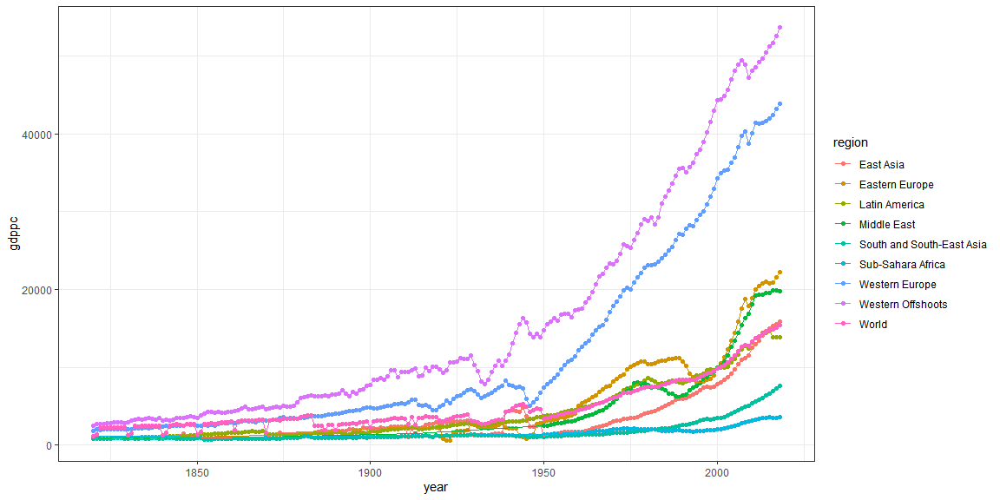

```r
library(tidyverse)
```


```r
#The rio package will simplify reading in Excel files. We need the third sheet in the dataset, so sheet = "Full data" provides the needed code. 
#install.packages("rio")
my_data <- rio::import("https://www.rug.nl/ggdc/historicaldevelopment/maddison/data/mpd2020.xlsx",sheet = "Full data")
my_data <- na.omit(my_data)
my_data <- my_data %>% filter(year >= 1820)

#If the source site is down, you can also grab the data from a temporary repository created for this coding challenge. 
#my_data1 <- rio::import("https://byuimath.com/bmw/s21/mpd2020.xlsx",sheet = "Full data")
#View(my_data1)

#This line of code will read in the region table, which you'll need to assign each country to its appropriate region. 
my_region_table <- read_csv("https://byuimath.com/bmw/s21/my_region_table.csv")
```


```r
colnames(my_region_table)[2] <- "countrycode"

View(my_data)
View(my_region_table)
```


```r
world_data <- my_data %>% group_by(year) %>% summarise(gdppc = weighted.mean(gdppc, w = pop), pop = sum(pop), region = "World") %>% filter(year >= 1820)
View(world_data)
```


```r
my_region_table$region <- stringr::str_replace(my_region_table$region, "Australia and New Zealand", "Western Offshoots")
my_region_table$region <- stringr::str_replace(my_region_table$region, "Northern America", "Western Offshoots")
my_region_table$region <- stringr::str_replace(my_region_table$region, "Eastern Asia", "East Asia")
my_region_table$region <- stringr::str_replace(my_region_table$region, "South-eastern Asia", "South and South-East Asia")
my_region_table$region <- stringr::str_replace(my_region_table$region, "Southern Asia", "South and South-East Asia")
my_region_table$region <- stringr::str_replace(my_region_table$region, "Latin America and the Caribbean", "Latin America")
my_region_table$region <- stringr::str_replace(my_region_table$region, "Sub-Saharan Africa", "Sub-Sahara Africa")
```


```r
my_data1 <- left_join(my_data, my_region_table %>% select(-country), by = "countrycode")

my_regional <- my_data1 %>% group_by(year, region) %>% summarise(gdppc = weighted.mean(gdppc, pop, na.rm = TRUE))

my_regional1 <- my_regional %>% filter(region %in% c("Western Offshoots", "Western Europe", "Eastern Europe", "Middle East", "East Asia", "Latin America", "South and South-East Asia", "Sub-Sahara Africa"))
```


```r
ggplot() +
  geom_point(my_regional1, mapping = aes(year, gdppc, color = region)) +
  geom_line(my_regional1, mapping = aes(year, gdppc, color = region)) +
  geom_point(world_data, mapping = aes(year, gdppc, color = region)) +
  geom_line(world_data, mapping = aes(year, gdppc, color = region)) +
  theme_bw()
```

<!-- -->

